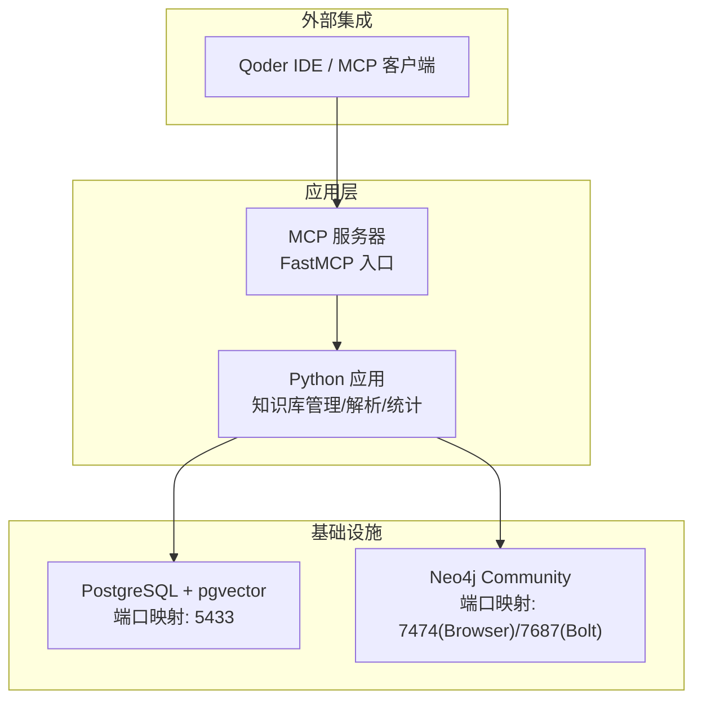
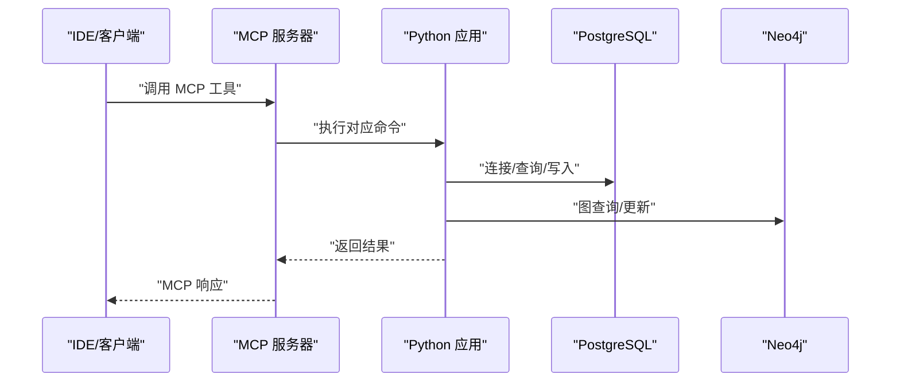
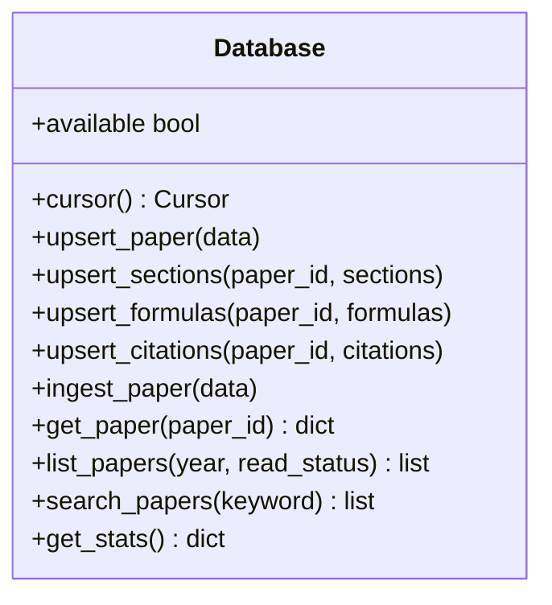
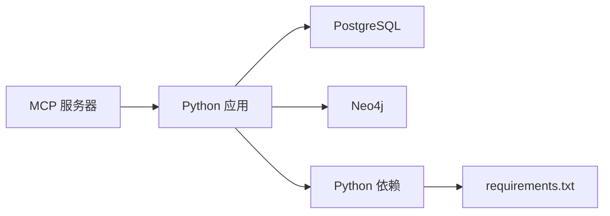

# 生产环境优化

<cite>
**本文档引用的文件**
- [docker-compose.yml](file://infra/docker-compose.yml)
- [init.sql](file://infra/init.sql)
- [config.py](file://scholar/config.py)
- [db.py](file://scholar/db.py)
- [server.py](file://scholar_mcp/server.py)
- [mcp.json](file://plugin/mcp.json)
- [requirements.txt](file://requirements.txt)
- [startup.ps1](file://startup.ps1)
</cite>

## 目录
1. [简介](#简介)
2. [项目结构](#项目结构)
3. [核心组件](#核心组件)
4. [架构总览](#架构总览)
5. [详细组件分析](#详细组件分析)
6. [依赖关系分析](#依赖关系分析)
7. [性能考虑](#性能考虑)
8. [故障排除指南](#故障排除指南)
9. [结论](#结论)
10. [附录](#附录)

## 简介
本指南面向生产环境部署与运维，围绕数据库连接池配置、缓存策略优化、内存使用优化、负载均衡与高可用架构、安全加固、扩展性与水平扩展、容量规划与资源配额管理、不同环境配置差异与最佳实践，以及性能基准与压力测试方法进行系统阐述。结合仓库中的容器编排、数据库模式、Python 配置与 MCP 服务实现，给出可操作的优化建议与落地步骤。

## 项目结构
该项目采用多服务容器化架构，核心由 PostgreSQL + pgvector（结构化数据与向量检索）、Neo4j（概念图谱与引用网络）组成，并通过 Python 应用层提供知识库管理、RAG 向量索引、实验执行等能力；MCP 服务作为外部 IDE 集成入口，统一暴露命令行工具为 MCP 工具。

图表来源
- [docker-compose.yml:1-44](file://infra/docker-compose.yml#L1-L44)
- [server.py:1-573](file://scholar_mcp/server.py#L1-L573)
- [config.py:41-51](file://scholar/config.py#L41-L51)

章节来源
- [docker-compose.yml:1-44](file://infra/docker-compose.yml#L1-L44)
- [startup.ps1:1-65](file://startup.ps1#L1-L65)

## 核心组件
- 数据库层（PostgreSQL + pgvector）
  - 提供结构化元数据存储、分块向量嵌入、引用关系等表结构，支持全文检索与向量相似度查询。
  - 连接管理采用按需连接与事务上下文封装，具备可用性探测与回滚机制。
- 图数据库层（Neo4j）
  - 存储概念图谱、引用网络、创新替换关系等，提供图分析与查询能力。
- Python 应用层
  - 统一配置加载、目录结构管理、arXiv 请求工具（含重试与代理支持）。
- MCP 服务器
  - 将 CLI 能力以 MCP 工具形式暴露，便于 IDE 集成与自动化工作流。

章节来源
- [db.py:24-74](file://scholar/db.py#L24-L74)
- [init.sql:9-131](file://infra/init.sql#L9-L131)
- [config.py:41-116](file://scholar/config.py#L41-L116)
- [server.py:17-37](file://scholar_mcp/server.py#L17-L37)

## 架构总览
下图展示生产环境的关键交互路径：客户端通过 MCP 服务器调用 Python 应用，应用层经由配置访问数据库与图数据库，完成知识库构建、检索与分析。

图表来源
- [server.py:23-36](file://scholar_mcp/server.py#L23-L36)
- [config.py:41-51](file://scholar/config.py#L41-L51)
- [db.py:46-73](file://scholar/db.py#L46-L73)

## 详细组件分析

### 数据库层（PostgreSQL + pgvector）
- 连接与事务
  - 使用按需连接策略，避免长连接占用资源；在上下文中自动提交或回滚，确保一致性。
  - 可用性探测通过临时连接验证，失败则重新建立连接。
- 表结构与索引
  - 论文、章节、公式、引用、概念、纸-概念关联、分块向量等表，配套索引提升查询效率。
  - 向量维度与索引策略为后续 RAG 检索奠定基础。
- 性能要点
  - 事务边界明确，批量写入建议合并为单事务以减少往返。
  - 查询参数化防止 SQL 注入，避免全表扫描的条件需配合索引。

图表来源
- [db.py:24-242](file://scholar/db.py#L24-L242)

章节来源
- [db.py:24-242](file://scholar/db.py#L24-L242)
- [init.sql:9-131](file://infra/init.sql#L9-L131)

### 图数据库层（Neo4j）
- 配置与健康检查
  - 容器内设置堆大小参数，健康检查基于服务状态。
- 应用侧交互
  - 通过驱动连接图数据库，执行图构建与查询任务。
- 性能要点
  - 大规模图构建建议批处理与事务拆分，避免长时间锁持有。
  - Cypher 查询需配合索引与参数化，避免 N+1 查询。

章节来源
- [docker-compose.yml:22-39](file://infra/docker-compose.yml#L22-L39)
- [config.py:48-51](file://scholar/config.py#L48-L51)

### Python 应用层
- 配置管理
  - 从 .env 加载环境变量，支持数据库、图数据库、嵌入模型等参数。
  - arXiv 请求工具内置重试与指数退避、代理支持与超时控制。
- 目录与输出
  - 自动创建输出目录，保证首次运行可用性。
- 性能要点
  - 网络请求具备超时与重试，避免阻塞主线程。
  - 文件读写采用 UTF-8 编码，确保跨平台兼容。

章节来源
- [config.py:1-116](file://scholar/config.py#L1-L116)

### MCP 服务器
- 工具注册与执行
  - 通过装饰器注册各类工具，内部以子进程方式调用 Python CLI，统一超时控制。
- 集成点
  - 与 IDE 的 MCP 客户端对接，提供搜索、图谱分析、RAG、实验执行等能力。
- 性能要点
  - 工具级超时参数可按功能复杂度调整，避免长耗时阻塞其他请求。
  - 子进程隔离有助于错误隔离与资源限制。

章节来源
- [server.py:17-573](file://scholar_mcp/server.py#L17-L573)
- [mcp.json:1-16](file://plugin/mcp.json#L1-L16)

## 依赖关系分析
- 组件耦合
  - Python 应用依赖数据库与图数据库，MCP 服务器依赖应用层命令。
- 外部依赖
  - Python 依赖包括数据库驱动、图数据库驱动、MCP 框架、LaTeX 编译工具等。
- 容器编排
  - docker-compose 定义服务、端口映射、健康检查与持久化卷。

图表来源
- [server.py:23-36](file://scholar_mcp/server.py#L23-L36)
- [config.py:41-51](file://scholar/config.py#L41-L51)
- [requirements.txt:1-9](file://requirements.txt#L1-L9)

章节来源
- [requirements.txt:1-9](file://requirements.txt#L1-L9)
- [docker-compose.yml:1-44](file://infra/docker-compose.yml#L1-L44)

## 性能考虑

### 数据库连接池配置（PostgreSQL + pgvector）
- 连接池选型
  - 在应用层引入连接池（如基于连接复用的连接池），限制最大连接数，设置空闲回收时间。
- 连接生命周期
  - 事务结束后及时释放连接；对只读查询可使用只读连接池分支。
- 连接参数优化
  - 设置合适的超时（连接超时、查询超时），启用 keepalives 与探测间隔。
- 写入优化
  - 批量插入使用事务包裹，减少往返；ON CONFLICT 更新尽量精简字段。
- 索引与查询
  - 为高频过滤字段建立索引；避免 SELECT *，仅选择必要列。
- 统计信息
  - 定期更新统计信息，确保查询计划最优。

### 缓存策略优化
- 应用层缓存
  - 对热点查询结果（如统计、热门论文列表）增加短期缓存，设置合理过期时间。
- 图查询缓存
  - 对稳定图谱查询结果进行缓存，结合版本号或时间戳失效。
- 向量检索缓存
  - 对常见查询向量与 Top-K 结果进行缓存，降低重复计算。

### 内存使用优化
- Python 进程
  - 控制并发与批大小，避免一次性加载大量数据；使用生成器与分页。
- Neo4j
  - 调整堆大小参数，避免 GC 抖动；对大规模导入使用流式写入。
- PostgreSQL
  - 合理设置 shared_buffers、work_mem 等参数，避免过度消耗内存。

### 负载均衡与高可用架构
- 服务拆分
  - 将 MCP 服务器与应用服务分离，分别横向扩展。
- 负载均衡
  - 使用反向代理（如 Nginx/Traefik）分发请求，开启健康检查。
- 数据高可用
  - PostgreSQL 使用主从复制或托管服务的高可用方案；Neo4j 使用集群版或备份策略。
- 会话与状态
  - 无状态设计优先；有状态部分通过共享存储或数据库解决。

### 安全加固
- 网络安全
  - 仅暴露必要端口；使用防火墙与安全组限制访问；TLS 终止于边缘网关。
- 访问控制
  - 为数据库与图数据库设置强密码与最小权限；MCP 工具调用鉴权（如 API Key）。
- 数据加密
  - 敏感数据加密存储；传输通道启用 TLS；密钥管理使用安全的密钥服务。
- 输入校验与限流
  - 对用户输入严格校验；对 MCP 工具设置速率限制与超时。

### 扩展性与水平扩展
- 垂直扩展
  - 首先提升单实例规格（CPU/内存/磁盘 IOPS），观察瓶颈再决定水平扩展。
- 水平扩展
  - 多副本 MCP 与应用服务，配合负载均衡；数据库通过读副本或分片扩展。
- 事件驱动
  - 引入消息队列异步处理耗时任务（如批量导入、RAG 索引）。

### 容量规划与资源配额管理
- 规模估算
  - 基于论文数量、分块数量、并发用户数估算存储与计算需求。
- 资源配额
  - 为容器设置 CPU/内存限制与请求；监控队列长度与延迟，动态扩缩容。
- 存储规划
  - 分离热数据与冷数据；定期清理与归档；预留增长空间。

### 不同环境配置差异与最佳实践
- 开发环境
  - 端口映射便于本地调试；日志级别较高；禁用或简化安全策略。
- 测试环境
  - 接近生产的数据规模与网络拓扑；启用完整安全策略与监控。
- 生产环境
  - 最小权限原则；严格的变更流程；完善的备份与灾难恢复预案。
- 环境变量
  - 使用独立的 .env 文件与 CI/CD 密钥管理；敏感信息不进入镜像。

### 性能基准测试与压力测试
- 基准测试
  - 使用标准数据集对全文检索、向量相似度检索、图查询进行基准测试，记录吞吐与延迟。
- 压力测试
  - 逐步提升并发与数据规模，观察 P95/P99 延迟、错误率与资源使用率。
- 场景化测试
  - 模拟真实工作流（解析、图构建、RAG 检索、实验执行），评估端到端性能。
- 监控指标
  - 关键指标包括 QPS、响应时间、错误率、连接数、CPU/内存/IO 利用率、队列长度。

## 故障排除指南
- 服务不可达
  - 检查容器健康状态与端口映射；确认防火墙放行；查看启动日志。
- 数据库连接失败
  - 核对主机名、端口、用户名与密码；检查网络连通性与 SSL 配置。
- 图数据库异常
  - 查看服务状态与日志；确认认证信息与插件配置；检查存储卷权限。
- MCP 工具超时
  - 调整工具超时参数；检查后端处理耗时；必要时拆分为异步任务。
- 启动脚本问题
  - 使用提供的启动脚本等待服务就绪后再进行状态检查；关注超时告警。

章节来源
- [startup.ps1:17-44](file://startup.ps1#L17-L44)
- [docker-compose.yml:15-19](file://infra/docker-compose.yml#L15-L19)
- [server.py:23-36](file://scholar_mcp/server.py#L23-L36)

## 结论
通过合理的数据库连接池与索引策略、缓存与内存优化、负载均衡与高可用架构、安全加固与合规管理、扩展性与容量规划，以及系统化的性能测试与监控，可显著提升系统的稳定性与性能表现。建议在生产环境中遵循最小权限、可观测性与自动化运维的最佳实践，持续迭代优化。

## 附录
- 快速参考
  - 数据库端口与凭据：见配置模块与容器编排文件。
  - 图数据库端口与凭据：见配置模块与容器编排文件。
  - MCP 服务器配置：见 MCP 配置文件与服务器实现。
  - 依赖清单：见依赖文件。

章节来源
- [config.py:41-51](file://scholar/config.py#L41-L51)
- [docker-compose.yml:1-44](file://infra/docker-compose.yml#L1-L44)
- [mcp.json:1-16](file://plugin/mcp.json#L1-L16)
- [requirements.txt:1-9](file://requirements.txt#L1-L9)