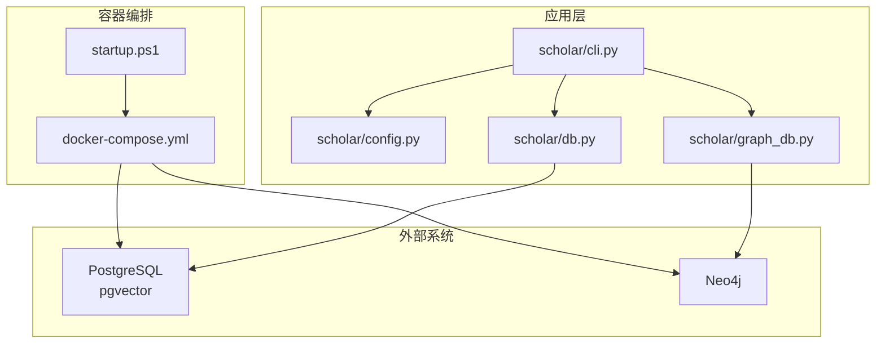
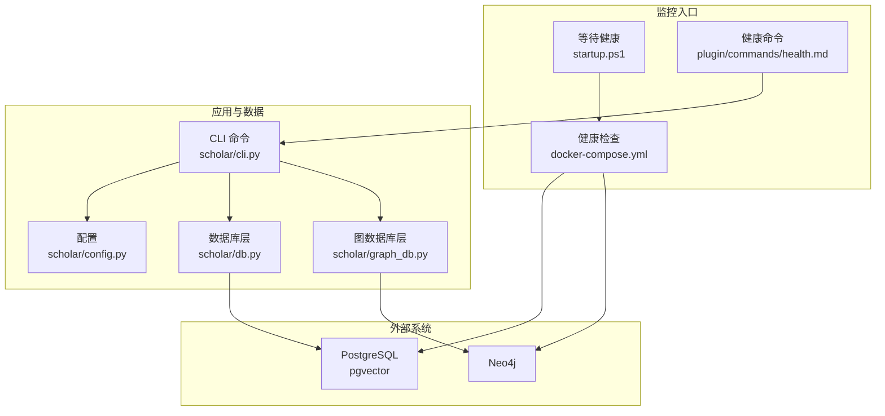
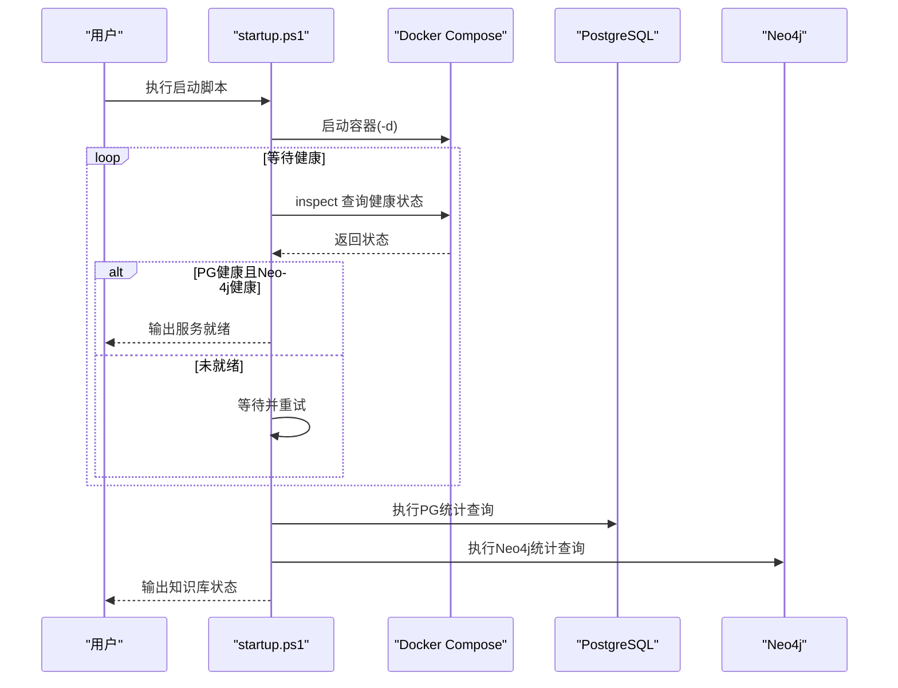
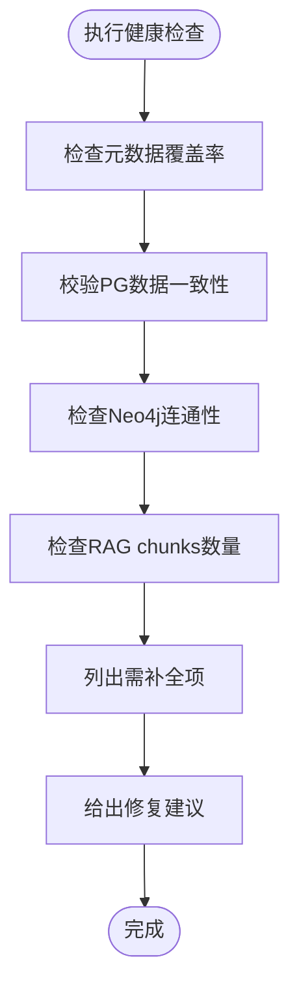
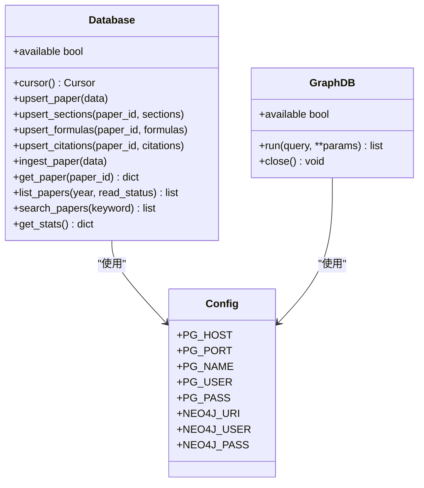
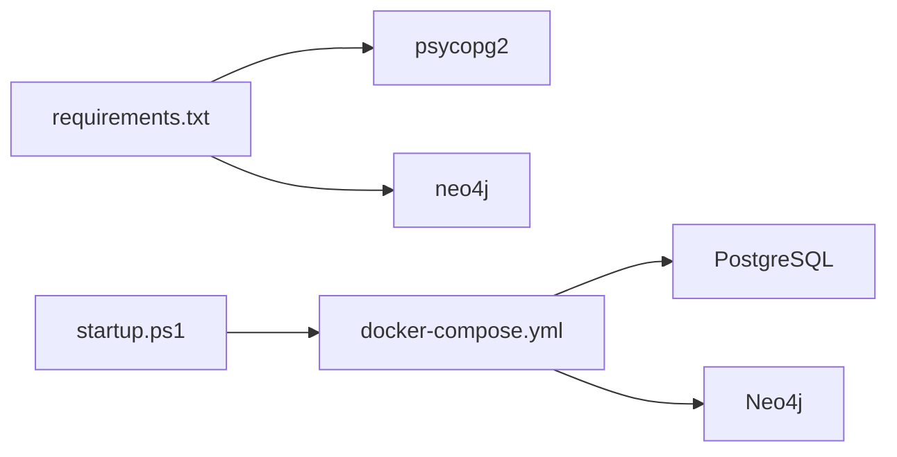

# 监控与日志管理

<cite>
**本文引用的文件**
- [docker-compose.yml](file://infra/docker-compose.yml)
- [startup.ps1](file://startup.ps1)
- [health.md](file://plugin/commands/health.md)
- [cli.py](file://scholar/cli.py)
- [config.py](file://scholar/config.py)
- [db.py](file://scholar/db.py)
- [graph_db.py](file://scholar/graph_db.py)
- [requirements.txt](file://requirements.txt)
- [pg_pull.log](file://pg_pull.log)
- [neo4j_pull.log](file://neo4j_pull.log)
</cite>

## 目录
1. [简介](#简介)
2. [项目结构](#项目结构)
3. [核心组件](#核心组件)
4. [架构总览](#架构总览)
5. [详细组件分析](#详细组件分析)
6. [依赖关系分析](#依赖关系分析)
7. [性能考量](#性能考量)
8. [故障排查指南](#故障排查指南)
9. [结论](#结论)
10. [附录](#附录)

## 简介
本文件面向“系统监控与日志管理”，结合仓库现有基础设施与代码实现，给出健康检查配置、监控指标采集、容器资源监控、数据库性能监控、应用日志收集与聚合、日志级别与轮转策略、告警与通知、性能监控仪表板搭建以及基于监控数据的故障诊断与性能优化建议。当前仓库已具备容器健康检查与基础的健康状态命令，但尚未集成集中式日志与监控平台。本文在不改变现有实现的前提下，提出可落地的扩展方案。

## 项目结构
围绕监控与日志管理的关键文件与职责如下：
- 容器编排与健康检查：infra/docker-compose.yml
- 启动与等待健康：startup.ps1
- 健康状态命令与统计：plugin/commands/health.md、scholar/cli.py
- 配置与连接参数：scholar/config.py
- 数据库访问层：scholar/db.py
- 图数据库访问层：scholar/graph_db.py
- 依赖声明：requirements.txt
- 日志文件：pg_pull.log、neo4j_pull.log

图表来源
- [docker-compose.yml:1-44](file://infra/docker-compose.yml#L1-L44)
- [startup.ps1:1-65](file://startup.ps1#L1-L65)
- [cli.py:1-800](file://scholar/cli.py#L1-L800)
- [config.py:1-116](file://scholar/config.py#L1-L116)
- [db.py:1-276](file://scholar/db.py#L1-L276)
- [graph_db.py:1-800](file://scholar/graph_db.py#L1-L800)

章节来源
- [docker-compose.yml:1-44](file://infra/docker-compose.yml#L1-L44)
- [startup.ps1:1-65](file://startup.ps1#L1-L65)
- [cli.py:1-800](file://scholar/cli.py#L1-L800)
- [config.py:1-116](file://scholar/config.py#L1-L116)
- [db.py:1-276](file://scholar/db.py#L1-L276)
- [graph_db.py:1-800](file://scholar/graph_db.py#L1-L800)

## 核心组件
- 容器健康检查：PostgreSQL 与 Neo4j 在 docker-compose 中定义了健康检查指令与重试策略，启动脚本通过 inspect 查询健康状态并等待服务就绪。
- 健康状态命令：CLI 提供 stats 命令用于知识库统计；plugin 命令文档描述了健康检查执行步骤（元数据覆盖率、PG 一致性、Neo4j 连通性、RAG 索引状态等）。
- 数据库访问层：db.py 封装了 PostgreSQL 的可用性检测、事务上下文、全文检索查询与统计汇总；graph_db.py 封装了 Neo4j 的连接可用性检测与图操作。
- 配置与连接参数：config.py 提供数据库与图数据库的连接参数，并封装 arXiv API 请求的超时与重试逻辑。
- 日志文件：pg_pull.log、neo4j_pull.log 作为容器拉取镜像的日志输出，可用于初步定位镜像拉取与初始化阶段的问题。

章节来源
- [docker-compose.yml:15-19](file://infra/docker-compose.yml#L15-L19)
- [docker-compose.yml:35-39](file://infra/docker-compose.yml#L35-L39)
- [startup.ps1:17-44](file://startup.ps1#L17-L44)
- [health.md:1-10](file://plugin/commands/health.md#L1-L10)
- [cli.py:421-476](file://scholar/cli.py#L421-L476)
- [db.py:24-74](file://scholar/db.py#L24-L74)
- [graph_db.py:32-70](file://scholar/graph_db.py#L32-L70)
- [config.py:41-57](file://scholar/config.py#L41-L57)
- [pg_pull.log:1-200](file://pg_pull.log#L1-L200)
- [neo4j_pull.log:1-200](file://neo4j_pull.log#L1-L200)

## 架构总览
下图展示监控与日志管理在系统中的位置与交互：

图表来源
- [docker-compose.yml:15-19](file://infra/docker-compose.yml#L15-L19)
- [docker-compose.yml:35-39](file://infra/docker-compose.yml#L35-L39)
- [startup.ps1:17-44](file://startup.ps1#L17-L44)
- [health.md:1-10](file://plugin/commands/health.md#L1-L10)
- [cli.py:421-476](file://scholar/cli.py#L421-L476)
- [config.py:41-57](file://scholar/config.py#L41-L57)
- [db.py:24-74](file://scholar/db.py#L24-L74)
- [graph_db.py:32-70](file://scholar/graph_db.py#L32-L70)

## 详细组件分析

### 容器健康检查与启动等待
- docker-compose 为 PostgreSQL 与 Neo4j 配置了健康检查测试命令、间隔、超时与重试次数，确保容器启动后数据库处于可用状态。
- startup.ps1 启动容器后循环检查两个服务的健康状态，达到健康后再输出知识库状态统计，避免后续命令因依赖服务未就绪而失败。

图表来源
- [startup.ps1:11-58](file://startup.ps1#L11-L58)
- [docker-compose.yml:15-19](file://infra/docker-compose.yml#L15-L19)
- [docker-compose.yml:35-39](file://infra/docker-compose.yml#L35-L39)

章节来源
- [docker-compose.yml:15-19](file://infra/docker-compose.yml#L15-L19)
- [docker-compose.yml:35-39](file://infra/docker-compose.yml#L35-L39)
- [startup.ps1:17-44](file://startup.ps1#L17-L44)

### 健康状态命令与统计
- plugin/commands/health.md 描述了知识库健康检查的执行步骤，包括元数据覆盖率、PG 数据一致性、Neo4j 连通性与 RAG 索引状态等。
- scholar/cli.py 的 stats 命令提供知识库统计信息，包括解析数量、段落数、公式数、引用数、数据库连通性状态以及按年份与会议的分布统计。

图表来源
- [health.md:3-10](file://plugin/commands/health.md#L3-L10)
- [cli.py:421-476](file://scholar/cli.py#L421-L476)

章节来源
- [health.md:1-10](file://plugin/commands/health.md#L1-L10)
- [cli.py:421-476](file://scholar/cli.py#L421-L476)

### 数据库访问层与监控指标
- PostgreSQL 访问层（db.py）提供：
  - 可用性检测：尝试建立连接以判断数据库是否可用。
  - 事务上下文：统一的游标与提交/回滚处理。
  - 全文检索与统计：提供搜索与统计接口，便于从数据库侧采集指标（如表行数、查询耗时等）。
- Neo4j 访问层（graph_db.py）提供：
  - 可用性检测：尝试建立驱动会话以判断图数据库是否可用。
  - 图操作：构建引用网络、概念图、计算中心性等，便于从图数据库侧采集指标（如节点/边数量、查询耗时等）。

图表来源
- [db.py:24-241](file://scholar/db.py#L24-L241)
- [graph_db.py:32-69](file://scholar/graph_db.py#L32-L69)
- [config.py:41-57](file://scholar/config.py#L41-L57)

章节来源
- [db.py:24-241](file://scholar/db.py#L24-L241)
- [graph_db.py:32-69](file://scholar/graph_db.py#L32-L69)
- [config.py:41-57](file://scholar/config.py#L41-L57)

### 应用日志收集与聚合
- 当前仓库未集成集中式日志收集（如 Fluent Bit、Filebeat、Logstash），仅存在容器镜像拉取日志文件（pg_pull.log、neo4j_pull.log）。这些日志可用于初步定位镜像拉取与初始化阶段的问题。
- 建议在现有 docker-compose 中增加日志驱动与卷挂载，或引入 Sidecar 收集器，将容器标准输出与错误输出统一写入共享卷或远程日志系统。

章节来源
- [pg_pull.log:1-200](file://pg_pull.log#L1-L200)
- [neo4j_pull.log:1-200](file://neo4j_pull.log#L1-L200)

### 告警机制与通知
- 仓库未提供告警规则与通知配置。可在现有健康检查基础上扩展：
  - 使用 Prometheus Exporter 暴露应用指标（如查询耗时、节点/边数量、表行数等）。
  - 使用 Alertmanager 配置邮件/Slack/Webhook 通知。
  - 在 docker-compose 中加入 Prometheus 与 Alertmanager 服务，并在 startup.ps1 中增加对 Prometheus 的健康探测。

章节来源
- [docker-compose.yml:15-19](file://infra/docker-compose.yml#L15-L19)
- [docker-compose.yml:35-39](file://infra/docker-compose.yml#L35-L39)

### 性能监控仪表板
- 建议引入 Grafana 作为可视化面板，结合 Prometheus 抓取指标，展示：
  - 数据库层：表行数趋势、查询 QPS/耗时、连接数。
  - 图数据库层：节点/边数量趋势、Cypher 查询耗时。
  - 应用层：CLI 命令执行耗时、RAG 索引进度。
- 仪表板可包含：
  - 知识库规模（论文、段落、公式、引用）随时间变化。
  - Neo4j 中引用网络与概念图的节点/边数量。
  - PostgreSQL 中 papers/chunks 表的增长趋势。

章节来源
- [cli.py:421-476](file://scholar/cli.py#L421-L476)
- [db.py:223-241](file://scholar/db.py#L223-L241)
- [graph_db.py:287-313](file://scholar/graph_db.py#L287-L313)

## 依赖关系分析
- 外部依赖（requirements.txt）中包含数据库与图数据库客户端，这些是健康检查与监控指标采集的基础。
- docker-compose 与 startup.ps1 负责服务生命周期与健康状态保障，是监控体系的入口。

图表来源
- [requirements.txt:1-9](file://requirements.txt#L1-L9)
- [docker-compose.yml:1-44](file://infra/docker-compose.yml#L1-L44)
- [startup.ps1:11-15](file://startup.ps1#L11-L15)

章节来源
- [requirements.txt:1-9](file://requirements.txt#L1-L9)
- [docker-compose.yml:1-44](file://infra/docker-compose.yml#L1-L44)
- [startup.ps1:11-15](file://startup.ps1#L11-L15)

## 性能考量
- 健康检查频率与超时：根据实际环境调整 docker-compose 中的 interval/timeout/retries，避免过短导致误报或过长导致恢复慢。
- 查询性能：db.py 与 graph_db.py 的查询应尽量使用索引与合适的 LIMIT，避免全表扫描。
- 连接池：在生产环境中建议引入连接池以减少连接开销。
- 日志轮转：建议启用容器日志轮转策略，避免单个日志文件过大影响 IO。

## 故障排查指南
- 容器未就绪：使用 startup.ps1 的等待逻辑确认健康状态；若超时，检查 docker-compose 的健康检查命令与外部端口映射。
- 数据库不可用：通过 db.py 的 available 属性判断；若不可用，检查 config.py 中的连接参数与网络连通性。
- 图数据库不可用：通过 graph_db.py 的 available 属性判断；若不可用，检查 Neo4j URI、认证与插件配置。
- 日志定位：参考 pg_pull.log、neo4j_pull.log 中的错误信息，定位镜像拉取或初始化阶段的问题。

章节来源
- [startup.ps1:17-44](file://startup.ps1#L17-L44)
- [db.py:32-44](file://scholar/db.py#L32-L44)
- [graph_db.py:40-49](file://scholar/graph_db.py#L40-L49)
- [config.py:41-57](file://scholar/config.py#L41-L57)
- [pg_pull.log:1-200](file://pg_pull.log#L1-L200)
- [neo4j_pull.log:1-200](file://neo4j_pull.log#L1-L200)

## 结论
当前仓库已具备容器健康检查与基础的健康状态命令，能够满足基本的可用性保障与知识库统计需求。为进一步完善监控与日志管理，建议：
- 引入集中式日志收集与聚合（如 Filebeat/Fluent Bit + Elasticsearch/OpenSearch）。
- 部署 Prometheus + Alertmanager + Grafana，采集数据库与图数据库指标并可视化。
- 在 docker-compose 中增加日志驱动与轮转策略，确保日志可追踪与可维护。
- 基于现有健康检查扩展告警规则，实现自动化通知与快速响应。

## 附录
- 健康检查配置要点
  - PostgreSQL：健康检查命令、间隔、超时、重试次数。
  - Neo4j：健康检查命令、内存参数、插件启用。
- 启动流程要点
  - 启动容器、等待健康、执行知识库状态检查。
- 健康命令要点
  - 元数据覆盖率、PG 一致性、Neo4j 连通性、RAG 索引状态、补全建议。

章节来源
- [docker-compose.yml:15-19](file://infra/docker-compose.yml#L15-L19)
- [docker-compose.yml:35-39](file://infra/docker-compose.yml#L35-L39)
- [startup.ps1:17-44](file://startup.ps1#L17-L44)
- [health.md:1-10](file://plugin/commands/health.md#L1-L10)
- [cli.py:421-476](file://scholar/cli.py#L421-L476)