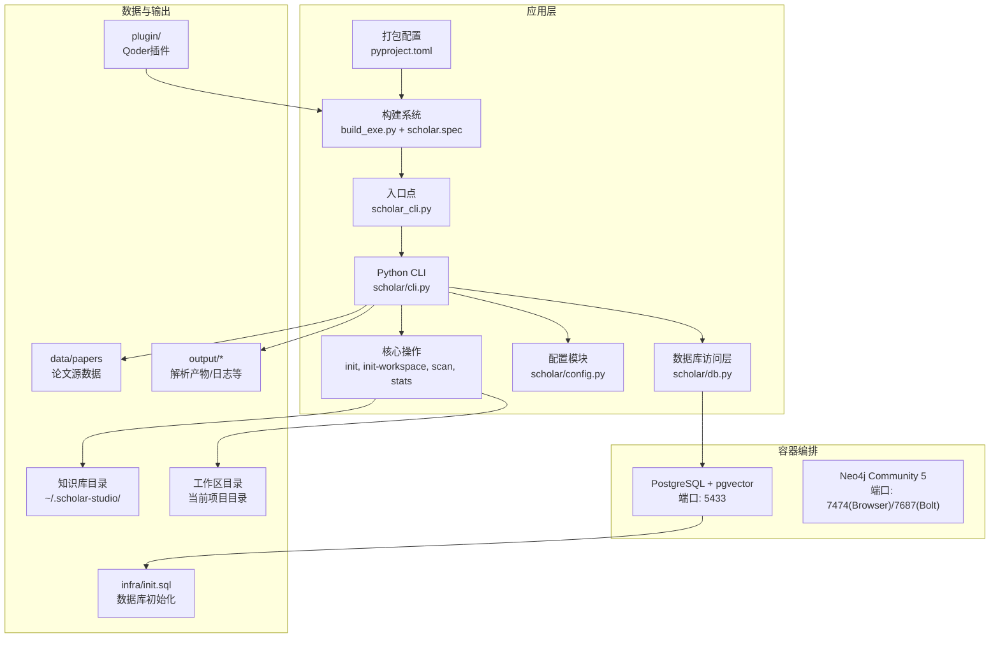
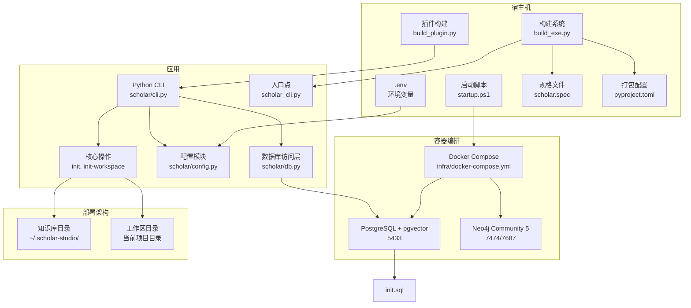
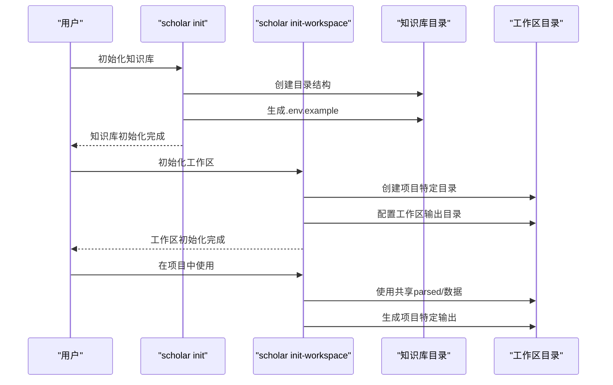
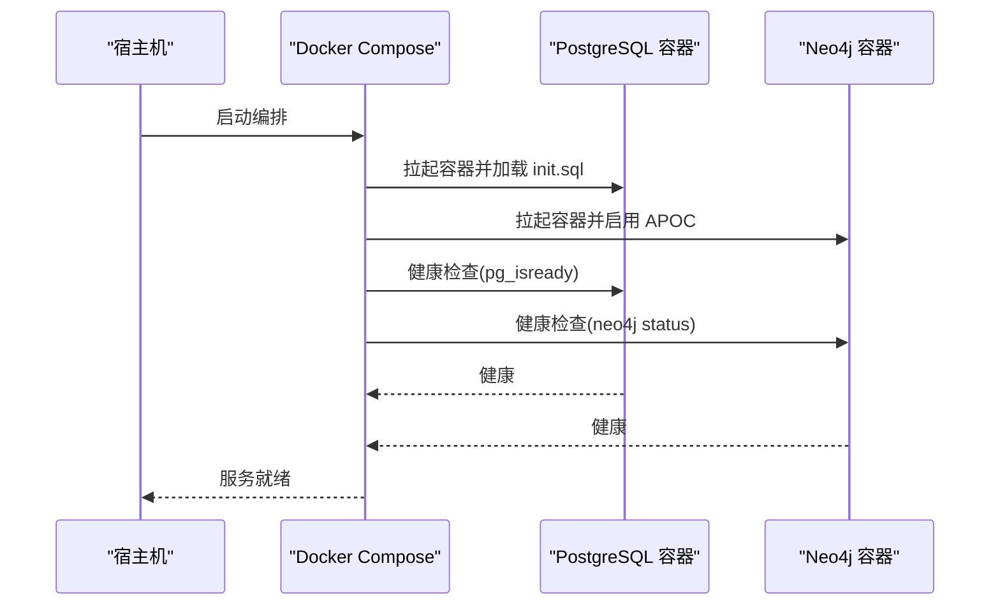
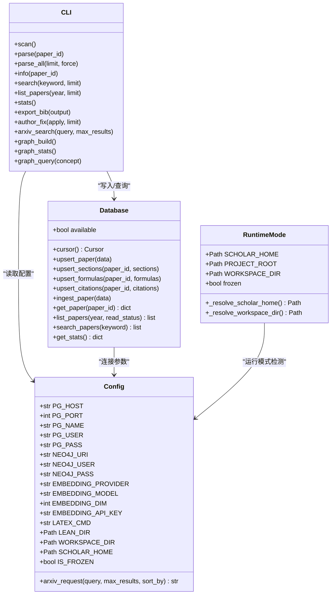
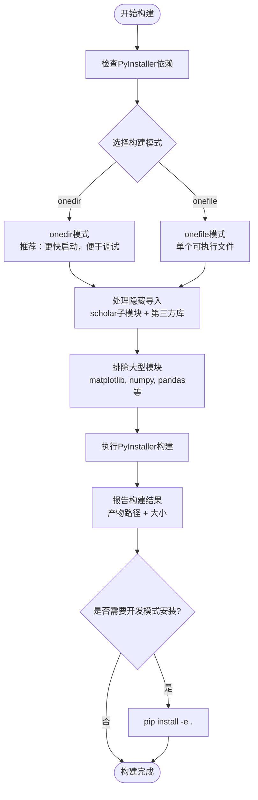
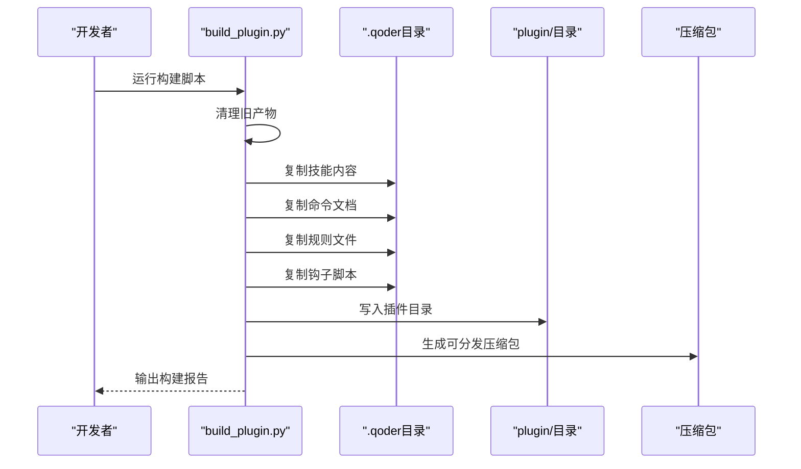
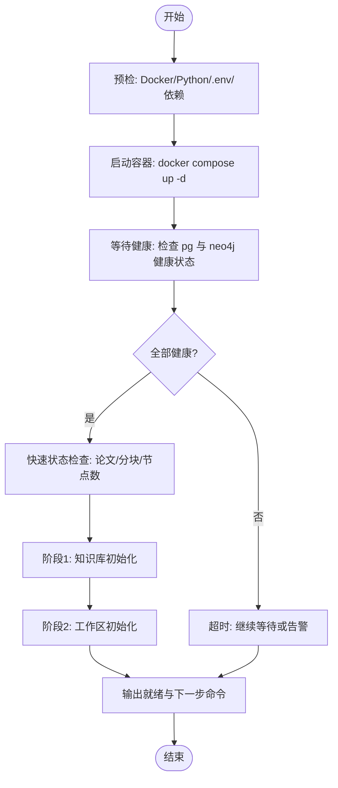
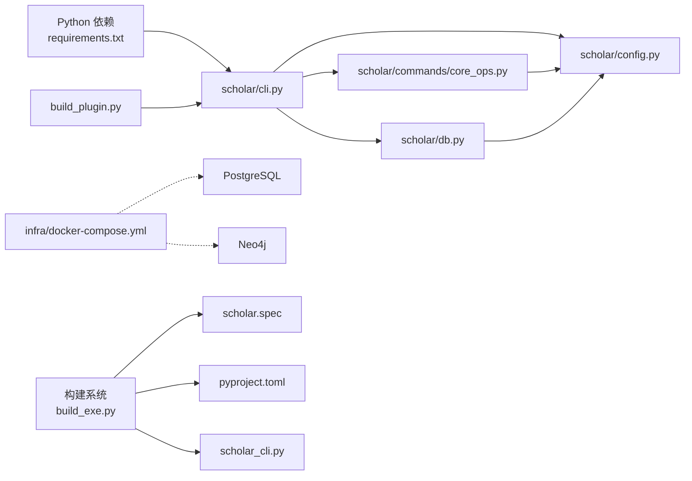

# 部署与运维

<cite>
**本文档引用的文件**
- [docker-compose.yml](file://infra/docker-compose.yml)
- [init.sql](file://infra/init.sql)
- [startup.ps1](file://startup.ps1)
- [requirements.txt](file://requirements.txt)
- [plugin/README.md](file://plugin/README.md)
- [scholar/__main__.py](file://scholar/__main__.py)
- [scholar/cli.py](file://scholar/cli.py)
- [scholar/config.py](file://scholar/config.py)
- [scholar/db.py](file://scholar/db.py)
- [scholar/commands/core_ops.py](file://scholar/commands/core_ops.py)
- [build_exe.py](file://build_exe.py)
- [scholar.spec](file://scholar.spec)
- [pyproject.toml](file://pyproject.toml)
- [scholar_cli.py](file://scholar_cli.py)
- [build_plugin.py](file://build_plugin.py)
</cite>

## 更新摘要
**变更内容**
- 新增两阶段部署系统：第一阶段初始化知识库，第二阶段初始化工作区
- 添加init-workspace命令说明和双拷贝数据策略的部署指南
- 更新启动脚本以支持阶段2工作区初始化
- 增强配置系统对工作区目录的灵活管理
- 完善容器化部署方案与运维实践

## 目录
1. [简介](#简介)
2. [项目结构](#项目结构)
3. [核心组件](#核心组件)
4. [架构总览](#架构总览)
5. [详细组件分析](#详细组件分析)
6. [依赖关系分析](#依赖关系分析)
7. [性能考虑](#性能考虑)
8. [故障排除指南](#故障排除指南)
9. [结论](#结论)
10. [附录](#附录)

## 简介
本指南面向部署与运维工程师，提供一套完整的容器化部署方案与运维实践，覆盖以下主题：
- 容器化部署：基于 Docker Compose 的 PostgreSQL + pgvector 与 Neo4j 服务编排
- 镜像构建与服务编排：镜像选择、端口映射、卷挂载与健康检查
- 环境变量管理：通过 .env 文件集中管理数据库与外部服务凭据
- 基础设施配置：数据库初始化 SQL、Neo4j 插件启用与内存参数
- 服务启动顺序与健康检查：容器启动顺序、健康检查策略与就绪判断
- **新增**：两阶段部署系统：第一阶段初始化知识库，第二阶段初始化工作区
- **新增**：双拷贝数据策略：共享知识库与工作区分离的部署架构
- **新增**：init-workspace命令：支持工作区目录初始化与配置
- 自动化构建系统：PyInstaller规格文件、setuptools打包配置
- 可执行文件构建与分发：onedir与onefile两种构建模式
- 生产环境部署策略：高可用、备份恢复、性能调优与安全加固
- 监控告警与日志管理：容器日志采集、健康检查指标与常见问题排查
- 运维手册：一键启动脚本、常用命令与最佳实践

## 项目结构
该项目采用"前端插件 + 后端 Python 应用 + 容器化基础设施 + 自动化构建系统 + 两阶段部署架构"的分层架构。核心目录与职责如下：
- infra：容器编排与数据库初始化脚本
- scholar：Python CLI 与数据库访问层，包含两阶段部署命令
- plugin：Qoder 插件说明与使用指引
- data/papers：论文源数据目录
- output：解析产物、笔记、草稿、日志等输出目录
- **新增**：两阶段部署架构：知识库目录与工作区目录分离
- **新增**：init-workspace命令：初始化项目工作区
- **新增**：双拷贝数据策略：共享parsed/与工作区特定输出
- **新增**：build_exe.py：自动化构建脚本
- **新增**：scholar.spec：PyInstaller规格文件
- **新增**：pyproject.toml：现代化打包配置
- **新增**：build_plugin.py：Qoder插件构建工具
- 启动脚本：一键启动容器与服务健康检查，支持两阶段部署

**图表来源**
- [docker-compose.yml:1-44](file://infra/docker-compose.yml#L1-L44)
- [init.sql:1-131](file://infra/init.sql#L1-L131)
- [scholar/cli.py:1-800](file://scholar/cli.py#L1-L800)
- [scholar/commands/core_ops.py:75-106](file://scholar/commands/core_ops.py#L75-L106)
- [scholar/config.py:180-206](file://scholar/config.py#L180-L206)
- [scholar/config.py:95-111](file://scholar/config.py#L95-L111)
- [build_exe.py:1-161](file://build_exe.py#L1-L161)
- [scholar.spec:1-150](file://scholar.spec#L1-L150)
- [pyproject.toml:1-34](file://pyproject.toml#L1-L34)
- [scholar_cli.py:1-15](file://scholar_cli.py#L1-L15)
- [build_plugin.py:1-180](file://build_plugin.py#L1-L180)

**章节来源**
- [docker-compose.yml:1-44](file://infra/docker-compose.yml#L1-L44)
- [init.sql:1-131](file://infra/init.sql#L1-L131)
- [startup.ps1:1-130](file://startup.ps1#L1-L130)
- [plugin/README.md:1-79](file://plugin/README.md#L1-L79)
- [build_exe.py:1-161](file://build_exe.py#L1-L161)
- [scholar.spec:1-150](file://scholar.spec#L1-L150)
- [pyproject.toml:1-34](file://pyproject.toml#L1-L34)
- [scholar_cli.py:1-15](file://scholar_cli.py#L1-L15)
- [build_plugin.py:1-180](file://build_plugin.py#L1-L180)

## 核心组件
- 容器编排与健康检查
  - PostgreSQL + pgvector：暴露端口 5433，使用健康检查命令检测连接可用性
  - Neo4j：暴露浏览器端口 7474 与 Bolt 端口 7687，启用 APOC 插件并设置堆内存
- 数据库初始化
  - 初始化扩展 vector（用于向量检索）
  - 创建 papers、sections、formulas、citations、concepts、paper_concepts、chunks、innovations、replacements 等表，并建立必要索引
- Python CLI 与数据库访问
  - CLI 提供扫描、解析、查询、统计、图谱构建等命令
  - **新增**：两阶段部署命令：init（初始化知识库）和init-workspace（初始化工作区）
  - 数据库访问层封装 PostgreSQL 连接与事务，支持文件回退模式
- **新增**：双拷贝数据策略
  - 知识库目录（SCHOLAR_HOME）：包含共享的parsed/目录
  - 工作区目录（WORKSPACE_DIR）：包含项目特定的drafts/、notes/、logs/目录
  - 支持SCHOLAR_WORKSPACE环境变量覆盖工作区位置
- **新增**：两阶段部署系统
  - 阶段1：使用`scholar init`初始化知识库目录结构
  - 阶段2：在每个项目目录使用`scholar init-workspace`初始化工作区
  - 支持开发模式与打包模式的自动切换
- **新增**：自动化构建系统
  - build_exe.py：自动化PyInstaller构建脚本，支持onedir和onefile两种模式
  - scholar.spec：PyInstaller规格文件，定义隐藏导入、排除模块、构建选项
  - pyproject.toml：现代化打包配置，支持setuptools构建系统和可执行命令
- **新增**：Qoder插件构建
  - build_plugin.py：自动构建Qoder插件，支持技能、命令、规则、钩子的打包
- 环境变量与配置
  - 通过 .env 加载数据库、Neo4j、嵌入模型与 arXiv 请求等配置项
  - **新增**：SCHOLAR_WORKSPACE环境变量支持工作区目录自定义
- 一键启动脚本
  - 检测 Docker、Python、依赖与 .env，拉起容器并等待健康状态
  - **新增**：阶段2工作区初始化说明与命令提示
  - 最后输出知识库状态与下一步操作建议

**章节来源**
- [docker-compose.yml:1-44](file://infra/docker-compose.yml#L1-L44)
- [init.sql:1-131](file://infra/init.sql#L1-L131)
- [scholar/cli.py:1-800](file://scholar/cli.py#L1-L800)
- [scholar/commands/core_ops.py:75-106](file://scholar/commands/core_ops.py#L75-L106)
- [scholar/config.py:180-206](file://scholar/config.py#L180-L206)
- [scholar/config.py:38-52](file://scholar/config.py#L38-L52)
- [scholar/config.py:116-177](file://scholar/config.py#L116-L177)
- [build_exe.py:1-161](file://build_exe.py#L1-L161)
- [scholar.spec:1-150](file://scholar.spec#L1-L150)
- [pyproject.toml:1-34](file://pyproject.toml#L1-L34)
- [build_plugin.py:1-180](file://build_plugin.py#L1-L180)
- [startup.ps1:117-121](file://startup.ps1#L117-L121)

## 架构总览
下图展示容器化部署的整体交互：CLI 通过配置模块读取环境变量，连接 PostgreSQL 与 Neo4j；容器内数据库由 init.sql 初始化；启动脚本负责编排与健康检查；**新增**的两阶段部署系统提供知识库与工作区的分离管理；**新增**的构建系统提供可执行文件的自动化生成。

**图表来源**
- [startup.ps1:1-130](file://startup.ps1#L1-L130)
- [docker-compose.yml:1-44](file://infra/docker-compose.yml#L1-L44)
- [init.sql:1-131](file://infra/init.sql#L1-L131)
- [scholar/cli.py:1-800](file://scholar/cli.py#L1-L800)
- [scholar/commands/core_ops.py:75-106](file://scholar/commands/core_ops.py#L75-L106)
- [scholar/config.py:180-206](file://scholar/config.py#L180-L206)
- [scholar/config.py:38-52](file://scholar/config.py#L38-L52)
- [scholar/db.py:1-276](file://scholar/db.py#L1-L276)
- [build_exe.py:1-161](file://build_exe.py#L1-L161)
- [scholar.spec:1-150](file://scholar.spec#L1-L150)
- [pyproject.toml:1-34](file://pyproject.toml#L1-L34)
- [scholar_cli.py:1-15](file://scholar_cli.py#L1-L15)
- [build_plugin.py:1-180](file://build_plugin.py#L1-L180)

## 详细组件分析

### 两阶段部署系统与双拷贝数据策略
**新增**：完整的两阶段部署系统，支持知识库与工作区的分离管理

- **阶段1：知识库初始化**
  - 使用`scholar init`命令初始化全局知识库目录
  - 创建知识库根目录（SCHOLAR_HOME）及其所有子目录
  - 生成.env.example配置文件
  - 目录结构：knowledge base（parsed/）、output/、data/、LEAN/
- **阶段2：工作区初始化**
  - 使用`scholar init-workspace`命令初始化项目工作区
  - 创建工作区目录（WORKSPACE_DIR）及其子目录
  - 目录结构：drafts/、notes/、logs/（项目特定输出）
  - **双拷贝策略**：共享parsed/目录保持不变，工作区特定输出独立管理
- **配置管理**
  - 支持SCHOLAR_WORKSPACE环境变量自定义工作区位置
  - 开发模式与打包模式自动切换
  - 支持多项目并行工作

**图表来源**
- [scholar/commands/core_ops.py:17-44](file://scholar/commands/core_ops.py#L17-L44)
- [scholar/commands/core_ops.py:75-106](file://scholar/commands/core_ops.py#L75-L106)
- [scholar/config.py:116-177](file://scholar/config.py#L116-L177)
- [scholar/config.py:180-206](file://scholar/config.py#L180-L206)

**章节来源**
- [scholar/commands/core_ops.py:17-44](file://scholar/commands/core_ops.py#L17-L44)
- [scholar/commands/core_ops.py:75-106](file://scholar/commands/core_ops.py#L75-L106)
- [scholar/config.py:116-177](file://scholar/config.py#L116-L177)
- [scholar/config.py:180-206](file://scholar/config.py#L180-L206)
- [scholar/config.py:38-52](file://scholar/config.py#L38-L52)

### 容器编排与健康检查
- PostgreSQL + pgvector
  - 镜像与端口：使用官方 pgvector 镜像，容器名 scholar-pg，映射宿主 5433:5432
  - 环境变量：数据库名、用户、密码
  - 卷：持久化数据与初始化脚本挂载
  - 健康检查：使用 pg_isready 检测连接可用性，间隔与超时合理设置
- Neo4j
  - 镜像与端口：Neo4j 5 Community，映射 7474（Browser UI）、7687（Bolt）
  - 环境变量：认证、启用 APOC 插件、堆内存参数
  - 卷：持久化数据
  - 健康检查：通过 neo4j status 命令检测服务状态

**图表来源**
- [docker-compose.yml:1-44](file://infra/docker-compose.yml#L1-L44)

**章节来源**
- [docker-compose.yml:1-44](file://infra/docker-compose.yml#L1-L44)

### 数据库初始化与表结构
- 初始化扩展：vector（用于向量检索）
- 表与索引
  - papers：论文元数据与解析状态
  - sections：论文结构化正文
  - formulas：提取的 LaTeX 公式
  - citations：参考文献关系
  - concepts：抽取的关键概念
  - paper_concepts：论文-概念关联
  - chunks：分块与向量嵌入（未来 RAG 使用）
  - innovations / replacements：与 Lean4 数据同步
- 设计要点
  - 外键约束与唯一性约束保证数据一致性
  - 为高频查询字段建立索引（如 paper_id）

**图表来源**
- [init.sql:1-131](file://infra/init.sql#L1-L131)

**章节来源**
- [init.sql:1-131](file://infra/init.sql#L1-L131)

### Python CLI 与数据库访问层
- CLI 命令族
  - 扫描、解析、批量解析、信息查看、全文搜索、列表、统计、导出 BibTeX、作者补全、arXiv 搜索、图谱构建与统计、查询等
  - **新增**：两阶段部署命令：init（初始化知识库）、init-workspace（初始化工作区）
- 数据库访问层
  - 支持可选的 psycopg2 连接，若不可用则回退到文件模式
  - 提供 upsert_paper、upsert_sections、upsert_formulas、upsert_citations、查询与统计方法
- 配置模块
  - 从 .env 加载数据库、Neo4j、嵌入模型、LaTeX 编译器、Lean4 项目路径等
  - 提供 arXiv 请求工具（带重试、超时、代理）
  - **新增**：运行模式检测，支持开发模式与打包模式的自动切换
  - **新增**：工作区目录解析，支持SCHOLAR_WORKSPACE环境变量

**图表来源**
- [scholar/db.py:1-276](file://scholar/db.py#L1-L276)
- [scholar/config.py:1-283](file://scholar/config.py#L1-L283)
- [scholar/cli.py:1-800](file://scholar/cli.py#L1-L800)

**章节来源**
- [scholar/cli.py:1-800](file://scholar/cli.py#L1-L800)
- [scholar/db.py:1-276](file://scholar/db.py#L1-L276)
- [scholar/config.py:1-283](file://scholar/config.py#L1-L283)

### 自动化构建系统
**新增**：全新的自动化构建系统，替代手动PyInstaller流程

- **build_exe.py** - 主要构建脚本
  - 自动检测并安装PyInstaller依赖
  - 支持onedir（推荐）和onefile两种构建模式
  - 自动报告构建产物大小和使用方式
  - 支持pip install -e .开发模式安装
  - 内置隐藏导入和排除模块配置

- **scholar.spec** - PyInstaller规格文件
  - 定义所有scholar子模块的隐藏导入
  - 包含第三方库的显式导入声明
  - 配置排除模块以减小体积
  - 支持onedir和onefile两种输出格式

- **pyproject.toml** - 现代化打包配置
  - 使用setuptools构建系统
  - 定义项目元数据和依赖关系
  - 配置可执行命令scholar
  - 支持可选依赖（mcp）
  - 定义包发现和数据文件

**图表来源**
- [build_exe.py:19-161](file://build_exe.py#L19-L161)
- [scholar.spec:77-150](file://scholar.spec#L77-L150)
- [pyproject.toml:1-34](file://pyproject.toml#L1-L34)

**章节来源**
- [build_exe.py:1-161](file://build_exe.py#L1-L161)
- [scholar.spec:1-150](file://scholar.spec#L1-L150)
- [pyproject.toml:1-34](file://pyproject.toml#L1-L34)

### Qoder插件构建系统
**新增**：专门的Qoder插件构建工具

- **build_plugin.py** - 插件构建脚本
  - 自动复制技能、命令、规则、钩子到plugin/目录
  - 支持从.qoder目录提取内容
  - 生成可分发的.zip压缩包
  - 自动清理旧的构建产物
  - 支持插件元数据读取和版本管理

- **插件结构**
  - skills/：学术研究技能集合
  - commands/：命令规范文档
  - rules/：行为规则
  - hooks/：钩子脚本
  - .qoder-plugin/：插件元数据

**图表来源**
- [build_plugin.py:26-180](file://build_plugin.py#L26-L180)

**章节来源**
- [build_plugin.py:1-180](file://build_plugin.py#L1-L180)

### 一键启动脚本与健康检查流程
**更新**：增强的启动脚本，支持两阶段部署

- 功能概览
  - 检测 Docker、Python、依赖与 .env
  - 拉起容器并等待 PostgreSQL 与 Neo4j 健康
  - 快速检查知识库状态（论文数、分块数、Neo4j 节点数）
  - **新增**：阶段2工作区初始化说明与命令提示
  - 输出下一步命令与提示
- 关键流程
  - 使用 docker inspect 获取健康状态
  - 通过 psql 与 cypher-shell 查询数据库状态
  - 超时控制与最大等待时间
  - **新增**：两阶段部署流程提示

**图表来源**
- [startup.ps1:1-130](file://startup.ps1#L1-L130)

**章节来源**
- [startup.ps1:1-130](file://startup.ps1#L1-L130)

## 依赖关系分析
- 组件耦合
  - CLI 依赖配置模块与数据库访问层
  - **新增**：核心操作模块（core_ops）依赖配置模块进行两阶段部署
  - 数据库访问层依赖配置模块与 psycopg2（可选）
  - 容器编排独立于应用层，通过端口与卷进行解耦
  - **新增**：构建系统独立于应用层，通过规格文件和配置文件进行解耦
- 外部依赖
  - Python 依赖：typer、rich、psycopg2-binary、neo4j、python-dotenv、PyMuPDF、mcp 等
  - 容器镜像：pgvector/pgvector:pg16、neo4j:5-community
  - **新增**：构建工具：PyInstaller、setuptools、wheel
- 可能的循环依赖
  - 当前模块间无循环导入，耦合度低，便于维护与扩展

**图表来源**
- [scholar/cli.py:1-800](file://scholar/cli.py#L1-L800)
- [scholar/commands/core_ops.py:1-438](file://scholar/commands/core_ops.py#L1-L438)
- [scholar/config.py:1-283](file://scholar/config.py#L1-L283)
- [scholar/db.py:1-276](file://scholar/db.py#L1-L276)
- [docker-compose.yml:1-44](file://infra/docker-compose.yml#L1-L44)
- [requirements.txt:1-14](file://requirements.txt#L1-L14)
- [build_exe.py:1-161](file://build_exe.py#L1-L161)
- [scholar.spec:1-150](file://scholar.spec#L1-L150)
- [pyproject.toml:1-34](file://pyproject.toml#L1-L34)
- [scholar_cli.py:1-15](file://scholar_cli.py#L1-L15)
- [build_plugin.py:1-180](file://build_plugin.py#L1-L180)

**章节来源**
- [requirements.txt:1-14](file://requirements.txt#L1-L14)
- [docker-compose.yml:1-44](file://infra/docker-compose.yml#L1-L44)
- [scholar/cli.py:1-800](file://scholar/cli.py#L1-L800)
- [scholar/commands/core_ops.py:1-438](file://scholar/commands/core_ops.py#L1-L438)
- [scholar/config.py:1-283](file://scholar/config.py#L1-L283)
- [scholar/db.py:1-276](file://scholar/db.py#L1-L276)
- [build_exe.py:1-161](file://build_exe.py#L1-L161)
- [scholar.spec:1-150](file://scholar.spec#L1-L150)
- [pyproject.toml:1-34](file://pyproject.toml#L1-L34)
- [build_plugin.py:1-180](file://build_plugin.py#L1-L180)

## 性能考虑
- 数据库性能
  - 为高频查询字段建立索引（如 sections.paper_id、formulas.paper_id、citations.from_paper、citations.to_paper）
  - 使用向量扩展进行 RAG 检索时，合理设置嵌入维度与索引策略
- 图数据库性能
  - 合理设置 Neo4j 堆内存参数，避免 OOM
  - 在大规模图构建时分批处理与事务提交
- I/O 与并发
  - 批量解析与入库时使用进度条与事务，减少锁竞争
  - 控制并发数量，避免磁盘与网络成为瓶颈
- 网络与代理
  - arXiv 请求支持代理与重试，建议在受限网络环境下配置代理环境变量
- **新增**：双拷贝数据策略性能优化
  - 共享parsed/目录减少重复数据存储
  - 工作区特定输出独立管理，避免I/O冲突
  - 支持多项目并行工作，提高资源利用率
- **新增**：构建性能优化
  - onedir模式启动更快，适合开发和调试
  - onefile模式便于分发，但启动速度较慢
  - 合理配置隐藏导入和排除模块，平衡功能完整性与体积大小

## 故障排除指南
- Docker 未安装或未运行
  - 现象：启动脚本报错退出
  - 处理：安装 Docker Desktop 并确保服务运行
- Python 依赖缺失
  - 现象：依赖检查失败
  - 处理：执行依赖安装命令，确保所需包版本满足要求
- .env 未创建
  - 现象：.env 不存在，脚本自动复制示例文件
  - 处理：根据需要编辑 .env，填写嵌入 API 密钥等敏感信息
- 服务未就绪
  - 现象：健康检查超时
  - 处理：检查容器日志、确认端口占用、调整健康检查间隔与超时
- 数据库初始化失败
  - 现象：表结构异常或索引缺失
  - 处理：确认 init.sql 已正确挂载并执行，检查权限与卷挂载
- Neo4j 图谱构建异常
  - 现象：图构建失败或节点为空
  - 处理：确认 Neo4j 健康、APOC 插件可用、数据导入顺序正确
- **新增**：两阶段部署问题
  - 现象：知识库或工作区初始化失败
  - 处理：检查SCHOLAR_HOME和SCHOLAR_WORKSPACE环境变量，确认目录权限
- **新增**：双拷贝数据策略问题
  - 现象：parsed/目录访问权限错误
  - 处理：确认知识库目录与工作区目录的读写权限，检查SCHOLAR_HOME设置
- **新增**：构建系统故障
  - 现象：PyInstaller构建失败
  - 处理：检查build_exe.py中的隐藏导入配置，确认所有依赖模块都已正确声明
- **新增**：可执行文件运行异常
  - 现象：scholar.exe无法启动或找不到模块
  - 处理：检查SCHOLAR_HOME环境变量，确认配置文件和数据目录存在

**章节来源**
- [startup.ps1:1-130](file://startup.ps1#L1-L130)
- [docker-compose.yml:1-44](file://infra/docker-compose.yml#L1-L44)
- [init.sql:1-131](file://infra/init.sql#L1-L131)
- [scholar/cli.py:1-800](file://scholar/cli.py#L1-L800)
- [scholar/commands/core_ops.py:75-106](file://scholar/commands/core_ops.py#L75-L106)
- [build_exe.py:1-161](file://build_exe.py#L1-L161)

## 结论
本指南提供了从容器编排、数据库初始化、环境变量管理到服务健康检查与运维实践的完整方案。**新增的两阶段部署系统**进一步完善了部署流程，通过知识库与工作区的分离管理，提供了更加灵活和高效的学术研究工具链部署方案。**新增的双拷贝数据策略**有效解决了多项目协作中的数据管理问题，支持共享知识库与项目特定输出的并存。**新增的init-workspace命令**简化了工作区初始化流程，配合一键启动脚本，可以快速搭建并稳定运行学术研究工具链。建议在生产环境中结合监控告警、备份恢复与安全加固进一步提升可靠性与安全性。

## 附录

### 环境变量清单（摘自配置模块）
- 数据库连接
  - SCHOLAR_PG_HOST：PostgreSQL 主机
  - SCHOLAR_PG_PORT：PostgreSQL 端口（默认 5433）
  - SCHOLAR_PG_NAME：数据库名（默认 scholar）
  - SCHOLAR_PG_USER：用户名（默认 scholar）
  - SCHOLAR_PG_PASS：密码（默认 scholar2024）
- Neo4j 连接
  - SCHOLAR_NEO4J_URI：Neo4j 地址（默认 bolt://localhost:7687）
  - SCHOLAR_NEO4J_USER：用户名（默认 neo4j）
  - SCHOLAR_NEO4J_PASS：密码（默认 scholar2024）
- 嵌入模型
  - SCHOLAR_EMBEDDING_PROVIDER：嵌入提供商（默认 zhipu）
  - SCHOLAR_EMBEDDING_MODEL：模型名称（默认 embedding-2）
  - SCHOLAR_EMBEDDING_DIM：嵌入维度（默认 1024）
  - SCHOLAR_EMBEDDING_API_KEY：API 密钥（默认空）
- LaTeX 与 Lean4
  - SCHOLAR_LATEX_CMD：LaTeX 编译命令（默认 pdflatex）
  - SCHOLAR_LEAN_DIR：Lean4 项目目录（指向 LEAN 目录）
- arXiv 请求
  - SCHOLAR_ARXIV_TIMEOUT：请求超时（秒）
  - SCHOLAR_ARXIV_RETRIES：重试次数
  - HTTP_PROXY / HTTPS_PROXY：代理配置
- **新增**：运行模式配置
  - SCHOLAR_HOME：知识库根目录（默认 ~/.scholar-studio/）
  - **新增**：SCHOLAR_WORKSPACE：工作区目录（默认当前目录）
- **新增**：项目配置
  - SCHOLAR_PROJECT_NAME：项目名称（默认知识库根目录名称）

**章节来源**
- [scholar/config.py:208-283](file://scholar/config.py#L208-L283)

### 常用命令与下一步操作
- 启动服务
  - 使用一键启动脚本拉起容器并等待健康
- **新增**：两阶段部署流程
  - 阶段1：`scholar init` - 初始化知识库目录结构
  - 阶段2：`scholar init-workspace` - 初始化项目工作区
- 初始化知识库
  - 执行全量初始化命令（耗时较长）
- **新增**：构建可执行文件
  - `python build_exe.py`：构建onedir模式（推荐）
  - `python build_exe.py --onefile`：构建onefile模式
  - `python build_exe.py --install`：pip install -e .开发模式安装
- **新增**：构建Qoder插件
  - `python build_plugin.py`：构建可分发插件包
- 日常运维
  - 查看知识库统计、执行搜索、维护图谱、导出参考文献

**章节来源**
- [startup.ps1:117-121](file://startup.ps1#L117-L121)
- [plugin/README.md:19-38](file://plugin/README.md#L19-L38)
- [build_exe.py:149-161](file://build_exe.py#L149-L161)
- [build_plugin.py:178-180](file://build_plugin.py#L178-L180)

### 两阶段部署详细流程
**新增**：完整的两阶段部署操作指南

- **阶段1：知识库初始化**
  1. 运行`scholar init`命令
  2. 系统创建知识库根目录（SCHOLAR_HOME）
  3. 生成.env.example配置文件
  4. 创建所有必要的子目录结构
  5. 复制示例配置文件到.SCHOLAR_HOME/.env
  6. 配置数据库连接参数
  7. 启动Docker容器并等待健康状态
  8. 验证数据库连接和Neo4j连接
  9. 显示知识库初始化完成信息

- **阶段2：工作区初始化**
  1. 在项目目录中运行`scholar init-workspace`
  2. 系统创建工作区目录（WORKSPACE_DIR）
  3. 创建项目特定的输出目录：drafts/、notes/、logs/
  4. 配置双拷贝数据策略
  5. 显示双拷贝布局信息
  6. 提示后续操作命令
  7. 支持多项目并行工作

- **双拷贝数据策略**
  - 共享知识库：parsed/目录位于SCHOLAR_HOME
  - 工作区特定：drafts/、notes/、logs/位于项目目录
  - 支持SCHOLAR_WORKSPACE环境变量自定义工作区位置
  - 开发模式与打包模式自动切换

**章节来源**
- [scholar/commands/core_ops.py:17-44](file://scholar/commands/core_ops.py#L17-L44)
- [scholar/commands/core_ops.py:75-106](file://scholar/commands/core_ops.py#L75-L106)
- [scholar/config.py:116-177](file://scholar/config.py#L116-L177)
- [scholar/config.py:180-206](file://scholar/config.py#L180-L206)
- [startup.ps1:117-121](file://startup.ps1#L117-L121)

### 构建系统配置详解
**新增**：详细的构建系统配置说明

- **build_exe.py配置**
  - 自动检查PyInstaller依赖并安装
  - 支持onedir（默认）和onefile两种模式
  - 内置100+个隐藏导入模块
  - 排除大型科学计算库以减小体积
  - 自动报告构建产物大小和使用方式

- **scholar.spec配置**
  - 定义scholar包的所有子模块
  - 包含第三方库的完整导入列表
  - 配置排除模块：matplotlib、numpy、pandas、torch等
  - 支持UPX压缩优化

- **pyproject.toml配置**
  - 使用setuptools构建系统
  - 定义项目元数据：名称、版本、描述
  - 配置可执行命令：scholar -> scholar.cli:main
  - 支持可选依赖：mcp
  - 定义包发现规则和数据文件

**章节来源**
- [build_exe.py:36-130](file://build_exe.py#L36-L130)
- [scholar.spec:19-98](file://scholar.spec#L19-L98)
- [pyproject.toml:5-34](file://pyproject.toml#L5-L34)