# 部署与运维

<cite>
**本文档引用的文件**
- [.github/workflows/test.yml](file://.github/workflows/test.yml)
- [scripts/startup.ps1](file://scripts/startup.ps1)
- [scripts/start-infra.ps1](file://scripts/start-infra.ps1)
- [scripts/verify_docs.py](file://scripts/verify_docs.py)
- [scripts/build_exe.py](file://scripts/build_exe.py)
- [scripts/scholar.spec](file://scripts/scholar.spec)
- [scripts/build_plugin.py](file://scripts/build_plugin.py)
- [desktop/src-tauri/src/main.rs](file://desktop/src-tauri/src/main.rs)
- [desktop/src-tauri/Cargo.toml](file://desktop/src-tauri/Cargo.toml)
- [desktop/src-tauri/tauri.conf.json](file://desktop/src-tauri/tauri.conf.json)
- [desktop/package.json](file://desktop/package.json)
- [pyproject.toml](file://pyproject.toml)
- [scholar/__main__.py](file://scholar/__main__.py)
- [scholar/scholar_cli.py](file://scholar/scholar_cli.py)
- [infra/docker-compose.yml](file://infra/docker-compose.yml)
- [infra/init.sql](file://infra/init.sql)
- [requirements.txt](file://requirements.txt)
- [plugin/README.md](file://plugin/README.md)
- [scholar/config.py](file://scholar/config.py)
- [scholar/db.py](file://scholar/db.py)
- [scholar/commands/core_ops.py](file://scholar/commands/core_ops.py)
</cite>

## 更新摘要
**变更内容**
- 新增GitHub Actions CI/CD流水线配置，替代原有GitLab CI
- 新增自动化基础设施启动脚本，支持独立服务启动
- 新增文档验证工具，确保文档与实际项目状态一致
- 新增桌面应用Tauri集成，支持跨平台桌面客户端
- 新增PyInstaller构建系统，支持可执行文件分发
- 新增Qoder插件构建工具，支持技能和命令的打包分发
- 完善两阶段部署系统，支持知识库与工作区分离管理

## 目录
1. [简介](#简介)
2. [项目结构](#项目结构)
3. [核心组件](#核心组件)
4. [架构总览](#架构总览)
5. [详细组件分析](#详细组件分析)
6. [依赖关系分析](#依赖关系分析)
7. [性能考虑](#性能考虑)
8. [故障排除指南](#故障排除指南)
9. [结论](#结论)
10. [附录](#附录)

## 简介
本指南面向部署与运维工程师，提供一套完整的容器化部署方案与运维实践，覆盖以下主题：
- 容器化部署：基于 Docker Compose 的 PostgreSQL + pgvector 与 Neo4j 服务编排
- 镜像构建与服务编排：镜像选择、端口映射、卷挂载与健康检查
- 环境变量管理：通过 .env 文件集中管理数据库与外部服务凭据
- 基础设施配置：数据库初始化 SQL、Neo4j 插件启用与内存参数
- 服务启动顺序与健康检查：容器启动顺序、健康检查策略与就绪判断
- **新增**：GitHub Actions CI/CD流水线，替代GitLab CI配置
- **新增**：自动化基础设施启动脚本，支持独立服务启动
- **新增**：文档验证工具，确保文档与实际项目状态一致
- **新增**：桌面应用Tauri集成，支持跨平台桌面客户端
- **新增**：PyInstaller构建系统，支持可执行文件分发
- **新增**：Qoder插件构建工具，支持技能和命令的打包分发
- **新增**：两阶段部署系统：第一阶段初始化知识库，第二阶段初始化工作区
- **新增**：双拷贝数据策略：共享知识库与工作区分离的部署架构
- **新增**：init-workspace命令：支持工作区目录初始化与配置
- 生产环境部署策略：高可用、备份恢复、性能调优与安全加固
- 监控告警与日志管理：容器日志采集、健康检查指标与常见问题排查
- 运维手册：一键启动脚本、常用命令与最佳实践

## 项目结构
该项目采用"前端插件 + 后端 Python 应用 + 容器化基础设施 + GitHub Actions CI/CD + 自动化构建系统 + 桌面应用 + 两阶段部署架构"的分层架构。核心目录与职责如下：
- infra：容器编排与数据库初始化脚本
- scholar：Python CLI 与数据库访问层，包含两阶段部署命令
- plugin：Qoder 插件说明与使用指引
- scripts：自动化脚本与构建工具
- desktop：Tauri桌面应用源码
- data/papers：论文源数据目录
- output：解析产物、笔记、草稿、日志等输出目录
- **新增**：.github/workflows：GitHub Actions CI/CD工作流配置
- **新增**：scripts/startup.ps1：一键启动脚本
- **新增**：scripts/start-infra.ps1：基础设施启动脚本
- **新增**：scripts/verify_docs.py：文档验证工具
- **新增**：desktop/src-tauri：Tauri桌面应用配置
- **新增**：scripts/build_exe.py：PyInstaller构建脚本
- **新增**：scripts/scholar.spec：PyInstaller规格文件
- **新增**：scripts/build_plugin.py：Qoder插件构建工具
- **新增**：pyproject.toml：现代化打包配置
- 启动脚本：一键启动容器与服务健康检查，支持两阶段部署

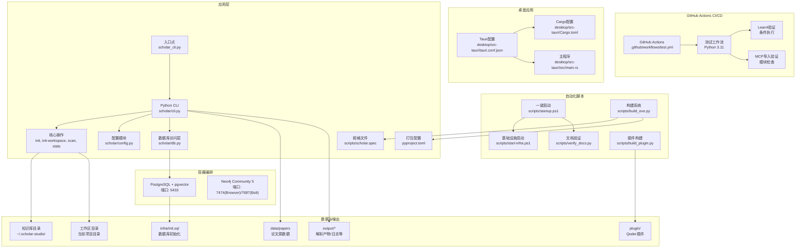

**图表来源**
- [.github/workflows/test.yml:1-45](file://.github/workflows/test.yml#L1-L45)
- [scripts/startup.ps1:1-130](file://scripts/startup.ps1#L1-L130)
- [scripts/start-infra.ps1:1-83](file://scripts/start-infra.ps1#L1-L83)
- [scripts/verify_docs.py:1-128](file://scripts/verify_docs.py#L1-L128)
- [scripts/build_exe.py:1-161](file://scripts/build_exe.py#L1-L161)
- [scripts/build_plugin.py:1-180](file://scripts/build_plugin.py#L1-L180)
- [desktop/src-tauri/tauri.conf.json:1-41](file://desktop/src-tauri/tauri.conf.json#L1-L41)
- [desktop/src-tauri/Cargo.toml:1-28](file://desktop/src-tauri/Cargo.toml#L1-L28)
- [desktop/src-tauri/src/main.rs:1-7](file://desktop/src-tauri/src/main.rs#L1-L7)
- [infra/docker-compose.yml:1-44](file://infra/docker-compose.yml#L1-L44)
- [infra/init.sql:1-131](file://infra/init.sql#L1-L131)
- [scholar/cli.py:1-800](file://scholar/cli.py#L1-L800)
- [scholar/commands/core_ops.py:75-106](file://scholar/commands/core_ops.py#L75-L106)
- [scholar/config.py:180-206](file://scholar/config.py#L180-L206)
- [scholar/config.py:95-111](file://scholar/config.py#L95-L111)
- [scripts/scholar.spec:1-151](file://scripts/scholar.spec#L1-L151)
- [pyproject.toml:1-36](file://pyproject.toml#L1-L36)
- [scholar_cli.py:1-15](file://scholar/scholar_cli.py#L1-L15)

**章节来源**
- [.github/workflows/test.yml:1-45](file://.github/workflows/test.yml#L1-L45)
- [scripts/startup.ps1:1-130](file://scripts/startup.ps1#L1-L130)
- [scripts/start-infra.ps1:1-83](file://scripts/start-infra.ps1#L1-L83)
- [scripts/verify_docs.py:1-128](file://scripts/verify_docs.py#L1-L128)
- [scripts/build_exe.py:1-161](file://scripts/build_exe.py#L1-L161)
- [scripts/scholar.spec:1-151](file://scripts/scholar.spec#L1-L151)
- [scripts/build_plugin.py:1-180](file://scripts/build_plugin.py#L1-L180)
- [desktop/src-tauri/tauri.conf.json:1-41](file://desktop/src-tauri/tauri.conf.json#L1-L41)
- [desktop/src-tauri/Cargo.toml:1-28](file://desktop/src-tauri/Cargo.toml#L1-L28)
- [desktop/src-tauri/src/main.rs:1-7](file://desktop/src-tauri/src/main.rs#L1-L7)
- [infra/docker-compose.yml:1-44](file://infra/docker-compose.yml#L1-L44)
- [infra/init.sql:1-131](file://infra/init.sql#L1-L131)
- [pyproject.toml:1-36](file://pyproject.toml#L1-L36)
- [scholar_cli.py:1-15](file://scholar/scholar_cli.py#L1-L15)

## 核心组件
- **新增**：GitHub Actions CI/CD流水线
  - 测试工作流：在Ubuntu最新环境中运行，支持Python 3.11矩阵测试
  - 条件执行：Lean4存在时才执行构建验证，避免环境差异影响
  - 模块验证：检查MCP服务器导入，确保依赖完整性
  - 多平台支持：跨平台兼容性测试
- **新增**：自动化基础设施启动脚本
  - 独立服务启动：支持PostgreSQL和Neo4j的独立启动
  - 健康检查：自动检测服务就绪状态
  - 状态报告：提供详细的服务状态信息
- **新增**：文档验证工具
  - 数字一致性检查：验证文档中的统计数据与实际项目状态
  - 自动化验证：定期检查文档准确性
  - 多文件支持：支持多个文档文件的一致性验证
- **新增**：桌面应用Tauri集成
  - 跨平台支持：支持Windows、macOS、Linux
  - React前端：基于React和TypeScript的现代前端框架
  - Tauri后端：轻量级原生应用框架
  - 插件系统：支持对话框、日志等Tauri插件
- **新增**：PyInstaller构建系统
  - 自动化构建：支持onedir和onefile两种构建模式
  - 隐藏导入：自动处理复杂的模块依赖关系
  - 体积优化：排除大型科学计算库以减小体积
- **新增**：Qoder插件构建工具
  - 自动化打包：支持技能、命令、规则、钩子的自动打包
  - 版本管理：从plugin.json读取版本信息
  - 分发支持：生成可分发的.zip压缩包
- **新增**：两阶段部署系统与双拷贝数据策略**
  - 阶段1：使用`scholar init`初始化知识库目录结构
  - 阶段2：在每个项目目录使用`scholar init-workspace`初始化工作区
  - 双拷贝策略：共享parsed/目录与项目特定输出分离
  - 环境变量支持：SCHOLAR_WORKSPACE环境变量自定义工作区位置
- 容器编排与健康检查
  - PostgreSQL + pgvector：暴露端口 5433，使用健康检查命令检测连接可用性
  - Neo4j：暴露浏览器端口 7474 与 Bolt 端口 7687，启用 APOC 插件并设置堆内存
- 数据库初始化
  - 初始化扩展 vector（用于向量检索）
  - 创建 papers、sections、formulas、citations、concepts、paper_concepts、chunks、innovations、replacements 等表，并建立必要索引
- Python CLI 与数据库访问
  - CLI 提供扫描、解析、查询、统计、图谱构建等命令
  - 数据库访问层封装 PostgreSQL 连接与事务，支持文件回退模式
- 环境变量与配置
  - 通过 .env 加载数据库、Neo4j、嵌入模型与 arXiv 请求等配置项
  - 支持SCHOLAR_WORKSPACE环境变量覆盖工作区位置

**章节来源**
- [.github/workflows/test.yml:1-45](file://.github/workflows/test.yml#L1-L45)
- [scripts/startup.ps1:1-130](file://scripts/startup.ps1#L1-L130)
- [scripts/start-infra.ps1:1-83](file://scripts/start-infra.ps1#L1-L83)
- [scripts/verify_docs.py:1-128](file://scripts/verify_docs.py#L1-L128)
- [scripts/build_exe.py:1-161](file://scripts/build_exe.py#L1-L161)
- [scripts/scholar.spec:1-151](file://scripts/scholar.spec#L1-L151)
- [scripts/build_plugin.py:1-180](file://scripts/build_plugin.py#L1-L180)
- [desktop/src-tauri/tauri.conf.json:1-41](file://desktop/src-tauri/tauri.conf.json#L1-L41)
- [desktop/src-tauri/Cargo.toml:1-28](file://desktop/src-tauri/Cargo.toml#L1-L28)
- [desktop/src-tauri/src/main.rs:1-7](file://desktop/src-tauri/src/main.rs#L1-L7)
- [infra/docker-compose.yml:1-44](file://infra/docker-compose.yml#L1-L44)
- [infra/init.sql:1-131](file://infra/init.sql#L1-L131)
- [scholar/cli.py:1-800](file://scholar/cli.py#L1-L800)
- [scholar/commands/core_ops.py:75-106](file://scholar/commands/core_ops.py#L75-L106)
- [scholar/config.py:180-206](file://scholar/config.py#L180-L206)
- [scholar/config.py:38-52](file://scholar/config.py#L38-L52)
- [scholar/config.py:116-177](file://scholar/config.py#L116-L177)

## 架构总览
下图展示容器化部署的整体交互：CLI 通过配置模块读取环境变量，连接 PostgreSQL 与 Neo4j；容器内数据库由 init.sql 初始化；启动脚本负责编排与健康检查；两阶段部署系统提供知识库与工作区的分离管理；构建系统提供可执行文件的自动化生成；GitHub Actions CI/CD基础设施提供自动化测试与验证；桌面应用提供跨平台客户端支持。

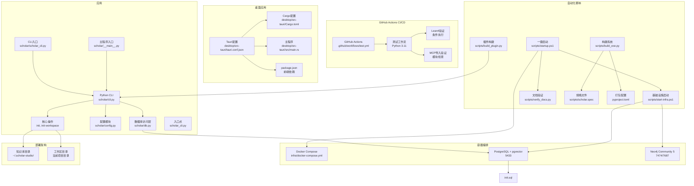

**图表来源**
- [.github/workflows/test.yml:1-45](file://.github/workflows/test.yml#L1-L45)
- [scripts/startup.ps1:1-130](file://scripts/startup.ps1#L1-L130)
- [scripts/start-infra.ps1:1-83](file://scripts/start-infra.ps1#L1-L83)
- [scripts/verify_docs.py:1-128](file://scripts/verify_docs.py#L1-L128)
- [scripts/build_exe.py:1-161](file://scripts/build_exe.py#L1-L161)
- [scripts/scholar.spec:1-151](file://scripts/scholar.spec#L1-L151)
- [scripts/build_plugin.py:1-180](file://scripts/build_plugin.py#L1-L180)
- [desktop/src-tauri/tauri.conf.json:1-41](file://desktop/src-tauri/tauri.conf.json#L1-L41)
- [desktop/src-tauri/Cargo.toml:1-28](file://desktop/src-tauri/Cargo.toml#L1-L28)
- [desktop/src-tauri/src/main.rs:1-7](file://desktop/src-tauri/src/main.rs#L1-L7)
- [desktop/package.json:1-37](file://desktop/package.json#L1-L37)
- [infra/docker-compose.yml:1-44](file://infra/docker-compose.yml#L1-L44)
- [infra/init.sql:1-131](file://infra/init.sql#L1-L131)
- [scholar/cli.py:1-800](file://scholar/cli.py#L1-L800)
- [scholar/commands/core_ops.py:75-106](file://scholar/commands/core_ops.py#L75-L106)
- [scholar/config.py:180-206](file://scholar/config.py#L180-L206)
- [scholar/config.py:38-52](file://scholar/config.py#L38-L52)
- [scholar/db.py:1-276](file://scholar/db.py#L1-L276)
- [scholar/__main__.py:1-8](file://scholar/__main__.py#L1-L8)
- [scholar/scholar_cli.py:1-15](file://scholar/scholar_cli.py#L1-L15)

## 详细组件分析

### GitHub Actions CI/CD流水线
**新增**：完整的GitHub Actions CI/CD流水线，替代GitLab CI配置

- **测试工作流配置**
  - 触发条件：在main/master分支推送和PR时触发
  - 运行环境：ubuntu-latest虚拟机
  - Python版本：固定使用3.11版本（matrix策略预留扩展空间）
  - 步骤流程：检出代码 → 设置Python → 安装依赖 → 运行测试 → 验证Lean4 → 验证MCP导入
- **条件执行机制**
  - Lean4验证：仅当系统中存在lake命令时才执行Lean4构建验证
  - 错误容忍：Lean4验证失败时不阻塞整体流程（continue-on-error: true）
  - 环境适配：避免不同环境下的依赖差异影响CI稳定性
- **模块完整性验证**
  - MCP服务器导入：验证scholar_mcp.server模块的可用性
  - 依赖完整性：确保所有必需模块都能正常导入
  - 测试前置：在运行pytest之前完成所有依赖验证

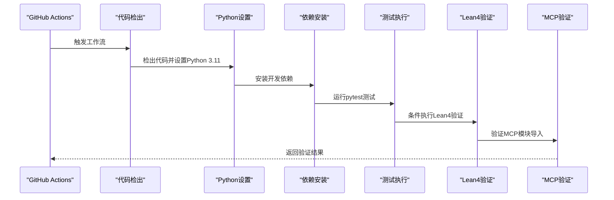

**图表来源**
- [.github/workflows/test.yml:16-45](file://.github/workflows/test.yml#L16-L45)

**章节来源**
- [.github/workflows/test.yml:1-45](file://.github/workflows/test.yml#L1-L45)

### 自动化基础设施启动脚本
**新增**：完整的基础设施启动脚本系统

- **scripts/startup.ps1 - 一键启动脚本**
  - 功能概览：检测Docker、Python、依赖与.env，启动容器并等待健康状态
  - 预检流程：检查Docker Desktop、Python版本、.env文件、依赖安装
  - 健康检查：使用docker inspect检测PostgreSQL和Neo4j健康状态
  - 状态检查：查询数据库论文数、分块数、Neo4j节点数
  - 阶段2提示：提供工作区初始化命令指导
  - 常用命令：显示知识库统计、搜索、更新等常用命令

- **scripts/start-infra.ps1 - 基础设施启动脚本**
  - 独立服务启动：支持PostgreSQL和Neo4j的独立启动
  - 健康检查：分别检测PostgreSQL连接状态和Neo4j Web界面
  - 状态报告：提供详细的服务状态信息和连接参数
  - 错误处理：完善的错误检测和用户友好的错误消息

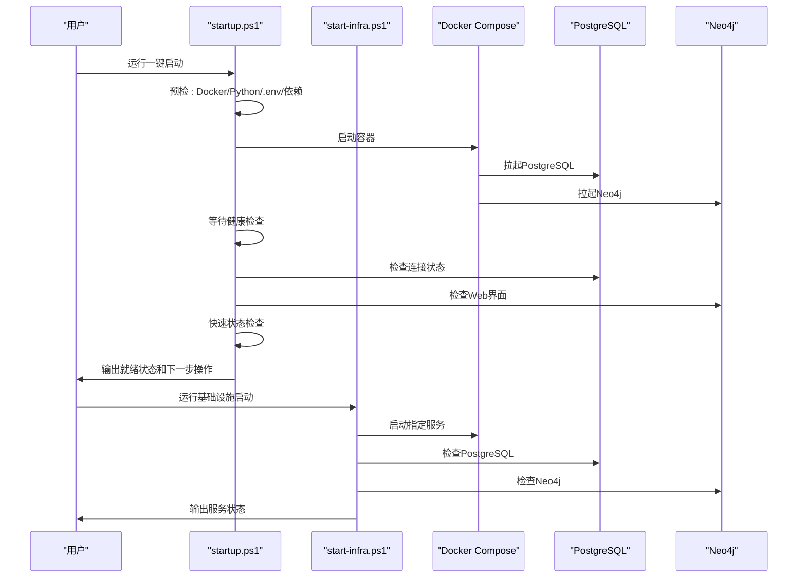

**图表来源**
- [scripts/startup.ps1:11-130](file://scripts/startup.ps1#L11-L130)
- [scripts/start-infra.ps1:14-83](file://scripts/start-infra.ps1#L14-L83)

**章节来源**
- [scripts/startup.ps1:1-130](file://scripts/startup.ps1#L1-L130)
- [scripts/start-infra.ps1:1-83](file://scripts/start-infra.ps1#L1-L83)

### 文档验证工具
**新增**：智能文档验证工具，确保文档与实际项目状态一致

- **功能特性**
  - 统计数据验证：自动统计MCP工具数量、技能数量、规则数量、命令数量、钩子数量
  - 论文数量检查：统计解析的论文数量和数据目录中的论文文件夹数量
  - 多文件支持：支持多个文档文件的一致性验证
  - 智能匹配：使用正则表达式匹配文档中的统计数据
  - 错误报告：提供详细的不一致错误报告和修复建议

- **验证范围**
  - MCP工具：统计scholar_mcp/server.py中的@mcp.tool装饰器数量
  - 技能：统计.qoder/skills目录中的技能数量
  - 规则：统计.qoder/rules目录中的规则文件数量
  - 命令：统计.qoder/commands目录中的命令文件数量
  - 钩子：统计.qoder/hooks目录中的PowerShell脚本数量
  - 论文：统计output/parsed目录中的JSON文件和data/papers目录中的论文文件夹

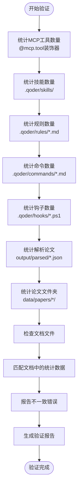

**图表来源**
- [scripts/verify_docs.py:18-128](file://scripts/verify_docs.py#L18-L128)

**章节来源**
- [scripts/verify_docs.py:1-128](file://scripts/verify_docs.py#L1-L128)

### 桌面应用Tauri集成
**新增**：完整的Tauri桌面应用集成

- **Tauri配置**
  - 产品配置：名称、版本、标识符、构建设置
  - 前端集成：Vite构建系统，React + TypeScript前端
  - 窗口配置：窗口尺寸、标题、可调整大小、全屏支持
  - 安全配置：CSP设置为空，允许更多灵活性
  - 打包配置：支持多平台打包，包含图标资源

- **Cargo依赖**
  - 核心框架：Tauri 2.11.3，支持现代桌面应用开发
  - 插件系统：日志插件、对话框插件
  - 数据处理：Serde JSON序列化
  - 跨平台：Dirs库支持用户目录访问

- **构建流程**
  - 开发模式：npm run dev启动Vite开发服务器
  - 生产构建：npm run build生成静态资源
  - Tauri集成：npm run tauri进行最终打包
  - 多平台支持：支持Windows、macOS、Linux

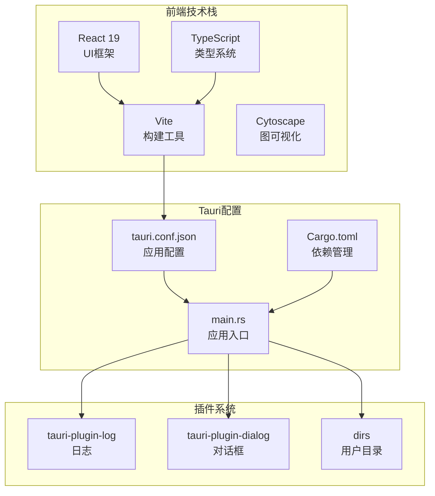

**图表来源**
- [desktop/src-tauri/tauri.conf.json:1-41](file://desktop/src-tauri/tauri.conf.json#L1-L41)
- [desktop/src-tauri/Cargo.toml:1-28](file://desktop/src-tauri/Cargo.toml#L1-L28)
- [desktop/src-tauri/src/main.rs:1-7](file://desktop/src-tauri/src/main.rs#L1-L7)
- [desktop/package.json:1-37](file://desktop/package.json#L1-L37)

**章节来源**
- [desktop/src-tauri/tauri.conf.json:1-41](file://desktop/src-tauri/tauri.conf.json#L1-L41)
- [desktop/src-tauri/Cargo.toml:1-28](file://desktop/src-tauri/Cargo.toml#L1-L28)
- [desktop/src-tauri/src/main.rs:1-7](file://desktop/src-tauri/src/main.rs#L1-L7)
- [desktop/package.json:1-37](file://desktop/package.json#L1-L37)

### PyInstaller构建系统
**新增**：完整的PyInstaller构建系统

- **scripts/build_exe.py - 主要构建脚本**
  - 自动检测：检查并安装PyInstaller依赖
  - 模式支持：支持onedir（推荐）和onefile两种构建模式
  - 隐藏导入：自动处理100+个隐藏导入模块
  - 体积优化：排除大型科学计算库以减小体积
  - 开发模式：支持pip install -e .开发模式安装
  - 产物报告：详细报告构建产物大小和使用方式

- **scripts/scholar.spec - PyInstaller规格文件**
  - 模块收集：自动收集所有scholar子模块
  - 第三方库：包含psycopg2、neo4j、rich等第三方库
  - 排除配置：排除matplotlib、numpy、pandas等大型库
  - UPX压缩：支持UPX压缩优化
  - 多模式支持：同时支持onedir和onefile模式

- **pyproject.toml - 现代化打包配置**
  - setuptools构建：使用setuptools构建系统
  - 可执行命令：定义scholar命令入口点
  - 依赖管理：核心依赖和可选开发依赖
  - 包发现：自动发现scholar和scholar_mcp包
  - 数据文件：包含JSON和文本文件

**图表来源**
- [scripts/build_exe.py:19-161](file://scripts/build_exe.py#L19-L161)
- [scripts/scholar.spec:19-98](file://scripts/scholar.spec#L19-L98)
- [pyproject.toml:5-36](file://pyproject.toml#L5-L36)

**章节来源**
- [scripts/build_exe.py:1-161](file://scripts/build_exe.py#L1-L161)
- [scripts/scholar.spec:1-151](file://scripts/scholar.spec#L1-L151)
- [pyproject.toml:1-36](file://pyproject.toml#L1-L36)

### Qoder插件构建工具
**新增**：专业的Qoder插件构建工具

- **scripts/build_plugin.py - 插件构建脚本**
  - 自动复制：从.qoder目录复制技能、命令、规则、钩子到plugin/目录
  - 版本管理：从plugin.json读取插件名称和版本信息
  - 压缩打包：生成可分发的.zip压缩包
  - 清理机制：自动清理旧的构建产物
  - 结构验证：显示最终插件目录结构

- **插件结构**
  - skills/：学术研究技能集合，包含SKILL.md文件
  - commands/：命令规范文档，包含.md文件
  - rules/：行为规则，包含.md文件（去除frontmatter）
  - hooks/：钩子脚本，包含.ps1文件和hooks.json
  - .qoder-plugin/：插件元数据，包含plugin.json

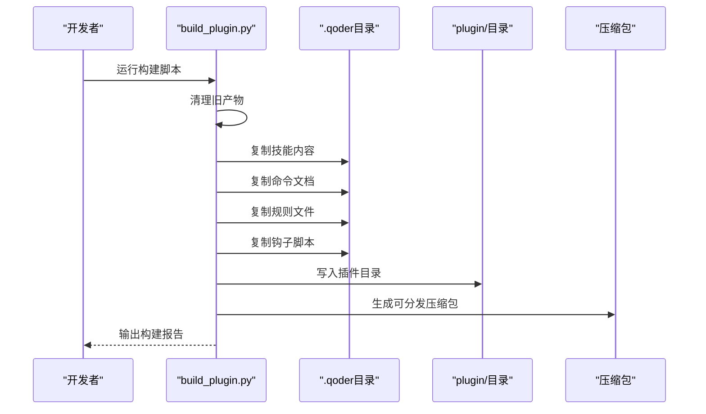

**图表来源**
- [scripts/build_plugin.py:26-180](file://scripts/build_plugin.py#L26-L180)

**章节来源**
- [scripts/build_plugin.py:1-180](file://scripts/build_plugin.py#L1-L180)

### 两阶段部署系统与双拷贝数据策略
**新增**：完整的两阶段部署系统，支持知识库与工作区的分离管理

- **阶段1：知识库初始化**
  - 使用`scholar init`命令初始化全局知识库目录
  - 创建知识库根目录（SCHOLAR_HOME）及其所有子目录
  - 生成.env.example配置文件
  - 目录结构：knowledge base（parsed/）、output/、data/、LEAN/
- **阶段2：工作区初始化**
  - 使用`scholar init-workspace`命令初始化项目工作区
  - 创建工作区目录（WORKSPACE_DIR）及其子目录
  - 目录结构：drafts/、notes/、logs/（项目特定输出）
  - **双拷贝策略**：共享parsed/目录保持不变，工作区特定输出独立管理
- **配置管理**
  - 支持SCHOLAR_WORKSPACE环境变量自定义工作区位置
  - 开发模式与打包模式自动切换
  - 支持多项目并行工作

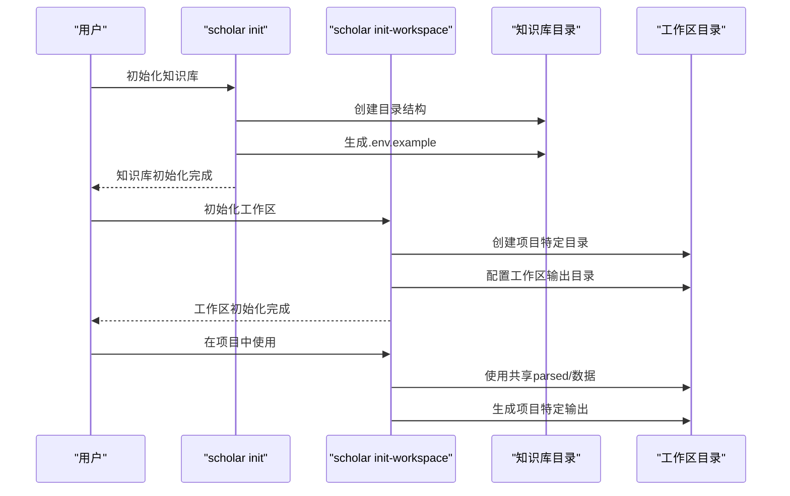

**图表来源**
- [scholar/commands/core_ops.py:17-44](file://scholar/commands/core_ops.py#L17-L44)
- [scholar/commands/core_ops.py:75-106](file://scholar/commands/core_ops.py#L75-L106)
- [scholar/config.py:116-177](file://scholar/config.py#L116-L177)
- [scholar/config.py:180-206](file://scholar/config.py#L180-L206)

**章节来源**
- [scholar/commands/core_ops.py:17-44](file://scholar/commands/core_ops.py#L17-L44)
- [scholar/commands/core_ops.py:75-106](file://scholar/commands/core_ops.py#L75-L106)
- [scholar/config.py:116-177](file://scholar/config.py#L116-L177)
- [scholar/config.py:180-206](file://scholar/config.py#L180-L206)
- [scholar/config.py:38-52](file://scholar/config.py#L38-L52)

### 容器编排与健康检查
- PostgreSQL + pgvector
  - 镜像与端口：使用官方 pgvector 镜像，容器名 scholar-pg，映射宿主 5433:5432
  - 环境变量：数据库名、用户、密码
  - 卷：持久化数据与初始化脚本挂载
  - 偁康检查：使用 pg_isready 检测连接可用性，间隔与超时合理设置
- Neo4j
  - 镜像与端口：Neo4j 5 Community，映射 7474（Browser UI）、7687（Bolt）
  - 环境变量：认证、启用 APOC 插件、堆内存参数
  - 卷：持久化数据
  - 健康检查：通过 neo4j status 命令检测服务状态

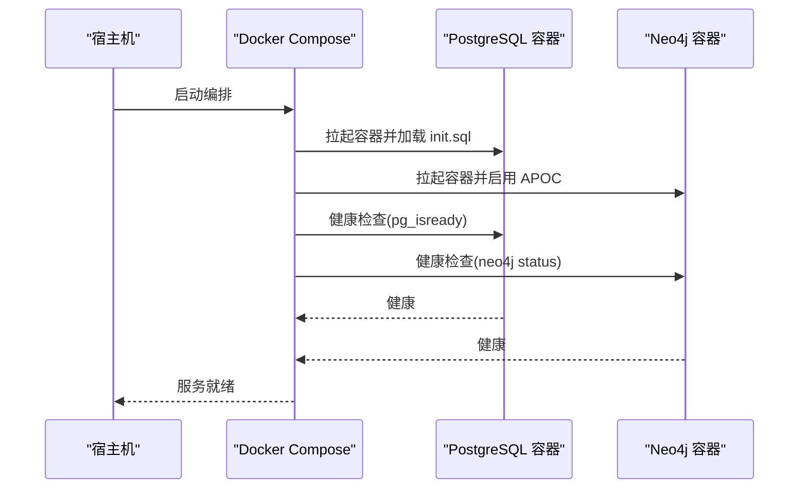

**图表来源**
- [infra/docker-compose.yml:1-44](file://infra/docker-compose.yml#L1-L44)

**章节来源**
- [infra/docker-compose.yml:1-44](file://infra/docker-compose.yml#L1-L44)

### 数据库初始化与表结构
- 初始化扩展：vector（用于向量检索）
- 表与索引
  - papers：论文元数据与解析状态
  - sections：论文结构化正文
  - formulas：提取的 LaTeX 公式
  - citations：参考文献关系
  - concepts：抽取的关键概念
  - paper_concepts：论文-概念关联
  - chunks：分块与向量嵌入（未来 RAG 使用）
  - innovations / replacements：与 Lean4 数据同步
- 设计要点
  - 外键约束与唯一性约束保证数据一致性
  - 为高频查询字段建立索引（如 paper_id）

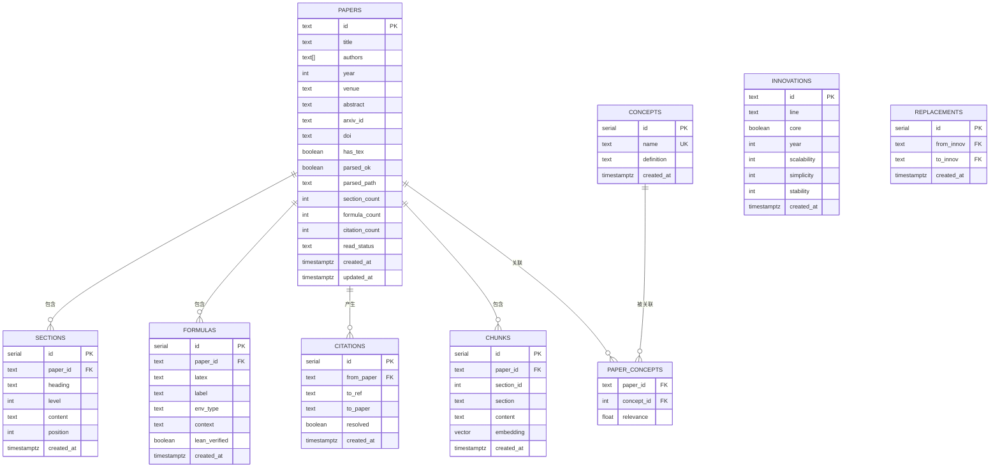

**图表来源**
- [infra/init.sql:1-131](file://infra/init.sql#L1-L131)

**章节来源**
- [infra/init.sql:1-131](file://infra/init.sql#L1-L131)

### Python CLI 与数据库访问层
- CLI 命令族
  - 扫描、解析、批量解析、信息查看、全文搜索、列表、统计、导出 BibTeX、作者补全、arXiv 搜索、图谱构建与统计、查询等
  - **新增**：两阶段部署命令：init（初始化知识库）、init-workspace（初始化工作区）
- 数据库访问层
  - 支持可选的 psycopg2 连接，若不可用则回退到文件模式
  - 提供 upsert_paper、upsert_sections、upsert_formulas、upsert_citations、查询与统计方法
- 配置模块
  - 从 .env 加载数据库、Neo4j、嵌入模型、LaTeX 编译器、Lean4 项目路径等
  - 提供 arXiv 请求工具（带重试、超时、代理）
  - **新增**：运行模式检测，支持开发模式与打包模式的自动切换
  - **新增**：工作区目录解析，支持SCHOLAR_WORKSPACE环境变量

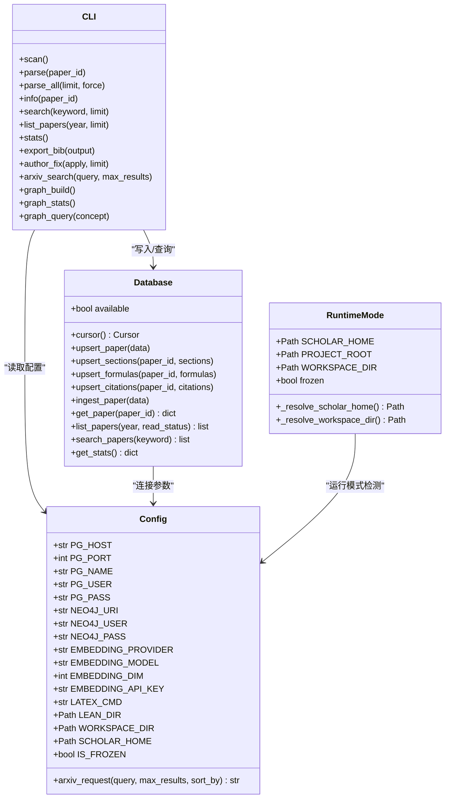

**图表来源**
- [scholar/db.py:1-276](file://scholar/db.py#L1-L276)
- [scholar/config.py:1-283](file://scholar/config.py#L1-L283)
- [scholar/cli.py:1-800](file://scholar/cli.py#L1-L800)

**章节来源**
- [scholar/cli.py:1-800](file://scholar/cli.py#L1-L800)
- [scholar/db.py:1-276](file://scholar/db.py#L1-L276)
- [scholar/config.py:1-283](file://scholar/config.py#L1-L283)

### 一键启动脚本与健康检查流程
**更新**：增强的启动脚本，支持两阶段部署

- 功能概览
  - 检测 Docker、Python、依赖与 .env
  - 拉起容器并等待 PostgreSQL 与 Neo4j 健康
  - 快速检查知识库状态（论文数、分块数、Neo4j 节点数）
  - **新增**：阶段2工作区初始化说明与命令提示
  - 输出下一步命令与提示
- 关键流程
  - 使用 docker inspect 获取健康状态
  - 通过 psql 与 cypher-shell 查询数据库状态
  - 超时控制与最大等待时间
  - **新增**：两阶段部署流程提示

**图表来源**
- [scripts/startup.ps1:11-130](file://scripts/startup.ps1#L11-L130)

**章节来源**
- [scripts/startup.ps1:1-130](file://scripts/startup.ps1#L1-L130)

## 依赖关系分析
- 组件耦合
  - CLI 依赖配置模块与数据库访问层
  - 核心操作模块（core_ops）依赖配置模块进行两阶段部署
  - 数据库访问层依赖配置模块与 psycopg2（可选）
  - 容器编排独立于应用层，通过端口与卷进行解耦
  - **新增**：构建系统独立于应用层，通过规格文件和配置文件进行解耦
  - **新增**：GitHub Actions CI/CD独立于应用层，通过工作流文件进行解耦
  - **新增**：桌面应用独立于后端服务，通过API接口进行通信
  - **新增**：自动化脚本独立于核心业务，提供运维支持
- 外部依赖
  - Python 依赖：typer、rich、psycopg2-binary、neo4j、python-dotenv、PyMuPDF、mcp 等
  - 容器镜像：pgvector/pgvector:pg16、neo4j:5-community
  - **新增**：构建工具：PyInstaller、setuptools、wheel
  - **新增**：CI/CD工具：GitHub Actions、pytest
  - **新增**：桌面应用：Tauri、React、Vite
  - **新增**：脚本工具：PowerShell自动化脚本
- 可能的循环依赖
  - 当前模块间无循环导入，耦合度低，便于维护与扩展

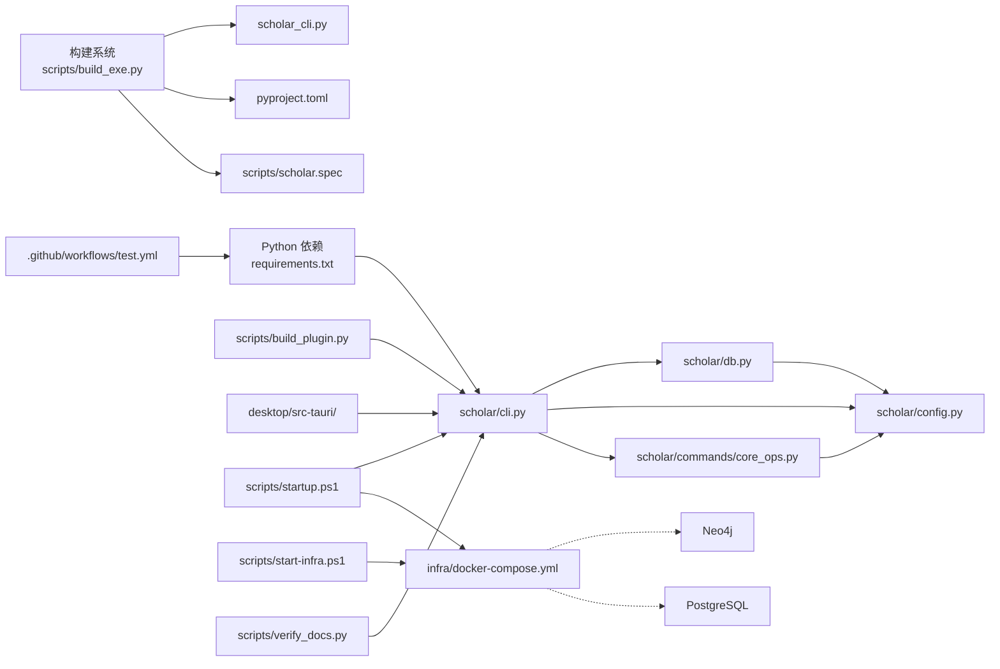

**图表来源**
- [scholar/cli.py:1-800](file://scholar/cli.py#L1-L800)
- [scholar/commands/core_ops.py:1-438](file://scholar/commands/core_ops.py#L1-L438)
- [scholar/config.py:1-283](file://scholar/config.py#L1-L283)
- [scholar/db.py:1-276](file://scholar/db.py#L1-L276)
- [infra/docker-compose.yml:1-44](file://infra/docker-compose.yml#L1-L44)
- [requirements.txt:1-18](file://requirements.txt#L1-L18)
- [scripts/build_exe.py:1-161](file://scripts/build_exe.py#L1-L161)
- [.github/workflows/test.yml:1-45](file://.github/workflows/test.yml#L1-L45)
- [scripts/scholar.spec:1-151](file://scripts/scholar.spec#L1-L151)
- [pyproject.toml:1-36](file://pyproject.toml#L1-L36)
- [scripts/build_plugin.py:1-180](file://scripts/build_plugin.py#L1-L180)
- [desktop/src-tauri/tauri.conf.json:1-41](file://desktop/src-tauri/tauri.conf.json#L1-L41)
- [scripts/startup.ps1:1-130](file://scripts/startup.ps1#L1-L130)
- [scripts/start-infra.ps1:1-83](file://scripts/start-infra.ps1#L1-L83)
- [scripts/verify_docs.py:1-128](file://scripts/verify_docs.py#L1-L128)

**章节来源**
- [requirements.txt:1-18](file://requirements.txt#L1-L18)
- [infra/docker-compose.yml:1-44](file://infra/docker-compose.yml#L1-L44)
- [scholar/cli.py:1-800](file://scholar/cli.py#L1-L800)
- [scholar/commands/core_ops.py:1-438](file://scholar/commands/core_ops.py#L1-L438)
- [scholar/config.py:1-283](file://scholar/config.py#L1-L283)
- [scholar/db.py:1-276](file://scholar/db.py#L1-L276)
- [scripts/build_exe.py:1-161](file://scripts/build_exe.py#L1-L161)
- [.github/workflows/test.yml:1-45](file://.github/workflows/test.yml#L1-L45)
- [scripts/scholar.spec:1-151](file://scripts/scholar.spec#L1-L151)
- [pyproject.toml:1-36](file://pyproject.toml#L1-L36)
- [scripts/build_plugin.py:1-180](file://scripts/build_plugin.py#L1-L180)
- [desktop/src-tauri/tauri.conf.json:1-41](file://desktop/src-tauri/tauri.conf.json#L1-L41)
- [scripts/startup.ps1:1-130](file://scripts/startup.ps1#L1-L130)
- [scripts/start-infra.ps1:1-83](file://scripts/start-infra.ps1#L1-L83)
- [scripts/verify_docs.py:1-128](file://scripts/verify_docs.py#L1-L128)

## 性能考虑
- 数据库性能
  - 为高频查询字段建立索引（如 sections.paper_id、formulas.paper_id、citations.from_paper、citations.to_paper）
  - 使用向量扩展进行 RAG 检索时，合理设置嵌入维度与索引策略
- 图数据库性能
  - 合理设置 Neo4j 堆内存参数，避免 OOM
  - 在大规模图构建时分批处理与事务提交
- I/O 与并发
  - 批量解析与入库时使用进度条与事务，减少锁竞争
  - 控制并发数量，避免磁盘与网络成为瓶颈
- 网络与代理
  - arXiv 请求支持代理与重试，建议在受限网络环境下配置代理环境变量
- **新增**：双拷贝数据策略性能优化
  - 共享parsed/目录减少重复数据存储
  - 工作区特定输出独立管理，避免I/O冲突
  - 支持多项目并行工作，提高资源利用率
- **新增**：构建性能优化
  - onedir模式启动更快，适合开发和调试
  - onefile模式便于分发，但启动速度较慢
  - 合理配置隐藏导入和排除模块，平衡功能完整性与体积大小
- **新增**：CI/CD性能优化
  - 条件执行避免不必要的构建步骤
  - 错误容忍机制确保CI稳定性
  - 多Python版本矩阵测试预留扩展空间
- **新增**：桌面应用性能优化**
  - Tauri框架提供轻量级原生应用体验
  - React前端优化渲染性能
  - Vite开发服务器提供快速热重载
- **新增**：自动化脚本性能优化**
  - PowerShell脚本优化执行效率
  - 健康检查采用并行检测
  - 错误处理减少重复检查

## 故障排除指南
- Docker 未安装或未运行
  - 现象：启动脚本报错退出
  - 处理：安装 Docker Desktop 并确保服务运行
- Python 依赖缺失
  - 现象：依赖检查失败
  - 处理：执行依赖安装命令，确保所需包版本满足要求
- .env 未创建
  - 现象：.env 不存在，脚本自动复制示例文件
  - 处理：根据需要编辑 .env，填写嵌入 API 密钥等敏感信息
- 服务未就绪
  - 现象：健康检查超时
  - 处理：检查容器日志、确认端口占用、调整健康检查间隔与超时
- 数据库初始化失败
  - 现象：表结构异常或索引缺失
  - 处理：确认 init.sql 已正确挂载并执行，检查权限与卷挂载
- Neo4j 图谱构建异常
  - 现象：图构建失败或节点为空
  - 处理：确认 Neo4j 健康、APOC 插件可用、数据导入顺序正确
- **新增**：两阶段部署问题
  - 现象：知识库或工作区初始化失败
  - 处理：检查SCHOLAR_HOME和SCHOLAR_WORKSPACE环境变量，确认目录权限
- **新增**：双拷贝数据策略问题
  - 现象：parsed/目录访问权限错误
  - 处理：确认知识库目录与工作区目录的读写权限，检查SCHOLAR_HOME设置
- **新增**：构建系统故障
  - 现象：PyInstaller构建失败
  - 处理：检查build_exe.py中的隐藏导入配置，确认所有依赖模块都已正确声明
- **新增**：可执行文件运行异常
  - 现象：scholar.exe无法启动或找不到模块
  - 处理：检查SCHOLAR_HOME环境变量，确认配置文件和数据目录存在
- **新增**：GitHub Actions CI/CD问题
  - 现象：测试工作流失败或中断
  - 处理：检查工作流语法、依赖安装、条件执行逻辑，确认环境配置正确
- **新增**：桌面应用启动问题
  - 现象：Tauri应用无法启动或崩溃
  - 处理：检查Node.js版本、依赖安装、构建配置，确认前端资源正确生成
- **新增**：自动化脚本问题
  - 现象：PowerShell脚本执行失败
  - 处理：检查脚本权限、执行策略、依赖模块，确认系统兼容性

**章节来源**
- [scripts/startup.ps1:1-130](file://scripts/startup.ps1#L1-L130)
- [scripts/start-infra.ps1:1-83](file://scripts/start-infra.ps1#L1-L83)
- [scripts/verify_docs.py:1-128](file://scripts/verify_docs.py#L1-L128)
- [scripts/build_exe.py:1-161](file://scripts/build_exe.py#L1-L161)
- [.github/workflows/test.yml:1-45](file://.github/workflows/test.yml#L1-L45)
- [desktop/src-tauri/tauri.conf.json:1-41](file://desktop/src-tauri/tauri.conf.json#L1-L41)
- [desktop/src-tauri/Cargo.toml:1-28](file://desktop/src-tauri/Cargo.toml#L1-L28)
- [desktop/src-tauri/src/main.rs:1-7](file://desktop/src-tauri/src/main.rs#L1-L7)

## 结论
本指南提供了从容器编排、数据库初始化、环境变量管理到服务健康检查与运维实践的完整方案。**新增的GitHub Actions CI/CD流水线**显著提升了项目的自动化测试与验证能力，通过条件执行和错误容忍机制确保了CI流程的稳定性。**新增的自动化基础设施启动脚本**提供了更加灵活的服务启动方式，支持独立服务启动和健康检查。**新增的文档验证工具**确保了文档与实际项目状态的一致性，减少了维护成本。**新增的桌面应用Tauri集成**为用户提供了跨平台的桌面客户端体验，支持现代化的前端技术栈。**新增的PyInstaller构建系统**简化了可执行文件的构建和分发过程，支持多种构建模式。**新增的Qoder插件构建工具**为技能和命令的打包分发提供了标准化流程。**新增的两阶段部署系统**进一步完善了部署流程，通过知识库与工作区的分离管理，提供了更加灵活和高效的学术研究工具链部署方案。**新增的双拷贝数据策略**有效解决了多项目协作中的数据管理问题，支持共享知识库与项目特定输出的并存。建议在生产环境中结合监控告警、备份恢复与安全加固进一步提升可靠性与安全性。

## 附录

### 环境变量清单（摘自配置模块）
- 数据库连接
  - SCHOLAR_PG_HOST：PostgreSQL 主机
  - SCHOLAR_PG_PORT：PostgreSQL 端口（默认 5433）
  - SCHOLAR_PG_NAME：数据库名（默认 scholar）
  - SCHOLAR_PG_USER：用户名（默认 scholar）
  - SCHOLAR_PG_PASS：密码（默认 scholar2024）
- Neo4j 连接
  - SCHOLAR_NEO4J_URI：Neo4j 地址（默认 bolt://localhost:7687）
  - SCHOLAR_NEO4J_USER：用户名（默认 neo4j）
  - SCHOLAR_NEO4J_PASS：密码（默认 scholar2024）
- 嵌入模型
  - SCHOLAR_EMBEDDING_PROVIDER：嵌入提供商（默认 zhipu）
  - SCHOLAR_EMBEDDING_MODEL：模型名称（默认 embedding-2）
  - SCHOLAR_EMBEDDING_DIM：嵌入维度（默认 1024）
  - SCHOLAR_EMBEDDING_API_KEY：API 密钥（默认空）
- LaTeX 与 Lean4
  - SCHOLAR_LATEX_CMD：LaTeX 编译命令（默认 pdflatex）
  - SCHOLAR_LEAN_DIR：Lean4 项目目录（指向 LEAN 目录）
- arXiv 请求
  - SCHOLAR_ARXIV_TIMEOUT：请求超时（秒）
  - SCHOLAR_ARXIV_RETRIES：重试次数
  - HTTP_PROXY / HTTPS_PROXY：代理配置
- **新增**：运行模式配置
  - SCHOLAR_HOME：知识库根目录（默认 ~/.scholar-studio/）
  - **新增**：SCHOLAR_WORKSPACE：工作区目录（默认当前目录）
- **新增**：项目配置
  - SCHOLAR_PROJECT_NAME：项目名称（默认知识库根目录名称）

**章节来源**
- [scholar/config.py:208-283](file://scholar/config.py#L208-L283)

### 常用命令与下一步操作
- 启动服务
  - 使用一键启动脚本拉起容器并等待健康
  - **新增**：使用基础设施启动脚本独立启动服务
- **新增**：两阶段部署流程
  - 阶段1：`scholar init` - 初始化知识库目录结构
  - 阶段2：`scholar init-workspace` - 初始化项目工作区
- 初始化知识库
  - 执行全量初始化命令（耗时较长）
- **新增**：构建可执行文件
  - `python scripts/build_exe.py`：构建onedir模式（推荐）
  - `python scripts/build_exe.py --onefile`：构建onefile模式
  - `python scripts/build_exe.py --install`：pip install -e .开发模式安装
- **新增**：构建Qoder插件
  - `python scripts/build_plugin.py`：构建可分发插件包
- **新增**：GitHub Actions测试
  - `gh workflow run test.yml`：手动触发测试工作流
  - `gh run list -w test`：查看最近测试运行记录
- **新增**：桌面应用开发
  - `npm run dev`：启动Tauri开发服务器
  - `npm run tauri dev`：启动Tauri应用
  - `npm run tauri build`：构建生产版本
- **新增**：文档验证
  - `python scripts/verify_docs.py`：验证文档一致性
- 日常运维
  - 查看知识库统计、执行搜索、维护图谱、导出参考文献

**章节来源**
- [scripts/startup.ps1:117-121](file://scripts/startup.ps1#L117-L121)
- [scripts/start-infra.ps1:72-83](file://scripts/start-infra.ps1#L72-L83)
- [plugin/README.md:19-38](file://plugin/README.md#L19-L38)
- [scripts/build_exe.py:149-161](file://scripts/build_exe.py#L149-L161)
- [scripts/build_plugin.py:178-180](file://scripts/build_plugin.py#L178-L180)
- [.github/workflows/test.yml:1-45](file://.github/workflows/test.yml#L1-L45)
- [desktop/package.json:6-11](file://desktop/package.json#L6-L11)
- [scripts/verify_docs.py:80-128](file://scripts/verify_docs.py#L80-L128)

### 两阶段部署详细流程
**新增**：完整的两阶段部署操作指南

- **阶段1：知识库初始化**
  1. 运行`scholar init`命令
  2. 系统创建知识库根目录（SCHOLAR_HOME）
  3. 生成.env.example配置文件
  4. 创建所有必要的子目录结构
  5. 复制示例配置文件到.SCHOLAR_HOME/.env
  6. 配置数据库连接参数
  7. 启动Docker容器并等待健康状态
  8. 验证数据库连接和Neo4j连接
  9. 显示知识库初始化完成信息

- **阶段2：工作区初始化**
  1. 在项目目录中运行`scholar init-workspace`
  2. 系统创建工作区目录（WORKSPACE_DIR）
  3. 创建项目特定的输出目录：drafts/、notes/、logs/
  4. 配置双拷贝数据策略
  5. 显示双拷贝布局信息
  6. 提示后续操作命令
  7. 支持多项目并行工作

- **双拷贝数据策略**
  - 共享知识库：parsed/目录位于SCHOLAR_HOME
  - 工作区特定：drafts/、notes/、logs/位于项目目录
  - 支持SCHOLAR_WORKSPACE环境变量自定义工作区位置
  - 开发模式与打包模式自动切换

**章节来源**
- [scholar/commands/core_ops.py:17-44](file://scholar/commands/core_ops.py#L17-L44)
- [scholar/commands/core_ops.py:75-106](file://scholar/commands/core_ops.py#L75-L106)
- [scholar/config.py:116-177](file://scholar/config.py#L116-L177)
- [scholar/config.py:180-206](file://scholar/config.py#L180-L206)
- [scripts/startup.ps1:117-121](file://scripts/startup.ps1#L117-L121)

### 构建系统配置详解
**新增**：详细的构建系统配置说明

- **scripts/build_exe.py配置**
  - 自动检查PyInstaller依赖并安装
  - 支持onedir（默认）和onefile两种模式
  - 内置100+个隐藏导入模块
  - 排除大型科学计算库以减小体积
  - 自动报告构建产物大小和使用方式

- **scripts/scholar.spec配置**
  - 定义scholar包的所有子模块
  - 包含第三方库的完整导入列表
  - 配置排除模块：matplotlib、numpy、pandas、torch等
  - 支持UPX压缩优化

- **pyproject.toml配置**
  - 使用setuptools构建系统
  - 定义项目元数据：名称、版本、描述
  - 配置可执行命令：scholar -> scholar.cli:main
  - 支持可选依赖：mcp
  - 定义包发现规则和数据文件

**章节来源**
- [scripts/build_exe.py:36-130](file://scripts/build_exe.py#L36-L130)
- [scripts/scholar.spec:19-98](file://scripts/scholar.spec#L19-L98)
- [pyproject.toml:5-36](file://pyproject.toml#L5-L36)

### GitHub Actions CI/CD配置详解
**新增**：完整的CI/CD配置说明

- **test.yml工作流配置**
  - 触发条件：main/master分支推送和PR活动
  - 运行环境：ubuntu-latest虚拟机
  - Python版本：3.11（matrix策略预留扩展）
  - 步骤序列：代码检出 → Python设置 → 依赖安装 → 测试执行 → 条件验证 → 模块检查
  - 错误处理：Lean4验证使用continue-on-error避免CI中断

- **测试配置**
  - pytest配置：testpaths、文件命名模式、类和函数匹配规则
  - 标记系统：slow（耗时测试）、integration（集成测试）
  - 测试隔离：支持网络和编译相关测试的分类管理

- **依赖管理**
  - 开发依赖：pytest、pytest-benchmark
  - 运行时依赖：核心Python包和可选包
  - 环境兼容：Python 3.10+要求

**章节来源**
- [.github/workflows/test.yml:1-45](file://.github/workflows/test.yml#L1-L45)
- [requirements.txt:1-18](file://requirements.txt#L1-L18)
- [pyproject.toml:1-36](file://pyproject.toml#L1-L36)

### 桌面应用开发配置详解
**新增**：完整的桌面应用开发配置说明

- **tauri.conf.json配置**
  - 产品配置：名称、版本、标识符、构建设置
  - 前端集成：Vite构建系统，React + TypeScript前端
  - 窗口配置：窗口尺寸、标题、可调整大小、全屏支持
  - 安全配置：CSP设置为空，允许更多灵活性
  - 打包配置：支持多平台打包，包含图标资源

- **Cargo.toml配置**
  - 核心框架：Tauri 2.11.3，支持现代桌面应用开发
  - 插件系统：日志插件、对话框插件
  - 数据处理：Serde JSON序列化
  - 跨平台：Dirs库支持用户目录访问

- **package.json配置**
  - 开发脚本：dev（Vite开发服务器）、build（生产构建）、tauri（Tauri集成）
  - 前端依赖：React 19、TypeScript、Vite、Cytoscape等
  - 开发依赖：Tauri CLI、TypeScript、Vite等

**章节来源**
- [desktop/src-tauri/tauri.conf.json:1-41](file://desktop/src-tauri/tauri.conf.json#L1-L41)
- [desktop/src-tauri/Cargo.toml:1-28](file://desktop/src-tauri/Cargo.toml#L1-L28)
- [desktop/src-tauri/src/main.rs:1-7](file://desktop/src-tauri/src/main.rs#L1-L7)
- [desktop/package.json:1-37](file://desktop/package.json#L1-L37)

### 自动化脚本配置详解
**新增**：完整的自动化脚本配置说明

- **scripts/startup.ps1配置**
  - 预检流程：Docker、Python、.env、依赖检查
  - 健康检查：PostgreSQL和Neo4j状态检测
  - 状态报告：论文数、分块数、节点数统计
  - 阶段2提示：工作区初始化命令指导
  - 常用命令：知识库统计、搜索、更新命令

- **scripts/start-infra.ps1配置**
  - 独立服务启动：PostgreSQL和Neo4j独立启动
  - 健康检查：分别检测服务连接状态
  - 状态报告：详细的服务状态信息
  - 错误处理：完善的错误检测和用户友好消息

- **scripts/verify_docs.py配置**
  - 统计功能：MCP工具、技能、规则、命令、钩子数量统计
  - 论文统计：解析论文和数据目录论文文件夹统计
  - 多文件支持：支持多个文档文件的一致性验证
  - 错误报告：详细的不一致错误报告

**章节来源**
- [scripts/startup.ps1:1-130](file://scripts/startup.ps1#L1-L130)
- [scripts/start-infra.ps1:1-83](file://scripts/start-infra.ps1#L1-L83)
- [scripts/verify_docs.py:1-128](file://scripts/verify_docs.py#L1-L128)

### Qoder插件构建配置详解
**新增**：完整的Qoder插件构建配置说明

- **scripts/build_plugin.py配置**
  - 自动复制：从.qoder目录复制技能、命令、规则、钩子到plugin/目录
  - 版本管理：从plugin.json读取插件名称和版本信息
  - 压缩打包：生成可分发的.zip压缩包
  - 清理机制：自动清理旧的构建产物
  - 结构验证：显示最终插件目录结构

- **插件结构**
  - skills/：学术研究技能集合，包含SKILL.md文件
  - commands/：命令规范文档，包含.md文件
  - rules/：行为规则，包含.md文件（去除frontmatter）
  - hooks/：钩子脚本，包含.ps1文件和hooks.json
  - .qoder-plugin/：插件元数据，包含plugin.json

**章节来源**
- [scripts/build_plugin.py:1-180](file://scripts/build_plugin.py#L1-L180)