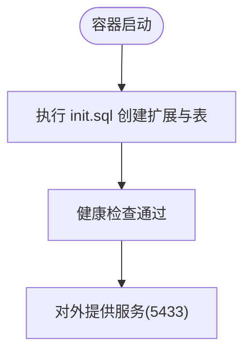
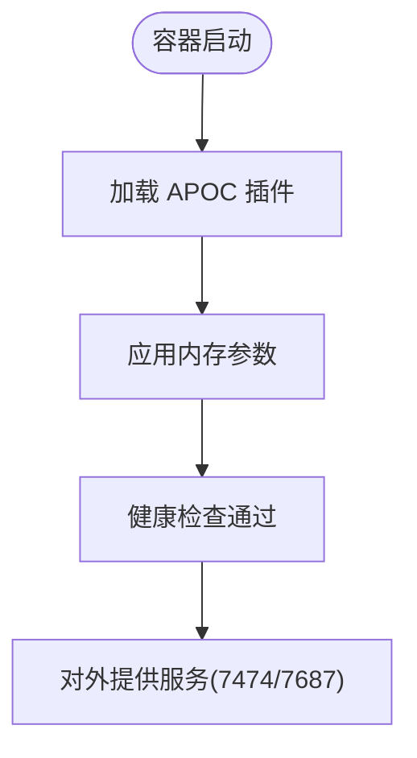
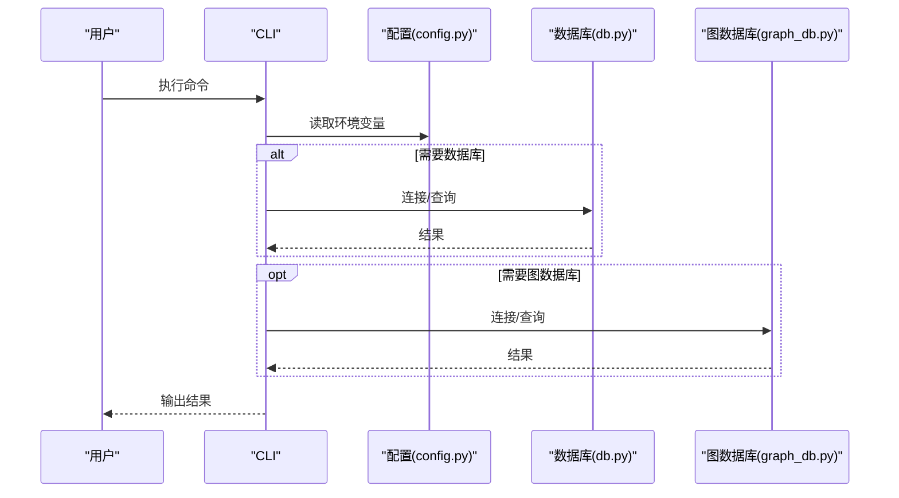
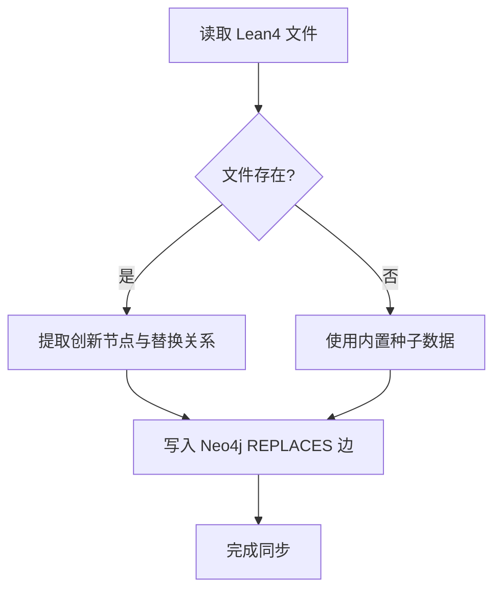
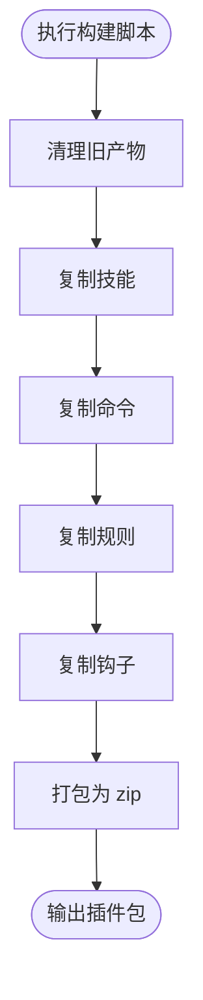
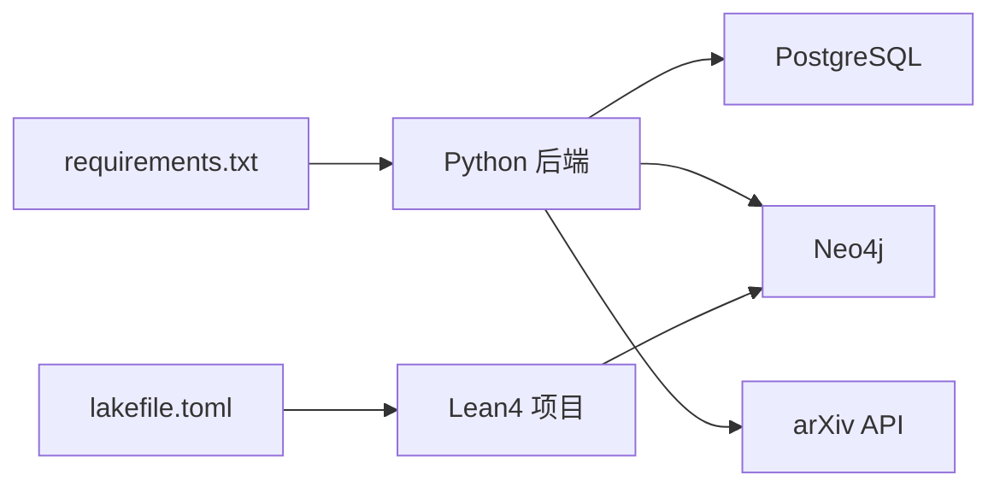

# 部署与运维

<cite>
**本文档引用的文件**
- [docker-compose.yml](file://infra/docker-compose.yml)
- [init.sql](file://infra/init.sql)
- [startup.ps1](file://startup.ps1)
- [requirements.txt](file://requirements.txt)
- [plugin README.md](file://plugin/README.md)
- [build_plugin.py](file://build_plugin.py)
- [lakefile.toml](file://LEAN/lakefile.toml)
- [__main__.py](file://scholar/__main__.py)
- [cli.py](file://scholar/cli.py)
- [config.py](file://scholar/config.py)
- [db.py](file://scholar/db.py)
- [graph_db.py](file://scholar/graph_db.py)
</cite>

## 目录
1. [简介](#简介)
2. [项目结构](#项目结构)
3. [核心组件](#核心组件)
4. [架构总览](#架构总览)
5. [详细组件分析](#详细组件分析)
6. [依赖关系分析](#依赖关系分析)
7. [性能考量](#性能考量)
8. [故障排除指南](#故障排除指南)
9. [结论](#结论)
10. [附录](#附录)

## 简介
本文件面向运维与平台工程团队，提供本项目的容器化部署与运维实践指南。内容覆盖：
- Docker Compose 服务配置、端口映射与数据卷挂载
- 生产环境最佳实践（性能调优、监控与日志）
- 数据库备份与恢复策略（PostgreSQL 与 Neo4j）
- 故障排除与性能分析
- 可扩展性与高可用设计建议
- 运维脚本与自动化部署方案

## 项目结构
本项目采用“容器化基础设施 + Python 后端 + Neo4j 图谱”的分层架构。核心目录与职责如下：
- infra：容器编排与初始化 SQL
- scholar：Python 后端 CLI 与数据库访问层
- plugin：Qoder 插件构建与发布脚本
- LEAN：Lean4 形式化知识库（用于图谱同步）

```mermaid
graph TB
subgraph "容器层"
PG["PostgreSQL(pgvector)"]
NEO["Neo4j(Community)"]
end
subgraph "应用层"
SCHOLAR["Python 后端(scholar)"]
CLI["CLI 命令集"]
end
subgraph "知识层"
LEAN["Lean4 形式化数据库"]
end
SCHOLAR --> PG
SCHOLAR --> NEO
CLI --> SCHOLAR
NEO <- --> LEAN
```

图表来源
- [docker-compose.yml:1-44](file://infra/docker-compose.yml#L1-L44)
- [config.py:41-51](file://scholar/config.py#L41-L51)
- [graph_db.py:1-20](file://scholar/graph_db.py#L1-L20)

章节来源
- [docker-compose.yml:1-44](file://infra/docker-compose.yml#L1-L44)
- [startup.ps1:1-65](file://startup.ps1#L1-L65)
- [requirements.txt:1-9](file://requirements.txt#L1-L9)

## 核心组件
- PostgreSQL + pgvector：结构化元数据与向量检索（RAG）
- Neo4j：引用网络与概念图谱
- Python 后端：提供 CLI、数据库访问、图谱构建与查询
- Lean4：形式化数据库，驱动图谱替换关系同步

章节来源
- [docker-compose.yml:2-19](file://infra/docker-compose.yml#L2-L19)
- [docker-compose.yml:21-39](file://infra/docker-compose.yml#L21-L39)
- [config.py:41-51](file://scholar/config.py#L41-L51)
- [graph_db.py:1-20](file://scholar/graph_db.py#L1-L20)

## 架构总览
下图展示容器、后端与外部系统的交互关系。

```mermaid
graph TB
subgraph "宿主机"
HOST["开发者/CI/CD"]
end
subgraph "容器编排"
DC["Docker Compose"]
PG["PostgreSQL:5432 映射至 5433"]
NEO["Neo4j:7474/7687 映射至宿主"]
end
subgraph "应用"
PY["Python 后端(scholar)"]
CLI["CLI 命令"]
end
subgraph "外部"
L4["Lean4 形式化数据库"]
ARX["arXiv API"]
end
HOST --> DC
DC --> PG
DC --> NEO
PY --> PG
PY --> NEO
CLI --> PY
NEO <- --> L4
PY --> ARX
```

图表来源
- [docker-compose.yml:1-44](file://infra/docker-compose.yml#L1-L44)
- [config.py:41-51](file://scholar/config.py#L41-L51)
- [cli.py:605-658](file://scholar/cli.py#L605-L658)

## 详细组件分析

### PostgreSQL + pgvector 服务
- 镜像与健康检查：使用官方 pgvector 镜像，通过健康检查确保可连接
- 端口映射：默认将容器内 5432 映射到宿主 5433，避免与本地已有实例冲突
- 环境变量：数据库名、用户名、密码
- 数据卷：持久化数据目录与初始化 SQL
- 初始化 SQL：创建扩展与核心表结构，包含论文、章节、公式、引用、概念、嵌入与创新等表



图表来源
- [docker-compose.yml:3-19](file://infra/docker-compose.yml#L3-L19)
- [init.sql:1-131](file://infra/init.sql#L1-L131)

章节来源
- [docker-compose.yml:3-19](file://infra/docker-compose.yml#L3-L19)
- [init.sql:1-131](file://infra/init.sql#L1-L131)

### Neo4j 服务
- 镜像与健康检查：使用官方社区版镜像，健康检查验证服务状态
- 端口映射：浏览器 UI 7474 与 Bolt 协议 7687
- 环境变量：认证、内存参数、启用 APOC 插件
- 数据卷：持久化数据目录



图表来源
- [docker-compose.yml:22-39](file://infra/docker-compose.yml#L22-L39)

章节来源
- [docker-compose.yml:22-39](file://infra/docker-compose.yml#L22-L39)

### Python 后端与 CLI
- CLI 入口：通过包入口调用命令行接口
- 配置加载：优先从 .env 加载环境变量，否则回退到系统环境
- 数据库层：封装 PostgreSQL 访问，支持文件模式降级
- 图数据库层：封装 Neo4j 访问，提供引用网络与概念图构建与查询



图表来源
- [__main__.py:1-8](file://scholar/__main__.py#L1-L8)
- [cli.py:1-40](file://scholar/cli.py#L1-L40)
- [config.py:1-51](file://scholar/config.py#L1-L51)
- [db.py:24-74](file://scholar/db.py#L24-L74)
- [graph_db.py:32-70](file://scholar/graph_db.py#L32-L70)

章节来源
- [__main__.py:1-8](file://scholar/__main__.py#L1-L8)
- [cli.py:1-80](file://scholar/cli.py#L1-L80)
- [config.py:1-51](file://scholar/config.py#L1-L51)
- [db.py:24-74](file://scholar/db.py#L24-L74)
- [graph_db.py:32-70](file://scholar/graph_db.py#L32-L70)

### Lean4 形式化数据库集成
- 动态加载：从 Lean4 文件动态提取创新节点与替换关系
- 回退机制：当源文件缺失时使用内置种子数据
- 同步：将 REPLACES 关系写入 Neo4j，完善图谱演进链路



图表来源
- [graph_db.py:371-405](file://scholar/graph_db.py#L371-L405)
- [graph_db.py:794-800](file://scholar/graph_db.py#L794-L800)

章节来源
- [graph_db.py:371-405](file://scholar/graph_db.py#L371-L405)
- [graph_db.py:794-800](file://scholar/graph_db.py#L794-L800)

### 插件构建与发布
- 构建流程：复制技能、命令、规则、钩子，打包为 Qoder 插件分发包
- 输出：生成 zip 包，包含插件元信息与资源



图表来源
- [build_plugin.py:132-180](file://build_plugin.py#L132-L180)

章节来源
- [build_plugin.py:1-180](file://build_plugin.py#L1-L180)
- [plugin README.md:1-79](file://plugin/README.md#L1-L79)

## 依赖关系分析
- Python 依赖：Typer、Rich、psycopg2、neo4j、dotenv、PyMuPDF、mcp 等
- 外部服务：PostgreSQL、Neo4j、arXiv API
- 开发工具：Lean4 项目配置文件



图表来源
- [requirements.txt:1-9](file://requirements.txt#L1-L9)
- [config.py:69-115](file://scholar/config.py#L69-L115)
- [lakefile.toml:1-11](file://LEAN/lakefile.toml#L1-L11)

章节来源
- [requirements.txt:1-9](file://requirements.txt#L1-L9)
- [config.py:69-115](file://scholar/config.py#L69-L115)
- [lakefile.toml:1-11](file://LEAN/lakefile.toml#L1-L11)

## 性能考量
- PostgreSQL
  - 使用 pgvector 扩展进行向量相似度检索，建议在文本块内容上建立合适的索引以提升查询性能
  - 控制并发连接数与查询超时，避免长事务阻塞
- Neo4j
  - 合理设置堆大小与内存参数，避免 GC 抖动
  - 对高频查询（如引用网络统计、概念共现）建立索引与预聚合
- Python 后端
  - 批量写入时使用批量操作减少往返开销
  - 在 CLI 中对大量数据处理时使用进度条与分页，避免 UI 卡顿
- 网络与外部依赖
  - arXiv 请求增加重试与超时控制，必要时配置代理

章节来源
- [init.sql:105-105](file://infra/init.sql#L105-L105)
- [config.py:69-115](file://scholar/config.py#L69-L115)
- [cli.py:198-237](file://scholar/cli.py#L198-L237)

## 故障排除指南
- 服务未就绪
  - 使用启动脚本等待健康检查通过；若超时，检查容器日志与端口占用
- 数据库连接失败
  - 核对环境变量与端口映射；确认数据库初始化 SQL 是否成功执行
- Neo4j 连接异常
  - 检查认证信息与端口映射；确认 APOC 插件加载情况
- arXiv 请求失败
  - 检查代理与超时设置；查看重试次数与错误日志
- 插件构建失败
  - 确认 .qoder 目录结构与权限；清理旧产物后重新构建

章节来源
- [startup.ps1:17-64](file://startup.ps1#L17-L64)
- [config.py:41-51](file://scholar/config.py#L41-L51)
- [docker-compose.yml:15-19](file://infra/docker-compose.yml#L15-L19)
- [docker-compose.yml:35-39](file://infra/docker-compose.yml#L35-L39)
- [cli.py:617-626](file://scholar/cli.py#L617-L626)
- [build_plugin.py:26-31](file://build_plugin.py#L26-L31)

## 结论
本项目提供了完整的容器化部署与运维基础：PostgreSQL + Neo4j 的基础设施、Python 后端与 CLI、以及 Lean4 的形式化集成。通过健康检查、环境变量与初始化 SQL，系统具备良好的自愈与可重复部署能力。建议在生产环境中进一步完善监控、备份与高可用策略，并结合本文的性能与故障排除建议持续优化。

## 附录

### Docker Compose 服务配置要点
- PostgreSQL
  - 端口：5433:5432
  - 环境变量：数据库名、用户、密码
  - 数据卷：pgdata、init.sql
- Neo4j
  - 端口：7474、7687
  - 环境变量：认证、内存、插件
  - 数据卷：neo4jdata

章节来源
- [docker-compose.yml:3-19](file://infra/docker-compose.yml#L3-L19)
- [docker-compose.yml:22-39](file://infra/docker-compose.yml#L22-L39)

### 初始化 SQL 与表结构
- 扩展：vector
- 表：papers、sections、formulas、citations、concepts、paper_concepts、chunks、innovations、replacements
- 索引：针对常用查询字段建立索引

章节来源
- [init.sql:4-131](file://infra/init.sql#L4-L131)

### 运维脚本与自动化
- 一键启动：启动容器并等待健康检查
- CLI 命令：提供统计、搜索、图谱构建与查询等运维常用功能
- 插件构建：自动化打包 Qoder 插件

章节来源
- [startup.ps1:11-64](file://startup.ps1#L11-L64)
- [cli.py:421-476](file://scholar/cli.py#L421-L476)
- [build_plugin.py:132-180](file://build_plugin.py#L132-L180)

### 生产环境最佳实践（建议）
- 监控与日志
  - 使用容器日志收集与集中化日志系统
  - 针对数据库与图数据库设置慢查询与错误日志告警
- 备份与恢复
  - PostgreSQL：定期逻辑备份与物理快照；验证恢复流程
  - Neo4j：定期快照与备份，确保图数据一致性
- 性能调优
  - 数据库：根据负载调整连接池、索引与查询计划
  - 图数据库：热点节点拆分、边数量控制与缓存策略
- 高可用与扩展
  - PostgreSQL：主从复制或托管数据库服务
  - Neo4j：集群模式或托管图数据库服务
- 安全加固
  - 强密码与最小权限原则；限制容器网络访问；定期更新镜像

[本节为通用运维建议，不直接分析具体文件，故无章节来源]