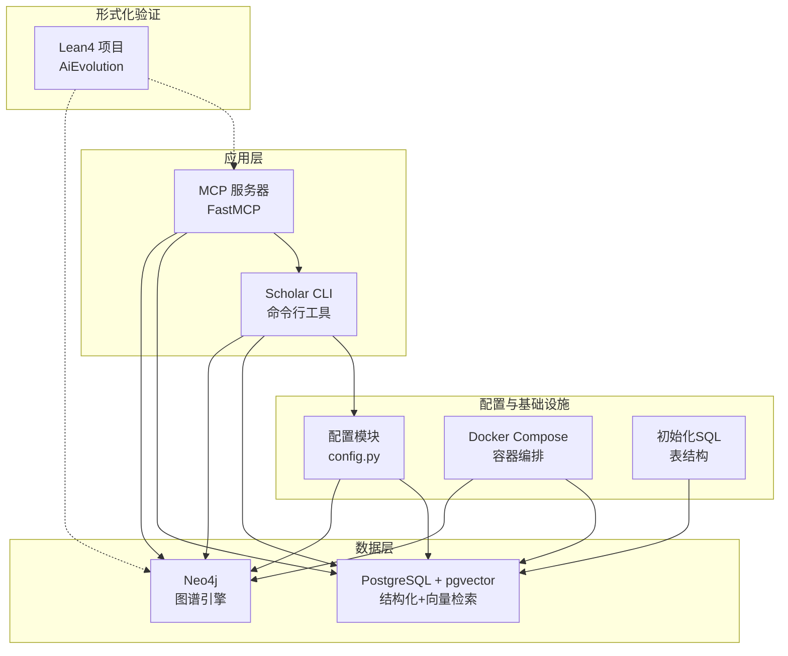
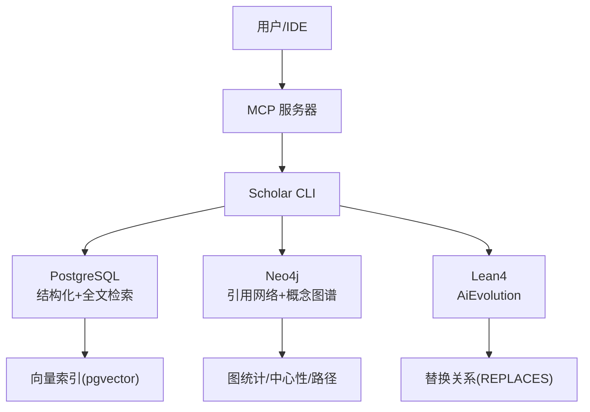
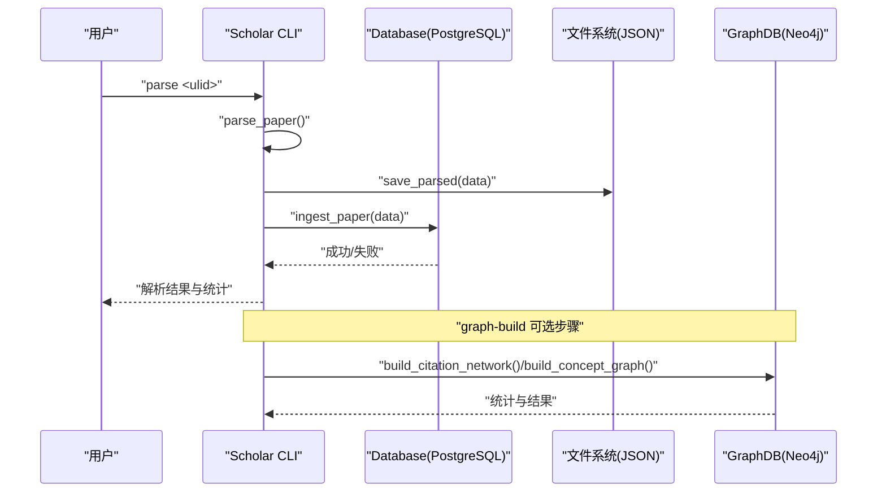
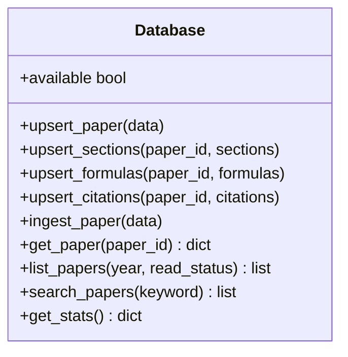
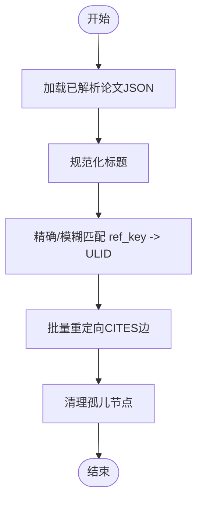
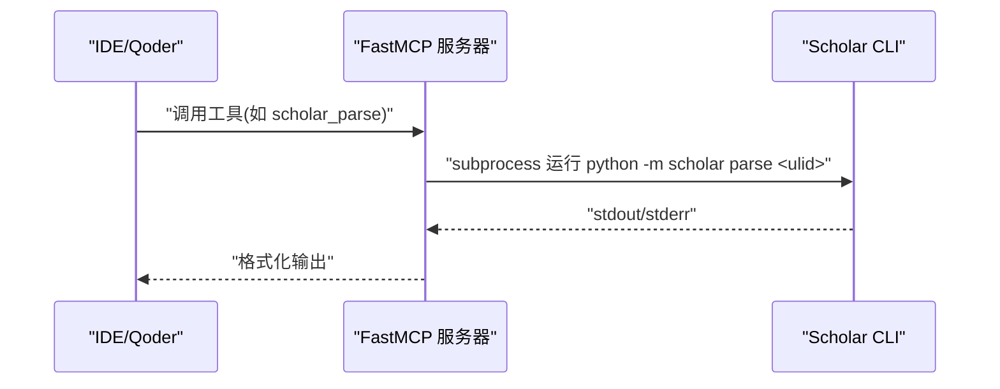
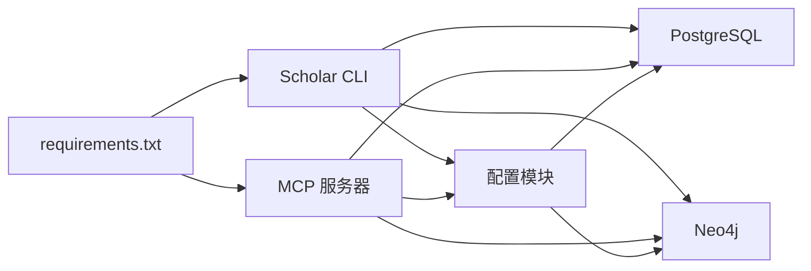

# 项目概述

<cite>
**本文档引用的文件**
- [__main__.py](file://scholar/__main__.py)
- [cli.py](file://scholar/cli.py)
- [db.py](file://scholar/db.py)
- [graph_db.py](file://scholar/graph_db.py)
- [config.py](file://scholar/config.py)
- [server.py](file://scholar_mcp/server.py)
- [requirements.txt](file://requirements.txt)
- [docker-compose.yml](file://infra/docker-compose.yml)
- [init.sql](file://infra/init.sql)
</cite>

## 目录
1. [引言](#引言)
2. [项目结构](#项目结构)
3. [核心组件](#核心组件)
4. [架构总览](#架构总览)
5. [详细组件分析](#详细组件分析)
6. [依赖关系分析](#依赖关系分析)
7. [性能考虑](#性能考虑)
8. [故障排除指南](#故障排除指南)
9. [结论](#结论)

## 引言
本项目旨在构建一个面向人工智能研究的知识库系统，通过形式化验证与知识库管理的深度融合，为AI技术发展提供严格的数学证明支撑与可追溯的研究脉络。系统以学术论文解析为核心入口，结合结构化数据库（PostgreSQL + pgvector）、图数据库（Neo4j）与形式化验证（Lean4）三大支柱，形成从“数据采集—结构化存储—知识抽取—图谱构建—形式化同步”的完整闭环。其核心价值在于：以严谨的数据模型与算法流程确保知识库的准确性与一致性；以图谱与向量检索提升跨领域发现能力；以Lean4的定理与替换关系同步，实现研究演进的数学化追踪。

## 项目结构
项目采用多模块分层组织，围绕“学术研究工具链”展开：
- 学术CLI工具（Python）：负责论文扫描、解析、入库、查询、统计、导出、作者/年份补全、arXiv搜索、图谱构建与统计等。
- 图数据库层（Neo4j）：构建引用网络、概念图谱与Lean4替换关系，支持中心性分析与路径查询。
- 数据库层（PostgreSQL + pgvector）：提供结构化存储与RAG向量检索能力。
- MCP服务（FastMCP）：将CLI能力封装为MCP工具，供IDE/Qoder集成使用。
- 基础设施（Docker Compose）：一键启动PostgreSQL与Neo4j，配合初始化脚本完成表结构准备。
- 配置管理：集中管理目录、连接参数与外部服务密钥。

图表来源
- [cli.py](file://scholar/cli.py)
- [server.py](file://scholar_mcp/server.py)
- [config.py](file://scholar/config.py)
- [docker-compose.yml](file://infra/docker-compose.yml)
- [init.sql](file://infra/init.sql)

章节来源
- [__main__.py](file://scholar/__main__.py)
- [cli.py](file://scholar/cli.py)
- [config.py](file://scholar/config.py)
- [docker-compose.yml](file://infra/docker-compose.yml)

## 核心组件
- 学术CLI（Scholar Studio）
  - 提供论文扫描、批量解析、信息展示、全文检索、统计报表、BibTeX导出、作者/年份补全、arXiv搜索等功能。
  - 支持数据库可用时走PostgreSQL，不可用时回退到文件模式（JSON）。
- 图数据库层（Neo4j）
  - 构建引用网络（CITES）、概念图谱（HAS_CONCEPT/RELATED_TO）与Lean4替换关系（REPLACES），并计算中心性指标。
  - 提供图统计、最短路径、桥接论文识别等查询能力。
- 数据库层（PostgreSQL + pgvector）
  - 提供论文元数据、章节、公式、引用的结构化存储与全文检索；支持向量检索用于RAG。
- MCP服务
  - 将CLI能力封装为MCP工具，便于在IDE中直接调用，覆盖解析、图谱、RAG、质量评估、分类等场景。
- 形式化验证（Lean4）
  - 通过动态解析Lean4数据库文件，将创新节点与替换关系同步至Neo4j，实现研究演进的数学化追踪。

章节来源
- [cli.py](file://scholar/cli.py)
- [db.py](file://scholar/db.py)
- [graph_db.py](file://scholar/graph_db.py)
- [server.py](file://scholar_mcp/server.py)

## 架构总览
系统采用“CLI驱动 + 多后端存储 + 形式化同步”的混合架构。CLI作为统一入口，按需选择PostgreSQL或文件模式进行数据持久化；Neo4j承载图谱与概念抽取；Lean4提供形式化验证与替换关系，通过MCP服务与IDE深度集成。

图表来源
- [server.py](file://scholar_mcp/server.py)
- [cli.py](file://scholar/cli.py)
- [db.py](file://scholar/db.py)
- [graph_db.py](file://scholar/graph_db.py)

## 详细组件分析

### 组件A：学术CLI（Scholar Studio）
- 职责
  - 论文生命周期管理：扫描、解析、入库、查询、统计、导出。
  - 元数据增强：作者补全、年份补全、arXiv搜索。
  - 知识图谱：构建引用网络、概念图谱、计算中心性。
  - 输出：控制台表格/面板、JSON文件、BibTeX。
- 关键流程
  - 扫描：遍历论文目录，统计解析状态与资源存在情况。
  - 解析：提取标题、作者、摘要、章节、公式、引用，生成结构化JSON。
  - 入库：优先写入PostgreSQL，失败则落盘为JSON文件。
  - 查询：支持标题/摘要/章节的全文检索与聚合统计。
  - 图谱：构建Paper节点与CITES/HAS_CONCEPT/RELATED_TO/REPLACES边。
- 错误处理
  - 数据库不可用时自动降级为文件模式。
  - 解析异常捕获并提示，避免中断批处理任务。

图表来源
- [cli.py](file://scholar/cli.py)
- [db.py](file://scholar/db.py)
- [graph_db.py](file://scholar/graph_db.py)

章节来源
- [cli.py](file://scholar/cli.py)
- [db.py](file://scholar/db.py)

### 组件B：数据库层（PostgreSQL + pgvector）
- 职责
  - 结构化存储：论文、章节、公式、引用。
  - 全文检索：基于ILIKE的关键词匹配。
  - 向量检索：为RAG提供嵌入向量索引。
- 设计要点
  - UPSERT策略：避免重复记录，更新时间戳。
  - 分区/批量插入：提升大体量数据写入效率。
  - 事务与回滚：保证一致性。
- 降级策略
  - 当psycopg2缺失或连接失败时，自动切换为文件模式（JSON）。

图表来源
- [db.py](file://scholar/db.py)

章节来源
- [db.py](file://scholar/db.py)

### 组件C：图数据库层（Neo4j）
- 职责
  - 引用网络：Paper节点与CITES边，支持解析引用键、计算中心性、最短路径。
  - 概念图谱：Paper-HasConcept-Innovation边，Innovation间RelatedTo边，TF-IDF匹配。
  - 形式化同步：从Lean4加载Innovation节点与REPLACES关系。
- 关键算法
  - 引用键解析：规范化标题，精确/模糊匹配，批量重定向CITES边。
  - 中心性计算：入度/出度与桥接分数，识别跨领域桥梁论文。
  - 概念共现：统计Innovation共现权重，构建强关联边。
- 查询能力
  - 全局统计：节点/边数量、解析率、孤立节点。
  - 单篇分析：前向/后向引用、最短路径。
  - 概念分析：相关概念、时间线、子图。

图表来源
- [graph_db.py](file://scholar/graph_db.py)

章节来源
- [graph_db.py](file://scholar/graph_db.py)

### 组件D：MCP服务（FastMCP）
- 职责
  - 将Scholar CLI封装为MCP工具，暴露给IDE/Qoder。
  - 覆盖解析、图谱、RAG、质量评估、分类、引导流程等常用工作流。
- 集成方式
  - 通过子进程调用python -m scholar，传递参数并返回输出。
  - 支持超时控制与错误合并输出。

图表来源
- [server.py](file://scholar_mcp/server.py)

章节来源
- [server.py](file://scholar_mcp/server.py)

### 组件E：基础设施与配置
- Docker Compose
  - PostgreSQL + pgvector：提供结构化+向量检索能力。
  - Neo4j：提供图谱引擎与插件（如APOC）。
- 初始化SQL
  - 完成表结构创建与扩展安装（如pgvector）。
- 配置模块
  - 统一管理目录、数据库连接、Neo4j凭据、嵌入模型与API密钥、LaTeX命令、Lean4项目路径等。

章节来源
- [docker-compose.yml](file://infra/docker-compose.yml)
- [init.sql](file://infra/init.sql)
- [config.py](file://scholar/config.py)

## 依赖关系分析
- 运行时依赖
  - CLI：typer、rich、psycopg2-binary、neo4j、python-dotenv、PyMuPDF、mcp。
  - MCP：mcp（FastMCP）。
- 组件耦合
  - CLI与数据库/图数据库解耦，通过配置模块统一接入。
  - MCP仅依赖CLI命令，不直接操作底层存储，降低耦合。
  - Lean4通过文件解析与Neo4j同步，保持形式化与知识图谱的松耦合。

图表来源
- [requirements.txt](file://requirements.txt)
- [cli.py](file://scholar/cli.py)
- [server.py](file://scholar_mcp/server.py)
- [config.py](file://scholar/config.py)

章节来源
- [requirements.txt](file://requirements.txt)
- [cli.py](file://scholar/cli.py)
- [server.py](file://scholar_mcp/server.py)
- [config.py](file://scholar/config.py)

## 性能考虑
- 批量处理
  - CLI提供批量解析与图谱构建，采用分批写入与进度条反馈，避免内存峰值。
- 数据库优化
  - 使用UPSERT与批量INSERT减少往返开销；全文检索使用ILIKE，建议在生产环境启用全文索引。
- 图数据库优化
  - MERGE避免重复节点；批量UNWIND提升Cypher写入性能；合理设置Neo4j堆内存。
- 形式化同步
  - 动态解析Lean4文件，建议缓存解析结果或增量同步，减少I/O压力。
- RAG与向量检索
  - 嵌入模型与API密钥由配置模块管理，建议在高并发场景下增加队列与限流。

## 故障排除指南
- 数据库不可用
  - 现象：数据库连接失败，CLI回退到文件模式。
  - 排查：检查PostgreSQL服务状态、凭据与端口；确认pgvector扩展已安装。
- Neo4j不可达
  - 现象：图谱构建失败或查询报错。
  - 排查：确认Neo4j服务运行、认证正确、插件可用；必要时重启容器。
- MCP工具执行失败
  - 现象：IDE调用MCP工具返回错误。
  - 排查：查看子进程stderr输出，确认Scholar CLI命令可用且参数正确。
- 引用解析不准确
  - 现象：CITES边指向非ULID节点或未解析。
  - 排查：检查论文标题规范化规则与别名匹配；确认解析批次大小与重试逻辑。
- Lean4同步缺失
  - 现象：Innovation节点或REPLACES关系为空。
  - 排查：确认Lean4项目路径与文件存在；检查解析正则是否匹配最新格式。

章节来源
- [db.py](file://scholar/db.py)
- [graph_db.py](file://scholar/graph_db.py)
- [server.py](file://scholar_mcp/server.py)
- [docker-compose.yml](file://infra/docker-compose.yml)

## 结论
本项目通过“CLI工具 + 多后端存储 + 形式化同步”的架构设计，实现了学术研究知识库的自动化采集、结构化存储、智能检索与图谱分析。其核心优势在于：严谨的数据模型与事务保障、强大的图谱与向量检索能力、与Lean4的深度集成以实现研究演进的数学化追踪。该体系既适用于个人研究助理，也可作为团队知识平台的基础底座，为AI技术的持续演进提供可验证、可追溯、可发现的知识支撑。