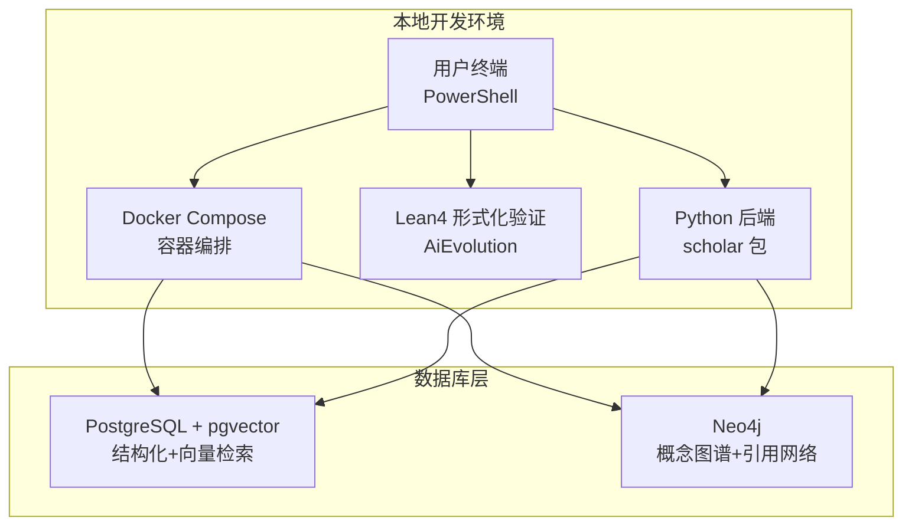
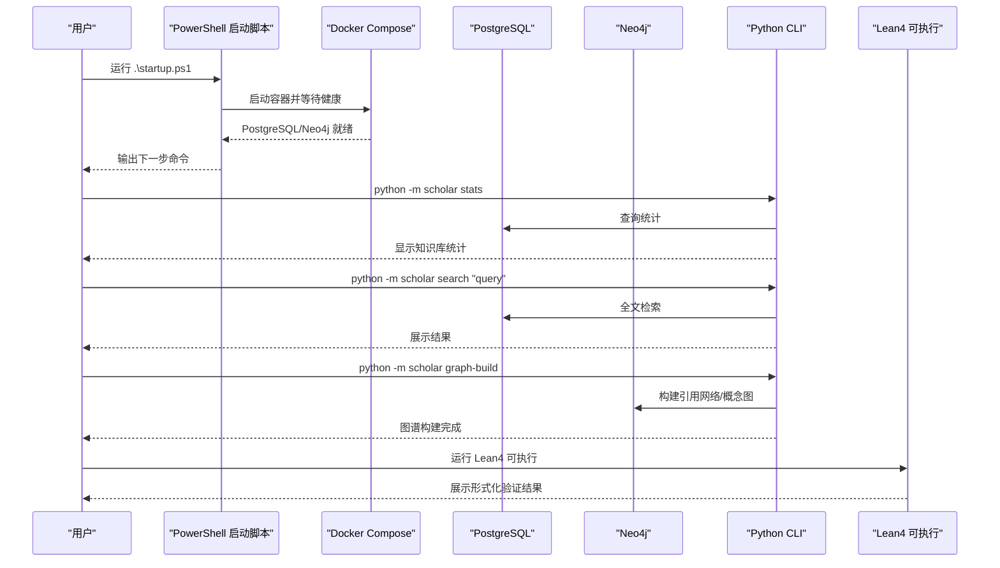
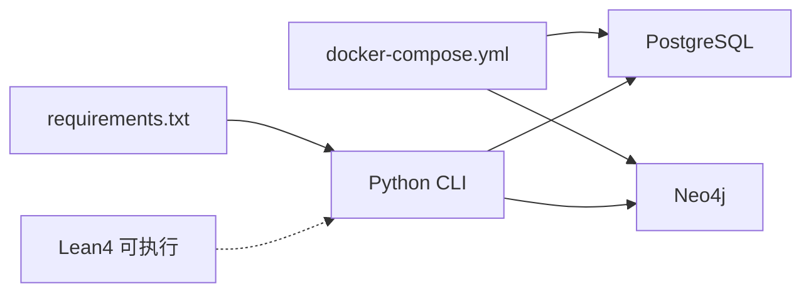
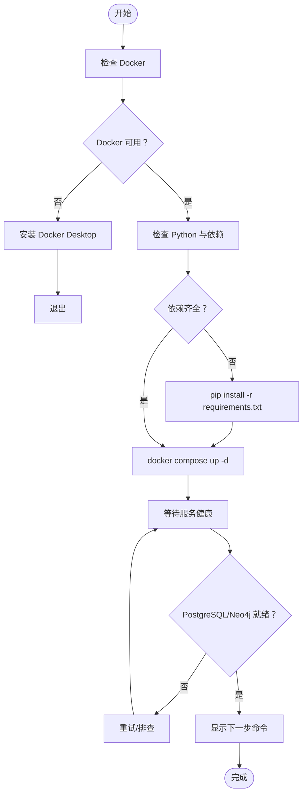

# 快速开始

<cite>
**本文档引用的文件**
- [startup.ps1](file://startup.ps1)
- [requirements.txt](file://requirements.txt)
- [docker-compose.yml](file://infra/docker-compose.yml)
- [init.sql](file://infra/init.sql)
- [config.py](file://scholar/config.py)
- [cli.py](file://scholar/cli.py)
- [__main__.py](file://scholar/__main__.py)
- [Main.lean](file://LEAN/Main.lean)
- [lakefile.toml](file://LEAN/lakefile.toml)
- [AiEvolution.lean](file://LEAN/AiEvolution.lean)
- [plugin/README.md](file://plugin/README.md)
</cite>

## 目录
1. [简介](#简介)
2. [项目结构](#项目结构)
3. [核心组件](#核心组件)
4. [架构总览](#架构总览)
5. [详细组件分析](#详细组件分析)
6. [依赖关系分析](#依赖关系分析)
7. [性能考虑](#性能考虑)
8. [故障排除指南](#故障排除指南)
9. [结论](#结论)
10. [附录](#附录)

## 简介
本指南面向首次接触“人工智能研究项目”的用户，目标是在最短时间内完成从零到运行的全流程：安装与配置 Lean4 环境、准备 Python 依赖、初始化数据库与图数据库、启动服务、运行最小可行示例，并体验核心命令。同时提供常见问题排查与最小配置建议，帮助您快速看到效果。

## 项目结构
该项目采用多语言混合架构：前端交互与研究工作流由 Python 实现，知识库与检索基于 PostgreSQL + pgvector，图谱分析基于 Neo4j；形式化验证部分由 Lean4 提供。整体通过 Docker 进行服务编排，一键启动脚本负责健康检查与状态提示。

图表来源
- [startup.ps1:1-125](file://startup.ps1#L1-L125)
- [docker-compose.yml:1-44](file://infra/docker-compose.yml#L1-L44)
- [config.py:44-66](file://scholar/config.py#L44-L66)

章节来源
- [startup.ps1:1-125](file://startup.ps1#L1-L125)
- [docker-compose.yml:1-44](file://infra/docker-compose.yml#L1-L44)
- [config.py:20-66](file://scholar/config.py#L20-L66)

## 核心组件
- 启动脚本：自动化检测 Docker/Python/.env，拉起容器，等待健康状态，输出下一步命令建议。
- Python 后端：CLI 命令集，覆盖扫描、解析、检索、统计、arXiv 搜索、图谱构建与查询等。
- 数据库与图数据库：PostgreSQL（结构化元数据+向量）、Neo4j（引用网络+概念图谱）。
- Lean4：形式化验证与属性计算，提供可直接运行的可执行程序入口。
- 插件生态：作为“大脑”，配合主仓库后端与数据库实现工作流与技能。

章节来源
- [startup.ps1:11-125](file://startup.ps1#L11-L125)
- [cli.py:1-800](file://scholar/cli.py#L1-L800)
- [config.py:44-66](file://scholar/config.py#L44-L66)
- [Main.lean:1-21](file://LEAN/Main.lean#L1-L21)
- [plugin/README.md:1-79](file://plugin/README.md#L1-L79)

## 架构总览
下图展示从用户命令到数据库与图数据库的调用链路，以及 Lean4 的集成位置。

图表来源
- [startup.ps1:58-125](file://startup.ps1#L58-L125)
- [cli.py:420-476](file://scholar/cli.py#L420-L476)
- [cli.py:660-706](file://scholar/cli.py#L660-L706)
- [Main.lean:6-21](file://LEAN/Main.lean#L6-L21)

## 详细组件分析

### 1) 安装与环境准备
- Docker：确保 Docker Desktop 正常运行，启动脚本会检测并提示安装路径。
- Python：建议使用 Python 3.10+，安装依赖包（CLI、数据库驱动、向量检索、MCP 等）。
- .env 文件：若不存在，启动脚本会从模板复制一份；请按需填写嵌入模型 API 密钥等参数。

章节来源
- [startup.ps1:14-56](file://startup.ps1#L14-L56)
- [requirements.txt:1-14](file://requirements.txt#L1-L14)

### 2) 数据库初始化与健康检查
- 使用 docker-compose 启动 PostgreSQL（端口映射 5433）与 Neo4j（端口 7474/7687）。
- PostgreSQL 在首次启动时执行 init.sql，创建扩展与所有表结构（论文、章节、公式、引用、概念、块向量、创新与替换关系）。
- 启动脚本等待两个服务健康后再继续，避免后续命令因数据库未就绪而失败。

章节来源
- [docker-compose.yml:1-44](file://infra/docker-compose.yml#L1-L44)
- [init.sql:1-131](file://infra/init.sql#L1-L131)
- [startup.ps1:64-91](file://startup.ps1#L64-L91)

### 3) Lean4 环境搭建与运行
- 项目根目录包含 LEAN 子项目，定义了可执行目标与库模块。
- 可直接运行 Lean4 可执行程序，查看形式化验证结果与系统状态。

章节来源
- [lakefile.toml:1-11](file://LEAN/lakefile.toml#L1-L11)
- [AiEvolution.lean:1-8](file://LEAN/AiEvolution.lean#L1-L8)
- [Main.lean:1-21](file://LEAN/Main.lean#L1-L21)

### 4) Python 后端与 CLI 命令
- CLI 入口位于 scholar/__main__.py，统一调度 typer 定义的命令。
- 常用命令（示例）：
  - 查看知识库统计：python -m scholar stats
  - 全文检索：python -m scholar search "关键词"
  - 图谱构建：python -m scholar graph-build
  - arXiv 搜索：python -m scholar arxiv-search "query"
  - 批量解析：python -m scholar parse-all
- CLI 内部根据配置连接 PostgreSQL 与 Neo4j，优先使用数据库模式，回退到文件模式。

章节来源
- [__main__.py:1-8](file://scholar/__main__.py#L1-L8)
- [cli.py:420-476](file://scholar/cli.py#L420-L476)
- [cli.py:308-370](file://scholar/cli.py#L308-L370)
- [cli.py:660-706](file://scholar/cli.py#L660-L706)
- [cli.py:602-658](file://scholar/cli.py#L602-L658)
- [config.py:44-66](file://scholar/config.py#L44-L66)

### 5) 最小可行配置示例
- 复制 .env.example 为 .env，至少设置嵌入模型 API 密钥（用于 RAG 搜索）。
- 默认数据库连接参数已在配置中给出，若使用默认 docker-compose，无需额外修改。
- 若需要访问 arXiv，请确保网络可达或配置代理环境变量。

章节来源
- [startup.ps1:40-47](file://startup.ps1#L40-L47)
- [config.py:56-61](file://scholar/config.py#L56-L61)
- [config.py:72-119](file://scholar/config.py#L72-L119)

### 6) 常用命令与使用示例
- 初始化与状态
  - docker compose up -d
  - python -m scholar stats
- 检索与分析
  - python -m scholar search "Transformer"
  - python -m scholar graph-stats
- 图谱构建
  - python -m scholar graph-build
- arXiv 搜索
  - python -m scholar arxiv-search "attention mechanism"

章节来源
- [startup.ps1:106-121](file://startup.ps1#L106-L121)
- [cli.py:420-476](file://scholar/cli.py#L420-L476)
- [cli.py:308-370](file://scholar/cli.py#L308-L370)
- [cli.py:708-792](file://scholar/cli.py#L708-L792)
- [cli.py:602-658](file://scholar/cli.py#L602-L658)

## 依赖关系分析
- Python 依赖通过 requirements.txt 管理，核心包括 CLI 框架、数据库驱动、向量数据库、文档解析、MCP 等。
- Docker Compose 将 PostgreSQL 与 Neo4j 作为外部依赖，Python CLI 通过配置文件进行连接。
- Lean4 作为独立可执行程序，与 Python 后端解耦，便于单独运行与验证。

图表来源
- [requirements.txt:1-14](file://requirements.txt#L1-L14)
- [docker-compose.yml:1-44](file://infra/docker-compose.yml#L1-L44)
- [config.py:44-66](file://scholar/config.py#L44-L66)
- [Main.lean:6-21](file://LEAN/Main.lean#L6-L21)

章节来源
- [requirements.txt:1-14](file://requirements.txt#L1-L14)
- [docker-compose.yml:1-44](file://infra/docker-compose.yml#L1-L44)
- [config.py:44-66](file://scholar/config.py#L44-L66)

## 性能考虑
- 数据库检索：PostgreSQL + pgvector 支持向量相似度检索，建议合理设置嵌入维度与索引策略。
- 图谱规模：Neo4j 的引用网络与概念图随论文数量增长而增大，建议定期清理与维护。
- 批处理解析：批量解析论文时注意并发与磁盘 I/O，必要时分批执行。
- Lean4 验证：形式化证明可能耗时较长，建议在专用环境中运行。

## 故障排除指南
- Docker 未运行或未安装
  - 现象：启动脚本检测失败并退出。
  - 解决：安装 Docker Desktop 并重启。
  - 参考：[startup.ps1:14-24](file://startup.ps1#L14-L24)
- Python 依赖缺失
  - 现象：依赖检查失败。
  - 解决：执行 pip install -r requirements.txt。
  - 参考：[startup.ps1:49-56](file://startup.ps1#L49-L56)
- 数据库未就绪
  - 现象：等待超时或服务不健康。
  - 解决：检查 docker-compose 日志，确认端口占用与权限；必要时调整 init.sql 或卷挂载。
  - 参考：[startup.ps1:64-91](file://startup.ps1#L64-L91)，[docker-compose.yml:15-19](file://infra/docker-compose.yml#L15-L19)，[docker-compose.yml:35-39](file://infra/docker-compose.yml#L35-L39)
- arXiv 请求失败
  - 现象：arXiv 搜索无结果或报错。
  - 解决：设置代理环境变量或稍后重试；检查网络连通性。
  - 参考：[cli.py:617-626](file://scholar/cli.py#L617-L626)，[config.py:72-119](file://scholar/config.py#L72-L119)
- Neo4j 不可用
  - 现象：图谱构建/查询时报错。
  - 解决：确认 Neo4j 容器健康，检查 bolt 端口与认证信息。
  - 参考：[cli.py:663-672](file://scholar/cli.py#L663-L672)，[config.py:51-54](file://scholar/config.py#L51-L54)

## 结论
通过本快速开始指南，您已完成 Lean4 环境、Python 依赖、数据库与图数据库的安装与初始化，并成功运行了最小可行示例。建议在掌握基础命令后，逐步探索图谱构建、arXiv 搜索与批量解析等高级功能，并结合插件生态实现更复杂的研究工作流。

## 附录

### A. 一键启动流程（概览）

图表来源
- [startup.ps1:11-125](file://startup.ps1#L11-L125)

### B. 最小配置清单
- 复制 .env 示例并填写：
  - 嵌入模型 API 密钥（RAG 搜索）
  - 如需访问 arXiv，可配置代理相关环境变量
- 默认数据库连接参数（使用默认 docker-compose）：
  - PostgreSQL：主机 localhost，端口 5433，库名 scholar，用户 scholar，密码 scholar2024
  - Neo4j：bolt://localhost:7687，用户名 neo4j，密码 scholar2024

章节来源
- [startup.ps1:40-47](file://startup.ps1#L40-L47)
- [config.py:44-61](file://scholar/config.py#L44-L61)
- [docker-compose.yml:6-11](file://infra/docker-compose.yml#L6-L11)
- [docker-compose.yml:25-30](file://infra/docker-compose.yml#L25-L30)