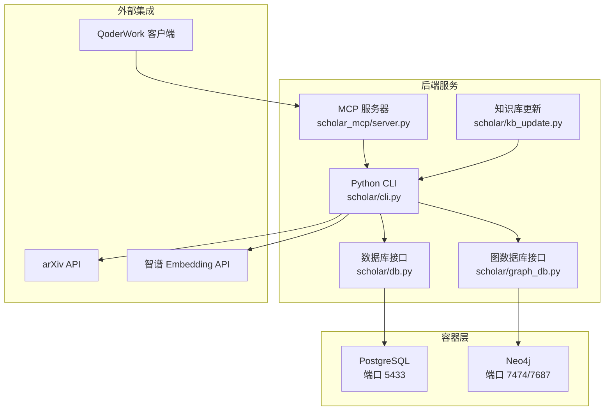

# 快速开始指南

<cite>
**本文档引用的文件**
- [requirements.txt](file://requirements.txt)
- [startup.ps1](file://startup.ps1)
- [docker-compose.yml](file://infra/docker-compose.yml)
- [init.sql](file://infra/init.sql)
- [README.md](file://README.md)
- [plugin/README.md](file://plugin/README.md)
- [plugin/mcp.json](file://plugin/mcp.json)
- [scholar/config.py](file://scholar/config.py)
- [scholar/db.py](file://scholar/db.py)
- [scholar/graph_db.py](file://scholar/graph_db.py)
- [scholar/cli.py](file://scholar/cli.py)
- [scholar/kb_update.py](file://scholar/kb_update.py)
- [scholar_mcp/server.py](file://scholar_mcp/server.py)
</cite>

## 目录
1. [简介](#简介)
2. [系统要求检查](#系统要求检查)
3. [环境准备](#环境准备)
4. [依赖安装](#依赖安装)
5. [数据库启动](#数据库启动)
6. [全量初始化](#全量初始化)
7. [系统验证](#系统验证)
8. [常见问题与故障排除](#常见问题与故障排除)
9. [入门示例场景](#入门示例场景)
10. [架构概览](#架构概览)
11. [结论](#结论)

## 简介
本指南面向首次接触 Scholar Studio 的用户，提供「5分钟搭建」的完整流程：系统要求检查、环境准备、依赖安装、数据库启动、全量初始化与系统验证。同时给出常见问题排查方法与多场景入门示例，帮助你快速上手并体验系统核心能力。

## 系统要求检查
- 操作系统：Windows（PowerShell）、Linux 或 macOS（可选）
- 容器运行时：Docker（用于启动 PostgreSQL 与 Neo4j）
- Python 运行时：Python 3.8+（建议 3.10+）
- 磁盘空间：至少 10GB 可用空间（取决于论文库规模）
- 网络访问：可访问 arXiv API（用于元数据补全）

**章节来源**
- [startup.ps1:11-56](file://startup.ps1#L11-L56)
- [requirements.txt:1-14](file://requirements.txt#L1-L14)

## 环境准备
- 准备工作目录：克隆主仓库到本地，并进入项目根目录
- 确认已安装 Docker，且可正常运行
- 准备 Python 环境（建议使用虚拟环境）
- 如需 RAG 功能，请准备智谱 AI 的 Embedding API Key（可选）

**章节来源**
- [README.md:54-65](file://README.md#L54-L65)

## 依赖安装
- 安装 Python 依赖
  - 在项目根目录执行：pip install -r requirements.txt
  - 依赖说明：包含 typer、rich、psycopg2-binary、neo4j、python-dotenv、PyMuPDF、mcp 等

**章节来源**
- [requirements.txt:1-14](file://requirements.txt#L1-L14)

## 数据库启动
- 使用一键启动脚本启动容器
  - Windows：在项目根目录执行：.\startup.ps1
  - 脚本会：
    - **预飞行检查**：检查 Docker、Python、.env 文件和依赖安装情况
    - 启动 PostgreSQL（端口 5433）与 Neo4j（端口 7474/7687）
    - 等待服务健康检查通过（最长等待 60 秒）
    - 输出知识库状态（统计 papers/chunks 行数，以及 Neo4j 节点数量）
    - **下一步指导**：根据知识库状态提供相应的操作建议
- 也可直接使用 Docker Compose
  - 在 infra 目录执行：docker compose up -d
  - 查看健康状态：docker compose ps

**更新** 启动脚本现在包含预飞行检查功能，会在启动前验证 Docker、Python、.env 文件和依赖安装情况。

预期输出要点（来自启动脚本）：
- PostgreSQL 健康：显示端口 5433 正常
- Neo4j 健康：显示端口 7474/7687 正常
- 知识库状态：显示 papers 与 chunks 的计数
- 下一步指导：根据知识库状态提供相应的操作建议

**章节来源**
- [startup.ps1:11-125](file://startup.ps1#L11-L125)
- [docker-compose.yml:1-44](file://infra/docker-compose.yml#L1-L44)

## 全量初始化
- 执行一键初始化命令
  - 在项目根目录执行：python -m scholar bootstrap
  - 初始化流程包括：
    1) 解析所有论文（若存在未解析的）
    2) 年份补全（基于 Lean4 与启发式规则）
    3) 作者补全（基于 arXiv API）
    4) 构建图谱（Neo4j：引用网络 + 概念图谱 + Lean4 替代关系）
    5) 同步到 PostgreSQL（用于 RAG 与查询）
    6) 构建 RAG 向量索引（需要 API Key）
    7) 自动生成阅读笔记
    8) 计算论文质量评分
    9) 对论文进行分类标注

**更新** Bootstrap 命令现在包含预飞行检查，会在启动前验证系统环境。

注意：
- 若未设置 Embedding API Key，RAG 索引阶段会被跳过
- 图谱构建依赖 Neo4j 可用；若不可用则跳过该步骤

**章节来源**
- [cli.py:1153-1266](file://scholar/cli.py#L1153-L1266)
- [config.py:54-57](file://scholar/config.py#L54-L57)

## 系统验证
- 常用验证命令（在项目根目录执行）：
  - 查看知识库统计：python -m scholar stats
  - 全文搜索：python -m scholar search "关键词"
  - 语义搜索：python -m scholar rag-search "自然语言查询"
  - 图谱统计：python -m scholar graph-stats
  - 图谱查询：python -m scholar graph-query "概念ID"
- 启动 MCP 服务器（用于与 QoderWork 集成）
  - 在项目根目录执行：python -m scholar_mcp
  - MCP 服务器会暴露 40+ 工具，供外部客户端调用

**更新** 新增了 Qoder IDE 集成指导，可以通过自然语言直接使用系统功能。

**章节来源**
- [startup.ps1:117-125](file://startup.ps1#L117-L125)
- [server.py:17-20](file://scholar_mcp/server.py#L17-L20)

## 常见问题与故障排除
- Docker 启动失败
  - 检查端口占用：PostgreSQL 默认 5433，Neo4j 默认 7474/7687
  - 权限问题：确保当前用户对 Docker 有执行权限
  - 网络问题：无法拉取镜像时，配置 Docker 加速器或代理
- 服务健康检查超时
  - 等待时间较长时可适当延长等待时间（启动脚本默认 60 秒）
  - 查看容器日志：docker compose logs pg 或 docker compose logs neo4j
- PostgreSQL 连接失败
  - 确认连接参数：主机 localhost、端口 5433、数据库 scholar、用户 scholar、密码 scholar2024
  - 可通过环境变量覆盖默认值（参考配置模块）
- Neo4j 连接失败
  - 确认 bolt://localhost:7687 可达
  - 默认凭据：neo4j/scholar2024
- arXiv API 请求失败
  - 设置代理：HTTP_PROXY/HTTPS_PROXY 环境变量
  - 超时与重试：可通过环境变量调整超时与重试次数
- RAG 索引失败
  - 确认已设置 Embedding API Key（EMBEDDING_API_KEY）
  - 确认网络可达智谱 API
- MCP 无法连接
  - 确认 MCP 服务器已启动
  - 检查 mcp.json 中的环境变量是否正确（PostgreSQL/Neo4j 地址）
- **预飞行检查失败**
  - **Docker 未安装或未运行**：安装 Docker Desktop 并确保服务正常
  - **Python 版本过低**：安装 Python 3.10+ 版本
  - **.env 文件缺失**：启动脚本会自动复制 .env.example 创建 .env 文件
  - **依赖未安装**：执行 pip install -r requirements.txt

**章节来源**
- [config.py:69-116](file://scholar/config.py#L69-L116)
- [db.py:32-44](file://scholar/db.py#L32-L44)
- [graph_db.py:39-49](file://scholar/graph_db.py#L39-L49)
- [mcp.json:1-16](file://plugin/mcp.json#L1-L16)

## 入门示例场景
以下示例均在项目根目录执行：

- 论文调研
  - 搜索 arXiv 新论文：python -m scholar arxiv-search "Transformer" --max 10
  - 下载 TeX 源码：python -m scholar arxiv-download "Transformer" --max 5
  - 批量导入：python -m scholar kb-update --query "Transformer" --max 5
- 深度分析
  - 单篇深度分析：python -m scholar info <论文ID>
  - 引用网络分析：python -m scholar cite-network <论文ID>
  - 概念图谱查询：python -m scholar graph-query "Transformer"
  - 论文质量评分：python -m scholar quality-score <论文ID>
- 写作辅助
  - 自动生成阅读笔记：python -m scholar auto-notes <论文ID>
  - 编译 LaTeX 论文草稿：python -m scholar compile-paper <相对路径.tex>
  - 导出参考文献：python -m scholar export-bib --output output/bib/references.bib

**更新** 新增了 kb-update 命令示例，用于一键更新知识库。

**章节来源**
- [cli.py:605-657](file://scholar/cli.py#L605-L657)
- [cli.py:1271-1349](file://scholar/cli.py#L1271-L1349)
- [cli.py:421-476](file://scholar/cli.py#L421-L476)
- [kb_update.py:415-445](file://scholar/kb_update.py#L415-L445)

## 架构概览
下图展示了 Scholar Studio 的核心组件与交互关系，包括容器化数据库、Python 后端、MCP 服务器以及外部工具链。

**图表来源**
- [docker-compose.yml:1-44](file://infra/docker-compose.yml#L1-L44)
- [config.py:41-61](file://scholar/config.py#L41-L61)
- [db.py:24-44](file://scholar/db.py#L24-L44)
- [graph_db.py:32-49](file://scholar/graph_db.py#L32-L49)
- [server.py:17-20](file://scholar_mcp/server.py#L17-L20)
- [kb_update.py:1-445](file://scholar/kb_update.py#L1-L445)

## 结论
按照本指南完成系统要求检查、环境准备、依赖安装、数据库启动与全量初始化后，你即可使用 Scholar Studio 的核心功能进行论文调研、深度分析与写作辅助。启动脚本现在包含预飞行检查功能，能提前发现并提示潜在问题。新增的 kb-update 命令让你可以一键更新知识库，而 Qoder IDE 集成则提供了更自然的交互体验。遇到问题时，可依据故障排除章节逐步定位并解决。随着知识库规模增长，建议定期执行增量导入与图谱同步以保持数据新鲜度。