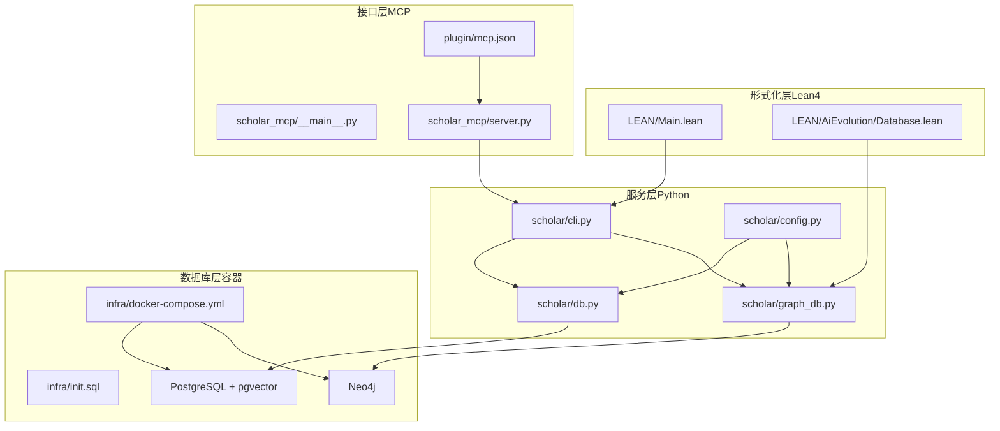
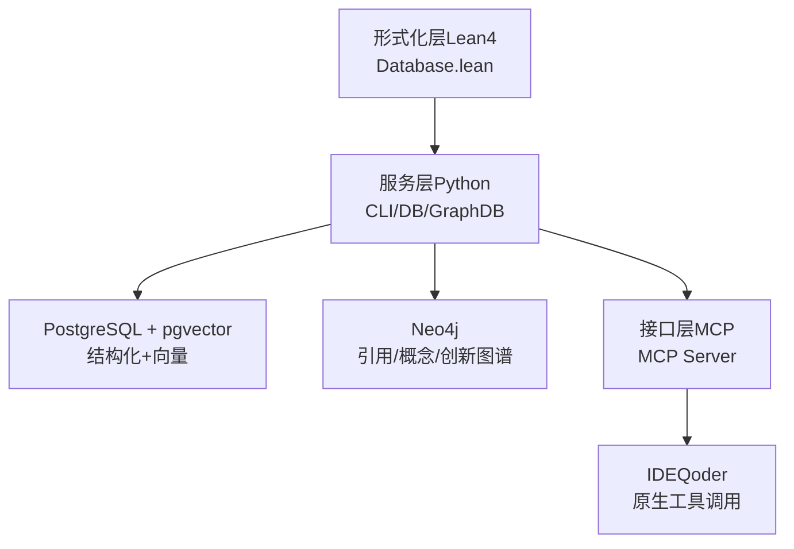
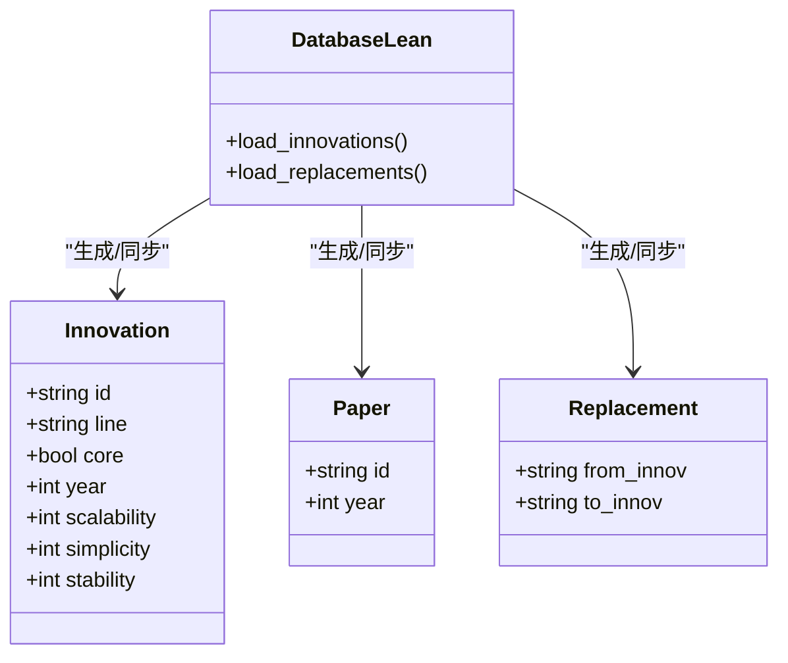
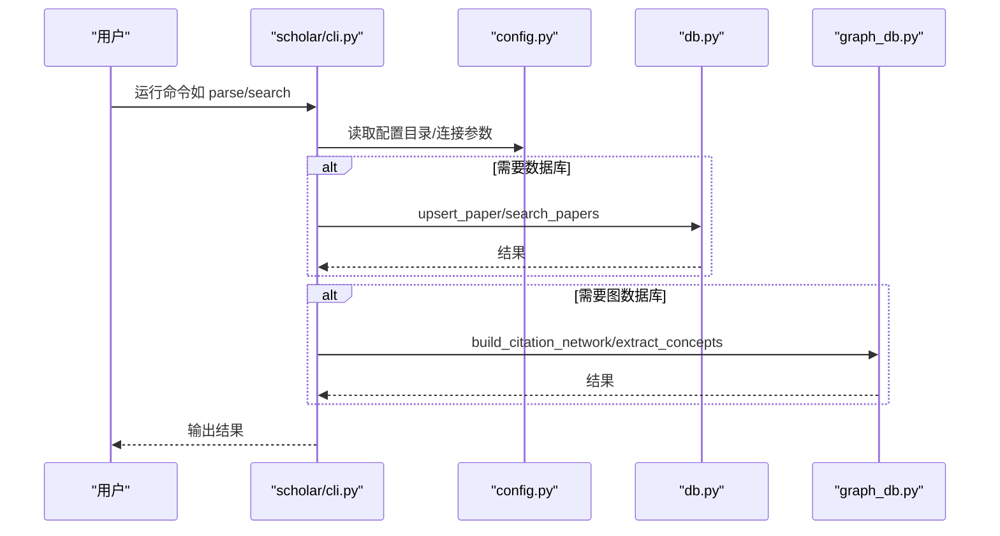
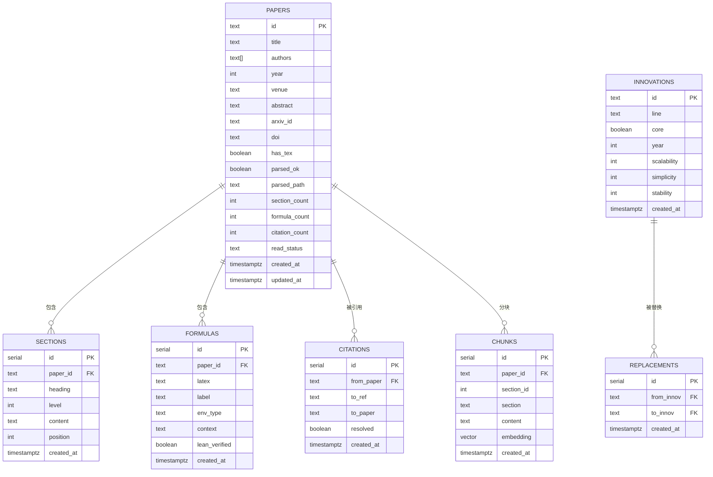
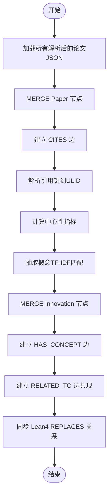
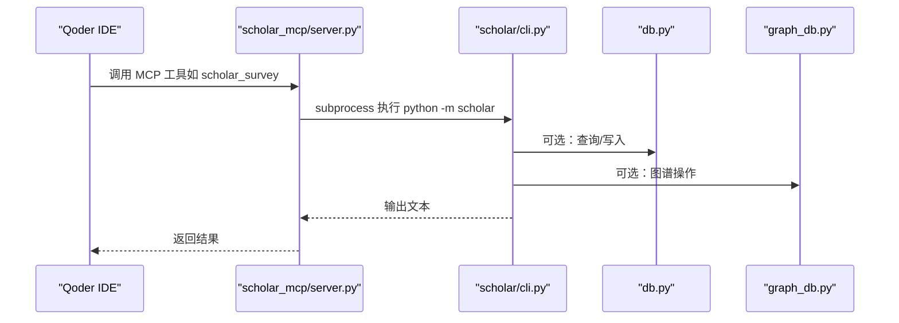
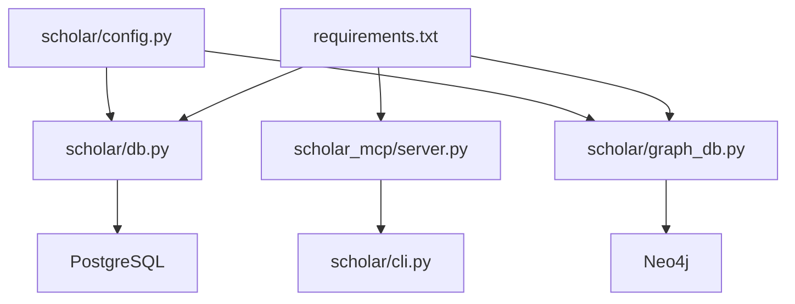

# 技术架构

<cite>
**本文引用的文件**
- [Main.lean](file://LEAN/Main.lean)
- [AiEvolution.lean](file://LEAN/AiEvolution.lean)
- [Database.lean](file://LEAN/AiEvolution/Database.lean)
- [__main__.py](file://scholar/__main__.py)
- [cli.py](file://scholar/cli.py)
- [config.py](file://scholar/config.py)
- [db.py](file://scholar/db.py)
- [graph_db.py](file://scholar/graph_db.py)
- [__main__.py](file://scholar_mcp/__main__.py)
- [server.py](file://scholar_mcp/server.py)
- [mcp.json](file://plugin/mcp.json)
- [docker-compose.yml](file://infra/docker-compose.yml)
- [init.sql](file://infra/init.sql)
- [startup.ps1](file://startup.ps1)
- [requirements.txt](file://requirements.txt)
</cite>

## 目录
1. [引言](#引言)
2. [项目结构](#项目结构)
3. [核心组件](#核心组件)
4. [架构总览](#架构总览)
5. [详细组件分析](#详细组件分析)
6. [依赖关系分析](#依赖关系分析)
7. [性能考虑](#性能考虑)
8. [故障排查指南](#故障排查指南)
9. [结论](#结论)
10. [附录](#附录)

## 引言
本项目围绕“人工智能研究”目标，构建了以分层微服务架构为核心的研究基础设施，涵盖形式化层（Lean4）、服务层（Python 后端）、接口层（MCP 服务），以及数据库层（PostgreSQL/Neo4j）。其核心目标是：
- 将形式化验证（Lean4）作为权威数据源，驱动知识图谱与演进关系；
- 提供统一的学术研究工作流（解析、索引、检索、图谱、实验执行等）；
- 通过 MCP 服务将 CLI 能力无缝集成到 IDE（Qoder）中，形成“原生工具链”。

## 项目结构
项目采用多模块组织，按职责划分为：
- 形式化层（LEAN）：定义 125 创新节点、417 论文记录及替换关系，作为权威数据源；
- 服务层（scholar）：Python CLI 与后端服务，负责数据处理、数据库访问、图谱构建、RAG 索引、实验执行等；
- 接口层（scholar_mcp）：基于 MCP 协议暴露 CLI 工具，供 IDE 集成；
- 数据库层（infra）：PostgreSQL + pgvector（结构化+向量检索）与 Neo4j（概念/引用/创新图谱）；
- 插件与配置（plugin、startup、requirements）：IDE 插件配置、环境准备与依赖管理。

**图表来源**
- [Main.lean:1-21](file://LEAN/Main.lean#L1-L21)
- [Database.lean:1-756](file://LEAN/AiEvolution/Database.lean#L1-L756)
- [cli.py:1-800](file://scholar/cli.py#L1-L800)
- [config.py:1-119](file://scholar/config.py#L1-L119)
- [db.py:1-276](file://scholar/db.py#L1-L276)
- [graph_db.py:1-922](file://scholar/graph_db.py#L1-L922)
- [__main__.py:1-5](file://scholar_mcp/__main__.py#L1-L5)
- [server.py:1-631](file://scholar_mcp/server.py#L1-L631)
- [mcp.json:1-16](file://plugin/mcp.json#L1-L16)
- [docker-compose.yml:1-44](file://infra/docker-compose.yml#L1-L44)
- [init.sql:1-131](file://infra/init.sql#L1-L131)

**章节来源**
- [Main.lean:1-21](file://LEAN/Main.lean#L1-L21)
- [AiEvolution.lean:1-8](file://LEAN/AiEvolution.lean#L1-L8)
- [Database.lean:1-756](file://LEAN/AiEvolution/Database.lean#L1-L756)
- [cli.py:1-800](file://scholar/cli.py#L1-L800)
- [config.py:1-119](file://scholar/config.py#L1-L119)
- [db.py:1-276](file://scholar/db.py#L1-L276)
- [graph_db.py:1-922](file://scholar/graph_db.py#L1-L922)
- [__main__.py:1-5](file://scholar_mcp/__main__.py#L1-L5)
- [server.py:1-631](file://scholar_mcp/server.py#L1-L631)
- [mcp.json:1-16](file://plugin/mcp.json#L1-L16)
- [docker-compose.yml:1-44](file://infra/docker-compose.yml#L1-L44)
- [init.sql:1-131](file://infra/init.sql#L1-L131)
- [startup.ps1:1-125](file://startup.ps1#L1-L125)
- [requirements.txt:1-14](file://requirements.txt#L1-L14)

## 核心组件
- 形式化层（Lean4）
  - 定义 125 创新节点、417 论文记录与替换关系，作为权威数据源；
  - 通过命令行与图谱模块动态加载，驱动 Neo4j 创新图谱同步。
- 服务层（Python）
  - CLI：提供扫描、解析、搜索、统计、图谱构建、RAG 索引、元数据补全、实验执行等能力；
  - 数据库层：封装 PostgreSQL（psycopg2）与文件回退模式；
  - 图数据库层：封装 Neo4j，构建引用网络、概念图谱与创新替换关系；
  - 配置：集中管理路径、数据库连接、嵌入模型与 arXiv API。
- 接口层（MCP）
  - 将 CLI 工具包装为 MCP 工具，供 Qoder IDE 直接调用；
  - 通过子进程执行 scholar CLI 并返回输出。
- 数据库层
  - PostgreSQL + pgvector：结构化论文元数据、公式、引用、分块向量；
  - Neo4j：Paper/Innovation 节点与 CITES/HAS_CONCEPT/RELATED_TO/REPLACES 边。

**章节来源**
- [Database.lean:1-756](file://LEAN/AiEvolution/Database.lean#L1-L756)
- [cli.py:1-800](file://scholar/cli.py#L1-L800)
- [db.py:1-276](file://scholar/db.py#L1-L276)
- [graph_db.py:1-922](file://scholar/graph_db.py#L1-L922)
- [config.py:1-119](file://scholar/config.py#L1-L119)
- [server.py:1-631](file://scholar_mcp/server.py#L1-L631)
- [docker-compose.yml:1-44](file://infra/docker-compose.yml#L1-L44)
- [init.sql:1-131](file://infra/init.sql#L1-L131)

## 架构总览
系统采用“形式化层 + 服务层 + 接口层”的三层架构：
- 形式化层（Lean4）：权威数据源，提供创新节点、论文记录与替换关系；
- 服务层（Python）：统一的数据处理与业务编排，负责入库、检索、图谱与 RAG；
- 接口层（MCP）：将 CLI 能力以 MCP 工具形式暴露，便于 IDE 集成；
- 数据库层：PostgreSQL 存储结构化数据与向量分块；Neo4j 存储图谱（引用、概念、创新替换）。

**图表来源**
- [Database.lean:1-756](file://LEAN/AiEvolution/Database.lean#L1-L756)
- [cli.py:1-800](file://scholar/cli.py#L1-L800)
- [db.py:1-276](file://scholar/db.py#L1-L276)
- [graph_db.py:1-922](file://scholar/graph_db.py#L1-L922)
- [server.py:1-631](file://scholar_mcp/server.py#L1-L631)
- [docker-compose.yml:1-44](file://infra/docker-compose.yml#L1-L44)

## 详细组件分析

### 形式化层（Lean4）
- 数据模型
  - 创新节点（Innovation）：包含 id、line（研究方向）、core（是否核心）、year、属性（可扩展性/简洁性/稳定性）；
  - 论文记录（Paper）：从 parsed JSON 生成；
  - 替换关系（Replacement）：形式化层面的演进替代关系。
- 加载与同步
  - 通过图谱模块动态解析 Lean4 文件，提取创新节点与替换关系，写入 Neo4j；
  - 若文件缺失，使用硬编码种子数据作为回退。

**图表来源**
- [Database.lean:18-171](file://LEAN/AiEvolution/Database.lean#L18-L171)
- [Database.lean:733-753](file://LEAN/AiEvolution/Database.lean#L733-L753)

**章节来源**
- [Main.lean:1-21](file://LEAN/Main.lean#L1-L21)
- [AiEvolution.lean:1-8](file://LEAN/AiEvolution.lean#L1-L8)
- [Database.lean:1-756](file://LEAN/AiEvolution/Database.lean#L1-L756)

### 服务层（Python）

#### CLI 与控制流
- 入口与命令组织：Typer 定义命令组（扫描、解析、搜索、统计、图谱、RAG、元数据补全、实验执行等）；
- 控制流：命令解析后调用对应模块（db、graph_db、config 等），并在可用时连接数据库或图数据库。

**图表来源**
- [cli.py:1-800](file://scholar/cli.py#L1-L800)
- [config.py:1-119](file://scholar/config.py#L1-L119)
- [db.py:1-276](file://scholar/db.py#L1-L276)
- [graph_db.py:1-922](file://scholar/graph_db.py#L1-L922)

**章节来源**
- [cli.py:1-800](file://scholar/cli.py#L1-L800)
- [config.py:1-119](file://scholar/config.py#L1-L119)

#### 数据库层（PostgreSQL + pgvector）
- 表结构概览
  - papers：论文元数据与解析状态；
  - sections/formulas/citations：结构化正文、公式与引用；
  - chunks：RAG 分块与向量（pgvector）；
  - innovations/replacements：与 Lean4 同步的创新节点与替换关系。
- 访问模式
  - upsert_paper/upsert_sections/upsert_formulas/upsert_citations：全量写入；
  - search_papers：全文检索（标题/摘要/段落）；
  - get_stats：统计聚合。

**图表来源**
- [init.sql:1-131](file://infra/init.sql#L1-L131)

**章节来源**
- [db.py:1-276](file://scholar/db.py#L1-L276)
- [init.sql:1-131](file://infra/init.sql#L1-L131)

#### 图数据库层（Neo4j）
- 图谱类型
  - 引用网络：Paper-CITES-Paper；
  - 概念图谱：Paper-HAS_CONCEPT-Innovation，Innovation-RELATED_TO-Innovation；
  - 创新替换：Innovation-REPLACES-Innovation（来自 Lean4）。
- 关键流程
  - 构建引用网络：MERGE Paper 节点，建立 CITES 边；
  - 解析引用键：将 ref_key 映射到 ULID；
  - 概念抽取：TF-IDF 匹配概念别名，建立 HAS_CONCEPT 与 RELATED_TO；
  - 同步 Lean4：导入 REPLACES 关系。

**图表来源**
- [graph_db.py:1-922](file://scholar/graph_db.py#L1-L922)

**章节来源**
- [graph_db.py:1-922](file://scholar/graph_db.py#L1-L922)

### 接口层（MCP 服务）
- MCP 服务器
  - 使用 FastMCP 暴露工具，将 scholar CLI 命令映射为 MCP 工具；
  - 通过子进程执行 python -m scholar 并捕获输出。
- IDE 集成
  - plugin/mcp.json 中声明 MCP 服务器与环境变量（数据库连接）；
  - 在 Qoder IDE 中可直接调用“调研/精读/维护知识库”等自然语言指令。

**图表来源**
- [server.py:1-631](file://scholar_mcp/server.py#L1-L631)
- [cli.py:1-800](file://scholar/cli.py#L1-L800)
- [db.py:1-276](file://scholar/db.py#L1-L276)
- [graph_db.py:1-922](file://scholar/graph_db.py#L1-L922)
- [mcp.json:1-16](file://plugin/mcp.json#L1-L16)

**章节来源**
- [__main__.py:1-5](file://scholar_mcp/__main__.py#L1-L5)
- [server.py:1-631](file://scholar_mcp/server.py#L1-L631)
- [mcp.json:1-16](file://plugin/mcp.json#L1-L16)

## 依赖关系分析
- 外部依赖
  - PostgreSQL + pgvector：结构化存储与向量检索；
  - Neo4j：图谱存储；
  - arXiv API：论文元数据补全；
  - LaTeX 编译器（MiKTeX）：论文 PDF 编译。
- 内部耦合
  - CLI 对 db 与 graph_db 的依赖；
  - MCP 依赖 CLI；
  - 配置模块贯穿各层。

**图表来源**
- [requirements.txt:1-14](file://requirements.txt#L1-L14)
- [db.py:1-276](file://scholar/db.py#L1-L276)
- [graph_db.py:1-922](file://scholar/graph_db.py#L1-L922)
- [server.py:1-631](file://scholar_mcp/server.py#L1-L631)
- [config.py:1-119](file://scholar/config.py#L1-L119)

**章节来源**
- [requirements.txt:1-14](file://requirements.txt#L1-L14)
- [config.py:1-119](file://scholar/config.py#L1-L119)

## 性能考虑
- 数据库层
  - PostgreSQL：为 papers/sections/formulas/citations/chunks 建立必要索引，避免全表扫描；
  - 向量检索：利用 pgvector 的向量维度与索引，结合 RAG 查询进行混合检索。
- 图数据库层
  - Neo4j：合理使用 MERGE 与批量写入，减少重复边与节点；
  - 中心性计算与最短路径查询需注意图规模增长带来的复杂度。
- 服务层
  - CLI 批处理：parse-all、graph-build、rag-index 等命令采用进度条与分批提交，提升吞吐；
  - 失败重试：arXiv 请求具备重试与退避机制。
- 形式化层
  - Lean4 动态解析：在缺少文件时使用硬编码种子数据，保证功能可用性。

[本节为通用指导，无需特定文件引用]

## 故障排查指南
- Docker 服务未就绪
  - 使用 startup.ps1 自动检查并等待健康状态；
  - 若超时，检查容器日志与端口占用。
- 数据库连接失败
  - 检查 .env 中数据库连接参数；
  - 确认 PostgreSQL/Neo4j 容器健康状态。
- MCP 工具调用异常
  - 确认 plugin/mcp.json 中环境变量正确；
  - 查看 MCP 服务器日志与子进程返回码。
- arXiv 请求失败
  - 检查代理设置与超时/重试配置；
  - 确认网络可达性。

**章节来源**
- [startup.ps1:1-125](file://startup.ps1#L1-L125)
- [mcp.json:1-16](file://plugin/mcp.json#L1-L16)
- [config.py:72-119](file://scholar/config.py#L72-L119)

## 结论
该系统通过“形式化层 + 服务层 + 接口层”的分层设计，实现了从权威数据源到可操作知识图谱与检索系统的完整闭环。Lean4 提供严谨的创新与论文数据，Python 服务层承担数据处理与编排，MCP 接口层打通 IDE 集成，数据库层支撑结构化与图谱需求。整体架构具备良好的扩展性与可维护性，适合持续演进的人工智能研究知识体系。

[本节为总结，无需特定文件引用]

## 附录
- 快速启动
  - 运行 startup.ps1 初始化 Docker 与依赖；
  - 首次运行建议执行 bootstrap 完整初始化。
- 常用命令
  - python -m scholar bootstrap：完整初始化；
  - python -m scholar kb-update：增量更新知识库；
  - python -m scholar survey/topic：生成研究综述。

**章节来源**
- [startup.ps1:1-125](file://startup.ps1#L1-L125)
- [server.py:297-327](file://scholar_mcp/server.py#L297-L327)