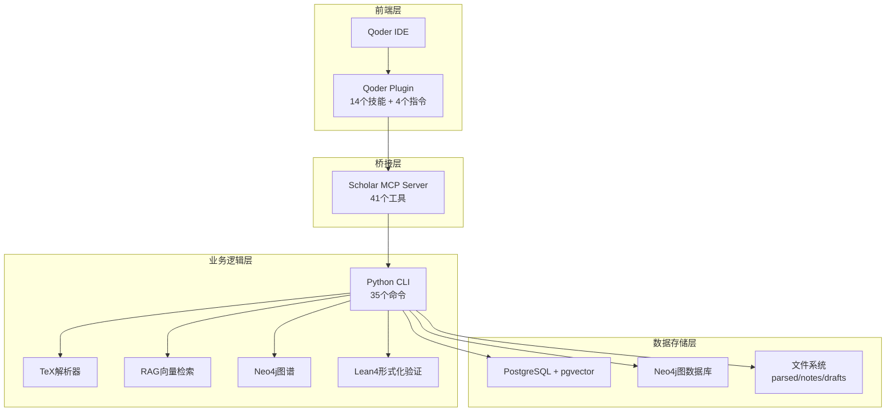
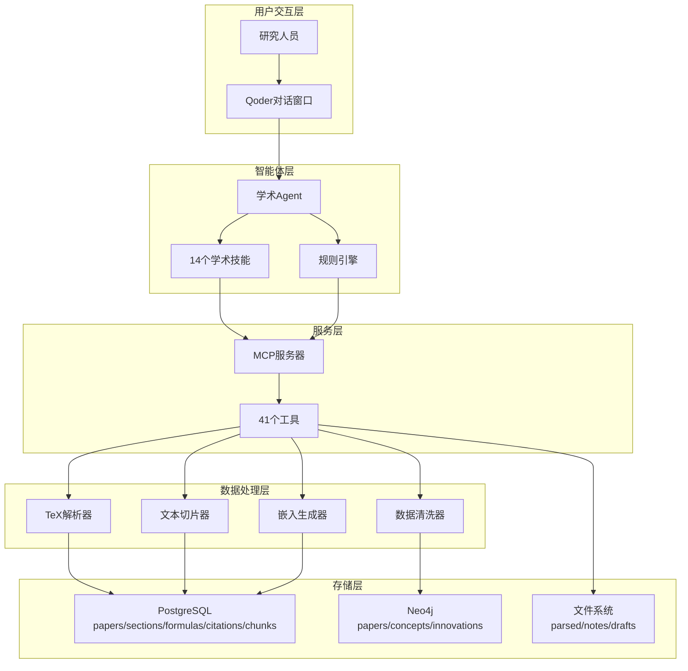
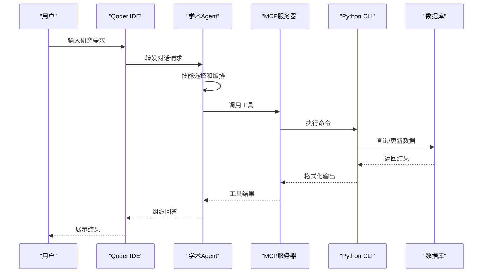
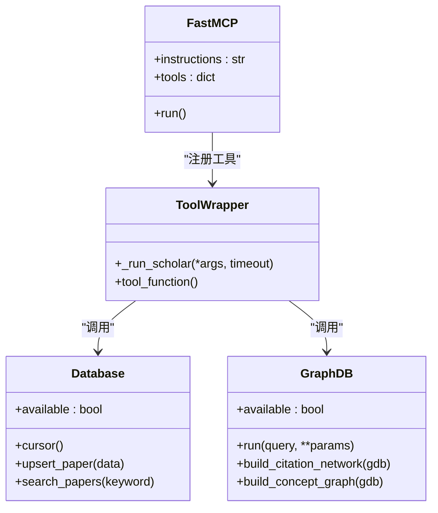
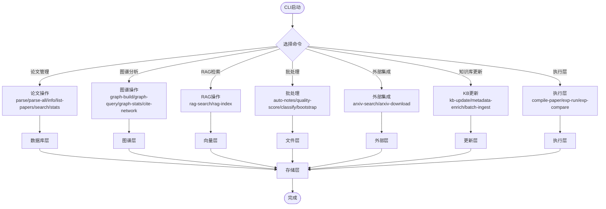
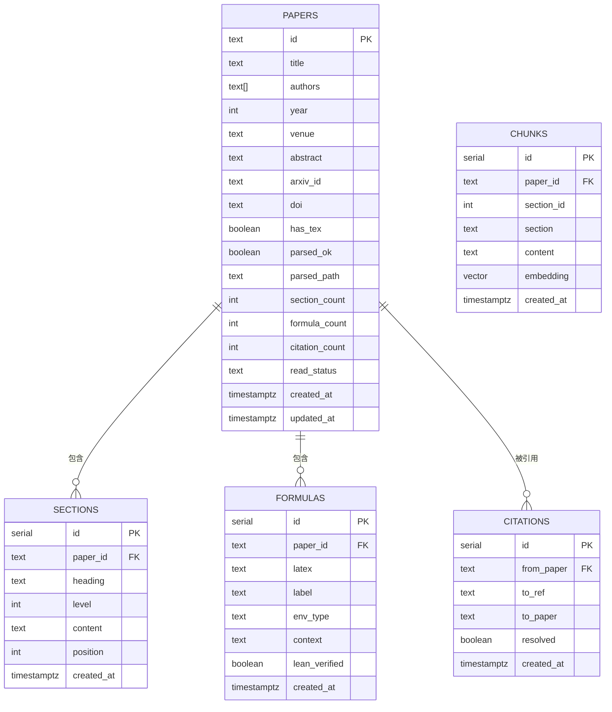
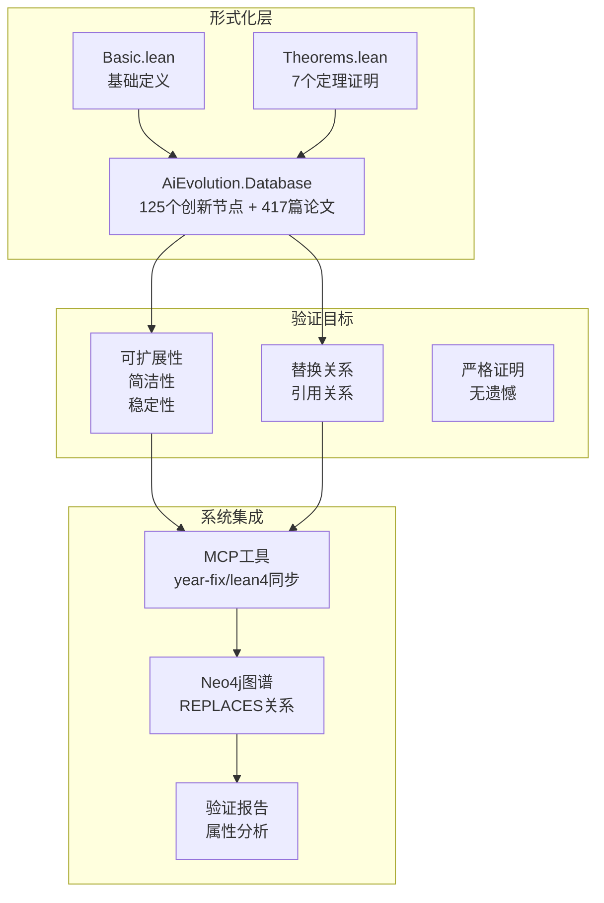
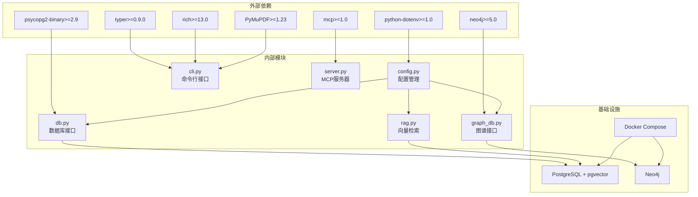

# 技术架构概览

<cite>
**本文档引用的文件**
- [README.md](file://README.md)
- [requirements.txt](file://requirements.txt)
- [startup.ps1](file://startup.ps1)
- [infra/docker-compose.yml](file://infra/docker-compose.yml)
- [infra/init.sql](file://infra/init.sql)
- [plugin/mcp.json](file://plugin/mcp.json)
- [scholar/__main__.py](file://scholar/__main__.py)
- [scholar/cli.py](file://scholar/cli.py)
- [scholar/config.py](file://scholar/config.py)
- [scholar/db.py](file://scholar/db.py)
- [scholar/graph_db.py](file://scholar/graph_db.py)
- [scholar/rag.py](file://scholar/rag.py)
- [scholar_mcp/__main__.py](file://scholar_mcp/__main__.py)
- [scholar_mcp/server.py](file://scholar_mcp/server.py)
- [LEAN/Main.lean](file://LEAN/Main.lean)
- [LEAN/AiEvolution/Database.lean](file://LEAN/AiEvolution/Database.lean)
</cite>

## 目录
1. [简介](#简介)
2. [项目结构](#项目结构)
3. [核心组件](#核心组件)
4. [架构总览](#架构总览)
5. [详细组件分析](#详细组件分析)
6. [依赖关系分析](#依赖关系分析)
7. [性能考虑](#性能考虑)
8. [故障排除指南](#故障排除指南)
9. [结论](#结论)

## 简介
Scholar Studio 是一个基于 Qoder IDE 的学术研究助手，围绕 440 篇 AI 演化方向论文构建，提供全文检索、Neo4j 引用图谱、14 个学术技能（8 个原子技能 + 6 个工作流）、Lean4 形式化验证以及 RAG 向量检索能力。系统采用分层架构：Qoder IDE 前端层、MCP 服务器桥接层、Python CLI 业务逻辑层和数据库存储层，实现 TeX 源码到可查询、可推理、可组合的学术数据层。

## 项目结构
项目采用模块化分层组织，主要目录包括：
- LEAN：Lean4 形式化验证系统，包含创新节点和替换关系定义
- scholar：Python CLI 工具集，提供论文解析、数据库操作、RAG 向量检索、Neo4j 图谱构建等
- scholar_mcp：MCP 服务器，将 CLI 工具暴露为 Qoder 可用的工具
- infra：Docker 编排，启动 PostgreSQL + pgvector 和 Neo4j
- plugin：Qoder 插件配置，包含 14 个技能和快捷指令
- data/papers：论文源文件（PDF + TeX）
- output：生成的结构化数据、笔记、草稿、实验结果等

**图表来源**
- [plugin/mcp.json:1-16](file://plugin/mcp.json#L1-L16)
- [scholar_mcp/server.py:1-573](file://scholar_mcp/server.py#L1-L573)
- [scholar/cli.py:1-800](file://scholar/cli.py#L1-L800)
- [infra/docker-compose.yml:1-44](file://infra/docker-compose.yml#L1-L44)

**章节来源**
- [README.md:301-326](file://README.md#L301-L326)
- [plugin/mcp.json:1-16](file://plugin/mcp.json#L1-L16)

## 核心组件
系统包含四大核心组件，分别负责不同层面的功能：

### 1. Qoder IDE 前端层
- 提供自然语言交互界面
- 管理 14 个学术技能和 4 个快捷指令
- 通过 MCP 协议与后端通信

### 2. MCP 服务器桥接层
- 将 Python CLI 工具转换为 Qoder 可用的工具
- 支持 41 个工具，覆盖论文管理、RAG 检索、图谱分析、批处理等
- 提供统一的命令执行接口

### 3. Python CLI 业务逻辑层
- 论文解析：TeX → JSON 结构化数据
- 数据库操作：PostgreSQL + pgvector
- 图谱构建：Neo4j 引用网络 + 概念图谱
- RAG 向量检索：智谱 API + 混合搜索
- 批处理：自动生成阅读笔记、质量评分、领域分类

### 4. 数据存储层
- PostgreSQL + pgvector：结构化数据 + 向量检索
- Neo4j：引用网络 + 概念图谱
- 文件系统：parsed、notes、drafts 等生成数据

**章节来源**
- [README.md:217-251](file://README.md#L217-L251)
- [scholar_mcp/server.py:1-573](file://scholar_mcp/server.py#L1-L573)
- [scholar/cli.py:1-800](file://scholar/cli.py#L1-L800)
- [infra/init.sql:1-131](file://infra/init.sql#L1-L131)

## 架构总览
系统采用分层架构设计，各层职责清晰，耦合度低，便于扩展和维护。

**图表来源**
- [README.md:217-251](file://README.md#L217-L251)
- [scholar_mcp/server.py:1-573](file://scholar_mcp/server.py#L1-L573)
- [scholar/cli.py:1-800](file://scholar/cli.py#L1-L800)
- [infra/docker-compose.yml:1-44](file://infra/docker-compose.yml#L1-L44)

## 详细组件分析

### Qoder IDE 前端层
Qoder IDE 作为用户交互界面，提供自然语言对话体验。系统包含：
- 14 个学术技能：论文管理、数学验证、论文推荐、引用分析、研究缺口、审稿报告、入门引导、实验代码
- 6 个工作流：研究综述、论文深度分析、写作流水线、实验复现、从想法到论文、知识库维护
- 4 个快捷指令：stats、find、paper、health
- 2 个自动化钩子：任务完成通知、危险操作拦截

**图表来源**
- [plugin/mcp.json:1-16](file://plugin/mcp.json#L1-L16)
- [scholar_mcp/server.py:1-573](file://scholar_mcp/server.py#L1-L573)

**章节来源**
- [README.md:183-214](file://README.md#L183-L214)
- [plugin/mcp.json:1-16](file://plugin/mcp.json#L1-L16)

### MCP 服务器桥接层
MCP 服务器将 Python CLI 工具转换为 Qoder 可用的工具，提供统一的命令执行接口。

**图表来源**
- [scholar_mcp/server.py:1-573](file://scholar_mcp/server.py#L1-L573)
- [scholar/db.py:1-276](file://scholar/db.py#L1-L276)
- [scholar/graph_db.py:1-800](file://scholar/graph_db.py#L1-L800)

**章节来源**
- [scholar_mcp/server.py:1-573](file://scholar_mcp/server.py#L1-L573)

### Python CLI 业务逻辑层
Python CLI 提供 35 个命令，涵盖论文管理、数据分析、批处理等功能。

**图表来源**
- [scholar/cli.py:1-800](file://scholar/cli.py#L1-L800)
- [scholar/db.py:1-276](file://scholar/db.py#L1-L276)
- [scholar/graph_db.py:1-800](file://scholar/graph_db.py#L1-L800)
- [scholar/rag.py:1-582](file://scholar/rag.py#L1-L582)

**章节来源**
- [scholar/cli.py:1-800](file://scholar/cli.py#L1-L800)

### 数据存储层
系统采用多存储架构，满足不同类型数据的存储和查询需求。

**图表来源**
- [infra/init.sql:1-131](file://infra/init.sql#L1-L131)

**章节来源**
- [infra/init.sql:1-131](file://infra/init.sql#L1-L131)
- [scholar/db.py:1-276](file://scholar/db.py#L1-L276)

### Lean4 形式化验证系统
Lean4 作为形式化验证的核心，提供严格的数学证明保证。

**图表来源**
- [LEAN/Main.lean:1-21](file://LEAN/Main.lean#L1-L21)
- [LEAN/AiEvolution/Database.lean:1-756](file://LEAN/AiEvolution/Database.lean#L1-L756)

**章节来源**
- [LEAN/Main.lean:1-21](file://LEAN/Main.lean#L1-L21)
- [LEAN/AiEvolution/Database.lean:1-756](file://LEAN/AiEvolution/Database.lean#L1-L756)

## 依赖关系分析

**图表来源**
- [requirements.txt:1-9](file://requirements.txt#L1-L9)
- [scholar/config.py:1-116](file://scholar/config.py#L1-L116)
- [infra/docker-compose.yml:1-44](file://infra/docker-compose.yml#L1-L44)

**章节来源**
- [requirements.txt:1-9](file://requirements.txt#L1-L9)
- [scholar/config.py:1-116](file://scholar/config.py#L1-L116)

## 性能考虑
系统在设计时充分考虑了性能优化：
- **向量检索性能**：使用 PostgreSQL + pgvector 的 HNSW 索引，支持近似最近邻搜索
- **批处理优化**：CLI 提供批量处理功能，减少重复 I/O 操作
- **缓存策略**：Neo4j 图谱查询结果缓存，减少重复计算
- **异步处理**：长耗时操作（如 RAG 索引构建）支持进度显示和中断恢复
- **内存管理**：合理控制批大小，避免内存溢出

## 故障排除指南
常见问题及解决方案：

### Docker 容器启动失败
- 检查 Docker Desktop 状态和 WSL2 后端
- 确认端口 5433 和 7474 未被占用
- 查看容器健康检查状态

### PostgreSQL 连接超时
- 确认端口 5433（非默认 5432）配置正确
- 检查数据库凭据和网络连通性
- 验证 pgvector 扩展已正确安装

### RAG 搜索无结果
- 确认环境变量 SCHOLAR_EMBEDDING_API_KEY 设置正确
- 检查 rag-index 是否成功执行
- 无 API Key 时可降级为全文搜索

### Bootstrap 中断恢复
- 直接重新运行 python -m scholar bootstrap
- 系统会自动跳过已完成步骤
- 强制重跑特定步骤时可指定相应命令

**章节来源**
- [README.md:460-498](file://README.md#L460-L498)

## 结论
Scholar Studio 通过分层架构实现了学术研究的智能化升级。前端层提供友好的交互体验，桥接层确保工具的标准化访问，业务逻辑层承载复杂的学术处理能力，存储层支撑多样化的数据需求。Lean4 形式化验证为系统提供了严格的数学保证，Neo4j 图谱和 RAG 向量检索则分别解决了知识关联和语义检索的核心问题。这一架构设计既保证了系统的可扩展性和可维护性，又为学术研究提供了强大的技术支持。