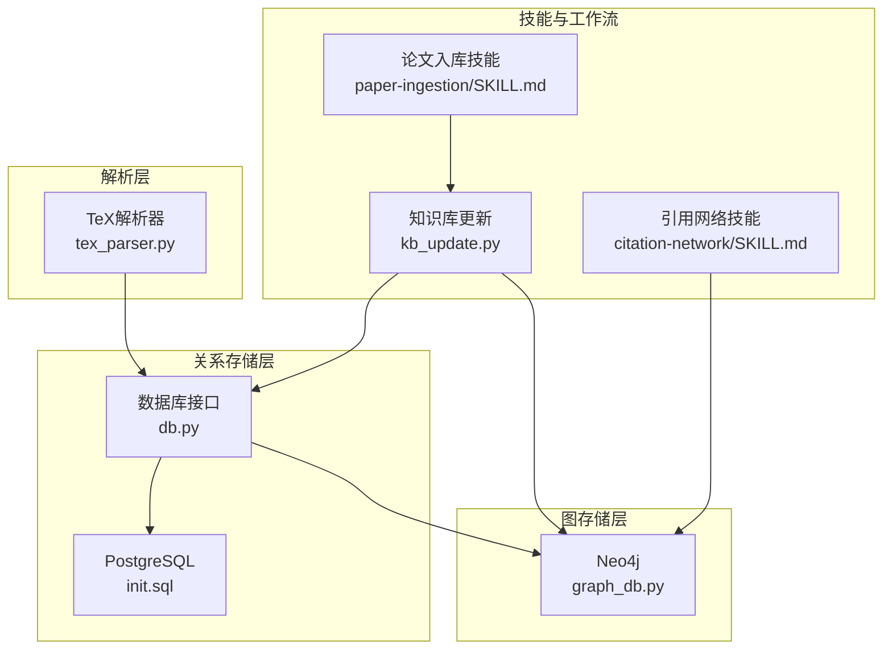
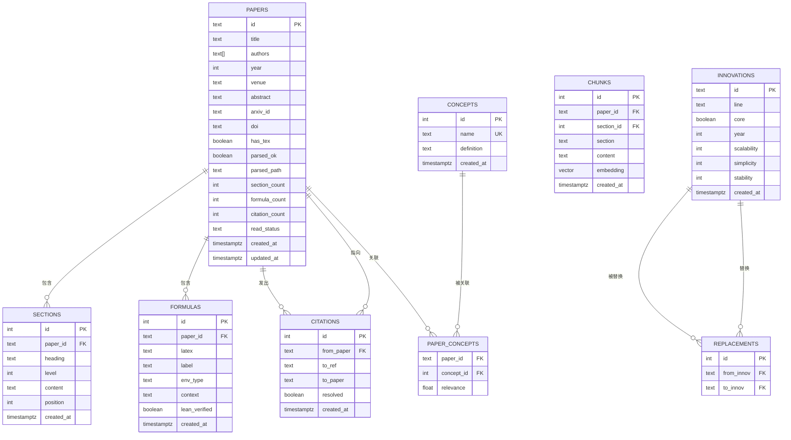
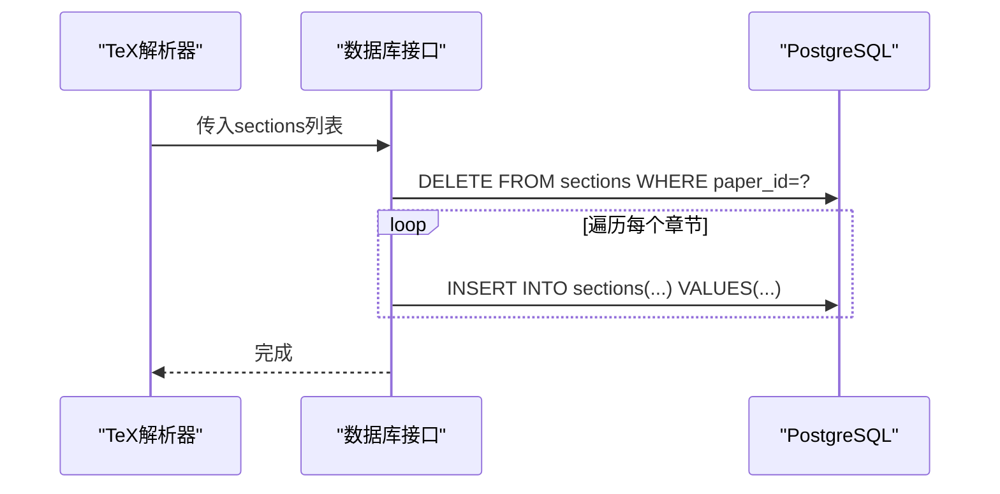
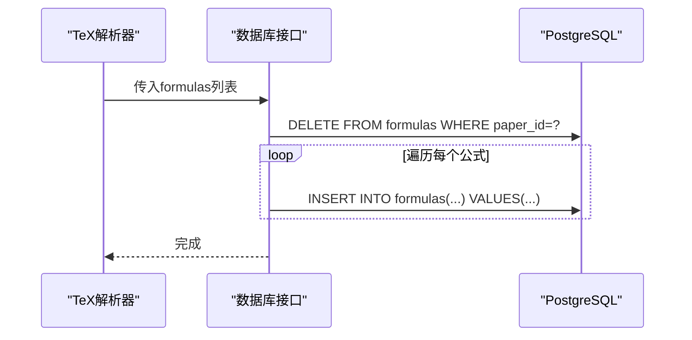
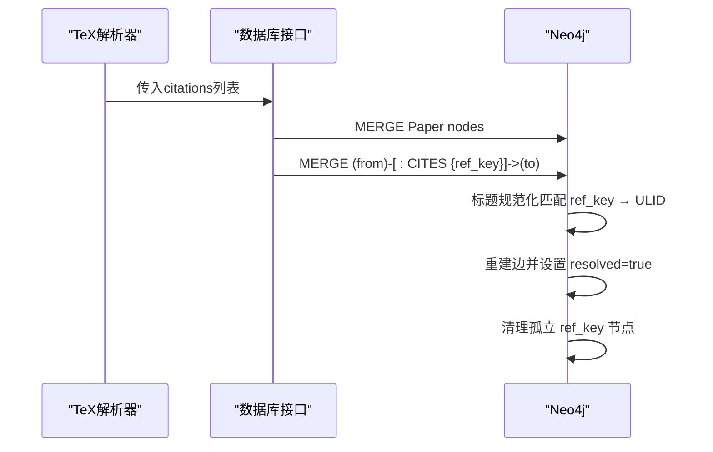
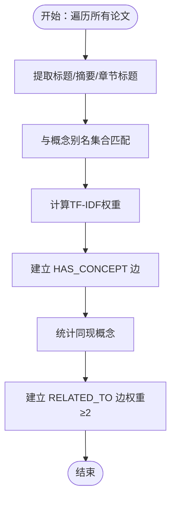
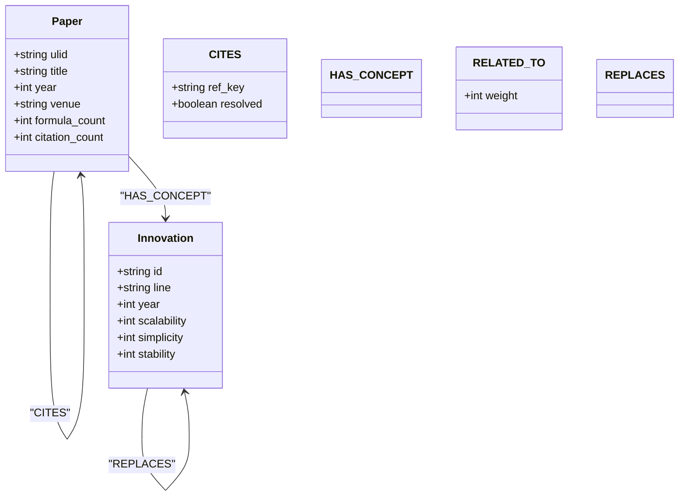
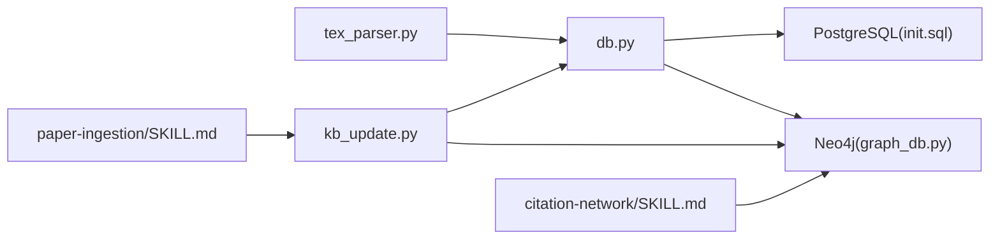

# 实体关系

<cite>
**本文档引用的文件**
- [db.py](file://scholar/db.py)
- [graph_db.py](file://scholar/graph_db.py)
- [init.sql](file://infra/init.sql)
- [tex_parser.py](file://scholar/tex_parser.py)
- [kb_update.py](file://scholar/kb_update.py)
- [SKILL.md（论文入库）](file://plugin/skills/paper-ingestion/SKILL.md)
- [SKILL.md（引用网络）](file://plugin/skills/citation-network/SKILL.md)
</cite>

## 目录
1. [简介](#简介)
2. [项目结构](#项目结构)
3. [核心实体](#核心实体)
4. [架构总览](#架构总览)
5. [详细实体分析](#详细实体分析)
6. [依赖关系分析](#依赖关系分析)
7. [性能考量](#性能考量)
8. [故障排查指南](#故障排查指南)
9. [结论](#结论)

## 简介
本文件面向Scholar Studio系统，聚焦“实体关系”主题，系统化阐述以下核心关系模型：
- 论文与章节的一对多关系
- 论文与公式的关联
- 引用关系的双向链接（数据库与图数据库）
- 概念提取与论文的多对多关系
- Neo4j图数据库中的节点与边模型（论文、创新、引用、概念等）

同时解释实体间的引用完整性约束与数据一致性保障机制，并提供实体关系图与数据流转示例。

## 项目结构
Scholar Studio采用“解析器 + 关系型数据库(PostgreSQL) + 图数据库(Neo4j)”三层架构：
- 解析层：TeX解析器负责从源码提取论文元数据、章节、公式、引用等
- 关系存储层：PostgreSQL负责持久化论文、章节、公式、引用、概念等结构化数据
- 图存储层：Neo4j负责构建引用网络、概念图谱与创新演进图

**图表来源**
- [tex_parser.py:214-285](file://scholar/tex_parser.py#L214-L285)
- [db.py:79-175](file://scholar/db.py#L79-L175)
- [init.sql:9-131](file://infra/init.sql#L9-L131)
- [graph_db.py:225-281](file://scholar/graph_db.py#L225-L281)
- [kb_update.py:199-413](file://scholar/kb_update.py#L199-L413)
- [SKILL.md（论文入库）:1-85](file://plugin/skills/paper-ingestion/SKILL.md#L1-L85)
- [SKILL.md（引用网络）:1-101](file://plugin/skills/citation-network/SKILL.md#L1-L101)

**章节来源**
- [tex_parser.py:214-285](file://scholar/tex_parser.py#L214-L285)
- [db.py:79-175](file://scholar/db.py#L79-L175)
- [init.sql:9-131](file://infra/init.sql#L9-L131)
- [graph_db.py:225-281](file://scholar/graph_db.py#L225-L281)
- [kb_update.py:199-413](file://scholar/kb_update.py#L199-L413)
- [SKILL.md（论文入库）:1-85](file://plugin/skills/paper-ingestion/SKILL.md#L1-L85)
- [SKILL.md（引用网络）:1-101](file://plugin/skills/citation-network/SKILL.md#L1-L101)

## 核心实体
- 论文(Paper)：唯一标识为ULID，包含标题、作者、年份、会议、摘要、arXiv/DOI等元数据
- 章节(Section)：属于某篇论文，有序排列，包含标题、层级、正文内容
- 公式(Formula)：属于某篇论文，记录LaTeX表达式、标签、环境类型、上下文
- 引用(Citation)：记录论文间的引用关系，包含引用键与目标论文ID（可为空）
- 概念(Concept)：抽象概念实体，用于论文-概念多对多映射
- 创新(Innovation)：来自Lean4的种子数据，Neo4j中的概念节点
- 嵌入块(Chunk)：用于RAG的文本分片与向量嵌入（扩展用途）

**章节来源**
- [init.sql:9-27](file://infra/init.sql#L9-L27)
- [init.sql:32-41](file://infra/init.sql#L32-L41)
- [init.sql:46-56](file://infra/init.sql#L46-L56)
- [init.sql:61-71](file://infra/init.sql#L61-L71)
- [init.sql:76-91](file://infra/init.sql#L76-L91)
- [init.sql:110-130](file://infra/init.sql#L110-L130)

## 架构总览
Scholar Studio通过解析器产出结构化JSON，再经数据库接口写入PostgreSQL；同时将论文、引用、概念同步至Neo4j，形成三类图谱：
- 引用网络：Paper → CITES → Paper
- 概念图谱：Paper → HAS_CONCEPT → Innovation；Innovation → RELATED_TO → Innovation
- 创新演进：Innovation → REPLACES → Innovation（来自Lean4）

**图表来源**
- [init.sql:9-27](file://infra/init.sql#L9-L27)
- [init.sql:32-41](file://infra/init.sql#L32-L41)
- [init.sql:46-56](file://infra/init.sql#L46-L56)
- [init.sql:61-71](file://infra/init.sql#L61-L71)
- [init.sql:76-91](file://infra/init.sql#L76-L91)
- [init.sql:96-104](file://infra/init.sql#L96-L104)
- [init.sql:110-130](file://infra/init.sql#L110-L130)

## 详细实体分析

### 论文与章节：一对多关系
- 关系模型：每篇论文对应多个章节，章节通过paper_id外键关联论文
- 数据一致性：
  - 删除论文时，级联删除其所有章节（ON DELETE CASCADE）
  - 插入/更新章节时，保持position顺序字段以维护阅读顺序
- 写入流程：
  - 解析器提取sections，数据库接口批量替换旧章节
  - 事务提交/回滚由数据库游标上下文管理

**图表来源**
- [tex_parser.py:214-285](file://scholar/tex_parser.py#L214-L285)
- [db.py:128-141](file://scholar/db.py#L128-L141)

**章节来源**
- [init.sql:32-41](file://infra/init.sql#L32-L41)
- [db.py:128-141](file://scholar/db.py#L128-L141)

### 论文与公式：一对多关系
- 关系模型：每篇论文包含多个公式，公式通过paper_id外键关联论文
- 数据一致性：
  - 删除论文时，级联删除其所有公式
  - 公式表包含环境类型、标签、上下文等丰富属性，便于检索与验证
- 写入流程：
  - 解析器提取formulas，数据库接口批量替换旧公式

**图表来源**
- [tex_parser.py:214-285](file://scholar/tex_parser.py#L214-L285)
- [db.py:142-155](file://scholar/db.py#L142-L155)

**章节来源**
- [init.sql:46-56](file://infra/init.sql#L46-L56)
- [db.py:142-155](file://scholar/db.py#L142-L155)

### 引用关系：双向链接与解析
- 关系模型：
  - 数据库层：citations表记录from_paper与to_ref，to_paper可为空表示未解析
  - 图数据库层：Paper → CITES → Paper，支持ref_key标注与解析
- 解析与修复：
  - Neo4j构建引用网络时，先建立占位节点，随后通过标题规范化匹配进行ref_key→ULID解析
  - 解析成功后重建边并标记resolved=true，清理孤立ref_key节点
- 数据一致性：
  - 数据库层：UNIQUE(from_paper,to_ref)避免重复引用
  - 图数据库层：MERGE确保节点与边幂等创建

**图表来源**
- [tex_parser.py:214-285](file://scholar/tex_parser.py#L214-L285)
- [db.py:156-168](file://scholar/db.py#L156-L168)
- [graph_db.py:225-281](file://scholar/graph_db.py#L225-L281)
- [graph_db.py:85-178](file://scholar/graph_db.py#L85-L178)

**章节来源**
- [init.sql:61-71](file://infra/init.sql#L61-L71)
- [db.py:156-168](file://scholar/db.py#L156-L168)
- [graph_db.py:225-281](file://scholar/graph_db.py#L225-L281)
- [graph_db.py:85-178](file://scholar/graph_db.py#L85-L178)

### 概念提取与论文：多对多关系
- 关系模型：
  - 数据库层：paper_concepts表实现论文与概念的多对多映射，包含relevance权重
  - 图数据库层：Paper → HAS_CONCEPT → Innovation；Innovation之间通过RELATED_TO边连接
- 概念抽取：
  - 基于TF-IDF思想，统计术语在论文中的出现频率与跨论文文档频率，匹配预定义的概念别名集合
  - 构建同现边：同一论文内共现概念间建立RELATED_TO边，权重为共现次数
- 数据一致性：
  - 数据库层：PRIMARY KEY(paper_id, concept_id)保证唯一映射
  - 图数据库层：MERGE确保节点与边幂等创建

**图表来源**
- [graph_db.py:581-633](file://scholar/graph_db.py#L581-L633)
- [graph_db.py:636-732](file://scholar/graph_db.py#L636-L732)

**章节来源**
- [init.sql:76-91](file://infra/init.sql#L76-L91)
- [graph_db.py:581-633](file://scholar/graph_db.py#L581-L633)
- [graph_db.py:636-732](file://scholar/graph_db.py#L636-L732)

### Neo4j节点与边模型
- 节点类型：
  - Paper：包含ulid、title、year、venue、formula_count、citation_count等属性
  - Innovation：来自Lean4种子数据，包含line、year、scalability、simplicity、stability等
- 边类型：
  - CITES：论文间引用，携带ref_key与resolved标记
  - HAS_CONCEPT：论文与概念（Innovation）的关联
  - RELATED_TO：概念间的共现关系，权重为共现次数
  - REPLACES：创新间的替代关系（来自Lean4）

**图表来源**
- [graph_db.py:225-281](file://scholar/graph_db.py#L225-L281)
- [graph_db.py:636-732](file://scholar/graph_db.py#L636-L732)
- [graph_db.py:794-860](file://scholar/graph_db.py#L794-L860)

**章节来源**
- [graph_db.py:225-281](file://scholar/graph_db.py#L225-L281)
- [graph_db.py:636-732](file://scholar/graph_db.py#L636-L732)
- [graph_db.py:794-860](file://scholar/graph_db.py#L794-L860)

## 依赖关系分析
- 解析器依赖：TeX解析器负责从源码提取结构化数据，供数据库接口写入
- 数据库接口依赖：统一提供upsert/ingest能力，支持事务与回滚
- Neo4j依赖：提供引用网络、概念图谱、创新演进的构建与查询
- 技能依赖：论文入库与引用网络技能分别驱动数据写入与图谱分析

**图表来源**
- [tex_parser.py:214-285](file://scholar/tex_parser.py#L214-L285)
- [db.py:79-175](file://scholar/db.py#L79-L175)
- [init.sql:9-131](file://infra/init.sql#L9-L131)
- [graph_db.py:225-281](file://scholar/graph_db.py#L225-L281)
- [kb_update.py:199-413](file://scholar/kb_update.py#L199-L413)
- [SKILL.md（论文入库）:1-85](file://plugin/skills/paper-ingestion/SKILL.md#L1-L85)
- [SKILL.md（引用网络）:1-101](file://plugin/skills/citation-network/SKILL.md#L1-L101)

**章节来源**
- [tex_parser.py:214-285](file://scholar/tex_parser.py#L214-L285)
- [db.py:79-175](file://scholar/db.py#L79-L175)
- [init.sql:9-131](file://infra/init.sql#L9-L131)
- [graph_db.py:225-281](file://scholar/graph_db.py#L225-L281)
- [kb_update.py:199-413](file://scholar/kb_update.py#L199-L413)
- [SKILL.md（论文入库）:1-85](file://plugin/skills/paper-ingestion/SKILL.md#L1-L85)
- [SKILL.md（引用网络）:1-101](file://plugin/skills/citation-network/SKILL.md#L1-L101)

## 性能考量
- 批量写入：数据库接口与Neo4j均采用批处理（默认100条/批）减少往返开销
- 级联删除：删除论文时自动清理章节/公式，避免悬挂数据
- 索引优化：为高频查询字段建立索引（如paper_id、to_paper等）
- 幂等操作：Neo4j使用MERGE避免重复节点/边，提升稳定性
- 事务控制：数据库游标上下文自动提交/回滚，保证一致性

[本节为通用性能建议，不直接分析具体文件，故无“章节来源”]

## 故障排查指南
- 引用解析失败：
  - 现象：citations表中to_paper为空，Neo4j中存在孤立ref_key节点
  - 排查：检查解析器是否正确提取引用键；确认ref_key→ULID解析逻辑是否命中
  - 处理：运行引用网络构建与解析流程，重新解析并重建边
- 论文入库异常：
  - 现象：解析失败或数据库写入报错
  - 排查：查看解析器日志与数据库事务回滚信息
  - 处理：定位具体步骤（解析/补全元数据/图谱更新），逐项修复
- Neo4j不可用：
  - 现象：图谱构建/查询失败
  - 排查：确认Neo4j服务可用性与认证配置
  - 处理：启动服务或切换到文件模式继续工作流

**章节来源**
- [graph_db.py:85-178](file://scholar/graph_db.py#L85-L178)
- [db.py:62-74](file://scholar/db.py#L62-L74)
- [kb_update.py:245-307](file://scholar/kb_update.py#L245-L307)

## 结论
Scholar Studio通过明确的实体关系模型与严格的引用完整性约束，实现了论文结构化数据与图谱数据的协同管理。数据库层保证关系型数据的强一致与高效查询，图数据库层提供复杂关系的灵活探索与分析。通过批处理、幂等操作与事务控制，系统在大规模论文入库场景下仍能保持稳定与高性能。