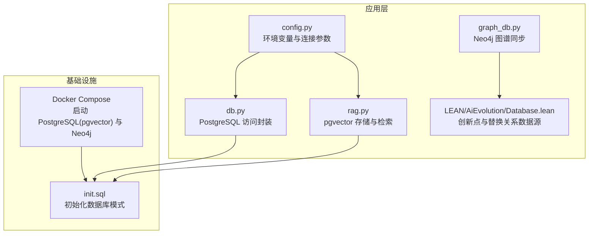
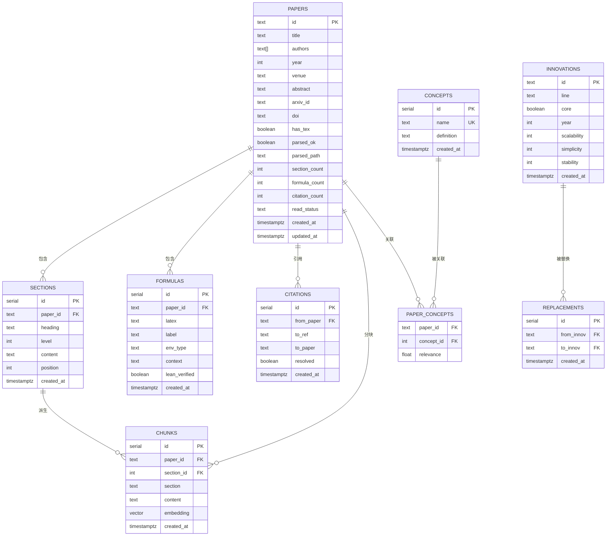
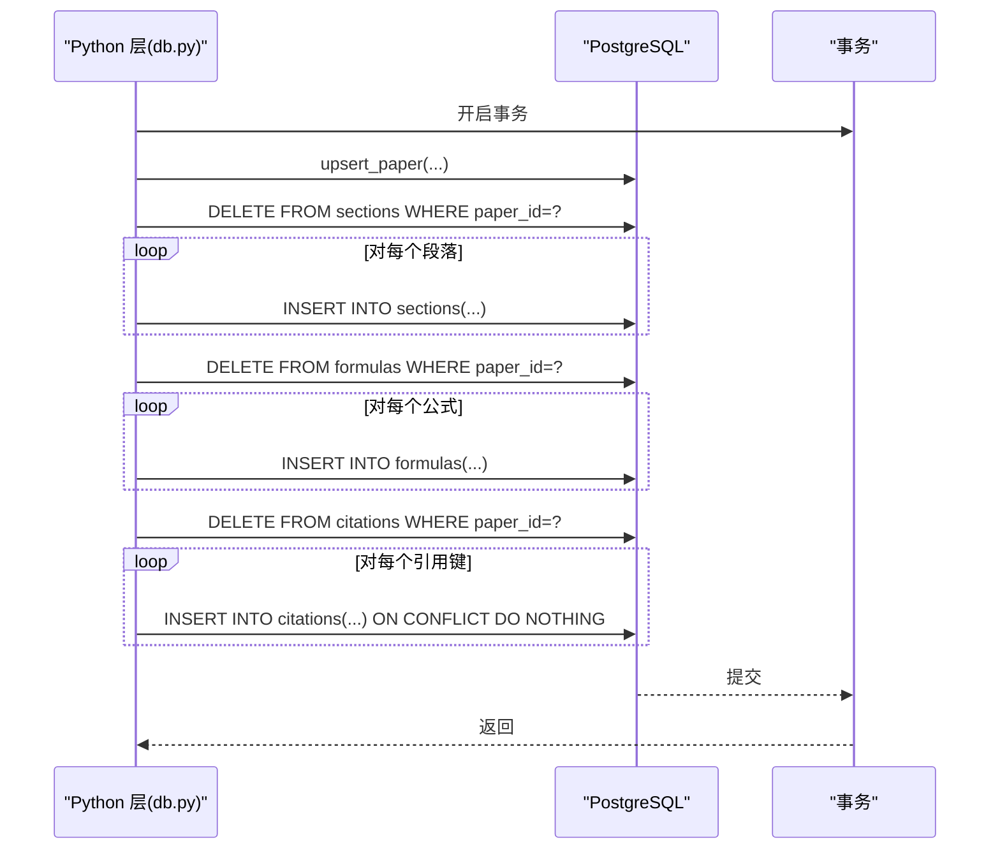
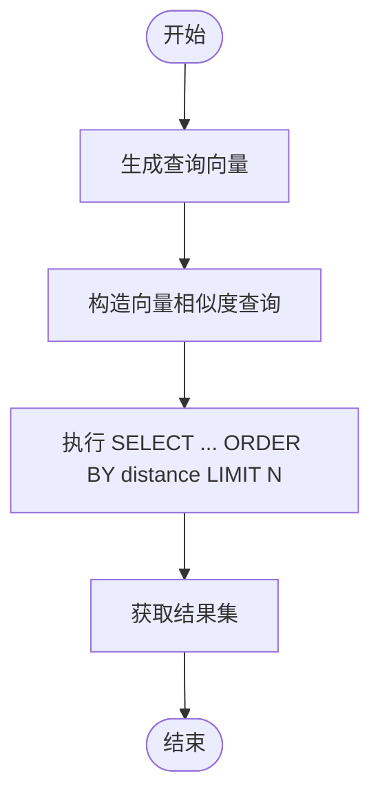
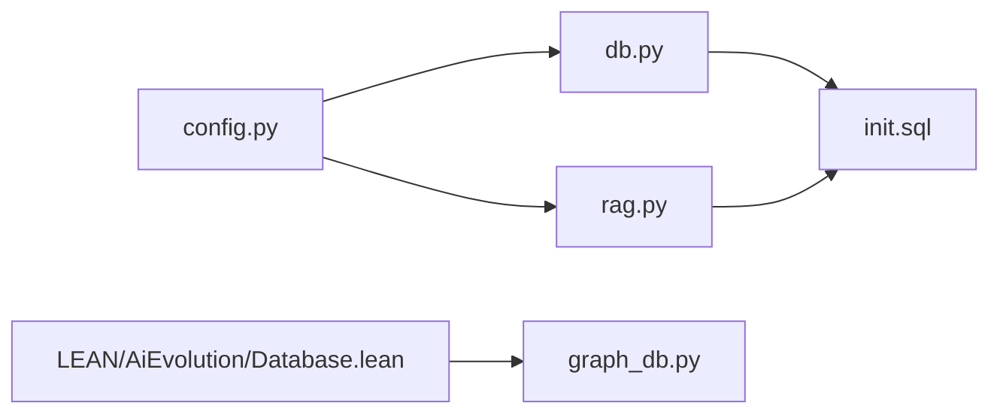

# 数据库设计

<cite>
**本文引用的文件**
- [infra/init.sql](file://infra/init.sql)
- [scholar/db.py](file://scholar/db.py)
- [scholar/config.py](file://scholar/config.py)
- [scholar/rag.py](file://scholar/rag.py)
- [scholar/graph_db.py](file://scholar/graph_db.py)
- [LEAN/AiEvolution/Database.lean](file://LEAN/AiEvolution/Database.lean)
- [README.md](file://README.md)
- [startup.ps1](file://startup.ps1)
</cite>

## 目录
1. [简介](#简介)
2. [项目结构](#项目结构)
3. [核心组件](#核心组件)
4. [架构总览](#架构总览)
5. [详细组件分析](#详细组件分析)
6. [依赖分析](#依赖分析)
7. [性能考虑](#性能考虑)
8. [故障排查指南](#故障排查指南)
9. [结论](#结论)
10. [附录](#附录)

## 简介
本文件面向 Scholar Studio 的数据库设计，聚焦于 PostgreSQL 16 + pgvector 的整体架构与实现细节。文档围绕以下目标展开：
- 解释核心表结构（papers、sections、formulas、citations、concepts、paper_concepts、chunks、innovations、replacements）的设计理念、字段含义与约束。
- 描述主键、外键关系与索引策略，并给出性能优化与扩展配置建议（如 HNSW 近似最近邻索引）。
- 提供数据库初始化脚本的逐段注释与最佳实践，帮助读者快速理解并安全地部署与维护数据库。

## 项目结构
Scholar Studio 的数据库层由初始化脚本定义核心模式，Python 层提供数据库访问与 RAG 向量存储能力，同时通过 Lean4 侧的数据文件同步创新点与替换关系到图数据库。

图表来源
- [startup.ps1:11-40](file://startup.ps1#L11-L40)
- [infra/init.sql:1-131](file://infra/init.sql#L1-L131)
- [scholar/config.py:41-57](file://scholar/config.py#L41-L57)
- [scholar/db.py:24-74](file://scholar/db.py#L24-L74)
- [scholar/rag.py:182-237](file://scholar/rag.py#L182-L237)
- [scholar/graph_db.py:794-801](file://scholar/graph_db.py#L794-L801)
- [LEAN/AiEvolution/Database.lean:14-756](file://LEAN/AiEvolution/Database.lean#L14-L756)

章节来源
- [startup.ps1:11-40](file://startup.ps1#L11-L40)
- [README.md:67-91](file://README.md#L67-L91)

## 核心组件
本节概述数据库模式的核心表及其职责：
- papers：论文元数据与解析状态
- sections：论文结构化正文段落
- formulas：提取的 LaTeX 公式
- citations：参考文献引用关系
- concepts：抽取的关键概念
- paper_concepts：论文与概念的关联及重要性
- chunks：分块内容与向量嵌入（用于 RAG）
- innovations：研究创新点（与 Lean4 数据同步）
- replacements：创新点之间的替换关系

章节来源
- [infra/init.sql:9-27](file://infra/init.sql#L9-L27)
- [infra/init.sql:32-40](file://infra/init.sql#L32-L40)
- [infra/init.sql:46-55](file://infra/init.sql#L46-L55)
- [infra/init.sql:61-71](file://infra/init.sql#L61-L71)
- [infra/init.sql:76-81](file://infra/init.sql#L76-L81)
- [infra/init.sql:86-91](file://infra/init.sql#L86-L91)
- [infra/init.sql:96-104](file://infra/init.sql#L96-L104)
- [infra/init.sql:110-119](file://infra/init.sql#L110-L119)
- [infra/init.sql:124-130](file://infra/init.sql#L124-L130)

## 架构总览
Scholar Studio 的数据库层采用“结构化关系型 + 向量相似度检索”的混合架构：
- 关系型数据（papers/sections/formulas/citations/concepts/paper_concepts/chunks）存储在 PostgreSQL 中，使用 pgvector 扩展支持向量检索。
- 创新点与替换关系来自 Lean4 数据文件，通过 Python 同步至 Neo4j 图数据库，用于概念与演进关系的可视化与推理。

图表来源
- [infra/init.sql:9-27](file://infra/init.sql#L9-L27)
- [infra/init.sql:32-40](file://infra/init.sql#L32-L40)
- [infra/init.sql:46-55](file://infra/init.sql#L46-L55)
- [infra/init.sql:61-71](file://infra/init.sql#L61-L71)
- [infra/init.sql:76-81](file://infra/init.sql#L76-L81)
- [infra/init.sql:86-91](file://infra/init.sql#L86-L91)
- [infra/init.sql:96-104](file://infra/init.sql#L96-L104)
- [infra/init.sql:110-119](file://infra/init.sql#L110-L119)
- [infra/init.sql:124-130](file://infra/init.sql#L124-L130)

## 详细组件分析

### 表：papers（论文元数据）
- 主键：id（文本，通常为 ULID）
- 字段含义：标题、作者数组、年份、会议/期刊、摘要、arXiv/DOI、解析状态与路径、统计计数、阅读状态、时间戳
- 约束与默认值：read_status 默认“未读”，created_at/updated_at 默认当前时间
- 设计理念：集中存储论文核心元数据与解析进度，便于全文检索与统计

章节来源
- [infra/init.sql:9-27](file://infra/init.sql#L9-L27)

### 表：sections（论文结构化正文）
- 主键：id（自增整数）
- 外键：paper_id → papers(id)，删除级联
- 字段含义：标题、层级、内容、顺序位置、时间戳
- 设计理念：按段落结构化存储正文，支持顺序与层级导航

章节来源
- [infra/init.sql:32-40](file://infra/init.sql#L32-L40)

### 表：formulas（提取的 LaTeX 公式）
- 主键：id（自增整数）
- 外键：paper_id → papers(id)，删除级联
- 字段含义：LaTeX 表达式、标签、环境类型（如 equation、align）、上下文、Lean 验证标记、时间戳
- 设计理念：保留公式表达式与上下文，便于后续数学验证与检索

章节来源
- [infra/init.sql:46-55](file://infra/init.sql#L46-L55)

### 表：citations（引用关系）
- 主键：id（自增整数）
- 外键：from_paper → papers(id)，删除级联
- 字段含义：引用键、目标论文 ID（可空，表示未解析）、解析标记、时间戳
- 唯一约束：from_paper + to_ref 组合唯一
- 设计理念：记录引用关系并支持解析追踪；to_paper 可为空以表示未解析状态

章节来源
- [infra/init.sql:61-71](file://infra/init.sql#L61-L71)

### 表：concepts（关键概念）
- 主键：id（自增整数）
- 唯一约束：name 唯一
- 字段含义：名称、定义、时间戳
- 设计理念：抽取与标准化关键概念，作为知识组织的基础单元

章节来源
- [infra/init.sql:76-81](file://infra/init.sql#L76-L81)

### 表：paper_concepts（论文-概念关联）
- 外键：paper_id → papers(id)、concept_id → concepts(id)，删除级联
- 主键：paper_id + concept_id（联合主键）
- 字段含义：相关性分数（默认 1.0）
- 设计理念：建立论文与概念的多对多关系，并量化相关性

章节来源
- [infra/init.sql:86-91](file://infra/init.sql#L86-L91)

### 表：chunks（RAG 分块与向量）
- 主键：id（自增整数）
- 外键：paper_id → papers(id)，删除级联；section_id → sections(id)，删除时设空
- 字段含义：paper_id、section_id、section 名称、内容、向量 embedding（pgvector），时间戳
- 设计理念：将长文本切分为适合向量检索的小块，支持语义相似度召回

章节来源
- [infra/init.sql:96-104](file://infra/init.sql#L96-L104)

### 表：innovations（研究创新点）
- 主键：id（文本，如“Transformer”等）
- 字段含义：所属研究线、是否核心、年份、可扩展性/简洁性/稳定性评分、时间戳
- 设计理念：结构化存储 AI 演进中的关键节点，便于与论文与图谱联动

章节来源
- [infra/init.sql:110-119](file://infra/init.sql#L110-L119)

### 表：replacements（替换关系）
- 主键：id（自增整数）
- 外键：from_innov、to_innov → innovations(id)
- 唯一约束：from_innov + to_innov 组合唯一
- 设计理念：记录创新点之间的替代或演进关系，支撑图谱分析

章节来源
- [infra/init.sql:124-130](file://infra/init.sql#L124-L130)

### 序列图：论文入库流程（Python 层）

图表来源
- [scholar/db.py:79-175](file://scholar/db.py#L79-L175)

章节来源
- [scholar/db.py:79-175](file://scholar/db.py#L79-L175)

### 流程图：RAG 向量检索（PostgreSQL + pgvector）

图表来源
- [scholar/rag.py:252-289](file://scholar/rag.py#L252-L289)

章节来源
- [scholar/rag.py:182-237](file://scholar/rag.py#L182-L237)
- [scholar/rag.py:252-289](file://scholar/rag.py#L252-L289)

## 依赖分析
- 外部依赖
  - PostgreSQL 16 + pgvector：提供向量类型与 HNSW 近似最近邻索引
  - Neo4j：用于概念与创新点关系的图谱分析（与 PostgreSQL 并行）
- 内部依赖
  - Python 配置模块提供连接参数（主机、端口、数据库名、用户、密码）
  - 初始化脚本定义所有表结构与索引
  - RAG 模块依赖向量索引进行相似度检索
  - Lean4 数据文件提供 innovations 与 replacements 的权威数据源

图表来源
- [scholar/config.py:41-57](file://scholar/config.py#L41-L57)
- [scholar/db.py:24-74](file://scholar/db.py#L24-L74)
- [scholar/rag.py:182-237](file://scholar/rag.py#L182-L237)
- [infra/init.sql:1-131](file://infra/init.sql#L1-131)
- [scholar/graph_db.py:794-801](file://scholar/graph_db.py#L794-L801)
- [LEAN/AiEvolution/Database.lean:14-756](file://LEAN/AiEvolution/Database.lean#L14-L756)

章节来源
- [scholar/config.py:41-57](file://scholar/config.py#L41-L57)
- [scholar/db.py:24-74](file://scholar/db.py#L24-L74)
- [scholar/rag.py:182-237](file://scholar/rag.py#L182-L237)
- [infra/init.sql:1-131](file://infra/init.sql#L1-131)
- [scholar/graph_db.py:794-801](file://scholar/graph_db.py#L794-L801)
- [LEAN/AiEvolution/Database.lean:14-756](file://LEAN/AiEvolution/Database.lean#L14-L756)

## 性能考虑
- 索引策略
  - 已有索引：sections.paper_id、formulas.paper_id、citations.from_paper、citations.to_paper、chunks.paper_id
  - 建议新增：对 chunks.embedding 建立 HNSW 近似最近邻索引，使用余弦距离，提升大规模向量检索性能
- 查询优化
  - 使用向量化检索时，优先基于 paper_id 过滤，减少候选集
  - 将高成本的向量计算与索引扫描分离，避免在查询中重复计算嵌入
- 扩展配置
  - 在 PostgreSQL 中启用 pgvector 扩展后，结合 HNSW 参数（如 m、ef_construction）调优吞吐与精度平衡
  - 对高频查询字段（如 read_status、year）考虑复合索引或物化视图
- 连接与并发
  - Python 层使用连接池与事务封装，避免长连接泄漏与死锁
  - 对批量写入（如分块入库）采用批量插入与单事务提交，减少往返开销

章节来源
- [infra/init.sql:41](file://infra/init.sql#L41)
- [infra/init.sql:56](file://infra/init.sql#L56)
- [infra/init.sql:70-71](file://infra/init.sql#L70-L71)
- [infra/init.sql:105](file://infra/init.sql#L105)
- [scholar/rag.py:214-237](file://scholar/rag.py#L214-L237)

## 故障排查指南
- 连接问题
  - 确认 PostgreSQL 容器健康状态与端口映射（默认 5433），参阅启动脚本与 README
  - 检查 .env 中的连接参数（主机、端口、数据库名、用户、密码）
- 权限与扩展
  - 确保数据库已创建并启用 pgvector 扩展；初始化脚本会尝试创建扩展
- 写入异常
  - Python 层在异常时回滚事务，检查日志定位具体 SQL 与参数
- 向量检索失败
  - 确认已创建 HNSW 索引；若索引缺失或损坏，重建索引后再试
- 数据同步
  - Lean4 到 Neo4j 的同步依赖本地文件存在；若文件不存在则回退到硬编码关系

章节来源
- [startup.ps1:11-40](file://startup.ps1#L11-L40)
- [README.md:67-91](file://README.md#L67-L91)
- [scholar/config.py:41-57](file://scholar/config.py#L41-L57)
- [scholar/db.py:62-73](file://scholar/db.py#L62-L73)
- [scholar/rag.py:214-237](file://scholar/rag.py#L214-L237)
- [scholar/graph_db.py:794-801](file://scholar/graph_db.py#L794-L801)

## 结论
Scholar Studio 的数据库设计以“结构化关系 + 向量检索”为核心，既满足论文元数据与结构化内容的高效管理，又为未来的 RAG 语义检索提供可扩展的向量索引能力。通过清晰的表结构、外键约束与索引策略，以及 Python 层的事务封装与错误处理，系统在可用性与性能之间取得良好平衡。配合 Lean4 与 Neo4j 的数据同步，形成从结构化数据到图谱分析的完整知识体系。

## 附录

### 初始化脚本逐段注释与最佳实践
- 第 1–2 行：脚本头部注释，声明使用 PostgreSQL 16 与 pgvector
- 第 4 行：创建 pgvector 扩展（若不存在）
- 第 9–27 行：papers 表
  - 主键：id（ULID）
  - 建议：为高频过滤字段（year、read_status）考虑索引
- 第 32–40 行：sections 表
  - 建议：为 paper_id 建立索引（已有），并考虑按 position 排序的复合索引
- 第 46–55 行：formulas 表
  - 建议：为 paper_id 建立索引（已有），必要时为 env_type 建立选择性索引
- 第 61–71 行：citations 表
  - 建议：为 to_paper 建立索引（已有），注意唯一约束避免重复引用
- 第 76–81 行：concepts 表
  - 建议：为 name 建立唯一索引（已有）
- 第 86–91 行：paper_concepts 表
  - 建议：为 relevance 建立选择性索引（可选），用于排序与过滤
- 第 96–104 行：chunks 表
  - 建议：为 embedding 创建 HNSW 索引（cosine 距离），并为 paper_id 建立常规索引（已有）
- 第 110–119 行：innovations 表
  - 建议：为 line、year 建立索引（可选），便于按研究线与年代筛选
- 第 124–130 行：replacements 表
  - 建议：为 from_innov、to_innov 建立索引（可选），并保持唯一性

章节来源
- [infra/init.sql:1-131](file://infra/init.sql#L1-L131)