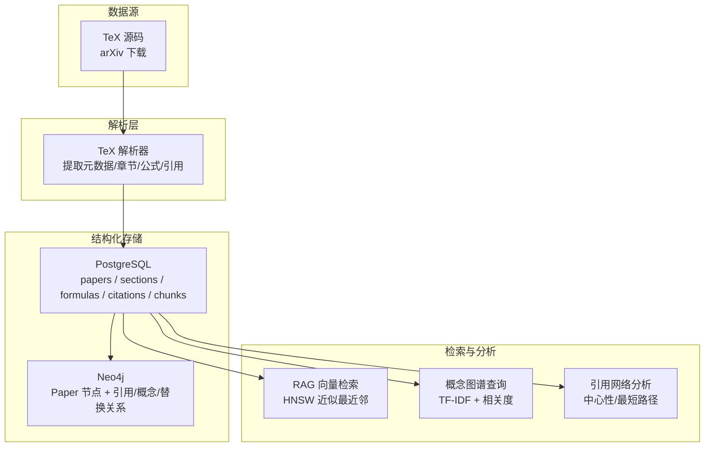
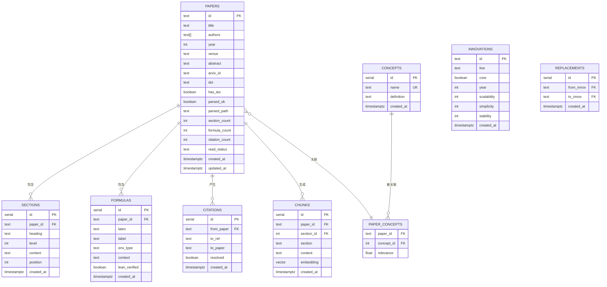
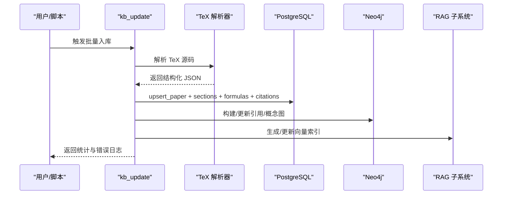
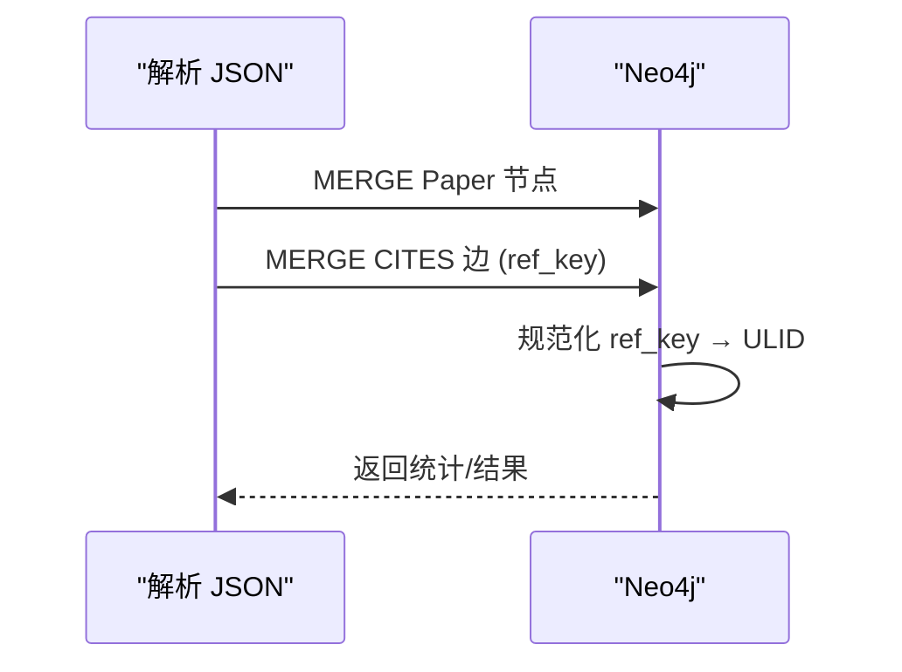
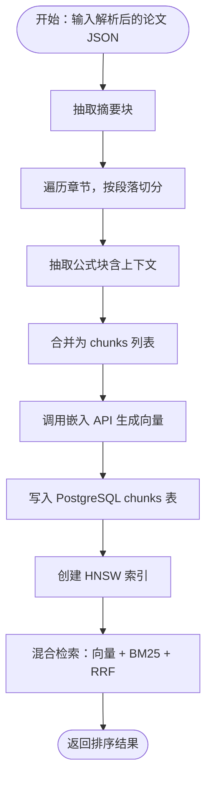
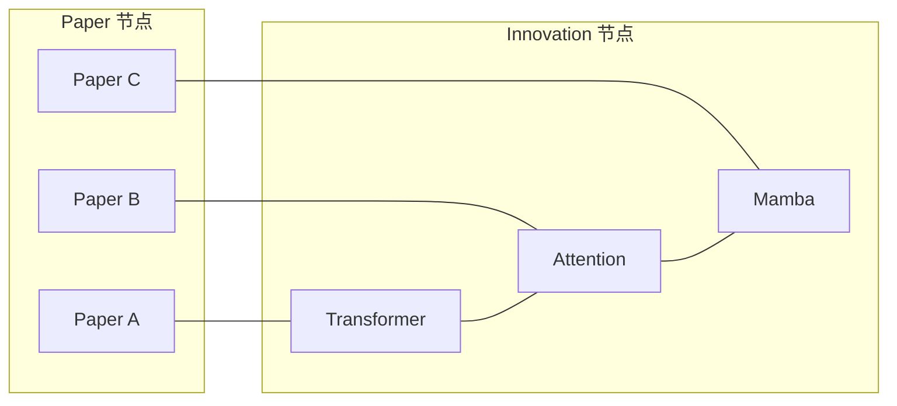
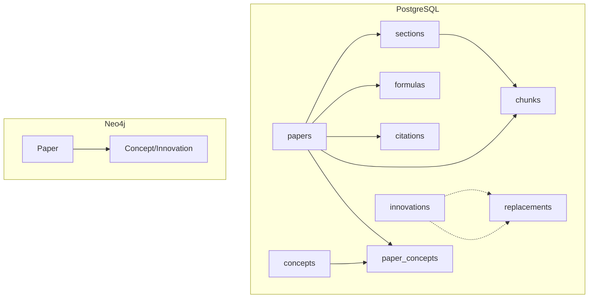

# 数据模型

<cite>
**本文档引用的文件**
- [db.py](file://scholar/db.py)
- [graph_db.py](file://scholar/graph_db.py)
- [init.sql](file://infra/init.sql)
- [rag.py](file://scholar/rag.py)
- [kb_update.py](file://scholar/kb_update.py)
- [tex_parser.py](file://scholar/tex_parser.py)
- [config.py](file://scholar/config.py)
- [Database.lean](file://LEAN/AiEvolution/Database.lean)
</cite>

## 目录
1. [简介](#简介)
2. [项目结构](#项目结构)
3. [核心组件](#核心组件)
4. [架构总览](#架构总览)
5. [详细组件分析](#详细组件分析)
6. [依赖关系分析](#依赖关系分析)
7. [性能考虑](#性能考虑)
8. [故障排查指南](#故障排查指南)
9. [结论](#结论)
10. [附录](#附录)

## 简介
本文件系统性阐述 Scholar Studio 的数据模型与数据流，覆盖以下核心实体与关系：
- 论文（Paper）
- 章节（Section）
- 公式（Formula）
- 引用（Citation）
- RAG 块（Chunk）

同时说明：
- PostgreSQL 中的表结构设计与索引策略
- Neo4j 图数据库中的节点与边模型
- 数据生命周期管理（采集、解析、入库、索引、查询）
- 性能优化与混合检索方案
- 数据导入导出流程与质量控制机制
- 实际数据示例与常用查询模式

## 项目结构
Scholar Studio 将结构化数据存储于 PostgreSQL（含 pgvector 向量扩展），并将引用网络、概念图谱与创新演进关系存储于 Neo4j。RAG 向量索引同样基于 PostgreSQL 的向量字段实现。

图表来源
- [tex_parser.py:214-285](file://scholar/tex_parser.py#L214-L285)
- [db.py:79-176](file://scholar/db.py#L79-L176)
- [init.sql:9-131](file://infra/init.sql#L9-L131)
- [rag.py:25-93](file://scholar/rag.py#L25-L93)
- [graph_db.py:225-281](file://scholar/graph_db.py#L225-L281)

章节来源
- [config.py:23-58](file://scholar/config.py#L23-L58)
- [kb_update.py:199-413](file://scholar/kb_update.py#L199-L413)

## 核心组件
- 结构化数据库（PostgreSQL + pgvector）
  - 表：papers、sections、formulas、citations、concepts、paper_concepts、chunks、innovations、replacements
  - 索引：主键、外键、部分唯一索引、向量 HNSW
- 图数据库（Neo4j）
  - 节点：Paper、Innovation
  - 边：CITES（引用）、HAS_CONCEPT（论文-概念）、RELATED_TO（概念共现）、REPLACES（创新演进）
- RAG 子系统
  - 分块策略、嵌入生成、向量存储、HNSW 索引、混合检索（向量 + BM25 + RRF 融合）

章节来源
- [init.sql:9-131](file://infra/init.sql#L9-L131)
- [db.py:79-176](file://scholar/db.py#L79-L176)
- [rag.py:25-93](file://scholar/rag.py#L25-L93)
- [graph_db.py:225-281](file://scholar/graph_db.py#L225-L281)

## 架构总览
Scholar Studio 的数据模型围绕“论文”这一核心实体展开，通过 TeX 解析器产出结构化 JSON，随后写入 PostgreSQL 并同步到 Neo4j。RAG 子系统基于解析后的文本进行分块与向量化，构建 PostgreSQL 向量索引，并提供语义检索能力。

图表来源
- [init.sql:9-131](file://infra/init.sql#L9-L131)

## 详细组件分析

### 论文（Paper）实体
- 字段要点：标题、作者数组、年份、会议/期刊、摘要、arXiv/DOI、TeX 是否存在、解析状态、统计计数、时间戳
- 生命周期：解析 → 元数据补全 → 写入 PostgreSQL → Neo4j 同步 → RAG 索引
- 关键操作：upsert_paper、list_papers、search_papers、get_stats

图表来源
- [kb_update.py:199-413](file://scholar/kb_update.py#L199-L413)
- [db.py:79-176](file://scholar/db.py#L79-L176)
- [graph_db.py:225-281](file://scholar/graph_db.py#L225-L281)
- [rag.py:471-582](file://scholar/rag.py#L471-L582)

章节来源
- [db.py:79-127](file://scholar/db.py#L79-L127)
- [kb_update.py:245-340](file://scholar/kb_update.py#L245-L340)

### 章节（Section）实体
- 字段要点：所属论文、标题、层级、正文内容、顺序位置
- 索引策略：按 paper_id 建立索引，便于快速定位论文的所有章节
- 用途：RAG 分块时优先以章节为单位切分

章节来源
- [init.sql:32-41](file://infra/init.sql#L32-L41)
- [db.py:128-141](file://scholar/db.py#L128-L141)
- [rag.py:25-93](file://scholar/rag.py#L25-L93)

### 公式（Formula）实体
- 字段要点：所属论文、LaTeX 表达式、标签、环境类型、上下文、Lean 验证标记
- 用途：在 RAG 分块中单独抽取公式作为独立块，提升检索精度

章节来源
- [init.sql:46-56](file://infra/init.sql#L46-L56)
- [db.py:142-155](file://scholar/db.py#L142-L155)
- [rag.py:81-93](file://scholar/rag.py#L81-L93)

### 引用（Citation）实体
- 字段要点：来源论文、目标引用键、目标论文（可空，解析后回填）、是否已解析
- Neo4j 引用网络：Paper 节点之间建立 CITES 边；支持规范化引用键到实际论文 ULID
- 查询：前向引用、后向引用、最短引用路径、中心性指标

图表来源
- [graph_db.py:225-281](file://scholar/graph_db.py#L225-L281)
- [graph_db.py:85-178](file://scholar/graph_db.py#L85-L178)

章节来源
- [init.sql:61-72](file://infra/init.sql#L61-L72)
- [graph_db.py:225-365](file://scholar/graph_db.py#L225-L365)

### RAG 块（Chunk）实体与检索
- 分块策略：摘要、章节（段落级）、公式三类块，统一注入论文标题与上下文前缀
- 向量存储：PostgreSQL chunks 表，embedding 为向量类型
- 索引：HNSW 近似最近邻，余弦距离
- 检索：向量检索 + BM25 关键词检索 + RRF 融合

图表来源
- [rag.py:25-93](file://scholar/rag.py#L25-L93)
- [rag.py:182-238](file://scholar/rag.py#L182-L238)
- [rag.py:252-289](file://scholar/rag.py#L252-L289)
- [rag.py:383-421](file://scholar/rag.py#L383-L421)

章节来源
- [init.sql:96-105](file://infra/init.sql#L96-L105)
- [rag.py:471-582](file://scholar/rag.py#L471-L582)

### Neo4j 概念图谱与创新演进
- 概念图谱：Paper-HasConcept-Concept；基于 TF-IDF 文本匹配构建概念共现边
- 创新演进：从 Lean4 Database.lean 动态加载创新节点与 REPLACES 关系，形成替代链路

图表来源
- [graph_db.py:636-733](file://scholar/graph_db.py#L636-L733)
- [graph_db.py:794-801](file://scholar/graph_db.py#L794-L801)

章节来源
- [graph_db.py:371-441](file://scholar/graph_db.py#L371-L441)
- [graph_db.py:636-733](file://scholar/graph_db.py#L636-L733)
- [graph_db.py:794-801](file://scholar/graph_db.py#L794-L801)

## 依赖关系分析
- PostgreSQL 表间依赖
  - sections.paper_id → papers.id（级联删除）
  - formulas.paper_id → papers.id（级联删除）
  - citations.from_paper → papers.id（级联删除）
  - chunks.paper_id → papers.id（级联删除）
  - chunks.section_id → sections.id（删除设为空）
  - paper_concepts.paper_id → papers.id（级联删除）
  - paper_concepts.concept_id → concepts.id（级联删除）
  - replacements.from_innov → innovations.id（级联删除）
  - replacements.to_innov → innovations.id（级联删除）
- Neo4j 节点与边
  - Paper 节点：ulid（主键）、title、year、venue、formula_count、citation_count
  - Innovation 节点：id（主键）、line、year、属性评分
  - 关系：CITES（引用）、HAS_CONCEPT（论文-概念）、RELATED_TO（概念共现）、REPLACES（创新演进）

图表来源
- [init.sql:9-131](file://infra/init.sql#L9-L131)
- [graph_db.py:225-281](file://scholar/graph_db.py#L225-L281)

章节来源
- [init.sql:9-131](file://infra/init.sql#L9-L131)

## 性能考虑
- PostgreSQL 索引
  - 主键索引：默认
  - 外键/唯一：citations(from_paper,to_ref) 唯一约束，避免重复
  - 向量索引：HNSW（余弦距离），参数 m=16、ef_construction=64
- 查询优化
  - 分页与限制：搜索与统计接口限制返回条数
  - 统计缓存：get_stats 聚合统计，减少复杂联接
- 检索融合
  - 向量检索：近似最近邻加速
  - BM25：轻量关键词检索，适合小规模或离线构建
  - RRF：将不同来源排序结果融合，提升稳健性
- 批处理与进度
  - RAG 批量嵌入与入库，配合进度条与分批提交，降低内存峰值

章节来源
- [init.sql:41-42](file://infra/init.sql#L41-L42)
- [init.sql:56-57](file://infra/init.sql#L56-L57)
- [init.sql:70-71](file://infra/init.sql#L70-L71)
- [init.sql:105-105](file://infra/init.sql#L105-L105)
- [rag.py:214-238](file://scholar/rag.py#L214-L238)
- [rag.py:383-421](file://scholar/rag.py#L383-L421)
- [db.py:223-242](file://scholar/db.py#L223-L242)

## 故障排查指南
- 数据库可用性
  - Database.available 通过连接测试判断 PostgreSQL 可用性；不可用时降级为文件模式（保存/读取 JSON）
- Neo4j 可用性
  - GraphDB.available 通过简单查询判断；不可用时跳过图谱更新
- 嵌入生成失败
  - RAG 子系统对 API 调用设置超时与异常捕获；失败的嵌入会被忽略并记录
- 引用规范化
  - resolve_ref_keys 对 ref_key 进行标题归一化匹配，支持精确与模糊匹配；清理孤立节点

章节来源
- [db.py:31-44](file://scholar/db.py#L31-L44)
- [graph_db.py:39-50](file://scholar/graph_db.py#L39-L50)
- [graph_db.py:85-178](file://scholar/graph_db.py#L85-L178)
- [rag.py:120-176](file://scholar/rag.py#L120-L176)

## 结论
Scholar Studio 的数据模型以论文为核心，结合 PostgreSQL 的结构化存储与 Neo4j 的图谱能力，实现了从 TeX 解析到结构化入库、向量检索与图谱分析的完整闭环。通过合理的索引策略与混合检索方案，系统在准确性与性能之间取得平衡；通过质量控制与增量更新机制，保障了数据的一致性与可维护性。

## 附录

### 数据导入导出流程
- 导入
  - arXiv 搜索与下载 → 解析 TeX → 生成结构化 JSON → 写入 PostgreSQL → Neo4j 同步 → RAG 向量索引
- 导出
  - 从 PostgreSQL 读取 papers/sections/formulas/citations
  - 从 Neo4j 读取引用/概念/创新关系
  - 从 RAG chunks 导出检索语料与向量

章节来源
- [kb_update.py:87-197](file://scholar/kb_update.py#L87-L197)
- [kb_update.py:199-413](file://scholar/kb_update.py#L199-L413)
- [db.py:181-222](file://scholar/db.py#L181-L222)
- [graph_db.py:287-365](file://scholar/graph_db.py#L287-L365)
- [rag.py:311-365](file://scholar/rag.py#L311-L365)

### 数据质量控制机制
- 解析阶段
  - TeX 解析器对宏、命令、格式化进行清洗与归一化
- 元数据增强
  - 作者/年份补全（arXiv API）
  - arXiv/DOI 回填
- 图谱与 RAG 更新
  - 引用规范化与中心性计算
  - 单篇重索引保证一致性
- 质量评分
  - 生成质量 JSON 并回写到解析 JSON

章节来源
- [tex_parser.py:214-285](file://scholar/tex_parser.py#L214-L285)
- [kb_update.py:264-339](file://scholar/kb_update.py#L264-L339)
- [graph_db.py:180-223](file://scholar/graph_db.py#L180-L223)
- [rag.py:551-582](file://scholar/rag.py#L551-L582)
- [quality.py:407-431](file://scholar/quality.py#L407-L431)

### 实际数据示例与查询模式
- 示例字段
  - 论文：id、title、authors[]、year、venue、abstract、arxiv_id、doi、has_tex、parsed_ok、parsed_path、section_count、formula_count、citation_count、read_status、created_at、updated_at
  - 章节：paper_id、heading、level、content、position
  - 公式：paper_id、latex、label、env_type、context、lean_verified
  - 引用：from_paper、to_ref、to_paper、resolved
  - RAG 块：paper_id、section_id、section、content、embedding
- 查询模式
  - 按年份/阅读状态列出论文
  - 标题/摘要/章节全文模糊搜索
  - 获取论文统计（总数、解析完成数、各实体计数、年份范围）
  - 引用网络统计、前向/后向引用、最短路径
  - 概念图谱：按概念查找论文、相关概念、时间线
  - RAG：向量相似检索、BM25 关键词检索、RRF 融合检索

章节来源
- [db.py:190-242](file://scholar/db.py#L190-L242)
- [graph_db.py:287-365](file://scholar/graph_db.py#L287-L365)
- [graph_db.py:739-765](file://scholar/graph_db.py#L739-L765)
- [rag.py:252-289](file://scholar/rag.py#L252-L289)
- [rag.py:338-365](file://scholar/rag.py#L338-L365)
- [rag.py:383-421](file://scholar/rag.py#L383-L421)