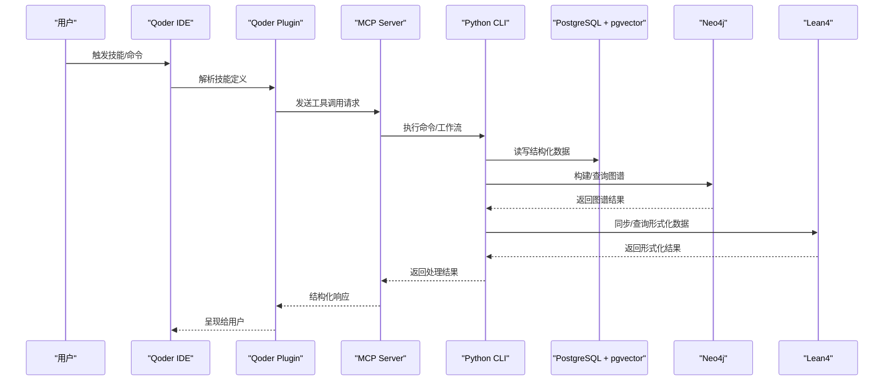
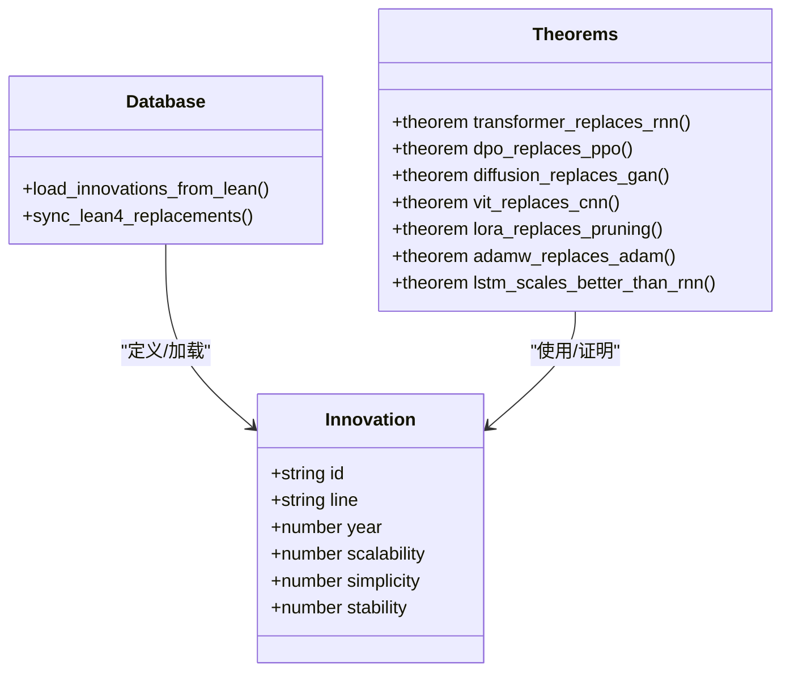
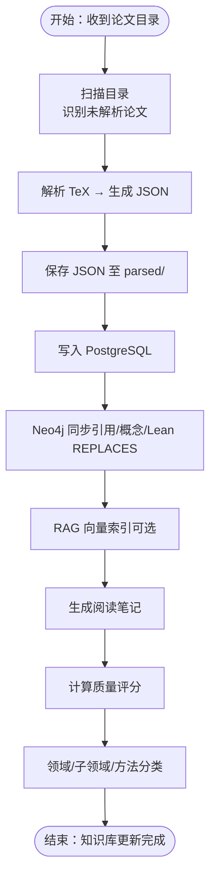
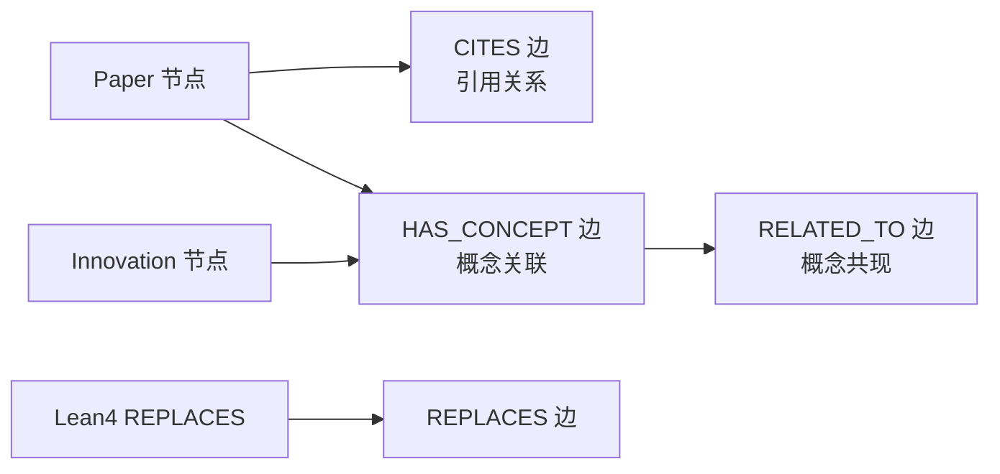
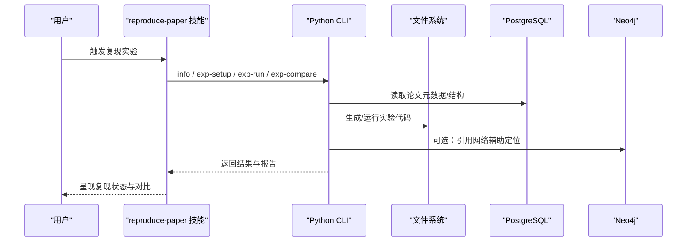
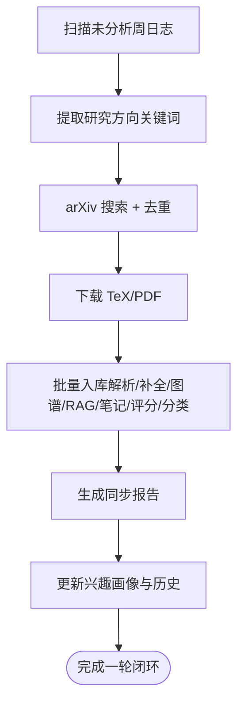
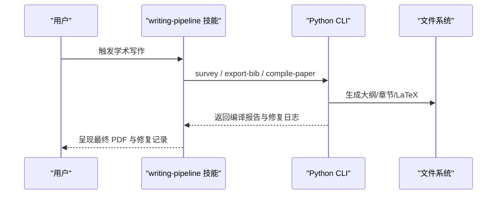
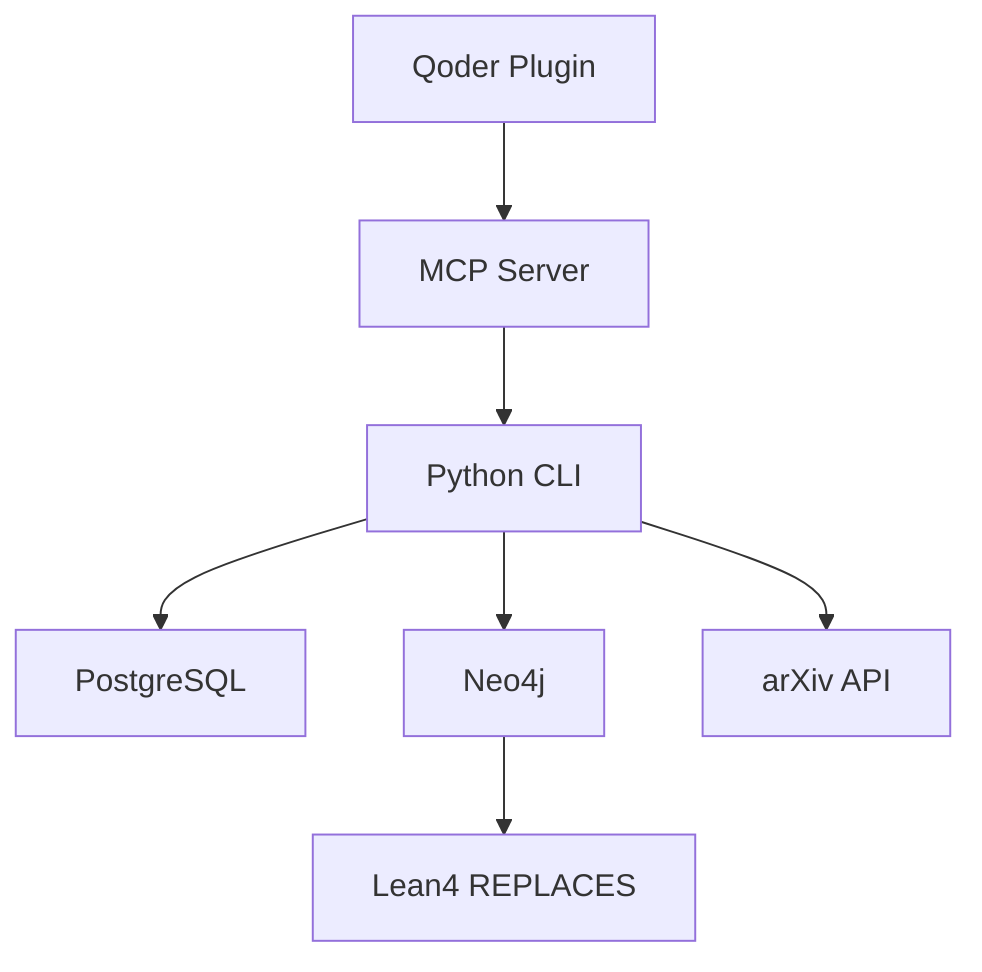

# 核心功能

<cite>
**本文档引用的文件**
- [README.md](file://README.md)
- [AiEvolution.lean](file://LEAN/AiEvolution.lean)
- [Theorems.lean](file://LEAN/AiEvolution/Theorems.lean)
- [cli.py](file://scholar/cli.py)
- [db.py](file://scholar/db.py)
- [graph_db.py](file://scholar/graph_db.py)
- [rag.py](file://scholar/rag.py)
- [research_loop.py](file://scholar/research_loop.py)
- [kb_update.py](file://scholar/kb_update.py)
- [paper-deep-dive/SKILL.md](file://plugin/skills/paper-deep-dive/SKILL.md)
- [reproduce-paper/SKILL.md](file://plugin/skills/reproduce-paper/SKILL.md)
- [writing-pipeline/SKILL.md](file://plugin/skills/writing-pipeline/SKILL.md)
</cite>

## 目录
1. [简介](#简介)
2. [项目结构](#项目结构)
3. [核心组件](#核心组件)
4. [架构总览](#架构总览)
5. [详细组件分析](#详细组件分析)
6. [依赖分析](#依赖分析)
7. [性能考虑](#性能考虑)
8. [故障排除指南](#故障排除指南)
9. [结论](#结论)
10. [附录](#附录)

## 简介
本项目是一个面向人工智能研究的学术研究助手，围绕“将 570 篇 AI 论文的 TeX 源码转化为可查询、可推理、可组合的学术数据层”，提供从调研→精读→对比→写作→追踪的全流程自动化能力。核心能力包括：
- 形式化 AI 演进分析：基于 Lean4 的形式化定理，证明若干代表性创新的演进优势。
- 智能论文处理：论文解析、元数据补全、引用网络与概念图谱构建、RAG 语义检索。
- 知识图谱管理：Neo4j 引用图谱与概念图谱，支持中心性分析与跨论文关系挖掘。
- 实验复现支持：端到端实验复现工作流，从代码生成到结果对比。
- 自适应研究闭环：从对话日志中提取研究方向，自动搜索、下载、入库，形成持续增长的知识库。

## 项目结构
项目采用“Python 后端 + Lean4 形式化层 + Qoder 插件”的分层架构：
- 数据层：PostgreSQL + pgvector（结构化论文数据与向量索引）
- 图谱层：Neo4j（引用图谱 + 概念图谱 + Lean4 REPLACES 关系）
- 应用层：Python CLI 与 MCP Server，提供 35+ 命令与 15 个学术技能
- 形式化层：Lean4 项目，包含基础类型、数据库定义与演进定理证明

```mermaid
graph TB
subgraph "前端与集成"
Qoder["Qoder IDE<br/>Agent + Skills + Hooks"]
Plugin["Qoder Plugin<br/>15 Skills + 6 Commands"]
end
subgraph "应用层"
CLI["Python CLI (35 命令)"]
MCP["MCP Server (43 工具)"]
end
subgraph "数据与存储"
PG["PostgreSQL + pgvector<br/>papers/sections/formulas/citations/chunks"]
Neo4j["Neo4j<br/>papers/concepts/innovations/relations"]
Files["文件系统<br/>data/papers/ + output/"]
end
subgraph "形式化层"
Lean["Lean4 项目<br/>AiEvolution (Basic/Database/Theorems/PDSS)"]
end
Qoder --> Plugin
Plugin --> MCP
MCP --> CLI
CLI --> PG
CLI --> Neo4j
CLI --> Files
Neo4j <- --> Lean
```

**图表来源**
- [README.md: 260-300:260-300](file://README.md#L260-L300)
- [README.md: 365-404:365-404](file://README.md#L365-L404)

**章节来源**
- [README.md: 260-300:260-300](file://README.md#L260-L300)
- [README.md: 365-404:365-404](file://README.md#L365-L404)

## 核心组件
- 论文解析与入库：将 TeX 源码解析为结构化 JSON，写入 PostgreSQL，并同步到 Neo4j。
- 引用网络与概念图谱：构建论文引用关系与概念共现关系，支持中心性分析与跨领域洞察。
- RAG 语义检索：将论文切分为块，生成嵌入并存储至 PostgreSQL pgvector，支持向量 + BM25 混合检索。
- 自适应研究闭环：从对话日志提取研究方向，自动 arXiv 搜索、下载、入库，形成持续增长的知识库。
- 形式化 AI 演进：在 Lean4 中定义创新节点与替换关系，形式化证明若干代表性演进的优劣。

**章节来源**
- [cli.py: 420-476:420-476](file://scholar/cli.py#L420-L476)
- [graph_db.py: 225-280:225-280](file://scholar/graph_db.py#L225-L280)
- [rag.py: 252-289:252-289](file://scholar/rag.py#L252-L289)
- [research_loop.py: 181-285:181-285](file://scholar/research_loop.py#L181-L285)
- [Theorems.lean: 46-128:46-128](file://LEAN/AiEvolution/Theorems.lean#L46-L128)

## 架构总览
系统通过 Python CLI 与 MCP Server 作为统一入口，连接数据库与图数据库，提供论文检索、图谱分析、RAG 搜索、研究方向同步与形式化证明等能力。Qoder 插件将这些能力包装为 15 个学术技能与 6 个快捷命令，实现“所想即所用”。



**图表来源**
- [README.md: 260-300:260-300](file://README.md#L260-L300)
- [plugin/skills/paper-deep-dive/SKILL.md: 11-16:11-16](file://plugin/skills/paper-deep-dive/SKILL.md#L11-L16)
- [plugin/skills/reproduce-paper/SKILL.md: 11-16:11-16](file://plugin/skills/reproduce-paper/SKILL.md#L11-L16)
- [plugin/skills/writing-pipeline/SKILL.md: 11-16:11-16](file://plugin/skills/writing-pipeline/SKILL.md#L11-L16)

## 详细组件分析

### 形式化 AI 演进分析
- 目标：用 Lean4 形式化证明若干代表性 AI 创新的演进关系，确保“替换”创新在至少两个轴上优于其前身（可扩展性、简洁性、稳定性）。
- 实现要点：
  - 定义 Innovation 类型与属性（scalability/simplicity/stability），以及 REPLACES 关系。
  - 在 Database.lean 中声明 125+ 创新节点及其属性。
  - 在 Theorems.lean 中编写定理证明，如 Transformer 替换 RNN、DPO 替换 PPO 等。
  - 通过 lake build 编译并验证，保证无“sorry”。
- 技术价值：
  - 为知识图谱中的 REPLACES 边提供形式化依据，提升因果关系可信度。
  - 为研究方向选择与演进趋势判断提供可验证的数学基础。



**图表来源**
- [graph_db.py: 371-405:371-405](file://scholar/graph_db.py#L371-L405)
- [Theorems.lean: 15-129:15-129](file://LEAN/AiEvolution/Theorems.lean#L15-L129)

**章节来源**
- [graph_db.py: 371-405:371-405](file://scholar/graph_db.py#L371-L405)
- [Theorems.lean: 15-129:15-129](file://LEAN/AiEvolution/Theorems.lean#L15-L129)

### 智能论文处理
- 功能概述：
  - 论文解析：将 TeX 源码解析为标题、摘要、章节、公式、引用等结构化数据。
  - 元数据补全：通过 arXiv API 补全年份、作者、arXiv ID、DOI、会议等。
  - 入库同步：写入 PostgreSQL（papers/sections/formulas/citations），并同步到 Neo4j。
  - 自动生成阅读笔记、质量评分、领域分类。
- 关键流程：



**图表来源**
- [kb_update.py: 216-438:216-438](file://scholar/kb_update.py#L216-L438)
- [cli.py: 471-524:471-524](file://scholar/cli.py#L471-L524)

**章节来源**
- [kb_update.py: 216-438:216-438](file://scholar/kb_update.py#L216-L438)
- [cli.py: 471-524:471-524](file://scholar/cli.py#L471-L524)

### 知识图谱管理
- 引用网络：基于 parsed JSON 中的 citations，构建论文间的 CITES 关系，并将 ref_key 解析为 ULID，计算入度/出度与桥接分数。
- 概念图谱：从 125+ 创新节点出发，匹配论文中的关键词与别名，建立 HAS_CONCEPT 关系，并统计概念共现构建 RELATED_TO 边。
- REPLACES 关系：从 Lean4 Database.lean 动态加载，同步到 Neo4j，形成可验证的演进关系。
- 查询能力：支持引用前后向查询、概念时间线、桥接论文识别、概念子图等。



**图表来源**
- [graph_db.py: 225-280:225-280](file://scholar/graph_db.py#L225-L280)
- [graph_db.py: 636-732:636-732](file://scholar/graph_db.py#L636-L732)
- [graph_db.py: 794-805:794-805](file://scholar/graph_db.py#L794-L805)

**章节来源**
- [graph_db.py: 225-280:225-280](file://scholar/graph_db.py#L225-L280)
- [graph_db.py: 636-732:636-732](file://scholar/graph_db.py#L636-L732)
- [graph_db.py: 794-805:794-805](file://scholar/graph_db.py#L794-L805)

### 实验复现支持
- 端到端流程：
  - 深度阅读：提取算法、实验设置、超参数、数据集。
  - 环境配置：自动检测依赖，创建 Conda 环境。
  - 代码生成：生成训练/评估脚本与配置文件。
  - 数据下载：自动识别并下载所需数据集。
  - 运行实验：支持 quick/full 模式，带超时保护。
  - 结果对比：与论文报告指标对比，生成对比报告。
  - 调试失败：自动诊断常见错误并给出修复建议。
- 技术实现：
  - 与论文 JSON 的 sections/formulas/citations 对齐，确保生成代码与论文描述一致。
  - 通过 CLI 命令链路串联，保证可重复与可观测。



**图表来源**
- [plugin/skills/reproduce-paper/SKILL.md: 11-63:11-63](file://plugin/skills/reproduce-paper/SKILL.md#L11-L63)

**章节来源**
- [plugin/skills/reproduce-paper/SKILL.md: 11-63:11-63](file://plugin/skills/reproduce-paper/SKILL.md#L11-L63)

### 自适应研究闭环
- 核心目标：从对话日志中自动提取研究方向，触发 arXiv 搜索、下载、入库，形成“研究→发现→入库→再研究”的闭环。
- 关键流程：
  - 兴趣管理：维护研究方向画像（关键词、类别、最大结果数、历史记录）。
  - 日志分析：扫描 output/logs/week-*.jsonl，提取未分析周，解析对话文本。
  - 方向同步：对每个方向执行搜索→下载→入库，生成同步报告。
  - 历史追踪：记录每次同步的论文数量、入库情况与错误明细。



**图表来源**
- [research_loop.py: 102-175:102-175](file://scholar/research_loop.py#L102-L175)
- [research_loop.py: 181-285:181-285](file://scholar/research_loop.py#L181-L285)

**章节来源**
- [research_loop.py: 102-175:102-175](file://scholar/research_loop.py#L102-L175)
- [research_loop.py: 181-285:181-285](file://scholar/research_loop.py#L181-L285)

### 学术写作流水线
- 端到端流程：
  - 主题调研：双路搜索（RAG + 关键词 + arXiv），生成调研报告。
  - 阅读笔记：优先选择高质量论文笔记，标注关键引用。
  - 大纲生成：构建论文结构，输出 BibTeX。
  - 逐节撰写：按 Related Work → Introduction → Method → Experiments → Conclusion → Abstract 的顺序增量撰写。
  - 质量门控：检查引用准确性、论证连贯性、篇幅均衡性、Abstract 独立性。
  - LaTeX 编译：执行 pdflatex/xelatex，自动诊断与修复 FATAL/WARN/INFO 错误，最多 3 轮修复。
- 技术价值：
  - 将“写作”标准化为可重复的工作流，降低学术写作门槛。
  - 通过质量门控与编译修复闭环，显著提升论文质量与交付效率。



**图表来源**
- [plugin/skills/writing-pipeline/SKILL.md: 11-121:11-121](file://plugin/skills/writing-pipeline/SKILL.md#L11-L121)

**章节来源**
- [plugin/skills/writing-pipeline/SKILL.md: 11-121:11-121](file://plugin/skills/writing-pipeline/SKILL.md#L11-L121)

## 依赖分析
- 组件耦合：
  - CLI 与数据库层（PostgreSQL）：通过统一的 Database 类封装，支持文件模式回退。
  - CLI 与图数据库层（Neo4j）：通过 GraphDB 类封装，提供连接与查询能力。
  - 图谱与形式化层：Neo4j 中的 REPLACES 边与 Lean4 Database.lean 动态同步。
- 外部依赖：
  - PostgreSQL + pgvector：结构化数据与向量检索。
  - Neo4j：图谱存储与查询。
  - arXiv API：论文元数据补全与批量下载。
  - Qoder 插件与 MCP Server：技能与命令的桥接层。



**图表来源**
- [db.py: 24-127:24-127](file://scholar/db.py#L24-L127)
- [graph_db.py: 32-69:32-69](file://scholar/graph_db.py#L32-L69)
- [kb_update.py: 88-213:88-213](file://scholar/kb_update.py#L88-L213)

**章节来源**
- [db.py: 24-127:24-127](file://scholar/db.py#L24-L127)
- [graph_db.py: 32-69:32-69](file://scholar/graph_db.py#L32-L69)
- [kb_update.py: 88-213:88-213](file://scholar/kb_update.py#L88-L213)

## 性能考虑
- 向量检索性能：
  - 使用 HNSW 索引（cosine 距离）加速近似最近邻搜索。
  - 混合检索（向量 + BM25 + RRF）在召回与排序之间取得平衡。
- 批处理与并发：
  - 论文解析、嵌入生成、入库均采用批处理与进度反馈，减少 IO 开销。
  - arXiv 下载与入库之间设置速率限制，避免 API 限流。
- 数据库优化：
  - PostgreSQL 使用 upsert 与批量插入，减少事务开销。
  - Neo4j 采用 MERGE 与批量写入，降低重复创建成本。

[本节为通用性能讨论，不直接分析具体文件]

## 故障排除指南
- Docker 容器启动失败：
  - 检查 Docker 状态与端口占用（5433/7474/7687），必要时调整映射。
- PostgreSQL 连接超时：
  - 确认端口为 5433（避免与本地实例冲突），检查凭据。
- RAG 搜索无结果：
  - 确认环境变量 SCHOLAR_EMBEDDING_API_KEY，或使用混合检索回退。
- Bootstrap 中断恢复：
  - 重新运行 bootstrap，已完成步骤会被跳过；如需重跑某步，可单独执行对应命令。
- 测试失败：
  - 确保依赖完整；若数据库未运行，部分测试会跳过，可仅运行不依赖数据库的测试。

**章节来源**
- [README.md: 590-651:590-651](file://README.md#L590-L651)

## 结论
本项目通过“形式化证明 + 结构化数据 + 图谱与检索 + 自动化工作流”的协同，实现了从“被动记录”到“主动发现再到自动入库”的研究闭环。它不仅提升了论文处理与检索效率，还为 AI 领域的演进分析提供了可验证的形式化基础，适合研究人员、工程团队与学生在学术写作、实验复现与知识管理场景中高效使用。

[本节为总结性内容，不直接分析具体文件]

## 附录
- 快速开始与常用命令参考见项目 README 的“命令参考”与“一键开始”部分。
- 插件能力与技能列表见 README 的“Qoder Plugin”与“15 个学术 Skills”部分。

**章节来源**
- [README.md: 317-361:317-361](file://README.md#L317-L361)
- [README.md: 150-186:150-186](file://README.md#L150-L186)
- [README.md: 497-525:497-525](file://README.md#L497-L525)