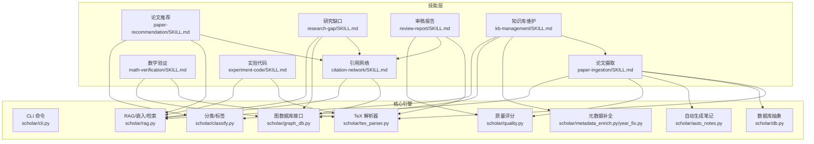
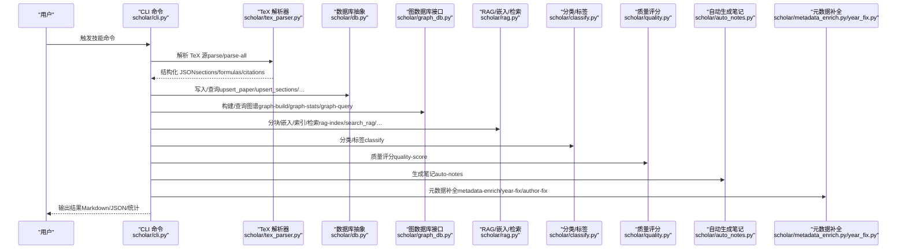
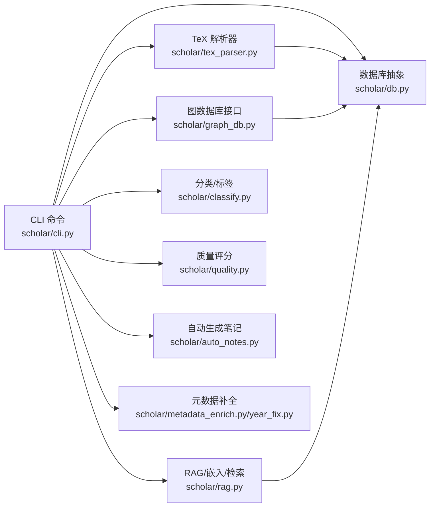

# 原子技能

<cite>
**本文档引用的文件**
- [plugin/skills/paper-ingestion/SKILL.md](file://plugin/skills/paper-ingestion/SKILL.md)
- [plugin/skills/math-verification/SKILL.md](file://plugin/skills/math-verification/SKILL.md)
- [plugin/skills/paper-recommendation/SKILL.md](file://plugin/skills/paper-recommendation/SKILL.md)
- [plugin/skills/citation-network/SKILL.md](file://plugin/skills/citation-network/SKILL.md)
- [plugin/skills/research-gap/SKILL.md](file://plugin/skills/research-gap/SKILL.md)
- [plugin/skills/review-report/SKILL.md](file://plugin/skills/review-report/SKILL.md)
- [plugin/skills/kb-management/SKILL.md](file://plugin/skills/kb-management/SKILL.md)
- [plugin/skills/experiment-code/SKILL.md](file://plugin/skills/experiment-code/SKILL.md)
- [scholar/__main__.py](file://scholar/__main__.py)
- [scholar/cli.py](file://scholar/cli.py)
- [scholar/db.py](file://scholar/db.py)
- [scholar/graph_db.py](file://scholar/graph_db.py)
- [scholar/tex_parser.py](file://scholar/tex_parser.py)
- [scholar/metadata_enrich.py](file://scholar/metadata_enrich.py)
- [scholar/year_fix.py](file://scholar/year_fix.py)
- [scholar/classify.py](file://scholar/classify.py)
- [scholar/rag.py](file://scholar/rag.py)
- [scholar/auto_notes.py](file://scholar/auto_notes.py)
- [scholar/quality.py](file://scholar/quality.py)
- [scholar/config.py](file://scholar/config.py)
</cite>

## 目录
1. [简介](#简介)
2. [项目结构](#项目结构)
3. [核心组件](#核心组件)
4. [架构总览](#架构总览)
5. [详细组件分析](#详细组件分析)
6. [依赖分析](#依赖分析)
7. [性能考虑](#性能考虑)
8. [故障排除指南](#故障排除指南)
9. [结论](#结论)
10. [附录](#附录)

## 简介
本文件系统化梳理 Scholar Studio 的 8 个原子技能，围绕“论文摄取、数学验证、论文推荐、引用网络、研究缺口、审稿报告、入门引导、实验代码”八个能力域，阐述其核心功能、技术实现、输入输出、配置参数、性能特征与最佳实践，并提供使用示例与故障排除建议。每个技能均与底层 CLI、解析器、数据库与图数据库模块紧密耦合，形成从“入库—预处理—检索—分析—生成”的闭环。

## 项目结构
- 技能层位于 plugin/skills/*，每个技能以 SKILL.md 描述触发条件、流程、注意事项与后续步骤。
- 核心引擎位于 scholar/*，提供命令行入口、CLI 命令、数据库抽象、图数据库接口、TeX 解析、RAG、分类、质量评分、自动生成笔记等能力。
- 配置层位于 scholar/config.py，统一管理数据库、图数据库、嵌入模型、arXiv API 等外部服务参数。

**图表来源**
- [plugin/skills/paper-ingestion/SKILL.md:1-85](file://plugin/skills/paper-ingestion/SKILL.md#L1-L85)
- [plugin/skills/math-verification/SKILL.md:1-101](file://plugin/skills/math-verification/SKILL.md#L1-L101)
- [plugin/skills/paper-recommendation/SKILL.md:1-96](file://plugin/skills/paper-recommendation/SKILL.md#L1-L96)
- [plugin/skills/citation-network/SKILL.md:1-101](file://plugin/skills/citation-network/SKILL.md#L1-L101)
- [plugin/skills/research-gap/SKILL.md:1-105](file://plugin/skills/research-gap/SKILL.md#L1-L105)
- [plugin/skills/review-report/SKILL.md:1-116](file://plugin/skills/review-report/SKILL.md#L1-L116)
- [plugin/skills/kb-management/SKILL.md:1-59](file://plugin/skills/kb-management/SKILL.md#L1-L59)
- [plugin/skills/experiment-code/SKILL.md:1-111](file://plugin/skills/experiment-code/SKILL.md#L1-L111)
- [scholar/cli.py:1-800](file://scholar/cli.py#L1-L800)
- [scholar/db.py:1-276](file://scholar/db.py#L1-L276)
- [scholar/graph_db.py:1-800](file://scholar/graph_db.py#L1-L800)
- [scholar/tex_parser.py:1-800](file://scholar/tex_parser.py#L1-L800)
- [scholar/rag.py:1-582](file://scholar/rag.py#L1-L582)
- [scholar/classify.py:1-328](file://scholar/classify.py#L1-L328)
- [scholar/quality.py:1-432](file://scholar/quality.py#L1-L432)
- [scholar/auto_notes.py:1-355](file://scholar/auto_notes.py#L1-L355)
- [scholar/metadata_enrich.py:1-217](file://scholar/metadata_enrich.py#L1-L217)
- [scholar/year_fix.py:1-420](file://scholar/year_fix.py#L1-L420)

**章节来源**
- [scholar/__main__.py:1-8](file://scholar/__main__.py#L1-L8)
- [scholar/cli.py:1-800](file://scholar/cli.py#L1-L800)
- [scholar/config.py:1-116](file://scholar/config.py#L1-L116)

## 核心组件
- CLI 命令体系：集中于 scholar/cli.py，提供 scan、parse、parse-all、info、search、list-papers、stats、export-bib、graph-build、graph-stats、graph-query、arxiv-search、year-fix、author-fix、metadata-enrich、rag-index 等命令，贯穿技能生命周期。
- 数据库抽象：scholar/db.py 提供 PostgreSQL 接口与文件回退模式，统一存储论文、章节、公式、引用等结构化数据。
- 图数据库接口：scholar/graph_db.py 提供 Neo4j 连接、引用网络构建与查询、概念图谱构建与查询、Lean4 替代关系同步。
- TeX 解析器：scholar/tex_parser.py 递归解析 TeX 输入、提取标题/作者/年份/摘要/章节/公式/引用，支持多种宏与会议格式。
- RAG/嵌入/检索：scholar/rag.py 提供分块、嵌入、向量索引、混合检索（向量+BM25+RRF）与增量索引。
- 分类/标签：scholar/classify.py 基于规则与关键词匹配进行多级标签分类。
- 质量评分：scholar/quality.py 7 维度评分（元数据、结构、引用、可复现性、问题定义、创新、实验严谨性）。
- 自动生成笔记：scholar/auto_notes.py 生成结构化阅读笔记。
- 元数据补全：scholar/metadata_enrich.py/year_fix.py 通过 arXiv API 补全 arXiv ID、DOI、年份与作者。

**章节来源**
- [scholar/cli.py:1-800](file://scholar/cli.py#L1-L800)
- [scholar/db.py:1-276](file://scholar/db.py#L1-L276)
- [scholar/graph_db.py:1-800](file://scholar/graph_db.py#L1-L800)
- [scholar/tex_parser.py:1-800](file://scholar/tex_parser.py#L1-L800)
- [scholar/rag.py:1-582](file://scholar/rag.py#L1-L582)
- [scholar/classify.py:1-328](file://scholar/classify.py#L1-L328)
- [scholar/quality.py:1-432](file://scholar/quality.py#L1-L432)
- [scholar/auto_notes.py:1-355](file://scholar/auto_notes.py#L1-L355)
- [scholar/metadata_enrich.py:1-217](file://scholar/metadata_enrich.py#L1-L217)
- [scholar/year_fix.py:1-420](file://scholar/year_fix.py#L1-L420)

## 架构总览
下图展示技能与核心引擎的交互关系，以及数据流与控制流：

**图表来源**
- [scholar/cli.py:1-800](file://scholar/cli.py#L1-L800)
- [scholar/tex_parser.py:1-800](file://scholar/tex_parser.py#L1-L800)
- [scholar/db.py:1-276](file://scholar/db.py#L1-L276)
- [scholar/graph_db.py:1-800](file://scholar/graph_db.py#L1-L800)
- [scholar/rag.py:1-582](file://scholar/rag.py#L1-L582)
- [scholar/classify.py:1-328](file://scholar/classify.py#L1-L328)
- [scholar/quality.py:1-432](file://scholar/quality.py#L1-L432)
- [scholar/auto_notes.py:1-355](file://scholar/auto_notes.py#L1-L355)
- [scholar/metadata_enrich.py:1-217](file://scholar/metadata_enrich.py#L1-L217)
- [scholar/year_fix.py:1-420](file://scholar/year_fix.py#L1-L420)

## 详细组件分析

### 论文摄取技能（paper-ingestion）
- 核心功能：扫描、解析并导入论文到知识库，支持增量入库、元数据补全、批量预处理与统计校验。
- 技术实现要点：
  - 使用 TeX 解析器递归解析输入文件，提取标题/作者/年份/摘要/章节/公式/引用。
  - 将解析结果写入文件系统（output/parsed/*.json），并可选写入 PostgreSQL。
  - 通过 graph-build 构建引用网络与概念图谱，通过 rag-index 构建向量索引。
  - 通过 year-fix/author-fix/metadata-enrich 补全缺失元数据。
  - 通过 auto-notes、quality-score、classify 生成预计算数据。
- 输入输出与配置：
  - 输入：data/papers/<ULID>/ 目录下的 source.tar.gz 或 PDF；环境变量（PostgreSQL/Neo4j/嵌入API）。
  - 输出：output/parsed/<ULID>.json、output/notes/<ULID>.md、output/notes/<ULID>-quality.json、Neo4j 图谱、pgvector 索引。
  - 关键命令：scan、parse、parse-all、stats、graph-build、rag-index、year-fix、author-fix、metadata-enrich、auto-notes、quality-score、classify。
- 性能与最佳实践：
  - 批量解析采用进度条与分片处理，失败项单独记录，避免阻塞整体流程。
  - 建议先启动数据库与图数据库容器，以便解析结果同步写入。
  - 增量入库时仅对新增目录执行 parse，随后 stats 校验入库数量与覆盖率。
- 使用示例：
  - 入库：python -m scholar scan → python -m scholar parse-all → python -m scholar stats
  - 增量：python -m scholar parse <ULID> → python -m scholar stats
- 故障排除：
  - 缺失 source.tar.gz：使用 PDF 元数据提取工具（见 SKILL.md）。
  - 解析失败：使用 python -m scholar info <ULID> 定位问题。
  - 数据库不可用：程序自动降级为文件模式，仍可生成 JSON 与笔记。

**章节来源**
- [plugin/skills/paper-ingestion/SKILL.md:1-85](file://plugin/skills/paper-ingestion/SKILL.md#L1-L85)
- [scholar/cli.py:46-237](file://scholar/cli.py#L46-L237)
- [scholar/tex_parser.py:214-286](file://scholar/tex_parser.py#L214-L286)
- [scholar/db.py:170-176](file://scholar/db.py#L170-L176)
- [scholar/graph_db.py:225-281](file://scholar/graph_db.py#L225-L281)
- [scholar/rag.py:471-548](file://scholar/rag.py#L471-L548)
- [scholar/year_fix.py:165-239](file://scholar/year_fix.py#L165-L239)
- [scholar/metadata_enrich.py:166-217](file://scholar/metadata_enrich.py#L166-L217)
- [scholar/auto_notes.py:282-327](file://scholar/auto_notes.py#L282-L327)
- [scholar/quality.py:363-402](file://scholar/quality.py#L363-L402)
- [scholar/classify.py:245-275](file://scholar/classify.py#L245-L275)

### 数学验证技能（math-verification）
- 核心功能：对论文中的数学公式与定理进行语义分析与形式化验证，结合 Lean4 形式化库进行对照与编译验证。
- 技术实现要点：
  - 从 output/parsed/<ULID>.json 提取公式上下文（LaTeX、所在章节、前后文）。
  - 语义分析：符号含义、维度一致性、极限情形、不等式方向、特殊值代入。
  - 对照 Neo4j 中的 Innovation 节点与 Lean4 Database.lean 中的形式化定义。
  - 在 Lean4 项目中尝试形式化与证明，编译通过后生成验证报告。
- 输入输出与配置：
  - 输入：ULID 或数学命题；Lean4 项目（AiEvolution）；Neo4j。
  - 输出：output/notes/math-verify-<paper_id>.md 或 <formula_label>.md。
  - 关键命令：graph-query、grep Lean4 定义、lake build。
- 性能与最佳实践：
  - 并非所有公式都适合形式化，优先核心 AI 演化定理。
  - 编译失败需记录失败原因，避免“已证明”的误判。
- 使用示例：
  - 定位公式 → 语义分析 → Lean4 对照 → 形式化尝试 → 编译验证 → 生成报告。
- 故障排除：
  - Neo4j 不可用：仅进行语义分析与 PDF 元数据提取。
  - Lean4 未安装：跳过形式化步骤，保留语义分析结果。

**章节来源**
- [plugin/skills/math-verification/SKILL.md:1-101](file://plugin/skills/math-verification/SKILL.md#L1-L101)
- [scholar/graph_db.py:371-440](file://scholar/graph_db.py#L371-L440)
- [scholar/year_fix.py:19-84](file://scholar/year_fix.py#L19-L84)

### 论文推荐技能（paper-recommendation）
- 核心功能：基于引用网络、研究方向或阅读缺口进行智能推荐，输出结构化推荐列表。
- 技术实现要点：
  - 场景识别：基于引用关系、基于方向、基于阅读缺口。
  - 引用网络：使用 graph-stats 与 centrality 数据（in_degree/out_degree/bridge_score）。
  - 方向推荐：结合分类标签与 RAG 混合检索（向量+BM25）。
  - 阅读缺口：基于已读论文列表识别缺失环节、概念图谱覆盖与时间线空白。
  - 排序与说明：必读/推荐/可选三档，附关系与难度说明。
- 输入输出与配置：
  - 输入：ULID 或方向关键词；Neo4j、RAG 索引。
  - 输出：output/notes/recommendations-<topic>.md。
  - 关键命令：cite-network、graph-query、search、rag-search、classify、list-papers。
- 性能与最佳实践：
  - 推荐需基于实际数据，避免主观臆断。
  - 对库外论文明确标注并提供 arXiv 链接。
- 使用示例：
  - 基于引用：cite-network <ULID> → graph-stats → 生成推荐。
  - 基于方向：search/rag-search/classify → 生成推荐。
  - 基于缺口：list-papers → 识别缺失 → 生成推荐。
- 故障排除：
  - Neo4j 未启动：使用 citations 字段手动分析，功能受限。

**章节来源**
- [plugin/skills/paper-recommendation/SKILL.md:1-96](file://plugin/skills/paper-recommendation/SKILL.md#L1-L96)
- [scholar/cli.py:660-791](file://scholar/cli.py#L660-L791)
- [scholar/graph_db.py:287-365](file://scholar/graph_db.py#L287-L365)
- [scholar/rag.py:383-421](file://scholar/rag.py#L383-L421)
- [scholar/classify.py:245-328](file://scholar/classify.py#L245-L328)

### 引用网络技能（citation-network）
- 核心功能：分析引用网络，识别关键论文与桥接节点，构建领域发展时间线。
- 技术实现要点：
  - 全局统计：Paper/Innovation 节点数、CITES/HAS_CONCEPT/REPLACES/RELATED_TO 边数、孤立节点、Top 10 被引与桥接论文。
  - 单论文分析：后向引用（前置知识）、前向引用（学术影响）、引用深度。
  - 概念关联：graph-query 查询概念关联、共现与时间分布。
  - 关键节点识别：in_degree、out_degree、bridge_score。
  - 时间线：按年份梳理引用关系与关键事件。
- 输入输出与配置：
  - 输入：Neo4j；graph-build 已执行。
  - 输出：output/drafts/citation-network-<topic>.md。
  - 关键命令：graph-stats、cite-network、graph-query、list-papers。
- 性能与最佳实践：
  - 引用网络质量取决于 citations 字段覆盖率。
  - 部分库外论文需结合 arXiv 补充。
- 使用示例：
  - graph-stats → cite-network <ULID> → graph-query → 生成网络分析。
- 故障排除：
  - Neo4j 未启动：仅能基于 JSON 手动分析。

**章节来源**
- [plugin/skills/citation-network/SKILL.md:1-101](file://plugin/skills/citation-network/SKILL.md#L1-L101)
- [scholar/cli.py:660-791](file://scholar/cli.py#L660-L791)
- [scholar/graph_db.py:180-223](file://scholar/graph_db.py#L180-L223)

### 研究缺口技能（research-gap）
- 核心功能：通过跨论文局限性分析发现研究空白，区分高置信度、中等置信度与探索性方向。
- 技术实现要点：
  - 确定分析范围：领域/子方向、特定论文、理论/方法/应用缺口偏好。
  - 收集局限性：从预生成笔记与 JSON 中提取“Core Contributions”“limitations/future work”等。
  - 交叉分析：共识缺口、矛盾缺口、盲区缺口。
  - 引用网络辅助：概念研究论文最少、概念间关联最弱、引用链断裂。
  - 概念演化：REPLACES 边分析替代关系与潜在方向。
  - arXiv 最新动态验证：确认是否已有填补工作。
- 输入输出与配置：
  - 输入：Neo4j、RAG；arXiv API。
  - 输出：output/drafts/research-gaps-<topic>.md。
  - 关键命令：graph-query、cite-network、graph-stats、arxiv-search。
- 性能与最佳实践：
  - 每个缺口需有证据支撑，区分“无人做”与“库外有但未入库”。
- 使用示例：
  - search/classify → 提取局限性 → 交叉分析 → 引用网络辅助 → arXiv 验证 → 生成缺口报告。
- 故障排除：
  - 缺口发现需基于论文实际内容，避免臆测。

**章节来源**
- [plugin/skills/research-gap/SKILL.md:1-105](file://plugin/skills/research-gap/SKILL.md#L1-L105)
- [scholar/cli.py:605-658](file://scholar/cli.py#L605-L658)
- [scholar/graph_db.py:581-732](file://scholar/graph_db.py#L581-L732)

### 审稿报告技能（review-report）
- 核心功能：撰写结构化同行评审报告，包含评分与改进建议。
- 技术实现要点：
  - 定位并深度阅读：quality-score、info、完整 JSON 与预生成笔记。
  - 评估贡献：新颖性、重要性、完整性。
  - 方法论审查：假设合理性、数学正确性、方法对比、消融实验。
  - 实验审查：数据集、指标、统计显著性、可复现性。
  - 写作质量审查：结构、图表、引用、语言。
  - 对照引用网络：引用是否准确、是否遗漏重要工作。
  - Lean4 形式化对照（如适用）。
- 输入输出与配置：
  - 输入：ULID；Neo4j、RAG。
  - 输出：output/notes/review-<paper_id>.md。
  - 关键命令：quality-score、info、cite-network、export-bib。
- 性能与最佳实践：
  - 审稿需客观公正，批评应具建设性。
- 使用示例：
  - quality-score → info → 方法论/实验审查 → 引用网络对照 → 生成报告。
- 故障排除：
  - 发现重大错误（如数学推导错误）需重点指出。

**章节来源**
- [plugin/skills/review-report/SKILL.md:1-116](file://plugin/skills/review-report/SKILL.md#L1-L116)
- [scholar/cli.py:132-171](file://scholar/cli.py#L132-L171)
- [scholar/quality.py:317-357](file://scholar/quality.py#L317-L357)

### 知识库维护技能（kb-management）
- 核心功能：知识库健康检查、自动更新、元数据回填、缺失字段补全、引用解析与图谱同步、RAG 索引同步。
- 技术实现要点：
  - 健康检查：stats、scan。
  - 自动更新：kb-update（arXiv 搜索 → 下载 TeX → 批量入库）。
  - 元数据回填：metadata-enrich（arXiv 标题搜索）。
  - 缺失字段补全：year-fix、author-fix。
  - 引用解析与图谱同步：cite-resolve、graph-build。
  - RAG 索引同步：rag-index。
- 输入输出与配置：
  - 输入：arXiv API、Neo4j、PostgreSQL。
  - 输出：维护报告；同步后的图谱与索引。
  - 关键命令：stats、kb-update、metadata-enrich、year-fix、author-fix、cite-resolve、graph-build、rag-index。
- 性能与最佳实践：
  - 保持图谱与索引与数据一致，定期同步。
- 使用示例：
  - stats → kb-update --query "<topic>" --max 10 → graph-build → rag-index。
- 故障排除：
  - arXiv API 速率限制：遵循延迟策略。

**章节来源**
- [plugin/skills/kb-management/SKILL.md:1-59](file://plugin/skills/kb-management/SKILL.md#L1-L59)
- [scholar/cli.py:527-658](file://scholar/cli.py#L527-L658)
- [scholar/metadata_enrich.py:166-217](file://scholar/metadata_enrich.py#L166-L217)
- [scholar/year_fix.py:262-304](file://scholar/year_fix.py#L262-L304)
- [scholar/graph_db.py:663-706](file://scholar/graph_db.py#L663-L706)
- [scholar/rag.py:471-548](file://scholar/rag.py#L471-L548)

### 实验代码技能（experiment-code）
- 核心功能：根据论文方法与公式生成 PyTorch 实验代码，支持复现实验与扩展。
- 技术实现要点：
  - 深度阅读：info、quality-score、完整 JSON。
  - 提取算法要素：输入/输出、核心循环、损失函数、优化目标。
  - 确定技术栈：框架偏好、库依赖、运行环境。
  - 生成代码结构：model/data/train/evaluate/config/requirements/README。
  - 逐步实现：config → model → data → train → evaluate。
  - 验证代码：公式一致性、维度匹配、小数据集 dry-run。
  - 生成说明文档：对应论文章节/公式注释、运行方式、差异与已知问题。
- 输入输出与配置：
  - 输入：ULID；RAG 检索辅助实现。
  - 输出：output/experiments/<paper_id>/ 下的完整实验工程。
  - 关键命令：info、rag-search、quality-score。
- 性能与最佳实践：
  - 严格标注公式对应论文编号；对歧义方法选择合理解释并标注。
  - 不要声称“完全复现”，除非实际运行结果一致。
- 使用示例：
  - info → 提取方法要素 → 确定技术栈 → 生成代码结构 → 逐步实现 → 验证 → 生成说明。
- 故障排除：
  - 依赖特定硬件/数据的方法需说明限制条件。

**章节来源**
- [plugin/skills/experiment-code/SKILL.md:1-111](file://plugin/skills/experiment-code/SKILL.md#L1-L111)
- [scholar/cli.py:242-306](file://scholar/cli.py#L242-L306)
- [scholar/rag.py:383-421](file://scholar/rag.py#L383-L421)
- [scholar/quality.py:317-357](file://scholar/quality.py#L317-L357)

### 入门引导技能（入门引导）
- 说明：本技能为概念性能力，旨在帮助新用户快速上手。典型流程包括：
  - 安装与环境准备：PostgreSQL、Neo4j、Lean4、嵌入模型 API。
  - 初始化知识库：下载/更新论文 → 入库 → 预处理 → 图谱与索引同步。
  - 快速体验：scan → parse → stats → info → auto-notes → quality-score。
  - 常用技能串联：paper-ingestion → paper-recommendation → review-report。
- 输入输出与配置：
  - 输入：本地数据目录、环境变量。
  - 输出：结构化 JSON、笔记、报告、图谱与索引。
- 性能与最佳实践：
  - 建议先执行 paper-ingestion 完成标准化处理，再使用其他技能。
- 使用示例：
  - docker compose up neo4j/postgres → python -m scholar kb-update --query "transformer" --max 10 → 生成推荐/审稿报告。

**章节来源**
- [plugin/skills/paper-ingestion/SKILL.md:65-85](file://plugin/skills/paper-ingestion/SKILL.md#L65-L85)
- [plugin/skills/kb-management/SKILL.md:18-27](file://plugin/skills/kb-management/SKILL.md#L18-L27)
- [plugin/skills/paper-recommendation/SKILL.md:88-96](file://plugin/skills/paper-recommendation/SKILL.md#L88-L96)
- [plugin/skills/review-report/SKILL.md:107-116](file://plugin/skills/review-report/SKILL.md#L107-L116)

## 依赖分析
- 组件耦合与内聚：
  - CLI 是统一入口，围绕其构建命令生态，内聚度高。
  - 数据层（db.py）与图层（graph_db.py）为多技能共享基础设施，耦合度中等。
  - 解析器（tex_parser.py）与预处理（auto_notes.py、quality.py、classify.py）构成数据管线，内聚度高。
  - RAG（rag.py）与 arXiv API（year_fix.py/metadata_enrich.py）提供检索与元数据增强能力。
- 外部依赖：
  - PostgreSQL（psycopg2）、Neo4j（python-driver）、arXiv API、嵌入模型 API（智谱/OpenAI）。
- 潜在循环依赖：
  - 技能与 CLI 之间为单向依赖，无循环。
  - 解析器与数据库为单向依赖，无循环。

**图表来源**
- [scholar/cli.py:1-800](file://scholar/cli.py#L1-L800)
- [scholar/db.py:1-276](file://scholar/db.py#L1-L276)
- [scholar/graph_db.py:1-800](file://scholar/graph_db.py#L1-L800)
- [scholar/tex_parser.py:1-800](file://scholar/tex_parser.py#L1-L800)
- [scholar/rag.py:1-582](file://scholar/rag.py#L1-L582)
- [scholar/classify.py:1-328](file://scholar/classify.py#L1-L328)
- [scholar/quality.py:1-432](file://scholar/quality.py#L1-L432)
- [scholar/auto_notes.py:1-355](file://scholar/auto_notes.py#L1-L355)
- [scholar/metadata_enrich.py:1-217](file://scholar/metadata_enrich.py#L1-L217)
- [scholar/year_fix.py:1-420](file://scholar/year_fix.py#L1-L420)

**章节来源**
- [scholar/cli.py:1-800](file://scholar/cli.py#L1-L800)
- [scholar/db.py:1-276](file://scholar/db.py#L1-L276)
- [scholar/graph_db.py:1-800](file://scholar/graph_db.py#L1-L800)
- [scholar/tex_parser.py:1-800](file://scholar/tex_parser.py#L1-L800)
- [scholar/rag.py:1-582](file://scholar/rag.py#L1-L582)
- [scholar/classify.py:1-328](file://scholar/classify.py#L1-L328)
- [scholar/quality.py:1-432](file://scholar/quality.py#L1-L432)
- [scholar/auto_notes.py:1-355](file://scholar/auto_notes.py#L1-L355)
- [scholar/metadata_enrich.py:1-217](file://scholar/metadata_enrich.py#L1-L217)
- [scholar/year_fix.py:1-420](file://scholar/year_fix.py#L1-L420)

## 性能考虑
- 批处理与并发：
  - parse-all 采用进度条与分片处理，失败项单独记录，避免阻塞整体。
  - rag.index_all_papers 支持批量化嵌入与 HNSW 索引创建。
- 索引与检索：
  - pgvector HNSW 索引提升向量检索性能；BM25 作为轻量关键字检索。
  - hybrid 搜索（RRF）融合向量与 BM25，平衡召回与精度。
- 数据库与图数据库：
  - PostgreSQL 与 Neo4j 的连接池与事务管理减少开销。
  - graph-build 分步执行（节点创建、边创建、中心度计算、概念图谱、替换关系同步）。
- API 速率限制：
  - arXiv API 请求遵循延迟策略，避免被限流。

**章节来源**
- [scholar/cli.py:176-237](file://scholar/cli.py#L176-L237)
- [scholar/rag.py:471-548](file://scholar/rag.py#L471-L548)
- [scholar/graph_db.py:663-706](file://scholar/graph_db.py#L663-L706)
- [scholar/metadata_enrich.py:166-217](file://scholar/metadata_enrich.py#L166-L217)

## 故障排除指南
- 入库与解析：
  - 缺少 source.tar.gz：使用 PDF 元数据提取工具（参见 paper-ingestion 技能）。
  - 解析失败：使用 info 命令查看 JSON 内容，定位问题章节/公式。
- 数据库与图数据库：
  - PostgreSQL/Neo4j 不可用：程序自动降级为文件模式；启动容器后再执行相应命令。
  - 图谱构建失败：检查 graph-build 输出与 resolve_ref_keys 结果。
- 检索与索引：
  - RAG 索引为空：执行 rag-index；确认嵌入模型 API Key 正确。
  - hybrid 搜索效果差：调整 k_vector/k_bm25 参数或重建索引。
- 元数据补全：
  - arXiv API 失败：检查代理与超时设置；适当增加延迟。
- 质量评分与分类：
  - 评分异常：检查 sections/formulas/citations 字段完整性。
  - 分类不准：调整关键词或 venue 提示。

**章节来源**
- [plugin/skills/paper-ingestion/SKILL.md:27-36](file://plugin/skills/paper-ingestion/SKILL.md#L27-L36)
- [scholar/cli.py:660-706](file://scholar/cli.py#L660-L706)
- [scholar/rag.py:252-289](file://scholar/rag.py#L252-L289)
- [scholar/metadata_enrich.py:60-110](file://scholar/metadata_enrich.py#L60-L110)
- [scholar/quality.py:317-357](file://scholar/quality.py#L317-L357)
- [scholar/classify.py:161-239](file://scholar/classify.py#L161-L239)

## 结论
Scholar Studio 的 8 个原子技能围绕“论文摄取—预处理—检索—分析—生成”闭环构建，既保证了强功能（如引用网络、研究缺口、审稿报告），也兼顾了易用性（如入门引导、实验代码、知识库维护）。通过 CLI 命令与底层引擎的协同，用户可以高效完成从论文入库到生成高质量报告与实验代码的全流程任务。建议在生产环境中优先完成数据库与图数据库的初始化，配合 RAG 索引与 Lean4 形式化库，以获得最佳体验。

## 附录
- 常用命令清单（来自 CLI）：
  - 入库与解析：scan、parse、parse-all、info、stats
  - 图谱：graph-build、graph-stats、graph-query、cite-network
  - 检索：search、rag-search、rag-index
  - 元数据：year-fix、author-fix、metadata-enrich
  - 预处理：auto-notes、quality-score、classify
  - 知识库：kb-update、batch-ingest、export-bib
- 环境变量（来自 config.py）：
  - PostgreSQL：SCHOLAR_PG_HOST、SCHOLAR_PG_PORT、SCHOLAR_PG_NAME、SCHOLAR_PG_USER、SCHOLAR_PG_PASS
  - Neo4j：SCHOLAR_NEO4J_URI、SCHOLAR_NEO4J_USER、SCHOLAR_NEO4J_PASS
  - 嵌入模型：SCHOLAR_EMBEDDING_PROVIDER、SCHOLAR_EMBEDDING_MODEL、SCHOLAR_EMBEDDING_DIM、SCHOLAR_EMBEDDING_API_KEY
  - arXiv API：SCHOLAR_ARXIV_TIMEOUT、SCHOLAR_ARXIV_RETRIES、HTTP_PROXY/HTTPS_PROXY

**章节来源**
- [scholar/cli.py:1-800](file://scholar/cli.py#L1-L800)
- [scholar/config.py:41-116](file://scholar/config.py#L41-L116)