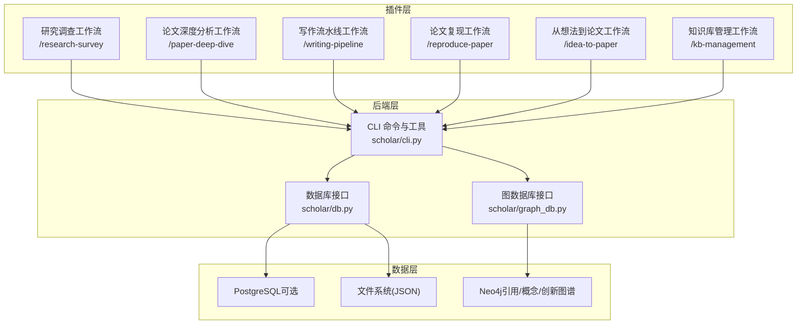
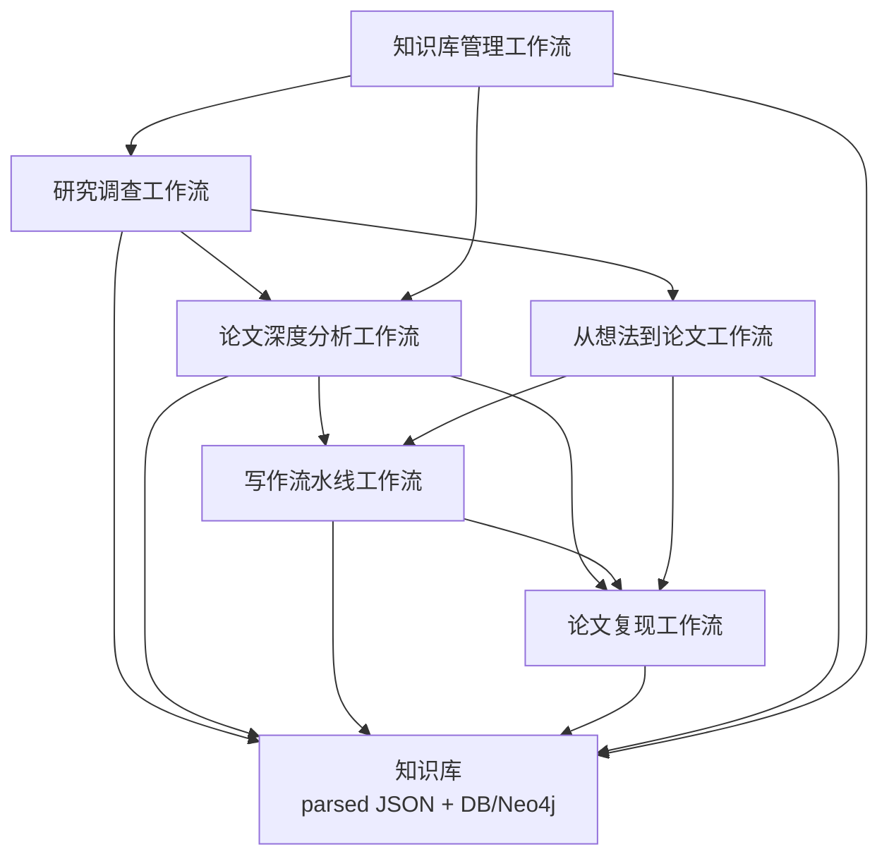
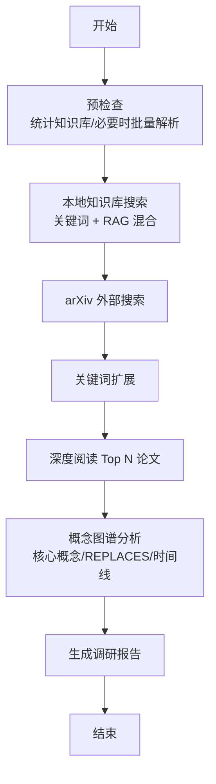
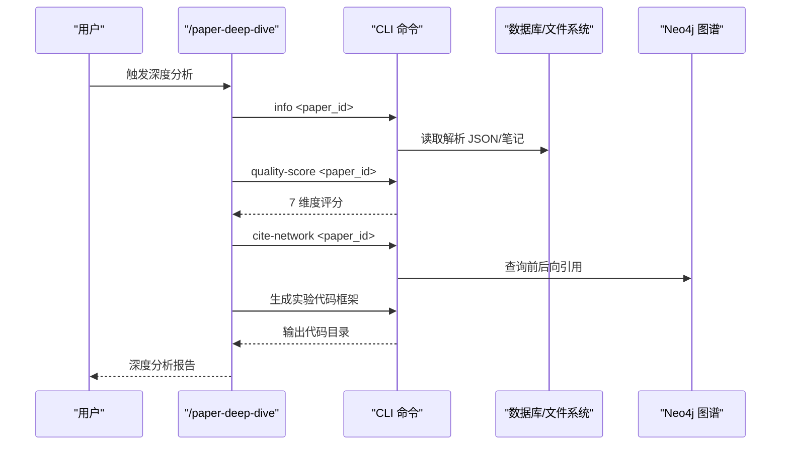
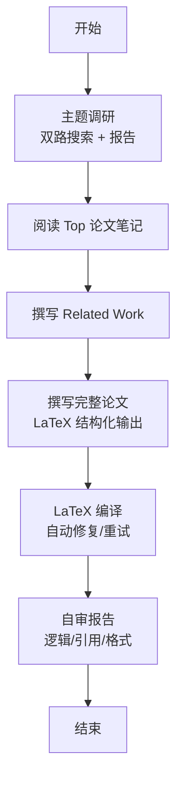
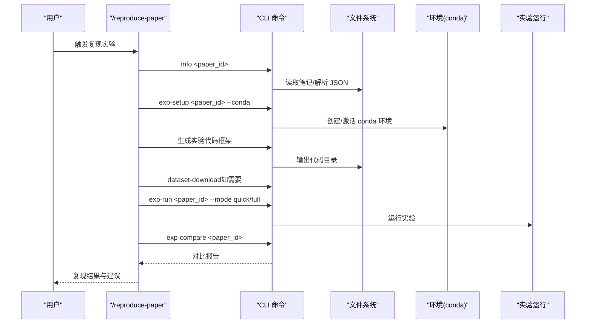
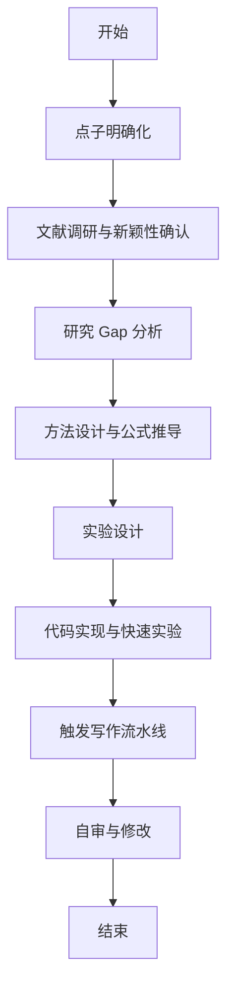
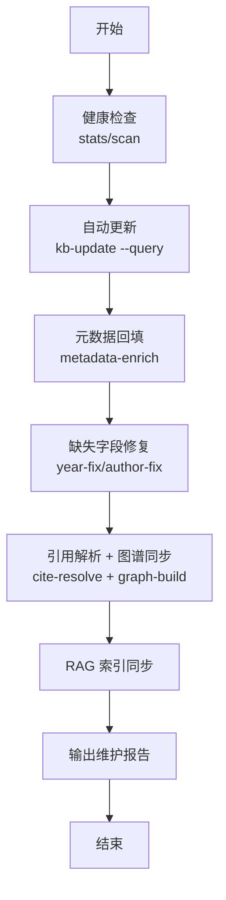
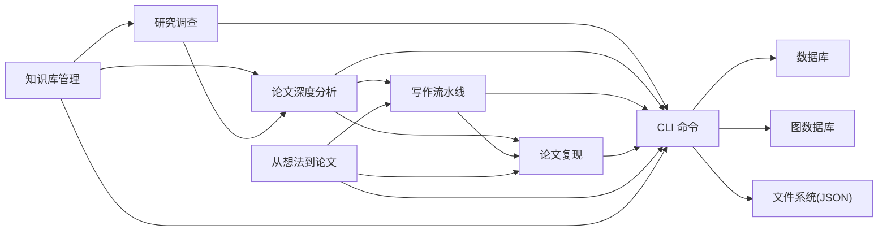

# 工作流技能

<cite>
**本文档引用的文件**
- [plugin/README.md](file://plugin/README.md)
- [plugin/skills/research-survey/SKILL.md](file://plugin/skills/research-survey/SKILL.md)
- [plugin/skills/paper-deep-dive/SKILL.md](file://plugin/skills/paper-deep-dive/SKILL.md)
- [plugin/skills/writing-pipeline/SKILL.md](file://plugin/skills/writing-pipeline/SKILL.md)
- [plugin/skills/reproduce-paper/SKILL.md](file://plugin/skills/reproduce-paper/SKILL.md)
- [plugin/skills/idea-to-paper/SKILL.md](file://plugin/skills/idea-to-paper/SKILL.md)
- [plugin/skills/kb-management/SKILL.md](file://plugin/skills/kb-management/SKILL.md)
- [scholar/__main__.py](file://scholar/__main__.py)
- [scholar/cli.py](file://scholar/cli.py)
- [scholar/db.py](file://scholar/db.py)
- [scholar/graph_db.py](file://scholar/graph_db.py)
</cite>

## 目录
1. [简介](#简介)
2. [项目结构](#项目结构)
3. [核心组件](#核心组件)
4. [架构总览](#架构总览)
5. [详细组件分析](#详细组件分析)
6. [依赖关系分析](#依赖关系分析)
7. [性能考量](#性能考量)
8. [故障排查指南](#故障排查指南)
9. [结论](#结论)
10. [附录](#附录)

## 简介
本文件系统性梳理 Scholar Studio 的 6 个工作流技能，覆盖从“研究调查”到“知识库管理”的完整学术研究与写作闭环。每个工作流均包含触发条件、阶段划分、技能组合、数据流转、状态管理、质量保障与监控指标，并给出定制化配置建议、实际案例研究与团队协作最佳实践，帮助研究者高效构建可重复、可验证、可持续演进的学术工作流。

## 项目结构
Scholar Studio 采用“插件（Skills/Commands/MCP）+ 后端（Python CLI + 数据库 + 图数据库）”的分层架构：
- 插件层：提供 6 个工作流技能与若干原子能力，负责“告诉 AI 做什么、怎么做”
- 后端层：提供 CLI 命令与工具函数，负责“执行搜索、解析、索引、图谱构建与查询”
- 数据层：PostgreSQL（可选）与文件系统（JSON）双轨存储；Neo4j 支持引用网络与概念图谱
- 基础设施：Docker Compose 启动数据库服务，启动脚本负责初始化

图表来源
- [plugin/README.md:1-79](file://plugin/README.md#L1-L79)
- [scholar/__main__.py:1-8](file://scholar/__main__.py#L1-L8)
- [scholar/cli.py:1-800](file://scholar/cli.py#L1-L800)
- [scholar/db.py:1-276](file://scholar/db.py#L1-L276)
- [scholar/graph_db.py:1-800](file://scholar/graph_db.py#L1-L800)

章节来源
- [plugin/README.md:1-79](file://plugin/README.md#L1-L79)
- [scholar/__main__.py:1-8](file://scholar/__main__.py#L1-L8)

## 核心组件
- 研究调查工作流：面向“任意研究主题”的全面文献调研，支持本地知识库搜索、arXiv 外部搜索、关键词扩展、概念图谱分析与调研报告生成
- 论文深度分析工作流：面向“单篇论文”的精读、质量评估、公式推导、引用网络分析与实验代码框架生成
- 写作流水线工作流：面向“端到端学术写作”，从调研→撰写→LaTeX 编译→自审报告
- 论文复现工作流：面向“端到端实验复现”，从深度阅读→环境配置→代码生成→运行→结果对比→调试
- 从想法到论文工作流：面向“从研究点子到完整论文”，串联调研→方法设计→实验→写作→自审
- 知识库管理工作流：面向“知识库健康检查、自动更新、元数据补全、引用解析与图谱同步”

章节来源
- [plugin/skills/research-survey/SKILL.md:1-91](file://plugin/skills/research-survey/SKILL.md#L1-L91)
- [plugin/skills/paper-deep-dive/SKILL.md:1-58](file://plugin/skills/paper-deep-dive/SKILL.md#L1-L58)
- [plugin/skills/writing-pipeline/SKILL.md:1-61](file://plugin/skills/writing-pipeline/SKILL.md#L1-L61)
- [plugin/skills/reproduce-paper/SKILL.md:1-69](file://plugin/skills/reproduce-paper/SKILL.md#L1-L69)
- [plugin/skills/idea-to-paper/SKILL.md:1-75](file://plugin/skills/idea-to-paper/SKILL.md#L1-L75)
- [plugin/skills/kb-management/SKILL.md:1-59](file://plugin/skills/kb-management/SKILL.md#L1-L59)

## 架构总览
下图展示 6 个工作流如何协同：以知识库为核心，围绕“数据→分析→产出→验证→沉淀”的闭环运转；工作流之间通过“paper_id/ULID”“调研报告/笔记/草稿/实验产物”等关键对象进行数据衔接。

图表来源
- [plugin/skills/research-survey/SKILL.md:82-91](file://plugin/skills/research-survey/SKILL.md#L82-L91)
- [plugin/skills/paper-deep-dive/SKILL.md:53-58](file://plugin/skills/paper-deep-dive/SKILL.md#L53-L58)
- [plugin/skills/writing-pipeline/SKILL.md:56-61](file://plugin/skills/writing-pipeline/SKILL.md#L56-L61)
- [plugin/skills/reproduce-paper/SKILL.md:64-69](file://plugin/skills/reproduce-paper/SKILL.md#L64-L69)
- [plugin/skills/idea-to-paper/SKILL.md:69-75](file://plugin/skills/idea-to-paper/SKILL.md#L69-L75)
- [plugin/skills/kb-management/SKILL.md:55-59](file://plugin/skills/kb-management/SKILL.md#L55-L59)

## 详细组件分析

### 研究调查工作流
- 触发条件：用户表达“调研 XX 方向”“survey XX”“了解 XX 领域”
- 关键阶段
  - 预检查：统计知识库状态，必要时执行批量解析
  - 本地知识库搜索（双路）：关键词搜索 + RAG 混合搜索
  - arXiv 外部搜索：补充最新论文
  - 关键词扩展：基于结果识别子主题与近义词，二次搜索
  - 深度阅读关键论文：读取预生成笔记与质量评分
  - 概念图谱分析：查询核心概念、REPLACES 关系、时间脉络
  - 生成调研报告：按结构化模板输出
- 技能组合：/research-survey → /paper-deep-dive → /citation-network → /research-gap
- 数据流转：paper_id 列表 → 笔记/质量评分 → 概念图谱 → 调研报告
- 质量保障：优先使用本地 TeX 精准解析；引用使用 paper_id；若本地无论文，提示从 arXiv 补充

图表来源
- [plugin/skills/research-survey/SKILL.md:9-91](file://plugin/skills/research-survey/SKILL.md#L9-L91)

章节来源
- [plugin/skills/research-survey/SKILL.md:1-91](file://plugin/skills/research-survey/SKILL.md#L1-L91)

### 论文深度分析工作流
- 触发条件：用户表达“精读 XX”“深度分析 XX”“分析这篇论文”
- 关键阶段
  - 加载论文数据：info 命令 + 预生成笔记
  - 深度阅读：提取核心贡献、关键公式、实验设计、局限性
  - 质量评估：7 维度评分
  - 公式推导：展开省略步骤、验证正确性、解释直觉
  - 引用网络分析：前后向引用
  - 生成实验代码框架：模块化输出
  - 输出深度分析报告
- 技能组合：/paper-deep-dive → /writing-pipeline → /reproduce-paper → /research-survey
- 数据流转：paper_id → 笔记/评分/引用 → 代码框架 → 深度报告

图表来源
- [plugin/skills/paper-deep-dive/SKILL.md:9-58](file://plugin/skills/paper-deep-dive/SKILL.md#L9-L58)
- [scholar/cli.py:242-306](file://scholar/cli.py#L242-L306)
- [scholar/cli.py:420-477](file://scholar/cli.py#L420-L477)
- [scholar/graph_db.py:316-332](file://scholar/graph_db.py#L316-L332)

章节来源
- [plugin/skills/paper-deep-dive/SKILL.md:1-58](file://plugin/skills/paper-deep-dive/SKILL.md#L1-L58)
- [scholar/cli.py:242-306](file://scholar/cli.py#L242-L306)
- [scholar/cli.py:420-477](file://scholar/cli.py#L420-L477)
- [scholar/graph_db.py:316-332](file://scholar/graph_db.py#L316-L332)

### 写作流水线工作流
- 触发条件：用户表达“写论文”“writing”“学术写作”
- 关键阶段
  - 主题调研：双路搜索 + 生成调研报告
  - 阅读关键论文笔记：优先 Grade A/B
  - 撰写 Related Work：分类与时间线
  - 撰写完整论文：按标准结构输出 LaTeX
  - LaTeX 编译：自动修复与重试
  - 自审报告：逻辑/引用/格式检查
- 技能组合：/writing-pipeline → /reproduce-paper → /paper-deep-dive → /idea-to-paper
- 数据流转：调研报告 → 笔记/评分 → LaTeX 草稿 → PDF → 自审报告

图表来源
- [plugin/skills/writing-pipeline/SKILL.md:9-61](file://plugin/skills/writing-pipeline/SKILL.md#L9-L61)

章节来源
- [plugin/skills/writing-pipeline/SKILL.md:1-61](file://plugin/skills/writing-pipeline/SKILL.md#L1-L61)

### 论文复现工作流
- 触发条件：用户表达“复现 XX 论文”“reproduce”“运行实验”
- 关键阶段
  - 深度阅读论文：提取算法/实验设置/超参/数据集
  - 配置运行环境：自动检测依赖并创建 conda 环境
  - 生成实验代码：主训练/模型/数据/评估/配置
  - 下载数据集（如需要）
  - 运行实验：quick/full 模式 + 超时保护
  - 对比结果：与论文报告指标对比
  - 调试失败：自动诊断常见错误
- 技能组合：/reproduce-paper → /writing-pipeline → /paper-deep-dive → /idea-to-paper
- 数据流转：paper_id → 笔记/代码 → 实验产物 → 对比报告 → 调试建议

图表来源
- [plugin/skills/reproduce-paper/SKILL.md:9-69](file://plugin/skills/reproduce-paper/SKILL.md#L9-L69)

章节来源
- [plugin/skills/reproduce-paper/SKILL.md:1-69](file://plugin/skills/reproduce-paper/SKILL.md#L1-L69)

### 从想法到论文工作流
- 触发条件：用户表达“我有一个想法”“idea to paper”
- 关键阶段
  - 点子明确化：创新点、问题、贡献、目标会议/期刊
  - 文献调研：确认新颖性与关键参考
  - 研究 Gap 分析：已有局限与优势
  - 方法设计：算法框架、公式推导、模块定义
  - 实验设计：基线/指标/数据集/消融实验
  - 代码实现与实验：快速验证与对比
  - 论文撰写：自动触发写作流水线
  - 自审与修改：逻辑/结果/引用一致性检查
- 技能组合：/idea-to-paper → /writing-pipeline → /reproduce-paper → /paper-deep-dive
- 数据流转：点子 → 调研报告 → 方法/实验设计 → 代码/对比 → 论文草稿 → 修改建议

图表来源
- [plugin/skills/idea-to-paper/SKILL.md:9-75](file://plugin/skills/idea-to-paper/SKILL.md#L9-L75)

章节来源
- [plugin/skills/idea-to-paper/SKILL.md:1-75](file://plugin/skills/idea-to-paper/SKILL.md#L1-L75)

### 知识库管理工作流
- 触发条件：用户表达“维护知识库”“更新知识库”“kb-update”
- 关键阶段
  - 健康检查：统计/扫描
  - 自动更新：arXiv 搜索 → TeX 下载 → 批量入库（parse/enrich/graph/notes/quality/classify）
  - 元数据回填：arXiv ID/DOI 回填
  - 补全缺失字段：年份/作者修复
  - 引用解析 + 图谱同步：cite-resolve + graph-build
  - RAG 索引同步：rag-index
  - 输出维护报告
- 技能组合：/kb-management → /research-survey → /paper-deep-dive
- 数据流转：查询/扫描 → 批量入库 → 元数据/图谱/RAG 同步 → 维护报告

图表来源
- [plugin/skills/kb-management/SKILL.md:9-59](file://plugin/skills/kb-management/SKILL.md#L9-L59)

章节来源
- [plugin/skills/kb-management/SKILL.md:1-59](file://plugin/skills/kb-management/SKILL.md#L1-L59)

## 依赖关系分析
- 组件耦合
  - 工作流高度依赖 CLI 命令与数据层（DB/GDB/FS），形成“技能 → 命令 → 数据”的清晰链路
  - 研究调查与知识库管理双向依赖：前者依赖后者数据，后者维护前者数据质量
  - 写作流水线与复现工作流相互驱动：前者产出草稿，后者验证实验并反哺写作
- 外部依赖
  - Docker Compose：PostgreSQL 与 Neo4j
  - arXiv API：外部论文搜索
  - conda：实验环境隔离
- 潜在循环依赖
  - 当前工作流以“数据驱动”为主，未见显式循环依赖；但建议在跨工作流调用时统一通过 paper_id/ULID 引用，避免状态耦合

图表来源
- [scholar/cli.py:1-800](file://scholar/cli.py#L1-L800)
- [scholar/db.py:1-276](file://scholar/db.py#L1-L276)
- [scholar/graph_db.py:1-800](file://scholar/graph_db.py#L1-L800)

章节来源
- [scholar/cli.py:1-800](file://scholar/cli.py#L1-L800)
- [scholar/db.py:1-276](file://scholar/db.py#L1-L276)
- [scholar/graph_db.py:1-800](file://scholar/graph_db.py#L1-L800)

## 性能考量
- 批量解析与索引
  - 使用批处理命令减少 IO 开销，合理设置 limit 与并发
  - 在大规模论文场景下，优先启用数据库模式，提升查询与统计效率
- 搜索与检索
  - 双路搜索（关键词 + RAG）兼顾召回与语义相关性；建议结合关键词扩展策略降低漏检
- 图谱构建
  - 引用网络与概念图谱构建为 O(n)~O(n^2)，建议分批写入并定期清理孤立节点
- 编译与复现
  - LaTeX 编译失败重试次数限制与自动修复规则可显著提升吞吐
  - 实验运行设置超时保护，避免长时间占用资源

## 故障排查指南
- 知识库不可用
  - 现象：stats 显示数据库不可连接
  - 排查：确认 Docker Compose 正常运行，PostgreSQL/Neo4j 可连通
- arXiv 请求失败
  - 现象：arXiv 搜索报错
  - 排查：检查代理设置或网络可达性
- 编译失败
  - 现象：LaTeX 编译报错
  - 排查：查看自动修复日志与重试次数上限
- 环境问题
  - 现象：exp-setup/ exp-run 报 ModuleNotFoundError/CUDA OOM
  - 排查：核对依赖清单、conda 环境、GPU 资源与超时设置
- 图谱异常
  - 现象：引用解析失败或孤立节点过多
  - 排查：执行 cite-resolve 与 graph-build 同步，清理无效节点

章节来源
- [scholar/cli.py:605-658](file://scholar/cli.py#L605-L658)
- [scholar/cli.py:663-706](file://scholar/cli.py#L663-L706)
- [scholar/cli.py:797-806](file://scholar/cli.py#L797-L806)
- [plugin/skills/reproduce-paper/SKILL.md:57-62](file://plugin/skills/reproduce-paper/SKILL.md#L57-L62)

## 结论
Scholar Studio 的 6 个工作流以“知识库为中心、数据为驱动”，形成从“调研—分析—写作—复现—沉淀”的闭环。通过标准化的 CLI 命令与多层数据存储，既满足个人研究的敏捷迭代，也支持团队协作的知识共享与质量控制。建议在团队中建立统一的数据标注规范、质量评分体系与版本化工作流，持续优化搜索与图谱策略，以获得更高的研究效率与可重复性。

## 附录
- 定制化配置建议
  - 搜索深度与结果数量：根据研究方向调整关键词扩展与混合搜索权重
  - 质量评分维度：结合领域专家意见微调评分权重
  - 实验运行模式：开发阶段使用 quick 模式，验证阶段切换 full 模式
  - 图谱同步频率：每日/每周增量同步，每月全量重建
- 监控指标
  - 知识库覆盖率：解析数/元数据完整性/引用解析率
  - 工作流吞吐：平均耗时、失败率、重试次数
  - 复现成功率：代码生成可用性、实验运行成功/失败分布
- 质量保证措施
  - 引用一致性校验、公式推导校验、实验对比阈值设定
  - 团队评审机制：写作流水线与复现结果的交叉验证
- 实际案例研究
  - 案例 A：某研究方向的年度趋势分析（研究调查 → 概念图谱 → 调研报告）
  - 案例 B：某论文的可复现性验证（论文深度分析 → 环境配置 → 代码生成 → 实验运行 → 对比报告）
  - 案例 C：从点子到论文的端到端实践（从想法到论文 → 写作流水线 → 复现验证 → 自审修改）