# 核心功能特性

<cite>
**本文档引用的文件**
- [plugin/README.md](file://plugin/README.md)
- [plugin/mcp.json](file://plugin/mcp.json)
- [requirements.txt](file://requirements.txt)
- [plugin/skills/paper-ingestion/SKILL.md](file://plugin/skills/paper-ingestion/SKILL.md)
- [plugin/skills/kb-management/SKILL.md](file://plugin/skills/kb-management/SKILL.md)
- [plugin/skills/reproduce-paper/SKILL.md](file://plugin/skills/reproduce-paper/SKILL.md)
- [plugin/skills/review-report/SKILL.md](file://plugin/skills/review-report/SKILL.md)
- [plugin/skills/experiment-code/SKILL.md](file://plugin/skills/experiment-code/SKILL.md)
- [plugin/skills/math-verification/SKILL.md](file://plugin/skills/math-verification/SKILL.md)
- [plugin/skills/paper-recommendation/SKILL.md](file://plugin/skills/paper-recommendation/SKILL.md)
- [plugin/skills/research-gap/SKILL.md](file://plugin/skills/research-gap/SKILL.md)
- [plugin/skills/writing-pipeline/SKILL.md](file://plugin/skills/writing-pipeline/SKILL.md)
- [plugin/skills/research-survey/SKILL.md](file://plugin/skills/research-survey/SKILL.md)
- [plugin/skills/cold-start/SKILL.md](file://plugin/skills/cold-start/SKILL.md)
- [scholar/__main__.py](file://scholar/__main__.py)
</cite>

## 目录
1. [简介](#简介)
2. [项目结构](#项目结构)
3. [核心组件](#核心组件)
4. [架构总览](#架构总览)
5. [详细组件分析](#详细组件分析)
6. [依赖分析](#依赖分析)
7. [性能考虑](#性能考虑)
8. [故障排查指南](#故障排查指南)
9. [结论](#结论)
10. [附录](#附录)

## 简介
本文件系统性阐述 Scholar Studio 的核心功能特性，聚焦 14 个学术技能的分类与协作机制：8 个原子技能（论文管理、数学验证、论文推荐、引用分析、研究缺口、审稿报告、入门引导、实验代码）与 6 个工作流（研究调查、论文深度分析、写作流水线、论文复现、从想法到论文、知识库管理）。文档说明每个技能的功能定位、典型使用场景、Next Steps 引导机制，以及技能间的组合关系与数据传递路径，并提供可操作的使用示例与最佳实践建议。

## 项目结构
Scholar Studio 插件作为“大脑”，定义技能、命令、规则与钩子，实际执行由主仓库的 Python 后端与数据库支撑。插件通过 MCP 服务器调用主仓库的 scholar CLI 工具链，实现论文解析、检索、图谱构建、RAG 索引、质量评估、实验复现等能力。

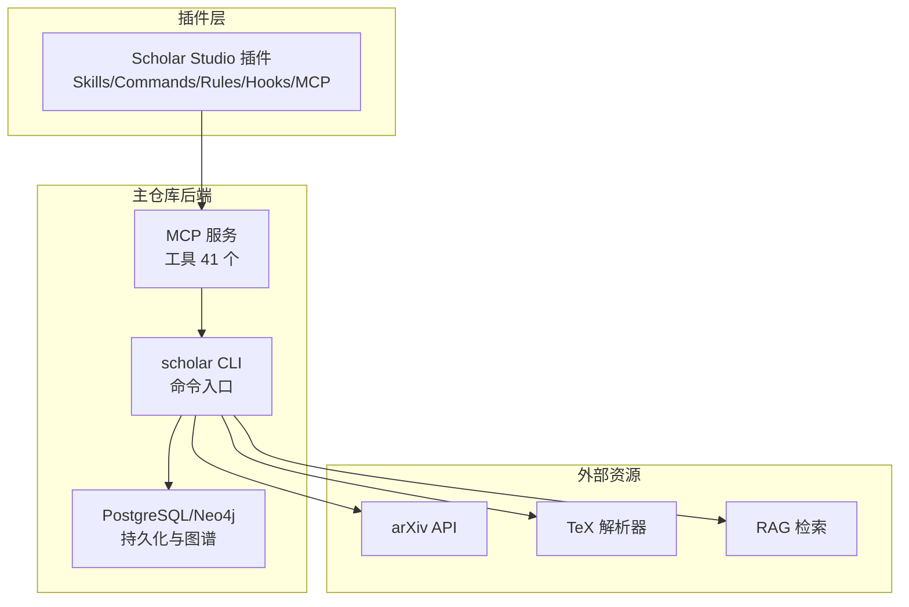

**图示来源**
- [plugin/README.md:1-79](file://plugin/README.md#L1-L79)
- [plugin/mcp.json:1-16](file://plugin/mcp.json#L1-L16)
- [requirements.txt:1-9](file://requirements.txt#L1-L9)

**章节来源**
- [plugin/README.md:1-79](file://plugin/README.md#L1-L79)
- [plugin/mcp.json:1-16](file://plugin/mcp.json#L1-L16)
- [requirements.txt:1-9](file://requirements.txt#L1-L9)

## 核心组件
- 原子技能（8 个）
  - 论文管理：扫描、解析、增量入库、元数据补全、批量预处理、统计校验
  - 数学验证：公式语义分析、Lean4 形式化对照与编译验证
  - 论文推荐：基于引用网络、研究方向、阅读缺口的智能推荐
  - 引用分析：引用网络可视化与中心性分析
  - 研究缺口：跨论文局限性分析，发现共识/矛盾/盲区缺口
  - 审稿报告：结构化同行评审报告生成（贡献、方法、实验、写作、引用网络、形式化对照）
  - 入门引导：陌生领域知识地图与学习路径构建
  - 实验代码：基于论文方法与公式生成 PyTorch 实验代码
- 工作流（6 个）
  - 研究调查：全面文献调研（本地+arXiv，关键词扩展，概念图谱分析）
  - 论文深度分析：精读+质量评分+公式推导+代码实现
  - 写作流水线：调研→撰写→LaTeX 编译→自审
  - 论文复现：环境配置→代码生成→运行→结果对比
  - 从想法到论文：端到端从研究点子到完整论文
  - 知识库管理：健康检查、自动更新、元数据回填、图谱同步、RAG 索引

**章节来源**
- [plugin/README.md:60-79](file://plugin/README.md#L60-L79)

## 架构总览
插件通过 MCP 服务器调用主仓库的 scholar CLI，形成“意图→技能→命令→工具”的执行闭环。技能之间通过统一的数据产物（解析 JSON、阅读笔记、质量评分、图谱节点、RAG 索引）进行衔接，形成可组合的工作流。

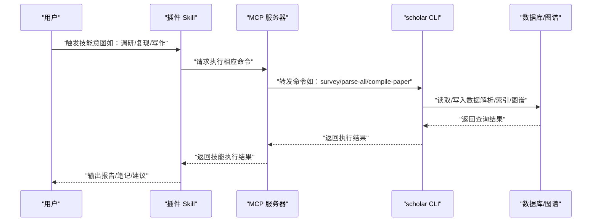

**图示来源**
- [plugin/README.md:1-79](file://plugin/README.md#L1-L79)
- [plugin/mcp.json:1-16](file://plugin/mcp.json#L1-L16)
- [scholar/__main__.py:1-8](file://scholar/__main__.py#L1-L8)

## 详细组件分析

### 原子技能

#### 论文管理（paper-ingestion）
- 功能定位：论文入库的“第一公里”，负责扫描、解析、增量入库、元数据补全与批量预处理。
- 使用场景：新增论文目录、批量导入、解析失败诊断、质量预处理、统计校验。
- Next Steps 引导：触发研究调查、知识库管理、质量评分。
- 数据传递：解析 JSON、阅读笔记、质量评分、分类标签自动进入知识库，供后续技能直接使用。

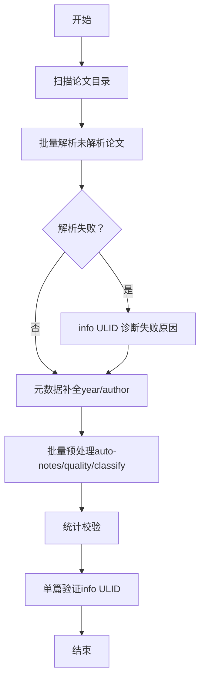

**图示来源**
- [plugin/skills/paper-ingestion/SKILL.md:1-85](file://plugin/skills/paper-ingestion/SKILL.md#L1-L85)

**章节来源**
- [plugin/skills/paper-ingestion/SKILL.md:1-85](file://plugin/skills/paper-ingestion/SKILL.md#L1-L85)

#### 数学验证（math-verification）
- 功能定位：公式语义分析与 Lean4 形式化验证，支持 AI 演化相关定理的形式化。
- 使用场景：论文公式正确性检查、形式化定理证明尝试、编译验证。
- Next Steps 引导：论文深度分析、实验代码生成。
- 数据传递：Lean4 验证结果与定理定义可用于论文写作中的形式化引用。

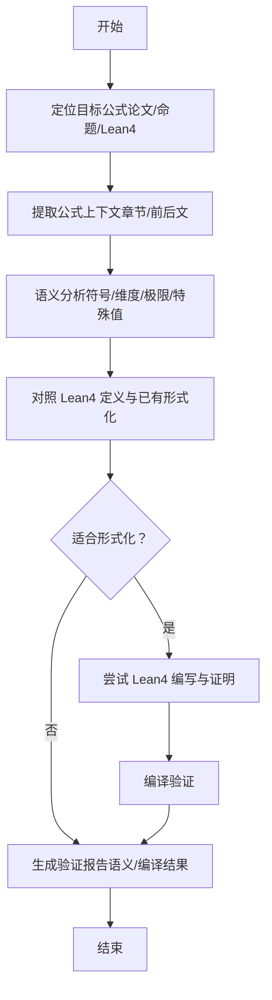

**图示来源**
- [plugin/skills/math-verification/SKILL.md:1-101](file://plugin/skills/math-verification/SKILL.md#L1-L101)

**章节来源**
- [plugin/skills/math-verification/SKILL.md:1-101](file://plugin/skills/math-verification/SKILL.md#L1-L101)

#### 论文推荐（paper-recommendation）
- 功能定位：基于引用网络、研究方向、阅读缺口的个性化论文推荐。
- 使用场景：确定下一步阅读、扩展视野、补充阅读链。
- Next Steps 引导：论文深度分析、冷启动。
- 数据传递：推荐列表中的 ULID 与理由可直接传给论文深度分析。

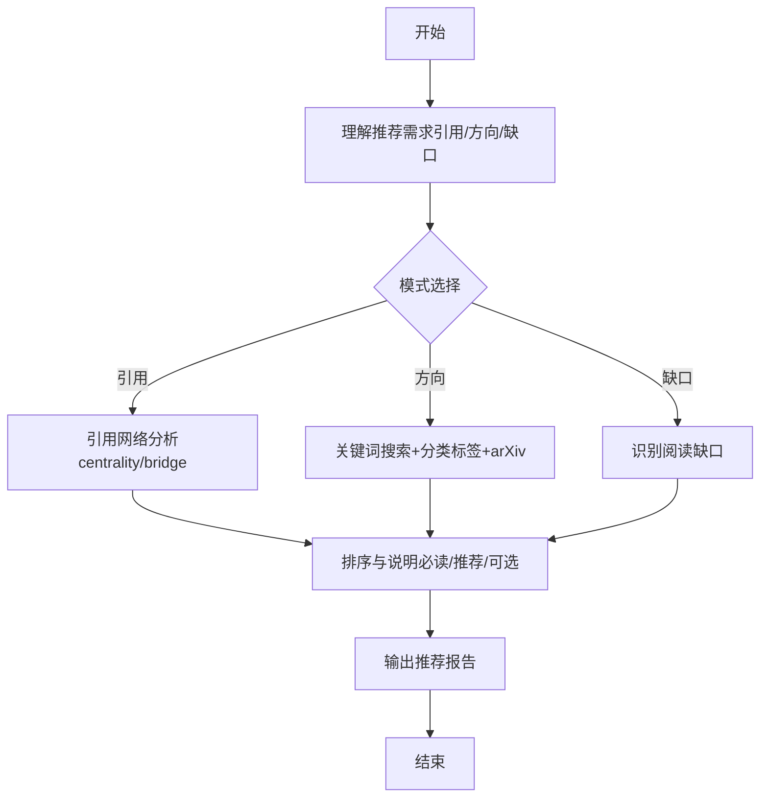

**图示来源**
- [plugin/skills/paper-recommendation/SKILL.md:1-96](file://plugin/skills/paper-recommendation/SKILL.md#L1-L96)

**章节来源**
- [plugin/skills/paper-recommendation/SKILL.md:1-96](file://plugin/skills/paper-recommendation/SKILL.md#L1-L96)

#### 引用分析（citation-network）
- 功能定位：分析论文引用关系，识别前置知识、最新进展与桥接论文。
- 使用场景：文献溯源、热点追踪、跨领域连接。
- Next Steps 引导：论文深度分析、研究缺口。
- 数据传递：引用网络统计与中心性指标支撑后续分析。

**章节来源**
- [plugin/skills/paper-recommendation/SKILL.md:17-44](file://plugin/skills/paper-recommendation/SKILL.md#L17-L44)

#### 研究缺口（research-gap）
- 功能定位：通过跨论文局限性分析发现研究空白（共识/矛盾/盲区）。
- 使用场景：选题方向、创新点挖掘、未来工作规划。
- Next Steps 引导：论文推荐、冷启动、研究调查。
- 数据传递：缺口描述与相关论文可直接传给论文推荐。

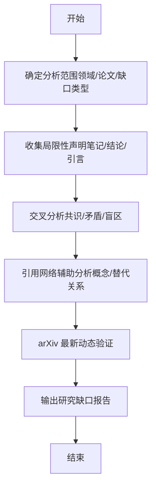

**图示来源**
- [plugin/skills/research-gap/SKILL.md:1-105](file://plugin/skills/research-gap/SKILL.md#L1-L105)

**章节来源**
- [plugin/skills/research-gap/SKILL.md:1-105](file://plugin/skills/research-gap/SKILL.md#L1-L105)

#### 审稿报告（review-report）
- 功能定位：结构化同行评审报告，包含贡献、方法、实验、写作质量与引用网络对照。
- 使用场景：论文自审、投稿准备、对比分析。
- Next Steps 引导：论文深度分析、质量评分量化记录、引用导出。
- 数据传递：主要问题与改进建议可用于后续论文修改与对比分析。

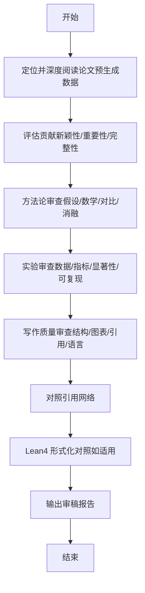

**图示来源**
- [plugin/skills/review-report/SKILL.md:1-116](file://plugin/skills/review-report/SKILL.md#L1-L116)

**章节来源**
- [plugin/skills/review-report/SKILL.md:1-116](file://plugin/skills/review-report/SKILL.md#L1-L116)

#### 入门引导（cold-start）
- 功能定位：为陌生领域构建知识地图与学习路径，提供可执行的学习顺序。
- 使用场景：跨领域研究、新方向探索、知识迁移。
- Next Steps 引导：研究调查、论文深度分析、引用网络分析。
- 数据传递：必读论文列表与概念依赖图为后续阅读提供导航。

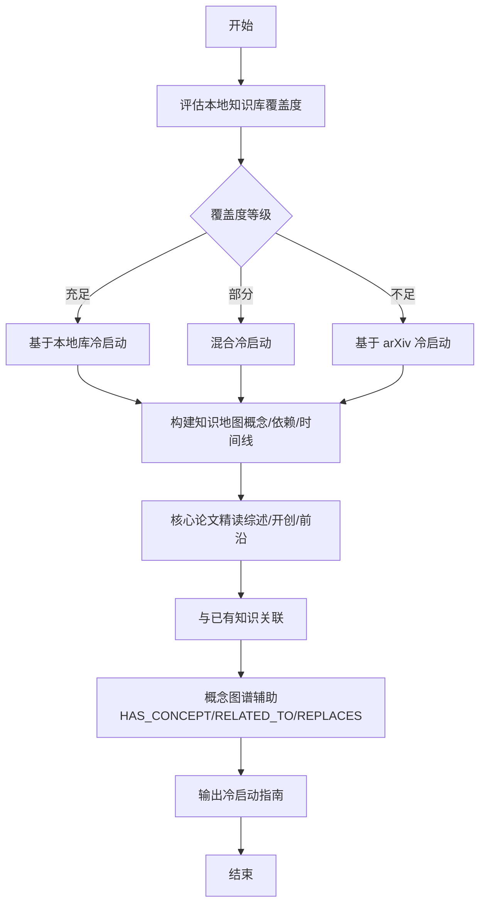

**图示来源**
- [plugin/skills/cold-start/SKILL.md:1-147](file://plugin/skills/cold-start/SKILL.md#L1-L147)

**章节来源**
- [plugin/skills/cold-start/SKILL.md:1-147](file://plugin/skills/cold-start/SKILL.md#L1-L147)

#### 实验代码（experiment-code）
- 功能定位：根据论文方法与公式生成 PyTorch 实验代码，提供可运行的实现基线。
- 使用场景：快速复现、算法实现、实验扩展。
- Next Steps 引导：论文深度分析、论文复现。
- 数据传递：生成的代码目录可作为复现与扩展的基线。

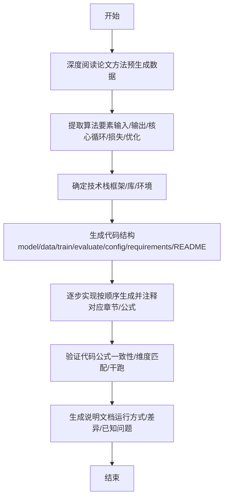

**图示来源**
- [plugin/skills/experiment-code/SKILL.md:1-111](file://plugin/skills/experiment-code/SKILL.md#L1-L111)

**章节来源**
- [plugin/skills/experiment-code/SKILL.md:1-111](file://plugin/skills/experiment-code/SKILL.md#L1-L111)

### 工作流

#### 研究调查（research-survey）
- 功能定位：对任意研究主题进行全面文献调研，生成结构化调研报告。
- 使用场景：选题前期、方向探索、背景梳理。
- Next Steps 引导：论文深度分析、引用网络分析、研究缺口。
- 数据传递：关键论文详析与参考文献列表可直接作为后续技能输入。

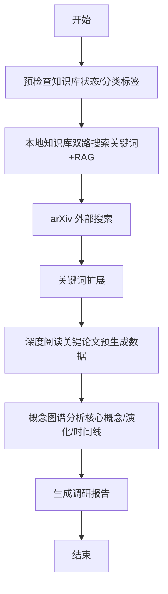

**图示来源**
- [plugin/skills/research-survey/SKILL.md:1-91](file://plugin/skills/research-survey/SKILL.md#L1-L91)

**章节来源**
- [plugin/skills/research-survey/SKILL.md:1-91](file://plugin/skills/research-survey/SKILL.md#L1-L91)

#### 论文深度分析（paper-deep-dive）
- 功能定位：单篇论文的精读与综合分析，涵盖质量评分、公式推导、代码实现与笔记沉淀。
- 使用场景：重要论文研读、方法对比、写作素材整理。
- Next Steps 引导：数学验证、实验代码、审稿报告。
- 数据传递：结构化笔记、质量评分、公式推导结果为后续技能提供依据。

**章节来源**
- [plugin/skills/research-survey/SKILL.md:36-42](file://plugin/skills/research-survey/SKILL.md#L36-L42)

#### 写作流水线（writing-pipeline）
- 功能定位：端到端学术写作，从主题调研到 LaTeX 编译与自审。
- 使用场景：论文撰写、格式规范、质量把关。
- Next Steps 引导：论文复现、论文深度分析、从想法到论文。
- 数据传递：调研报告、相关工作章节、LaTeX 源码与 PDF 输出。

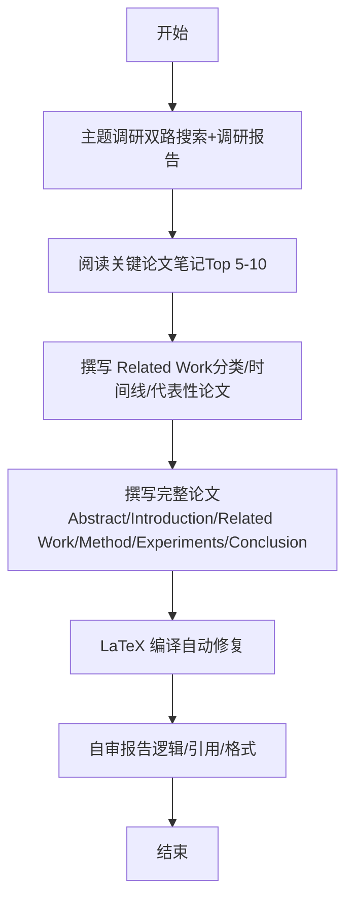

**图示来源**
- [plugin/skills/writing-pipeline/SKILL.md:1-61](file://plugin/skills/writing-pipeline/SKILL.md#L1-L61)

**章节来源**
- [plugin/skills/writing-pipeline/SKILL.md:1-61](file://plugin/skills/writing-pipeline/SKILL.md#L1-L61)

#### 论文复现（reproduce-paper）
- 功能定位：端到端实验复现，从环境配置到代码生成、运行与结果对比。
- 使用场景：方法验证、实验扩展、教学演示。
- Next Steps 引导：写作流水线、论文深度分析、从想法到论文。
- 数据传递：实验代码、运行日志、对比报告为后续写作与改进提供依据。

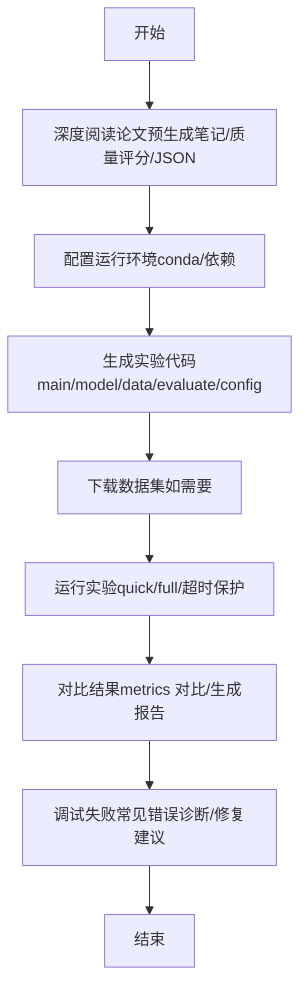

**图示来源**
- [plugin/skills/reproduce-paper/SKILL.md:1-69](file://plugin/skills/reproduce-paper/SKILL.md#L1-L69)

**章节来源**
- [plugin/skills/reproduce-paper/SKILL.md:1-69](file://plugin/skills/reproduce-paper/SKILL.md#L1-L69)

#### 从想法到论文（idea-to-paper）
- 功能定位：从研究点子到完整论文的端到端流程，涵盖调研→写作→复现→成文。
- 使用场景：科研创新、论文孵化、教学案例。
- Next Steps 引导：完善自审报告、准备投稿材料、扩展实验。
- 数据传递：调研报告、方法设计、实验实现与论文草稿。

**章节来源**
- [plugin/skills/idea-to-paper/SKILL.md:1-75](file://plugin/skills/idea-to-paper/SKILL.md#L1-L75)

#### 知识库管理（kb-management）
- 功能定位：知识库维护与自动更新，包含健康检查、自动更新、元数据回填、图谱同步与 RAG 索引。
- 使用场景：知识库扩容、数据一致性保障、检索效果优化。
- Next Steps 引导：研究调查、论文深度分析。
- 数据传递：arXiv 搜索→下载 TeX→批量入库（parse/enrich/graph/notes/quality/classify）。

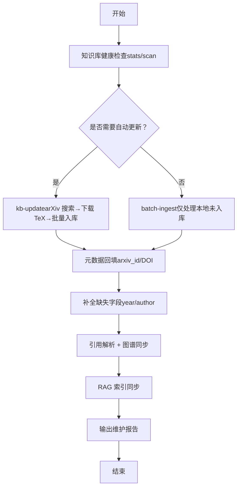

**图示来源**
- [plugin/skills/kb-management/SKILL.md:1-59](file://plugin/skills/kb-management/SKILL.md#L1-L59)

**章节来源**
- [plugin/skills/kb-management/SKILL.md:1-59](file://plugin/skills/kb-management/SKILL.md#L1-L59)

## 依赖分析
- 技能间耦合与协作
  - 论文管理是上游数据源，为所有技能提供解析 JSON、阅读笔记、质量评分、分类标签。
  - 研究调查与入门引导为下游技能提供方向与导航；论文推荐与研究缺口为选题与对比提供依据。
  - 数学验证与实验代码为论文复现与写作提供严谨性与可执行性保障。
  - 审稿报告为论文深度分析与自审提供结构化反馈。
- 外部依赖
  - PostgreSQL/Neo4j：持久化与图谱存储
  - arXiv API：外部论文搜索与补充
  - TeX 解析器：论文源码解析
  - RAG 检索：语义搜索与混合检索

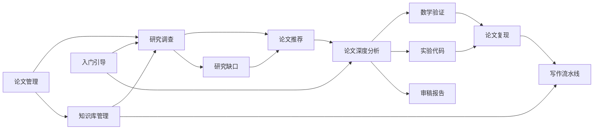

**图示来源**
- [plugin/README.md:60-79](file://plugin/README.md#L60-L79)
- [plugin/skills/paper-ingestion/SKILL.md:76-84](file://plugin/skills/paper-ingestion/SKILL.md#L76-L84)
- [plugin/skills/kb-management/SKILL.md:18-28](file://plugin/skills/kb-management/SKILL.md#L18-L28)

**章节来源**
- [plugin/README.md:60-79](file://plugin/README.md#L60-L79)

## 性能考虑
- 批量处理与增量更新：论文解析与预处理采用批量策略，失败跳过不影响整体；增量入库支持新论文快速接入。
- 依赖安装与环境隔离：实验复现通过 conda 环境隔离依赖，避免冲突；超时保护防止长时间阻塞。
- 检索与索引：RAG 混合搜索提升召回质量；定期同步图谱与 RAG 索引保证检索效率。
- 数据一致性：知识库健康检查与统计校验确保入库质量；元数据回填与缺失字段补全减少噪声。

## 故障排查指南
- 解析失败
  - 现象：论文解析失败或缺少 TeX 源码
  - 处理：使用单篇诊断命令定位原因，必要时回退到 PDF 元数据提取策略
- 环境与依赖
  - 现象：实验运行报错（模块缺失/CUDA OOM/文件不存在）
  - 处理：使用调试命令自动诊断常见错误并提供修复建议
- 数据不一致
  - 现象：元数据缺失或字段覆盖率低
  - 处理：执行元数据回填与缺失字段补全；核对 arXiv 与数据库一致性
- 检索效果差
  - 现象：关键词搜索召回不足或语义相关性差
  - 处理：启用 RAG 混合搜索；扩展关键词；检查分类标签覆盖度

**章节来源**
- [plugin/skills/paper-ingestion/SKILL.md:27-36](file://plugin/skills/paper-ingestion/SKILL.md#L27-L36)
- [plugin/skills/reproduce-paper/SKILL.md:57-62](file://plugin/skills/reproduce-paper/SKILL.md#L57-L62)
- [plugin/skills/kb-management/SKILL.md:29-40](file://plugin/skills/kb-management/SKILL.md#L29-L40)

## 结论
Scholar Studio 通过 14 个技能的有机组合，构建了从“数据接入—知识发现—方法实现—论文产出”的完整学术研究闭环。原子技能提供细粒度能力，工作流提供端到端体验；技能间通过统一数据产物实现无缝衔接。建议在实际使用中遵循“先入库、后分析、再写作”的路径，结合 Next Steps 引导逐步推进研究进程。

## 附录
- 使用示例与最佳实践
  - 新手入门：先执行知识库健康检查与增量入库，再使用入门引导构建学习路径
  - 选题阶段：使用研究调查与研究缺口识别方向，再用论文推荐补充阅读
  - 方法验证：使用论文深度分析与数学验证确保方法正确性，再用实验代码与论文复现验证可复现性
  - 论文产出：使用写作流水线生成 LaTeX 草稿，配合审稿报告与自审完善质量
- 常用命令与路径
  - 论文管理：扫描、批量解析、单篇诊断、元数据补全、批量预处理、统计校验
  - 知识库管理：健康检查、自动更新、元数据回填、图谱同步、RAG 索引
  - 写作与复现：调研、深度分析、实验代码生成、实验运行、结果对比、LaTeX 编译