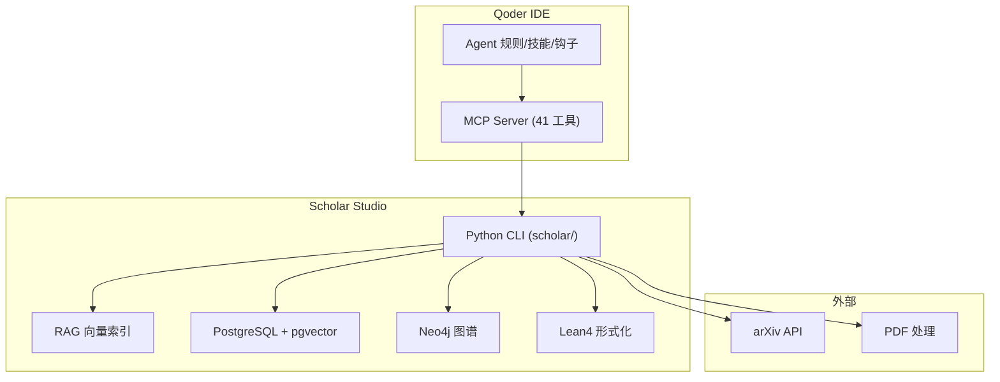
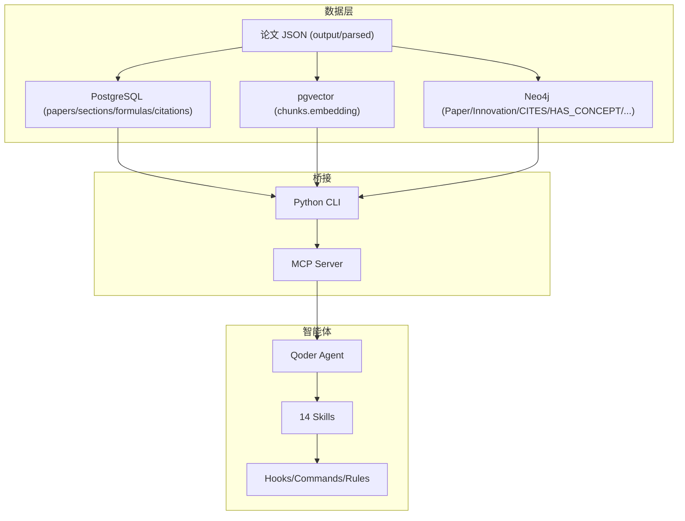
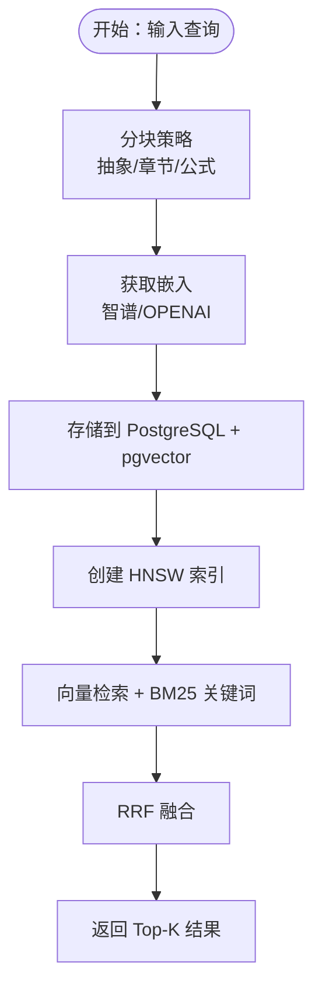
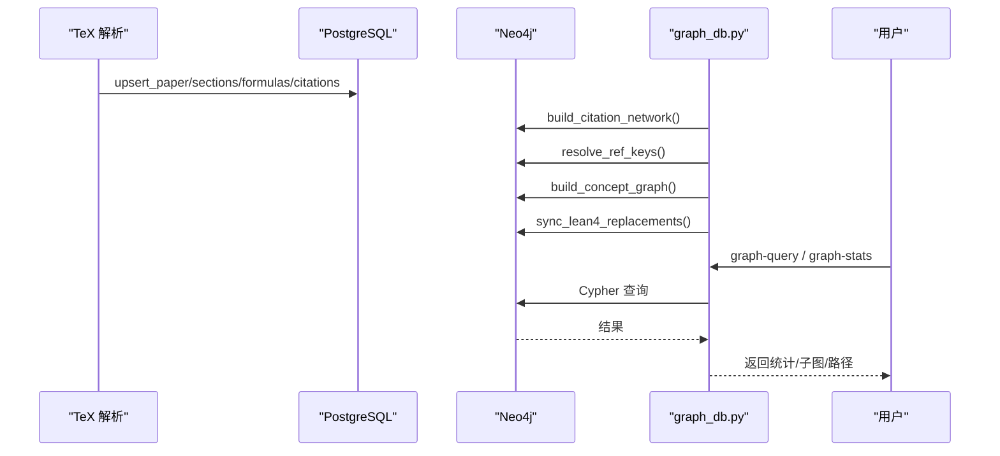
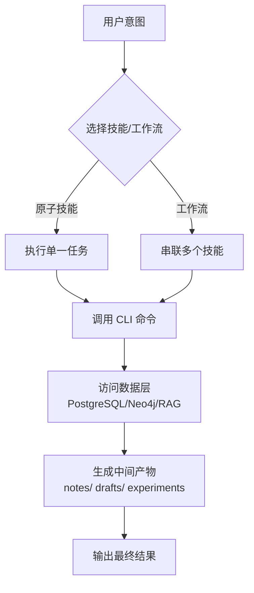
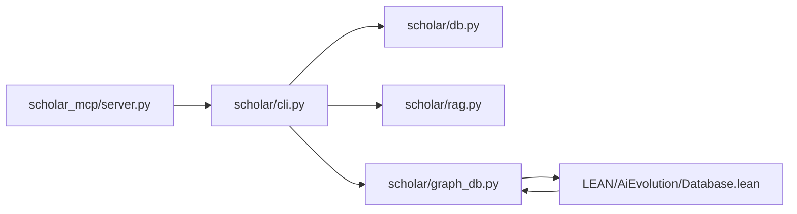

# 系统介绍

<cite>
**本文档引用的文件**
- [README.md](file://README.md)
- [plugin/README.md](file://plugin/README.md)
- [scholar/__main__.py](file://scholar/__main__.py)
- [scholar/cli.py](file://scholar/cli.py)
- [scholar/db.py](file://scholar/db.py)
- [scholar/rag.py](file://scholar/rag.py)
- [scholar/graph_db.py](file://scholar/graph_db.py)
- [plugin/skills/paper-ingestion/SKILL.md](file://plugin/skills/paper-ingestion/SKILL.md)
- [plugin/skills/kb-management/SKILL.md](file://plugin/skills/kb-management/SKILL.md)
- [plugin/skills/research-survey/SKILL.md](file://plugin/skills/research-survey/SKILL.md)
- [plugin/skills/math-verification/SKILL.md](file://plugin/skills/math-verification/SKILL.md)
- [plugin/skills/reproduce-paper/SKILL.md](file://plugin/skills/reproduce-paper/SKILL.md)
- [LEAN/AiEvolution.lean](file://LEAN/AiEvolution.lean)
- [LEAN/Main.lean](file://LEAN/Main.lean)
- [LEAN/AiEvolution/Database.lean](file://LEAN/AiEvolution/Database.lean)
- [LEAN/AiEvolution/Theorems.lean](file://LEAN/AiEvolution/Theorems.lean)
</cite>

## 目录
1. [简介](#简介)
2. [项目结构](#项目结构)
3. [核心组件](#核心组件)
4. [架构总览](#架构总览)
5. [详细组件分析](#详细组件分析)
6. [依赖关系分析](#依赖关系分析)
7. [性能考量](#性能考量)
8. [故障排查指南](#故障排查指南)
9. [结论](#结论)
10. [附录](#附录)

## 简介
Scholar Studio 是面向 AI 演化方向的学术研究助手，围绕 440 篇高质量论文的 TeX 源码，构建“可查询、可推理、可组合”的学术数据层，并通过 Qoder IDE 提供从“调研→精读→对比→写作”的全流程自动化支持。系统具备四大核心能力：
- RAG 语义检索：基于向量与关键词的混合检索，支持智谱/OPENAI 等嵌入服务
- Neo4j 引用图谱：论文引用网络 + 概念图谱 + 技术演化 REPLACES 关系
- 14 个学术 skills（8 原子 + 6 工作流）：覆盖论文管理、数学验证、推荐、引用分析、研究空白、审稿报告、入门引导、实验代码、以及多技能串联的工作流
- Lean4 形式化验证：对关键演化节点与定理进行严格形式化证明，确保技术演进的可验证性

系统核心理念是将 TeX 源码转化为结构化数据，再通过 Agent + Skills 自动化完成学术研究闭环。

**章节来源**
- [README.md:1-511](file://README.md#L1-L511)

## 项目结构
项目采用分层组织，核心模块包括：
- scholar/：Python CLI 工具集，负责论文解析、数据库写入、RAG 向量索引、Neo4j 图谱构建与查询、arXiv 搜索、统计与批处理等
- scholar_mcp/：MCP Server，作为 Qoder 与 CLI 的桥接层
- LEAN/：Lean4 形式化验证层，包含 125 个创新节点、417 篇论文、演化关系与定理证明
- plugin/：Qoder 插件，封装 14 个 skills、4 个命令与规则/钩子
- infra/：Docker 编排，PostgreSQL + pgvector 与 Neo4j
- data/、output/：论文源文件与解析产物



**图表来源**
- [README.md:217-262](file://README.md#L217-L262)
- [plugin/README.md:7-17](file://plugin/README.md#L7-L17)

**章节来源**
- [README.md:300-326](file://README.md#L300-L326)

## 核心组件
- Python CLI（scholar/）
  - 论文解析与入库：parse/parse-all、scan、info、ingest
  - 全文检索与统计：search、stats、list-papers、export-bib
  - RAG 向量索引：rag-search、rag-index、rag-hybrid
  - Neo4j 图谱：graph-build、graph-stats、graph-query、cite-network、cite-resolve
  - 预处理与维护：auto-notes、quality-score、classify、year-fix、author-fix、metadata-enrich、kb-update、batch-ingest
  - 外部集成：arxiv-search
- MCP Server：将 CLI 命令暴露为 Qoder 可用的工具集合
- 数据层
  - PostgreSQL + pgvector：论文、章节、公式、引用、向量块
  - Neo4j：Paper、Innovation 节点与 CITES/HAS_CONCEPT/RELATED_TO/REPLACES 关系
- Lean4 形式化层：Innovation/Paper/ResearchLine 定义、演化关系、定理证明
- Qoder 插件：14 个 skills（原子 + 工作流）、4 个命令、规则与钩子

**章节来源**
- [README.md:266-297](file://README.md#L266-L297)
- [scholar/__main__.py:1-8](file://scholar/__main__.py#L1-L8)
- [scholar/cli.py:1-800](file://scholar/cli.py#L1-L800)

## 架构总览
系统通过“数据层 + 智能体 + 技能”三层协同：
- 数据层：统一存储 TeX 解析后的结构化数据，提供全文检索、向量检索与图谱查询
- 智能体：Qoder Agent 基于规则与技能，自动编排研究流程
- 技能：14 个原子技能与工作流，串联数据层能力，形成端到端研究管线



**图表来源**
- [README.md:217-262](file://README.md#L217-L262)
- [plugin/README.md:7-17](file://plugin/README.md#L7-L17)

## 详细组件分析

### RAG 语义检索
- 数据流：TeX → JSON → chunks → 向量嵌入 → pgvector HNSW 索引 → 语义搜索
- 特性：支持智谱/OPENAI 嵌入、批量索引、HNSW 近似检索、BM25 关键词召回、RRF 融合排序
- 性能：HNSW 索引 + 限制返回条数，兼顾速度与精度



**图表来源**
- [scholar/rag.py:25-93](file://scholar/rag.py#L25-L93)
- [scholar/rag.py:100-176](file://scholar/rag.py#L100-L176)
- [scholar/rag.py:182-238](file://scholar/rag.py#L182-L238)
- [scholar/rag.py:252-289](file://scholar/rag.py#L252-L289)
- [scholar/rag.py:295-365](file://scholar/rag.py#L295-L365)
- [scholar/rag.py:383-421](file://scholar/rag.py#L383-L421)
- [scholar/rag.py:471-582](file://scholar/rag.py#L471-L582)

**章节来源**
- [scholar/rag.py:1-582](file://scholar/rag.py#L1-L582)

### Neo4j 引用图谱
- 数据源：TeX 解析 JSON → 构建 Paper 节点与 CITES 边
- 概念图谱：基于标题/摘要/章节标题的 TF-IDF + 别名匹配，建立 HAS_CONCEPT 与 RELATED_TO 边
- 演化关系：从 Lean4 Database.lean 动态加载 REPLACES 关系，同步至 Neo4j
- 查询：引用统计、前后向引用、最短路径、桥接论文、概念时间线、子图提取



**图表来源**
- [scholar/graph_db.py:225-281](file://scholar/graph_db.py#L225-L281)
- [scholar/graph_db.py:85-178](file://scholar/graph_db.py#L85-L178)
- [scholar/graph_db.py:636-733](file://scholar/graph_db.py#L636-L733)
- [scholar/graph_db.py:794-800](file://scholar/graph_db.py#L794-L800)

**章节来源**
- [scholar/graph_db.py:1-922](file://scholar/graph_db.py#L1-L922)

### Lean4 形式化验证
- 数据与关系：Database.lean 定义 125 个 Innovation、417 篇 Paper、引用与 REPLACES 关系
- 定理证明：Theorems.lean 证明 7 条演化定理（如 Transformer 替换 RNN、DPO 替换 PPO 等），严格无 `sorry`
- 入口程序：Main.lean 展示 125 个创新节点与论文实例、属性校验与证明状态

```mermaid
classDiagram
class Innovation {
+string id
+ResearchLine line
+bool core
+int year
+properties : {scalability, simplicity, stability}
}
class Paper {
+string id
+int year
}
class Database {
+List[Citation] citationsDb
+List[Replacement] replacesDb
}
class Theorems {
+theorem transformer_replaces_rnn
+theorem dpo_replaces_ppo
+...
}
Database --> Innovation : "定义 125 个"
Database --> Paper : "定义 417 篇"
Database --> Database : "citationsDb / replacesDb"
Theorems --> Database : "基于定义进行证明"
```

**图表来源**
- [LEAN/AiEvolution/Database.lean:18-753](file://LEAN/AiEvolution/Database.lean#L18-L753)
- [LEAN/AiEvolution/Theorems.lean:19-167](file://LEAN/AiEvolution/Theorems.lean#L19-L167)
- [LEAN/Main.lean:6-21](file://LEAN/Main.lean#L6-L21)

**章节来源**
- [LEAN/AiEvolution.lean:1-7](file://LEAN/AiEvolution.lean#L1-L7)
- [LEAN/AiEvolution/Database.lean:1-756](file://LEAN/AiEvolution/Database.lean#L1-L756)
- [LEAN/AiEvolution/Theorems.lean:1-168](file://LEAN/AiEvolution/Theorems.lean#L1-L168)
- [LEAN/Main.lean:1-21](file://LEAN/Main.lean#L1-L21)

### 14 个学术 Skills（8 原子 + 6 工作流）
- 原子技能（8 个）
  - 论文管理：paper-ingestion（扫描、解析、补全元数据、预处理、统计）
  - 数学验证：math-verification（公式语义分析 + Lean4 形式化尝试 + 编译验证）
  - 论文推荐：paper-recommendation（基于引用网络）
  - 引用分析：citation-network（前后向引用、引用统计、桥接论文）
  - 研究空白：research-gap（跨论文局限性分析）
  - 审稿报告：review-report（结构化同行评审）
  - 入门引导：cold-start（知识地图与学习路径）
  - 实验代码：experiment-code（复现实验代码生成）
- 工作流（6 个）
  - research-survey（全面文献调研：本地 + arXiv + 概念图谱 + 报告生成）
  - paper-deep-dive（单篇深度分析：精读 + 质量 + 推导 + 代码）
  - writing-pipeline（端到端学术写作：调研 → 撰写 → 编译 → 审稿）
  - reproduce-paper（端到端实验复现：环境 → 代码 → 运行 → 对比）
  - idea-to-paper（从研究点子到完整论文）
  - kb-management（知识库维护：健康检查 + 自动更新 + 入库）



**图表来源**
- [README.md:183-214](file://README.md#L183-L214)
- [plugin/skills/paper-ingestion/SKILL.md:9-85](file://plugin/skills/paper-ingestion/SKILL.md#L9-L85)
- [plugin/skills/kb-management/SKILL.md:9-59](file://plugin/skills/kb-management/SKILL.md#L9-L59)
- [plugin/skills/research-survey/SKILL.md:9-91](file://plugin/skills/research-survey/SKILL.md#L9-L91)
- [plugin/skills/math-verification/SKILL.md:12-101](file://plugin/skills/math-verification/SKILL.md#L12-L101)
- [plugin/skills/reproduce-paper/SKILL.md:9-69](file://plugin/skills/reproduce-paper/SKILL.md#L9-L69)

**章节来源**
- [README.md:183-214](file://README.md#L183-L214)
- [plugin/README.md:50-79](file://plugin/README.md#L50-L79)

## 依赖关系分析
- 组件耦合
  - scholar/cli.py 依赖 scholar/db.py（PostgreSQL）、scholar/rag.py（RAG）、scholar/graph_db.py（Neo4j）
  - MCP Server 将 CLI 命令暴露为 Qoder 工具，实现“前端对话 → 后端命令”的解耦
  - Lean4 Database.lean 与 graph_db.py 双向协作：前者提供数据源，后者负责 Neo4j 同步
- 外部依赖
  - PostgreSQL + pgvector：结构化数据与向量检索
  - Neo4j：图谱查询与分析
  - arXiv API：外部论文搜索与元数据回填
  - PyMuPDF：PDF 元数据提取（当缺少 TeX 源时）



**图表来源**
- [scholar/cli.py:19-29](file://scholar/cli.py#L19-L29)
- [scholar/db.py:24-60](file://scholar/db.py#L24-L60)
- [scholar/rag.py:18-19](file://scholar/rag.py#L18-L19)
- [scholar/graph_db.py:17-18](file://scholar/graph_db.py#L17-L18)

**章节来源**
- [scholar/cli.py:1-800](file://scholar/cli.py#L1-L800)
- [scholar/db.py:1-276](file://scholar/db.py#L1-L276)
- [scholar/rag.py:1-582](file://scholar/rag.py#L1-L582)
- [scholar/graph_db.py:1-922](file://scholar/graph_db.py#L1-L922)

## 性能考量
- RAG 索引
  - HNSW 索引显著提升向量检索性能，结合 BM25 与 RRF 融合，兼顾语义与关键词召回
  - 批量嵌入与进度可视化，支持大规模论文的增量索引
- Neo4j
  - 标准化节点与边命名空间（Paper/Innovation、CITES/HAS_CONCEPT/RELATED_TO/REPLACES）
  - 中心性指标（入度/出度/桥接分数）辅助定位关键论文
- PostgreSQL
  - 结构化数据与向量数据分离存储，避免热数据区膨胀
  - 事务与批量写入减少锁竞争
- Lean4
  - 仅对关键演化节点与定理进行形式化，控制证明规模与编译成本

[本节为通用指导，无需引用具体文件]

## 故障排查指南
- Docker 容器启动失败
  - 检查 Docker 状态与端口占用（5433/7474/7687），必要时修改 docker-compose.yml 端口映射
- PostgreSQL 连接超时
  - 端口固定为 5433，确保连接串一致
- RAG 搜索无结果
  - 确认 SCHOLAR_EMBEDDING_API_KEY 设置；若无 API Key，系统自动回落到全文搜索
- Bootstrap 中断恢复
  - 重复执行 bootstrap，系统会跳过已完成步骤；如需重跑某步，先 TRUNCATE chunks 表
- Windows + VMware 冲突
  - 确保 WSL2 后端一致，必要时重启 WSL2 再启动 Docker Desktop

**章节来源**
- [README.md:460-498](file://README.md#L460-L498)

## 结论
Scholar Studio 通过“数据层 + 智能体 + 技能”的架构，将 440 篇 AI 演化方向论文的 TeX 源码转化为可查询、可推理、可组合的学术数据层，并借助 Qoder IDE 的 Agent 与 14 个 skills，实现从调研到写作的全流程自动化。系统以 RAG、Neo4j 图谱、Lean4 形式化为核心技术支点，既满足初学者的易用性，也为资深研究者提供了强大的可扩展性与可验证性。

[本节为总结性内容，无需引用具体文件]

## 附录
- 快速开始（已部署用户）
  - 启动数据库后，直接在 Qoder 中输入“调研/精读/写作/复现/空白/入门/推荐/维护”等指令，或使用 `/stats`、`/find`、`/paper`、`/health` 快捷命令
- 数据规模
  - 论文：440 篇（TeX 源文件解析）
  - Sections：13,719
  - Formulas：5,064
  - Citations：36,477
  - RAG Chunks：45,405
  - Neo4j Nodes：25,131
  - Neo4j Edges：38,485
  - 阅读笔记：439
  - 质量评分：423（A:93 B:262 C:59 D:9）
  - 领域分类：417

**章节来源**
- [README.md:145-180](file://README.md#L145-L180)
- [README.md:330-344](file://README.md#L330-L344)