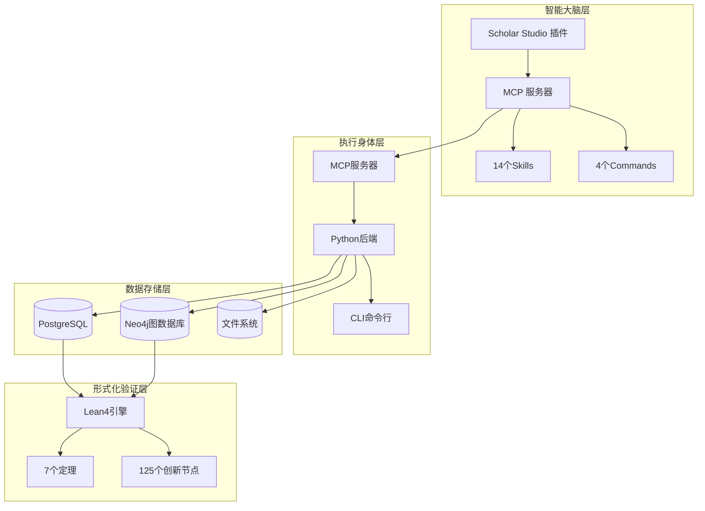
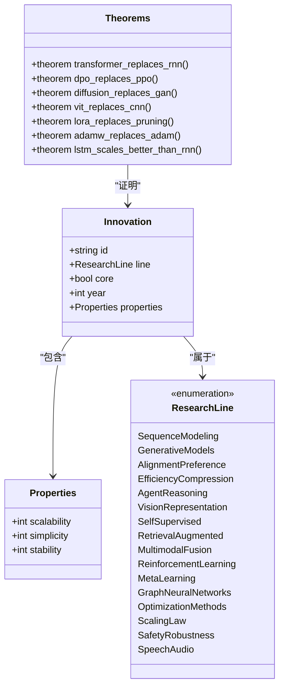
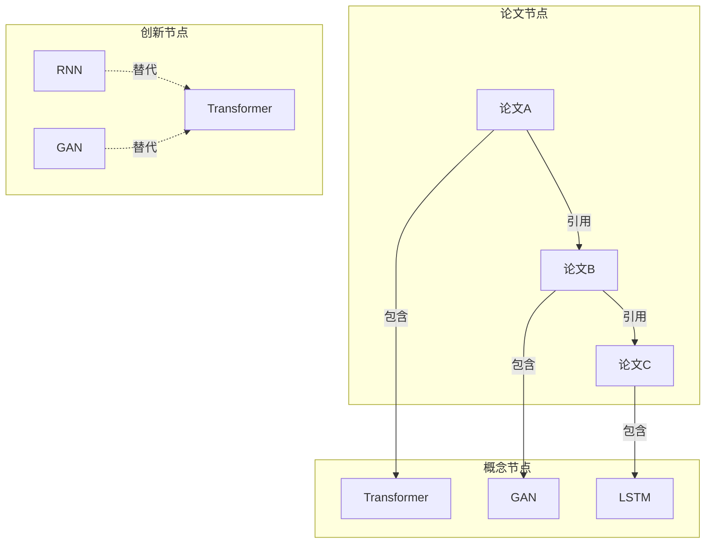

# 项目介绍

<cite>
**本文档引用的文件**
- [plugin/README.md](file://plugin/README.md)
- [plugin/mcp.json](file://plugin/mcp.json)
- [scholar/__main__.py](file://scholar/__main__.py)
- [scholar/cli.py](file://scholar/cli.py)
- [scholar/db.py](file://scholar/db.py)
- [scholar/graph_db.py](file://scholar/graph_db.py)
- [scholar/research_loop.py](file://scholar/research_loop.py)
- [requirements.txt](file://requirements.txt)
- [LEAN/README.md](file://LEAN/README.md)
- [LEAN/Main.lean](file://LEAN/Main.lean)
- [LEAN/AiEvolution.lean](file://LEAN/AiEvolution.lean)
- [LEAN/AiEvolution/Basic.lean](file://LEAN/AiEvolution/Basic.lean)
- [LEAN/AiEvolution/Theorems.lean](file://LEAN/AiEvolution/Theorems.lean)
- [LEAN/AiEvolution/Database.lean](file://LEAN/AiEvolution/Database.lean)
- [plugin/skills/paper-ingestion/SKILL.md](file://plugin/skills/paper-ingestion/SKILL.md)
- [plugin/skills/math-verification/SKILL.md](file://plugin/skills/math-verification/SKILL.md)
- [plugin/skills/experiment-code/SKILL.md](file://plugin/skills/experiment-code/SKILL.md)
</cite>

## 目录
1. [项目概述](#项目概述)
2. [核心使命与愿景](#核心使命与愿景)
3. [系统架构总览](#系统架构总览)
4. [核心技术特色](#核心技术特色)
5. [主要应用场景](#主要应用场景)
6. [混合架构详解](#混合架构详解)
7. [AI演进分析系统](#ai演进分析系统)
8. [知识图谱构建](#知识图谱构建)
9. [学术研究辅助](#学术研究辅助)
10. [实验复现支持](#实验复现支持)
11. [竞争优势分析](#竞争优势分析)
12. [部署与集成](#部署与集成)
13. [总结](#总结)

## 项目概述

人工智能研究项目是一个创新的跨学科研究平台，旨在通过形式化验证与学术研究工具的深度融合，为AI领域的演进分析提供前所未有的严谨性和可追溯性。该项目的核心价值在于将Lean4形式化验证技术与Python学术研究工具相结合，形成独特的混合架构，为学术研究、知识管理、实验复现等领域提供全方位的支持。

项目采用"大脑+身体"的插件化设计理念，其中Scholar Studio插件作为智能"大脑"，负责指导AI执行复杂的学术研究任务；而主仓库的Python后端和数据库作为"身体"，真正执行搜索、解析、检索等具体操作。这种架构设计既保证了AI智能决策的灵活性，又确保了底层执行的可靠性和可扩展性。

## 核心使命与愿景

### 核心使命
- **严谨性保障**：通过Lean4形式化验证确保AI演进分析的数学严谨性和逻辑正确性
- **知识传承**：构建完整的AI发展知识图谱，促进学术知识的有效传承和创新
- **研究效率提升**：为研究人员提供智能化的学术研究辅助工具，显著提高研究效率
- **实验可复现**：建立标准化的实验复现流程，推动AI研究的可重复性和可信度

### 愿景
成为全球领先的AI演进分析平台，通过形式化方法和智能工具的结合，为人类理解AI技术的发展规律、加速技术创新做出贡献。

## 系统架构总览

**图表来源**
- [plugin/README.md:1-79](file://plugin/README.md#L1-L79)
- [plugin/mcp.json:1-16](file://plugin/mcp.json#L1-L16)

## 核心技术特色

### 1. 形式化验证引擎
项目的核心技术特色在于将Lean4形式化验证技术深度集成到AI研究流程中。通过定义125个AI创新节点和7个严格证明的演进定理，系统能够以数学精度验证AI技术的发展规律和替代关系。

### 2. 智能插件架构
采用MCP（Model Context Protocol）协议，实现了14个专业技能和4个命令的模块化设计。每个技能都有明确的职责边界和标准接口，支持灵活组合和扩展。

### 3. 多模态知识管理
系统支持论文解析、引用网络分析、概念图谱构建等多种知识管理方式，形成了立体化的知识管理体系。

### 4. 自适应研究循环
内置智能研究循环机制，能够根据用户兴趣自动追踪最新研究成果，实现持续的知识更新和扩展。

**章节来源**
- [LEAN/Main.lean:1-21](file://LEAN/Main.lean#L1-L21)
- [LEAN/AiEvolution/Theorems.lean:1-130](file://LEAN/AiEvolution/Theorems.lean#L1-L130)
- [plugin/README.md:50-79](file://plugin/README.md#L50-L79)

## 主要应用场景

### 学术研究辅助
为研究人员提供智能化的论文搜索、解析、分类和推荐服务。通过深度学习算法和形式化验证的结合，帮助研究者快速定位相关文献，理解研究现状，发现研究空白。

### 知识图谱构建
基于125个AI创新节点和417篇论文，构建完整的AI发展知识图谱。图谱不仅包含传统的引用关系，还融合了概念关联、技术演进等多维度信息。

### 实验复现支持
提供从论文到代码的完整复现流程，包括算法解析、代码生成、实验验证等环节，确保研究结果的可重复性和可信度。

### 技术演进分析
通过形式化方法分析AI技术的发展轨迹，识别技术替代规律，预测未来发展趋势，为技术决策提供科学依据。

## 混合架构详解

### 架构设计理念
项目采用"插件+后端"的混合架构，其中插件层负责智能决策和工作流编排，后端层负责具体的任务执行和数据处理。这种设计既保证了系统的灵活性，又确保了执行的可靠性。

### 技术栈集成
- **前端交互**：通过MCP协议实现与各种AI助手的无缝集成
- **后端服务**：基于Python的高性能处理能力和丰富的学术研究工具
- **数据存储**：PostgreSQL提供结构化数据存储，Neo4j支持复杂图谱查询
- **形式化验证**：Lean4引擎确保数学推导的严格性

### 模块化设计
系统采用高度模块化的设计，每个功能模块都有明确的职责和接口规范。这种设计便于功能扩展、维护升级和第三方集成。

**章节来源**
- [plugin/README.md:1-79](file://plugin/README.md#L1-L79)
- [requirements.txt:1-14](file://requirements.txt#L1-L14)

## AI演进分析系统

### 形式化基础
系统以Lean4为基础，建立了完整的AI演进理论体系。通过定义16个研究领域和125个创新节点，形成了统一的概念框架和技术分类标准。

### 演进定理证明
项目已经严格证明了7个重要的AI演进定理，这些定理以数学形式描述了技术替代的条件和规律，为AI技术发展提供了理论支撑。

### 性能指标体系
每个创新节点都定义了三个核心性能指标：可扩展性(scalability)、简洁性(simplicity)、稳定性(stability)，为技术评估提供了量化标准。

**图表来源**
- [LEAN/AiEvolution/Basic.lean:10-26](file://LEAN/AiEvolution/Basic.lean#L10-L26)
- [LEAN/AiEvolution/Theorems.lean:15-129](file://LEAN/AiEvolution/Theorems.lean#L15-L129)

**章节来源**
- [LEAN/AiEvolution/Database.lean:1-200](file://LEAN/AiEvolution/Database.lean#L1-L200)
- [LEAN/AiEvolution/Theorems.lean:1-130](file://LEAN/AiEvolution/Theorems.lean#L1-L130)

## 知识图谱构建

### 图谱结构设计
系统构建了三层知识图谱：论文引用网络、概念关联图、创新替代关系图。这三层图谱相互关联，形成了完整的AI知识体系。

### 数据处理流程
从论文解析到图谱构建的完整流程包括：论文入库、元数据提取、引用关系识别、概念匹配、图谱构建等步骤。

### 查询与分析
提供丰富的图谱查询接口，支持路径查找、社区发现、中心性分析等功能，帮助用户深入理解AI技术的发展脉络。

**图表来源**
- [scholar/graph_db.py:225-281](file://scholar/graph_db.py#L225-L281)
- [scholar/graph_db.py:636-732](file://scholar/graph_db.py#L636-L732)

**章节来源**
- [scholar/graph_db.py:1-800](file://scholar/graph_db.py#L1-L800)

## 学术研究辅助

### 智能论文管理
提供完整的论文生命周期管理：从arXiv搜索、论文下载、解析入库到质量评估、分类标注、自动笔记生成等全流程自动化。

### 研究兴趣追踪
基于对话日志分析用户研究兴趣，自动追踪相关领域的最新进展，实现个性化研究推荐和持续的知识更新。

### 文献质量评估
通过多维度的质量评分体系，帮助研究者快速筛选高质量的参考文献，提高文献综述的效率和质量。

**章节来源**
- [plugin/skills/paper-ingestion/SKILL.md:1-85](file://plugin/skills/paper-ingestion/SKILL.md#L1-L85)
- [scholar/research_loop.py:1-359](file://scholar/research_loop.py#L1-L359)

## 实验复现支持

### 代码生成自动化
基于论文中的算法描述和数学公式，自动生成可运行的实验代码。支持多种深度学习框架，确保代码的正确性和可移植性。

### 实验环境标准化
提供标准化的实验环境配置，包括依赖管理、数据准备、训练脚本等，确保实验结果的可复现性。

### 结果对比分析
建立统一的实验结果对比机制，支持不同方法在同一数据集上的公平比较，为算法改进提供量化依据。

**章节来源**
- [plugin/skills/experiment-code/SKILL.md:1-111](file://plugin/skills/experiment-code/SKILL.md#L1-L111)

## 竞争优势分析

### 技术优势
- **形式化严谨性**：通过Lean4确保所有技术结论的数学严格性
- **知识完整性**：涵盖16个AI研究领域，包含125个创新节点的完整知识体系
- **自动化程度高**：从论文解析到实验复现的全流程自动化

### 应用优势
- **多场景适配**：适用于学术研究、工业研发、教育学习等多种场景
- **可扩展性强**：模块化设计支持功能扩展和定制开发
- **易用性好**：提供友好的用户界面和丰富的API接口

### 生态优势
- **开源免费**：完整的开源生态，降低使用成本
- **社区活跃**：持续的功能更新和技术支持
- **标准兼容**：遵循学术界和工业界的主流标准

## 部署与集成

### 环境要求
系统支持多种部署方式，包括本地开发环境、容器化部署、云平台部署等。基本环境要求包括Python运行时、数据库服务、图数据库服务等。

### 集成方案
提供多种集成方案，包括MCP协议集成、API接口调用、插件扩展等方式，满足不同用户的集成需求。

### 扩展开发
提供完善的开发者工具和SDK，支持第三方开发者扩展功能、开发新的技能模块、集成外部服务等。

**章节来源**
- [plugin/mcp.json:1-16](file://plugin/mcp.json#L1-L16)
- [requirements.txt:1-14](file://requirements.txt#L1-L14)

## 总结

人工智能研究项目通过将Lean4形式化验证技术与Python学术研究工具的深度融合，开创性地解决了AI研究中的严谨性、可追溯性和可复现性等关键问题。项目的混合架构设计既保证了技术的先进性，又确保了应用的实用性。

通过构建完整的AI演进分析系统、知识图谱和实验复现支持，项目为AI领域的研究、教学和产业发展提供了强有力的技术支撑。其独特的形式化验证方法和智能化的学术研究辅助功能，使其在同类产品中具有明显的竞争优势。

未来，随着AI技术的不断发展和应用场景的持续拓展，该项目将继续完善其理论体系和实践工具，为推动AI技术的健康发展和知识传承做出更大贡献。