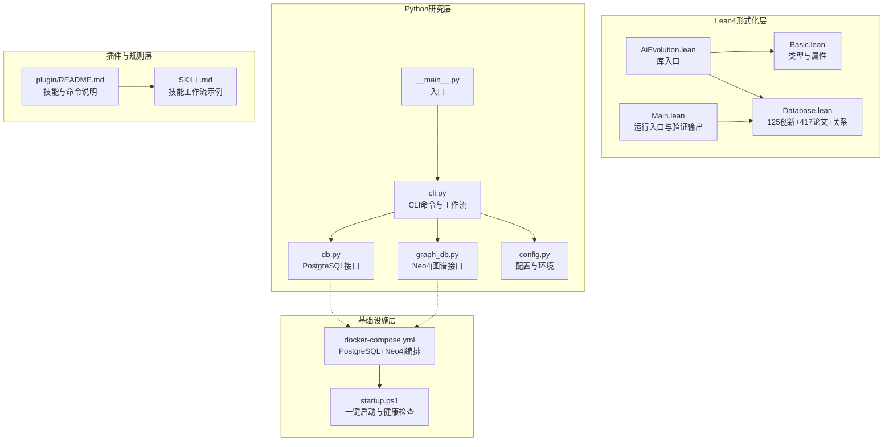
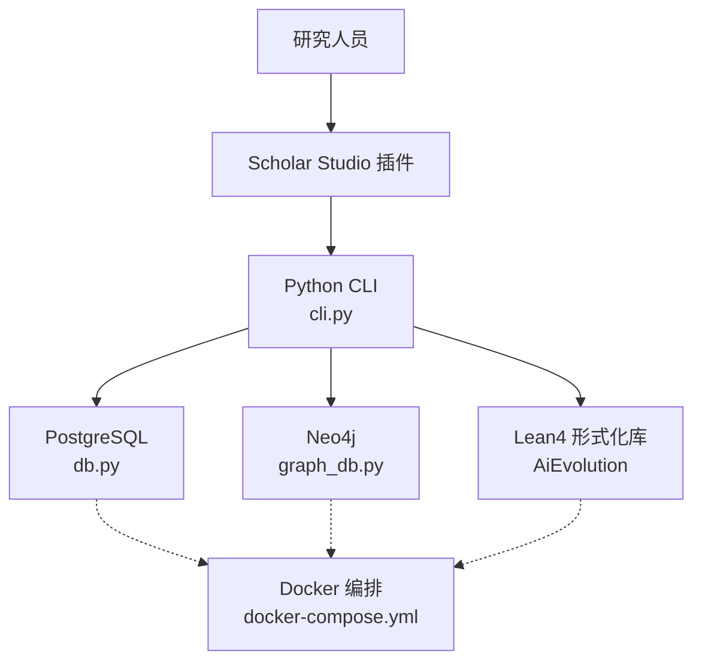
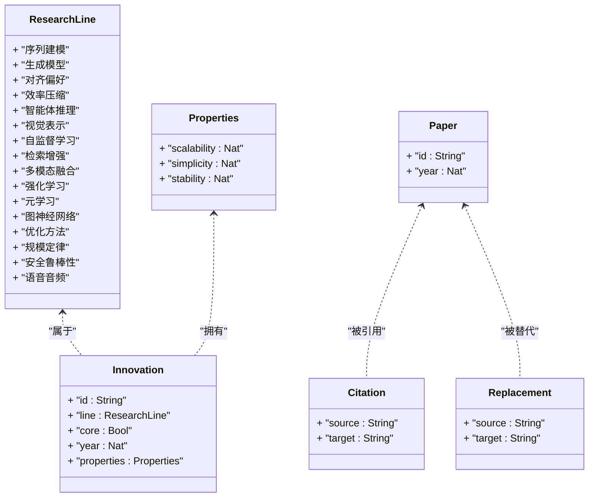
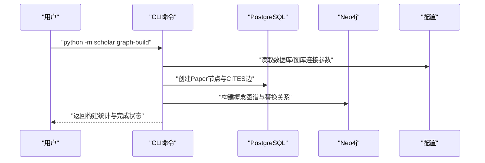
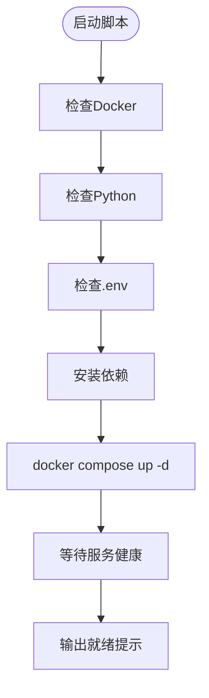
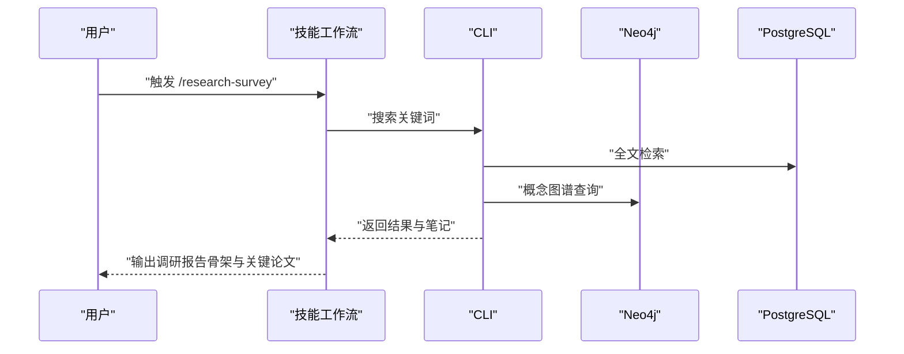
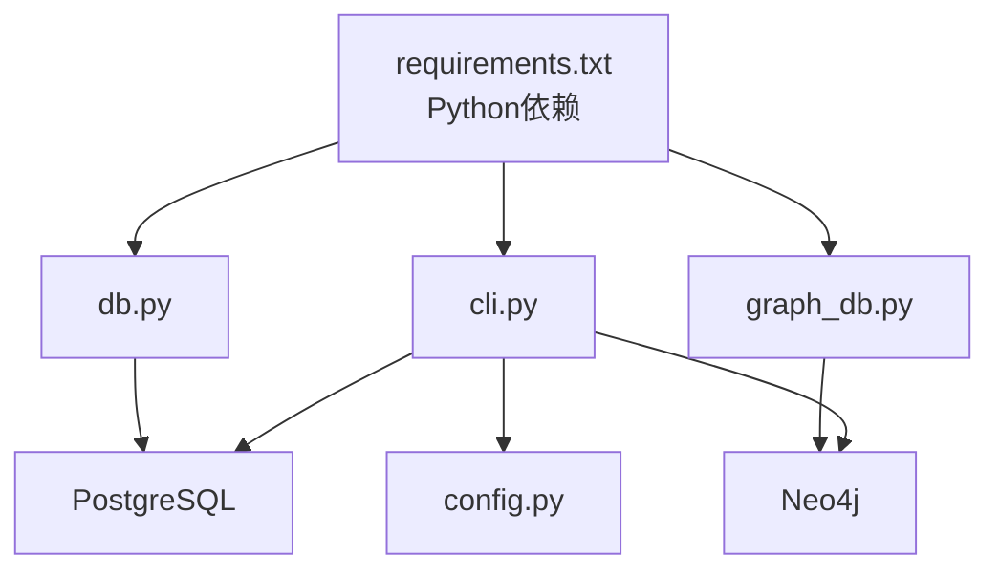

# 项目概述

<cite>
**本文档引用的文件**
- [LEAN/README.md](file://LEAN/README.md)
- [plugin/README.md](file://plugin/README.md)
- [scholar/__main__.py](file://scholar/__main__.py)
- [LEAN/AiEvolution.lean](file://LEAN/AiEvolution.lean)
- [LEAN/Main.lean](file://LEAN/Main.lean)
- [LEAN/AiEvolution/Basic.lean](file://LEAN/AiEvolution/Basic.lean)
- [LEAN/AiEvolution/Database.lean](file://LEAN/AiEvolution/Database.lean)
- [scholar/cli.py](file://scholar/cli.py)
- [scholar/db.py](file://scholar/db.py)
- [scholar/config.py](file://scholar/config.py)
- [scholar/graph_db.py](file://scholar/graph_db.py)
- [requirements.txt](file://requirements.txt)
- [infra/docker-compose.yml](file://infra/docker-compose.yml)
- [startup.ps1](file://startup.ps1)
- [plugin/skills/citation-network/SKILL.md](file://plugin/skills/citation-network/SKILL.md)
- [plugin/skills/math-verification/SKILL.md](file://plugin/skills/math-verification/SKILL.md)
- [plugin/skills/research-survey/SKILL.md](file://plugin/skills/research-survey/SKILL.md)
</cite>

## 目录
1. [简介](#简介)
2. [项目结构](#项目结构)
3. [核心组件](#核心组件)
4. [架构总览](#架构总览)
5. [详细组件分析](#详细组件分析)
6. [依赖关系分析](#依赖关系分析)
7. [性能考虑](#性能考虑)
8. [故障排除指南](#故障排除指南)
9. [结论](#结论)
10. [附录](#附录)

## 简介
本项目是一个面向人工智能研究的综合型学术研究平台，旨在通过“Lean4形式化验证系统 + Python学术研究工具”的协同，构建AI演进分析的严谨知识体系。项目围绕125个代表性创新节点与417篇论文的知识图谱，提供从文献调研、公式验证、引用网络分析到学术写作的全链路能力，帮助研究者系统把握AI技术的发展脉络与关键演进路径。

项目核心价值体现在：
- 形式化验证：以Lean4对AI演进中的关键方法与理论进行严格建模与编译验证，确保核心定理的可靠性。
- 图谱驱动：通过Neo4j构建“论文-引用-概念-创新”四维图谱，支持演化路径追踪与研究空白发现。
- 研究自动化：提供CLI与插件化的研究技能，覆盖从调研、精读到写作的全流程，提升研究效率与质量。

## 项目结构
项目采用多模块协作的分层架构：
- Lean4形式化层：定义AI演进的类型系统、数据源与定理库，提供可编译的形式化证明。
- Python研究层：提供CLI命令、数据库接口、图数据库操作与研究技能，支撑学术研究工作流。
- 基础设施层：通过Docker编排PostgreSQL+pgvector与Neo4j，提供结构化存储与图计算能力。
- 插件与规则层：在IDE环境中提供技能、命令、规则与钩子，形成可组合的研究工作流。

**图表来源**
- [LEAN/AiEvolution.lean:1-8](file://LEAN/AiEvolution.lean#L1-L8)
- [LEAN/AiEvolution/Basic.lean:1-65](file://LEAN/AiEvolution/Basic.lean#L1-L65)
- [LEAN/AiEvolution/Database.lean:1-756](file://LEAN/AiEvolution/Database.lean#L1-L756)
- [LEAN/Main.lean:1-21](file://LEAN/Main.lean#L1-L21)
- [scholar/cli.py:1-800](file://scholar/cli.py#L1-L800)
- [scholar/db.py:1-276](file://scholar/db.py#L1-L276)
- [scholar/graph_db.py:1-922](file://scholar/graph_db.py#L1-L922)
- [scholar/config.py:1-119](file://scholar/config.py#L1-L119)
- [infra/docker-compose.yml:1-44](file://infra/docker-compose.yml#L1-L44)
- [startup.ps1:1-125](file://startup.ps1#L1-L125)
- [plugin/README.md:1-79](file://plugin/README.md#L1-L79)

**章节来源**
- [plugin/README.md:1-79](file://plugin/README.md#L1-L79)
- [LEAN/README.md:1-1](file://LEAN/README.md#L1-L1)
- [infra/docker-compose.yml:1-44](file://infra/docker-compose.yml#L1-L44)
- [startup.ps1:1-125](file://startup.ps1#L1-L125)

## 核心组件
- Lean4形式化库（AiEvolution）
  - 类型系统：研究方向、创新节点、论文、引用与替换关系的结构化定义。
  - 数据源：125个创新节点、417篇论文及相互间的引用与替代关系。
  - 运行入口：Main.lean展示编译后的验证结果与系统状态。
- Python研究工具链
  - CLI命令：扫描、解析、查询、统计、图谱构建与查询等。
  - 数据库接口：PostgreSQL（可选）与文件回退模式。
  - 图数据库接口：Neo4j（可选）与图谱构建/查询。
  - 配置管理：统一的环境变量与外部服务连接参数。
- 基础设施编排
  - Docker Compose：PostgreSQL+pgvector与Neo4j服务编排与健康检查。
  - 一键启动：PowerShell脚本自动检测依赖、拉起容器并提示下一步操作。
- 插件与技能
  - 技能：原子技能与工作流，覆盖文献调研、公式验证、引用网络分析等。
  - 命令：stats、find、paper、health等常用命令。
  - 规则与钩子：角色定义、危险命令拦截与任务完成通知。

**章节来源**
- [LEAN/AiEvolution.lean:1-8](file://LEAN/AiEvolution.lean#L1-L8)
- [LEAN/AiEvolution/Basic.lean:1-65](file://LEAN/AiEvolution/Basic.lean#L1-L65)
- [LEAN/AiEvolution/Database.lean:1-756](file://LEAN/AiEvolution/Database.lean#L1-L756)
- [LEAN/Main.lean:1-21](file://LEAN/Main.lean#L1-L21)
- [scholar/cli.py:1-800](file://scholar/cli.py#L1-L800)
- [scholar/db.py:1-276](file://scholar/db.py#L1-L276)
- [scholar/graph_db.py:1-922](file://scholar/graph_db.py#L1-L922)
- [scholar/config.py:1-119](file://scholar/config.py#L1-L119)
- [requirements.txt:1-14](file://requirements.txt#L1-L14)
- [plugin/README.md:1-79](file://plugin/README.md#L1-L79)

## 架构总览
系统采用“形式化建模 + 研究工具 + 图谱分析 + 自动化工作流”的整体架构。Lean4负责提供严格的数学模型与可编译的定理库；Python研究工具负责数据处理、检索与可视化；Neo4j与PostgreSQL分别承担图谱与结构化数据存储；插件层将技能与命令注入到IDE工作流中，形成端到端的研究闭环。

**图表来源**
- [plugin/README.md:1-79](file://plugin/README.md#L1-L79)
- [scholar/cli.py:1-800](file://scholar/cli.py#L1-L800)
- [scholar/db.py:1-276](file://scholar/db.py#L1-L276)
- [scholar/graph_db.py:1-922](file://scholar/graph_db.py#L1-L922)
- [LEAN/AiEvolution.lean:1-8](file://LEAN/AiEvolution.lean#L1-L8)
- [infra/docker-compose.yml:1-44](file://infra/docker-compose.yml#L1-L44)

## 详细组件分析

### Lean4形式化库（AiEvolution）
- 类型与属性
  - 研究方向（ResearchLine）：涵盖序列建模、生成模型、对齐偏好、效率压缩、智能体推理、视觉表示、自监督学习、检索增强、多模态融合、强化学习、元学习、图神经网络、优化方法、规模定律、安全鲁棒性与语音音频等16个方向。
  - 创新节点（Innovation）：包含id、所属方向、是否核心、年份与可扩展性/简洁性/稳定性三项属性。
  - 论文（Paper）：包含人类可读ID与发表年份。
  - 引用（Citation）与替换（Replacement）：描述论文间引用关系与方法替代关系。
- 数据源与定理
  - 数据库：包含125个创新节点、417篇论文以及关键引用与替代关系。
  - 主程序：Main.lean展示编译状态与各项方法的属性评估。
- 形式化验证流程
  - 语义分析：对公式与定理进行符号、维度与极限情况检查。
  - 对照现有形式化：在Neo4j与Lean4中查找对应节点与定义。
  - 形式化尝试与编译：在Lean4中编写并编译，确保无“sorry”。

**图表来源**
- [LEAN/AiEvolution/Basic.lean:1-65](file://LEAN/AiEvolution/Basic.lean#L1-L65)
- [LEAN/AiEvolution/Database.lean:1-756](file://LEAN/AiEvolution/Database.lean#L1-L756)

**章节来源**
- [LEAN/AiEvolution/Basic.lean:1-65](file://LEAN/AiEvolution/Basic.lean#L1-L65)
- [LEAN/AiEvolution/Database.lean:1-756](file://LEAN/AiEvolution/Database.lean#L1-L756)
- [LEAN/Main.lean:1-21](file://LEAN/Main.lean#L1-L21)

### Python研究工具链
- CLI命令与工作流
  - 文献扫描与解析：批量扫描、解析单篇论文并入库。
  - 查询与统计：全文检索、知识库统计、作者修复、arXiv搜索。
  - 图谱构建与查询：引用网络、概念图谱与替换关系同步。
- 数据库接口
  - PostgreSQL封装：提供UPSERT、全文检索、统计查询等。
  - 文件回退：在无DB时仍可使用JSON文件进行基本操作。
- 图数据库接口
  - Neo4j封装：提供连接、Cypher执行与图谱构建/查询。
  - 引用解析与中心度计算：支持大规模引用网络分析。
- 配置管理
  - 环境变量：数据库、图数据库、嵌入模型等参数集中管理。
  - arXiv请求：带重试、超时与代理支持的请求工具。

**图表来源**
- [scholar/cli.py:660-706](file://scholar/cli.py#L660-L706)
- [scholar/db.py:79-176](file://scholar/db.py#L79-L176)
- [scholar/graph_db.py:225-281](file://scholar/graph_db.py#L225-L281)
- [scholar/config.py:44-61](file://scholar/config.py#L44-L61)

**章节来源**
- [scholar/cli.py:1-800](file://scholar/cli.py#L1-L800)
- [scholar/db.py:1-276](file://scholar/db.py#L1-L276)
- [scholar/graph_db.py:1-922](file://scholar/graph_db.py#L1-L922)
- [scholar/config.py:1-119](file://scholar/config.py#L1-L119)

### 基础设施编排与启动
- Docker Compose
  - PostgreSQL+pgvector：结构化存储与向量检索。
  - Neo4j：概念图谱与引用网络。
- 一键启动脚本
  - 检测Docker、Python、.env与依赖。
  - 启动容器并等待健康状态。
  - 提示下一步操作与常见命令。

**图表来源**
- [startup.ps1:1-125](file://startup.ps1#L1-L125)
- [infra/docker-compose.yml:1-44](file://infra/docker-compose.yml#L1-L44)

**章节来源**
- [startup.ps1:1-125](file://startup.ps1#L1-L125)
- [infra/docker-compose.yml:1-44](file://infra/docker-compose.yml#L1-L44)

### 插件与技能工作流
- 技能与命令
  - 技能：14个技能覆盖文献处理、公式验证、引用网络分析、研究空白发现、写作管线等。
  - 命令：stats、find、paper、health等实用命令。
- 工作流示例
  - 引用网络分析：全局统计、单论文分析、概念关联、关键节点识别与时间线构建。
  - 数学验证：公式定位、上下文提取、语义分析、对照形式化、编译验证与报告生成。
  - 全面调研：本地搜索、arXiv补充、关键词扩展、深度阅读、概念图谱分析、报告骨架与增量撰写。

**图表来源**
- [plugin/skills/research-survey/SKILL.md:1-113](file://plugin/skills/research-survey/SKILL.md#L1-L113)
- [plugin/skills/citation-network/SKILL.md:1-101](file://plugin/skills/citation-network/SKILL.md#L1-L101)
- [plugin/skills/math-verification/SKILL.md:1-101](file://plugin/skills/math-verification/SKILL.md#L1-L101)

**章节来源**
- [plugin/README.md:1-79](file://plugin/README.md#L1-L79)
- [plugin/skills/research-survey/SKILL.md:1-113](file://plugin/skills/research-survey/SKILL.md#L1-L113)
- [plugin/skills/citation-network/SKILL.md:1-101](file://plugin/skills/citation-network/SKILL.md#L1-L101)
- [plugin/skills/math-verification/SKILL.md:1-101](file://plugin/skills/math-verification/SKILL.md#L1-L101)

## 依赖关系分析
- 外部依赖
  - Python生态：typer、rich、psycopg2、neo4j、python-dotenv、PyMuPDF、mcp等。
  - 数据库与图数据库：PostgreSQL+pgvector、Neo4j。
- 内部耦合
  - CLI对数据库与图数据库的依赖，以及对配置模块的依赖。
  - 图谱构建依赖Lean4数据源（动态解析）与解析后的论文数据。
  - 插件技能依赖CLI命令与图谱/数据库接口。

**图表来源**
- [requirements.txt:1-14](file://requirements.txt#L1-L14)
- [scholar/cli.py:1-800](file://scholar/cli.py#L1-L800)
- [scholar/db.py:1-276](file://scholar/db.py#L1-L276)
- [scholar/graph_db.py:1-922](file://scholar/graph_db.py#L1-L922)
- [scholar/config.py:1-119](file://scholar/config.py#L1-L119)

**章节来源**
- [requirements.txt:1-14](file://requirements.txt#L1-L14)
- [scholar/cli.py:1-800](file://scholar/cli.py#L1-L800)
- [scholar/db.py:1-276](file://scholar/db.py#L1-L276)
- [scholar/graph_db.py:1-922](file://scholar/graph_db.py#L1-L922)
- [scholar/config.py:1-119](file://scholar/config.py#L1-L119)

## 性能考虑
- 数据库与检索
  - PostgreSQL提供全文检索与统计查询，建议在生产环境启用索引与分区。
  - Neo4j的大规模图谱查询可通过批处理与分页优化。
- 图谱构建
  - 引用网络与概念图谱的批量插入应控制批次大小，避免内存峰值。
  - 引用解析采用模糊匹配与TF-IDF，建议缓存中间结果。
- 形式化验证
  - Lean4编译时间较长，建议增量构建与并行验证。
- 启动与可用性
  - Docker Compose健康检查与启动脚本减少人工干预，提高可用性。

## 故障排除指南
- 依赖缺失
  - Docker未安装或未运行：根据启动脚本提示安装Docker Desktop。
  - Python依赖缺失：执行依赖安装命令。
- 服务不可达
  - PostgreSQL/Neo4j未就绪：等待健康检查或检查日志。
  - 环境变量错误：核对.env文件中的数据库与图库连接参数。
- CLI命令失败
  - 数据库连接异常：检查DB可用性与连接参数。
  - 图库连接异常：检查Neo4j可用性与认证信息。
- 图谱构建失败
  - 解析引用失败：检查parsed目录中的JSON完整性与引用字段。
  - 概念匹配不准确：调整别名映射或TF-IDF阈值。

**章节来源**
- [startup.ps1:1-125](file://startup.ps1#L1-L125)
- [scholar/config.py:44-61](file://scholar/config.py#L44-L61)
- [scholar/db.py:31-44](file://scholar/db.py#L31-L44)
- [scholar/graph_db.py:40-49](file://scholar/graph_db.py#L40-L49)

## 结论
本项目通过Lean4形式化验证与Python研究工具的深度融合，构建了AI演进分析的严谨知识体系与高效研究工作流。形式化库提供可编译的数学模型，研究工具链支撑从文献到写作的全生命周期，图谱与数据库提供强大的检索与分析能力。插件化的技能与命令进一步降低了使用门槛，使研究者能够专注于学术洞察本身。

## 附录
- 实际使用场景与案例演示
  - 场景一：对“Transformer”方法进行形式化验证与引用网络分析
    - 步骤：在Lean4中定位相关定义与定理，编译验证；在Neo4j中查询引用关系与概念共现；在CLI中生成统计与报告。
  - 场景二：对“MoE（Mixture of Experts）”进行全面调研与写作
    - 步骤：使用研究调查技能进行关键词扩展与深度阅读；利用引用网络发现桥接论文；基于概念图谱识别演化路径；生成报告骨架并增量撰写。
  - 场景三：对“扩散模型”家族进行方法对比与未来方向推导
    - 步骤：通过Neo4j的替换关系识别技术替代；结合论文年份构建时间线；在CLI中导出参考文献并生成对比表格。

**章节来源**
- [plugin/skills/research-survey/SKILL.md:1-113](file://plugin/skills/research-survey/SKILL.md#L1-L113)
- [plugin/skills/citation-network/SKILL.md:1-101](file://plugin/skills/citation-network/SKILL.md#L1-L101)
- [plugin/skills/math-verification/SKILL.md:1-101](file://plugin/skills/math-verification/SKILL.md#L1-L101)
- [LEAN/AiEvolution/Database.lean:1-756](file://LEAN/AiEvolution/Database.lean#L1-L756)
- [scholar/cli.py:660-706](file://scholar/cli.py#L660-L706)